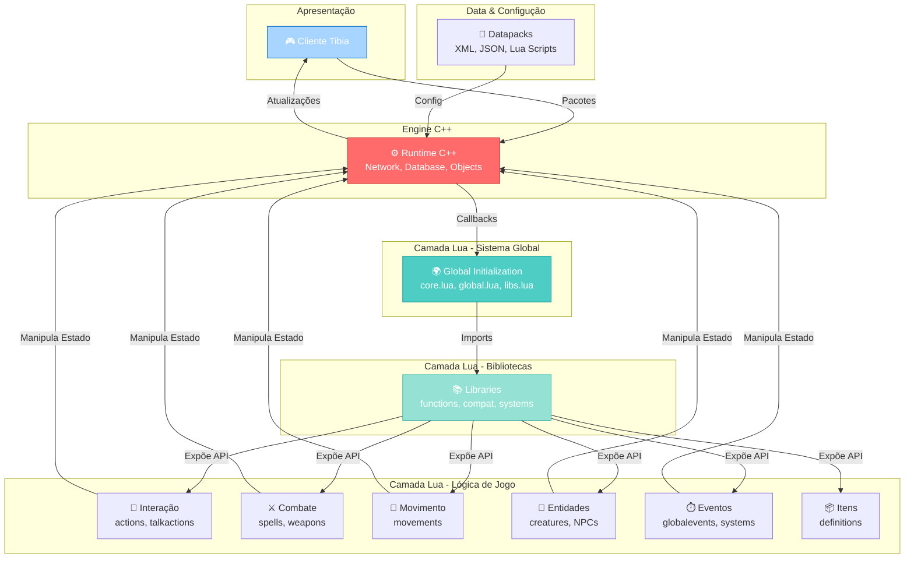
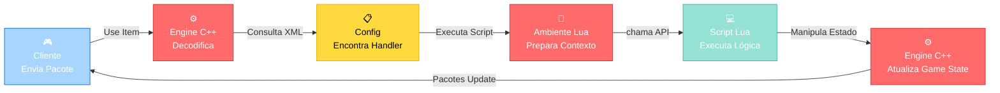

import { Aside, Card } from '@astrojs/starlight/components';

# Arquitetura do Projeto Canary

<div className="intro-section">

## 1. Visão Geral

O projeto Canary utiliza uma **arquitetura event-driven** (orientada a eventos) onde:

- **Engine (C++)**: Atua como runtime, gerenciando objetos nativos, callbacks, rede e banco de dados
- **Datapacks (Lua + XML/JSON)**: Implementam a lógica de negócios e configurações do jogo

A separação clara entre infraestrutura (C++) e lógica de jogo (Lua) permite flexibilidade e manutenção facilitada.

</div>

---

## 2. Estrutura de Diretórios Principais

### 2.1 Datapacks

```
data/                      → Núcleo essencial do servidor
data-otservbr-global/      → Conteúdo base compartilhavel (mundo, monstros, NPCs, scripts)
```

O projeto suporta múltiplos datapacks. A função `IsRunningGlobalDatapack()` permite código condicional quando `data-otservbr-global` estiver ativo.

### 2.2 Estrutura Interna do Datapack

```
data/
├── core.lua               → Ponto de entrada (carrega global.lua, libs.lua, stages.lua)
├── global.lua             → Inicialização global (constantes, políticas, detecção de datapack)
├── libs.lua               → Importa módulos essenciais
│
├── scripts/               → Lógica principal do jogo
│   ├── actions/           → Handlers de clique direito e uso de itens
│   ├── creaturescripts/   → Hooks (login, morte, ataque, avanço, etc.)
│   ├── globalevents/      → Eventos globais (timers, spawns, ciclos)
│   ├── movements/         → Scripts ao pisar ou equipar
│   ├── spells/            → Definições e fórmulas de magia
│   ├── talkactions/       → Comandos de texto (!buy, /a, etc.)
│   ├── weapons/           → Configuração de armas e combate
│   └── systems/           → Subsistemas complexos
│
├── lib/                   → Código reutilizável do datapack
├── libs/                  → Biblioteca core (functions, compat, debugging, systems, tables)
│
├── items/                 → Definições de itens (XML)
├── XML/                   → Dados estáticos (grupos, outfits, mounts, vocações, etc.)
├── events/                → Configurações de eventos
│
├── modules/               → Módulos opcionais
├── npclib/                → Biblioteca e sistema de NPCs
├── chatchannels/          → Canais de chat customizados
└── reports/               → Sistema de reports (bugs, players)

data-otservbr-global/
├── lib/                   → Código compartilhável
├── monster/               → Definições de monstros
├── npc/                   → Definições de NPCs do mundo
├── scripts/               → Quests, eventos, lógica específica
├── raids/                 → Raids
├── migrations/            → Migrações do banco de dados
└── world/                 → Arquivo de mapa (.otbm) e spawns
```

---

## 3. Camadas Arquiteturais (Organização por Responsabilidade)

<div className="layers-section">

### 3.1 **Camada de Biblioteca (Compartilhada)**
- **Localização**: `lib/` e `libs/`
- **Responsabilidade**: Código reutilizável e funções globais
- **Exemplos**: Cálculos de experiência, funções de string, lógica de guildas, helpers

### 3.2 **Camada de Interação com Jogador**
- **Localização**: `scripts/actions/`, `scripts/talkactions/`
- **Actions**: Interações físicas (clique direito, uso de itens) — *Command Pattern*
- **Talkactions**: Comandos de texto — *Command Pattern*

### 3.3 **Camada de Ambiente e Movimento**
- **Localização**: `scripts/movements/`, `world/`
- **Movements**: Scripts gatilhados ao pisar em tiles ou equipar itens
- **World**: Mapa (.otbm) e configurações de spawn

### 3.4 **Camada de Entidades e IA**
- **Localização**: `monster/`, `npc/`, `scripts/creaturescripts/`
- **Monster/NPC**: Definição de atributos estáticos
- **Creaturescripts**: Hooks de ciclo de vida (login, morte, ataque, avanço) — lógica complexa dos sistemas

### 3.5 **Camada de Combate e Magia**
- **Localização**: `scripts/spells/`, `scripts/weapons/`
- **Responsabilidade**: Fórmulas de dano, áreas de efeito, consumo de recursos

### 3.6 **Camada de Sistemas Globais**
- **Localização**: `scripts/globalevents/`, `scripts/systems/`, `modules/`
- **Responsabilidade**: Eventos recorrentes, timers, lógica de servidor, subsistemas

</div>

### Diagrama de Camadas



---

## 4. Fluxo de Dados (Client → Server → Client)

### Diagrama: Ciclo de Requisição



---

## 5. Fluxo de Carregamento (Inicialização do Servidor)

### Diagrama: Bootstrap Sequence

```mermaid
graph TD
    A["🚀 START<br/>Engine C++ Inicializa"] --> B["💉 Injeta Bindings<br/>configManager<br/>configKeys<br/>Player, Creature, etc."]
    B --> C["🔨 Carrega<br/>data/core.lua<br/>PONTO DE ENTRADA"]
    C --> D["📖 core.lua Executa"]
    D --> E["🔍 Identifica Diretórios<br/>DATA_DIRECTORY<br/>CORE_DIRECTORY"]
    E --> F["📚 Carrega global.lua"]
    F --> G["⚙️ global.lua Configura<br/>✓ Constantes Globais<br/>✓ Políticas do Servidor<br/>✓ Stamina, Party Protection<br/>✓ IsRunningGlobalDatapack?<br/>✓ Carrega startup.lua"]
    G --> H["📚 Carrega libs.lua"]
    H --> I["🔗 libs.lua Importa<br/>✓ functions<br/>✓ compat<br/>✓ debugging<br/>✓ systems<br/>✓ tables"]
    I --> J["📜 Expõe API Lua<br/>ao Datapack"]
    J --> K["🎬 Carrega Scripts<br/>actions, spells, creaturescripts<br/>talkactions, movements, etc."]
    K --> L["✅ READY<br/>Registra Handlers<br/>para Eventos Nativos"]
    
    style A fill:#95e1d3,stroke:#38ada9,color:#fff
    style B fill:#ff6b6b,stroke:#c92a2a,color:#fff
    style C fill:#4ecdc4,stroke:#0a9396,color:#fff
    style D fill:#4ecdc4,stroke:#0a9396,color:#fff
    style E fill:#ffd93d,stroke:#f0a500,color:#000
    style F fill:#a8d5ff,stroke:#0066cc,color:#fff
    style G fill:#a8d5ff,stroke:#0066cc,color:#fff
    style H fill:#a8d5ff,stroke:#0066cc,color:#fff
    style I fill:#a8d5ff,stroke:#0066cc,color:#fff
    style J fill:#95e1d3,stroke:#38ada9,color:#fff
    style K fill:#95e1d3,stroke:#38ada9,color:#fff
    style L fill:#95e1d3,stroke:#38ada9,color:#fff
```



### Descrição Detalhada

1. **Engine C++ inicializa ambiente Lua**
   - Injeta `configManager` e `configKeys`
   - Injeta bindings nativos (Player, Creature, etc.)

2. **Engine carrega `data/core.lua`** (ponto de entrada)

3. **core.lua identifica diretórios** e carrega:
   - `global.lua`
   - `libs.lua`
   - `stages.lua` (e outros)

4. **global.lua configura**:
   - Constantes e tabelas globais (`_G.*`)
   - Políticas (stamina, proteção de party, schedules)
   - Detecta se `data-otservbr-global` está ativo
   - Carrega `startup/startup.lua` (se existir)

5. **libs.lua importa bibliotecas core** (`CORE_DIRECTORY`):
   - `functions`, `compat`, `debugging`, `systems`, `tables`
   - Expõe API Lua ao datapack

6. **Scripts do datapack são carregados** e registrados como handlers para eventos nativos

---

## 6. Papel do C++ vs Lua

<div className="comparison-table">

| Aspecto | **C++** | **Lua** |
|--------|---------|--------|
| **Responsabilidade** | Runtime base, objetos nativos, callbacks | Lógica de jogo, eventos, configurações |
| **Performance** | Operações críticas, processamento pesado | Lógica condicional, orquestração |
| **Maintainability** | Estável, mudanças exigem recompilação | Dinâmico, hot-reload possível |
| **Exemplos** | Player, Creature, network stack, DB | Spells, quests, sistemas, eventos |
| **Execução** | Sempre ativo (loop do servidor) | Chamado sob demanda por eventos |

</div>

---

## 7. Padrões de Design Observados

<div className="patterns-section">

### 7.1 Event-Driven Architecture
- Toda a lógica de jogo é orientada a eventos
- **Exemplo**: `creaturescripts/` reagir a eventos de login, morte, ataque

### 7.2 Command Pattern
- `actions/` e `talkactions/` implementam padrão Command
- Cada comando é um handler isolado que pode ser registrado dinamicamente

### 7.3 Dependency Injection
- Engine injeta bindings e `configManager` no ambiente Lua
- Permite que scripts acessem infraestrutura sem acoplamento

### 7.4 Layered Architecture
- Separação clara: Biblioteca → Lógica → Integração
- Cada camada tem responsabilidades bem definidas

### 7.5 Multi-Datapack Pattern
- Suporte a múltiplos datapacks parallelos
- `IsRunningGlobalDatapack()` permite code branching

</div>

---

## 8. Boas Práticas Observadas

<div className="practices-section">

### ✅ Separação de Conteúdo
- `data/`: Core essencial (sempre necessário)
- `data-otservbr-global/`: Conteúdo específico (opcional, compartilhável)

### ✅ API Limpa Lua-C++
- Bindings bem definidos em `CORE_DIRECTORY`
- Objetos nativos (Player, Creature) acessíveis via Lua

### ✅ Code Organization
- Pastas `scripts/` organizadas por tipo de handler
- Código reutilizável isolado em `lib/`
- **Exemplo em bank_system.lua**: Funções bem encapsuladas (`parseBank`, `parseGuildBank`)

### ✅ Configuração Dinâmica
- Uso de `revscripts` (scripts puros Lua) em versões recentes
- Reduz necessidade de XML boilerplate
- **Exemplo**: Handlers podem ser registrados programaticamente

### ✅ Detecção de Contexto
- Funções como `IsRunningGlobalDatapack()` permitem comportamento condicional
- Facilita manutenção de múltiplos datapacks
- **Exemplo em bank_system.lua**: NPCs podem ter comportamento diferente por datapack

### ✅ State Management com Tables
- Local tables (`count`, `transfer`) para manter estado de conversas
- **Exemplo em bank_system.lua**: `count[playerId]` e `transfer[playerId]` isolam estado por jogador

### ✅ Message Handling Pattern
- `MsgContains()`, `MsgFind()`, `getMoneyCount()` são helpers reutilizáveis
- **Exemplo em bank_system.lua**: Parsing de mensagens de forma consistente

</div>

---

## 9. Fluxo de uma Interação Prática (Exemplo: NPC Bank)

<div className="example-section">

### Diagrama: Bank Transaction Flow

```mermaid
sequenceDiagram
    participant Player as 🎮 Jogador
    participant Client as 💻 Cliente
    participant Engine as ⚙️ Engine C++
    participant NPC as 🤖 Bank NPC
    participant State as 💾 State

    rect rgb(72, 71, 73)
    Note over Player,State: Jogador solicita depósito
    Player->>Client: Fala "deposit 1000"
    Client->>Engine: Envia mensagem
    Engine->>NPC: Chama parseBank(msg, npc, creature)
    NPC->>State: getTopic(playerId) → 0
    NPC->>NPC: MsgContains("deposit") ✓
    NPC->>State: count[playerId] = 1000
    NPC->>State: setTopic(playerId, 1)
    NPC->>Engine: say("Confirma 1000 gold?")
    Engine->>Client: Envia resposta
    Client->>Player: Mostra pergunta do NPC
    end

    rect rgb(61, 61, 71)
    Note over Player,State: Jogador confirma
    Player->>Client: Fala "yes"
    Client->>Engine: Envia mensagem
    Engine->>NPC: Chama parseBank(msg, npc, creature)
    NPC->>State: getTopic(playerId) → 1
    NPC->>NPC: MsgContains("yes") ✓
    NPC->>Engine: Player:depositMoney(1000)
    Engine->>Engine: Deduz 1000 do player
    NPC->>State: setTopic(playerId, 0)
    NPC->>Engine: say("Depositado com sucesso!")
    Engine->>Client: Envia confirmação
    Client->>Player: Mostra sucesso
    end
```


</div>
---

## 10. Próximos Passos para Desenvolvimento

<div className="next-steps-section">

### Para Entender o Boot
- [ ] Rastrear chamada do C++ para `data/core.lua` em `src/` (entender ordem exata)
- [ ] Analisar `data/core.lua` para ver imports
- [ ] Verificar `configManager` em C++

### Para Estender o Jogo
- [ ] Criar scripts em `data/scripts/` seguindo padrão de diretórios
- [ ] Adicionar definições em `data/items/`, `data/XML/`
- [ ] Importar helpers de `data/lib/` ou `data/libs/`
- [ ] Usar padrão de NPC do `bank_system.lua` como referência

### Para Adicionar Conteúdo Compartilhável
- [ ] Colocar em `data-otservbr-global/` para reuso em múltiplos servidores
- [ ] Usar `IsRunningGlobalDatapack()` para lógica condicional
- [ ] Documentar comportamento por datapack

### Para Criar Novos Sistemas
- [ ] Seguir padrão Event-Driven
- [ ] Usar `creaturescripts/` para ciclos de vida
- [ ] Isolar estado em tables locais (como em `bank_system.lua`)
- [ ] Usar helpers de parsing consistentes

</div>

---

## 11. Referências Rápidas

<div className="quick-reference">

| Arquivo/Pasta | Propósito |
|---------------|-----------|
| `data/core.lua` | Bootstrap e inicialização |
| `data/global.lua` | Configurações globais e políticas |
| `data/libs/libs.lua` | Imports de bibliotecas core |
| `src/` | Código-fonte C++ da Engine |
| `CORE_DIRECTORY` | Implementação interna das libs Lua (C++) |
| `CONFIG_MANAGER` | Gerenciador de configurações (injetado pelo C++) |
| `npclib/bank_system.lua` | Exemplo de padrão NPC avançado (state management) |

### Funções Importantes

```lua
-- Estado de Conversas NPC
npcHandler:getTopic(playerId)        -- Obtém estado atual
npcHandler:setTopic(playerId, topic) -- Define novo estado
npcHandler:say(text, npc, creature)  -- NPC fala

-- Helpers de Parsing
MsgContains(message, keyword)        -- Check if message contains keyword
MsgFind(message, keyword)            -- Find keyword in message
getMoneyCount(message)               -- Extract money value

-- Banco API
Bank.balance(player)                 -- Saldo do player
Bank.hasBalance(player, amount)      -- Check se tem saldo
Bank.transfer(from, to, amount)      -- Transferir dinheiro
Player:depositMoney(amount)          -- Depositar no banco
Player:withdrawMoney(amount)         -- Sacar do banco
Player:transferMoneyTo(recipient, amount) -- Transferir para player

-- Game Helpers
Player(creature)                     -- Cast creature para Player
Game.createItem(itemId)              -- Criar item
Game.getNormalizedPlayerName(name)   -- Normalizar nome de player
string.titleCase(str)                -- Title case string
table.contains(t, value)             -- Check se table contém value
```

</div>

---

## 12. Conclusão

O projeto Canary implementa uma arquitetura sólida e escalável que separa claramente:

- **Infraestrutura (C++)**: Runtime estável e performático
- **Lógica (Lua)**: Flexível, dinâmica e fácil de manter
- **Dados (XML/JSON)**: Configurable e compartilhável

Esse design permite que datapacks sejam desenvolvidos, testados e distribuídos independentemente, mantendo compatibilidade com a Engine. O padrão Event-Driven e o uso de State Management (como em `bank_system.lua`) são chave para criar sistemas complexos e confiáveis.

---

## 🤖 Informações da Documentação

<Aside type="note">
  Esta documentação foi **gerada automaticamente por IA** (Claude Haiku 4.5) utilizando análise estática de código. Todas as explicações técnicas foram produzidas por processamento inteligente do código-fonte, garantindo precisão e consistência com o padrão de documentação Starlight/Astro do projeto.
</Aside>

**Última Atualização**: Baseado no servidor **OpenTibiaBR/Canary** (Fork do OTServBR-Global)

**Repositório**: [opentibiabr/canary](https://github.com/opentibiabr/canary)

**Documento MDX consolidado com diagramas Mermaid**  
*Baseado em análise de ARQUITETURA.txt, Arquitetura 2.md e padrões observados em bank_system.lua*


**Documento MDX consolidado com diagramas Mermaid**  
*Baseado em análise de ARQUITETURA.txt, Arquitetura 2.md e padrões observados em bank_system.lua*
