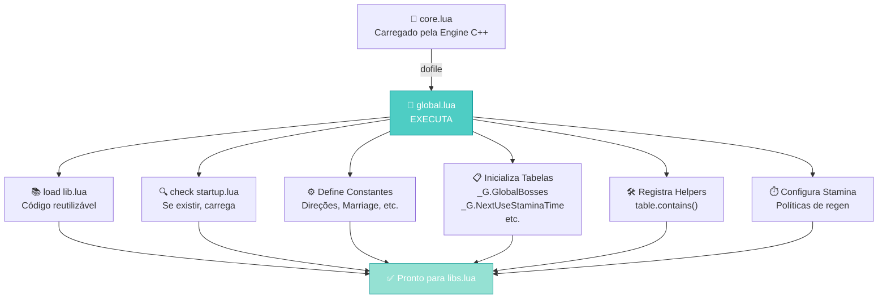
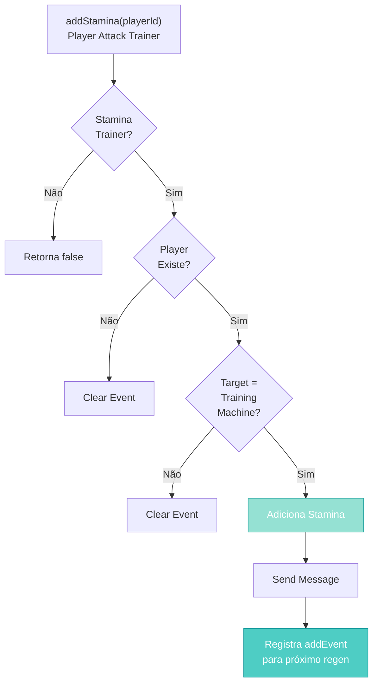
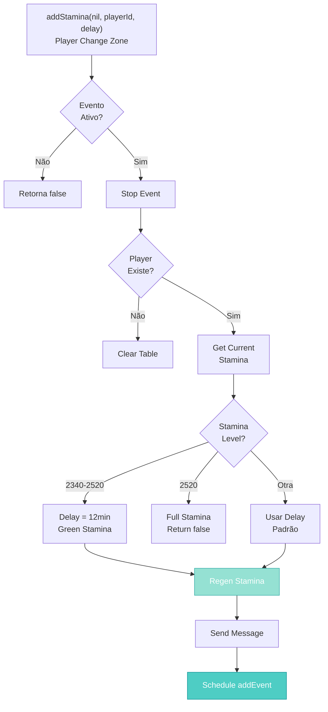
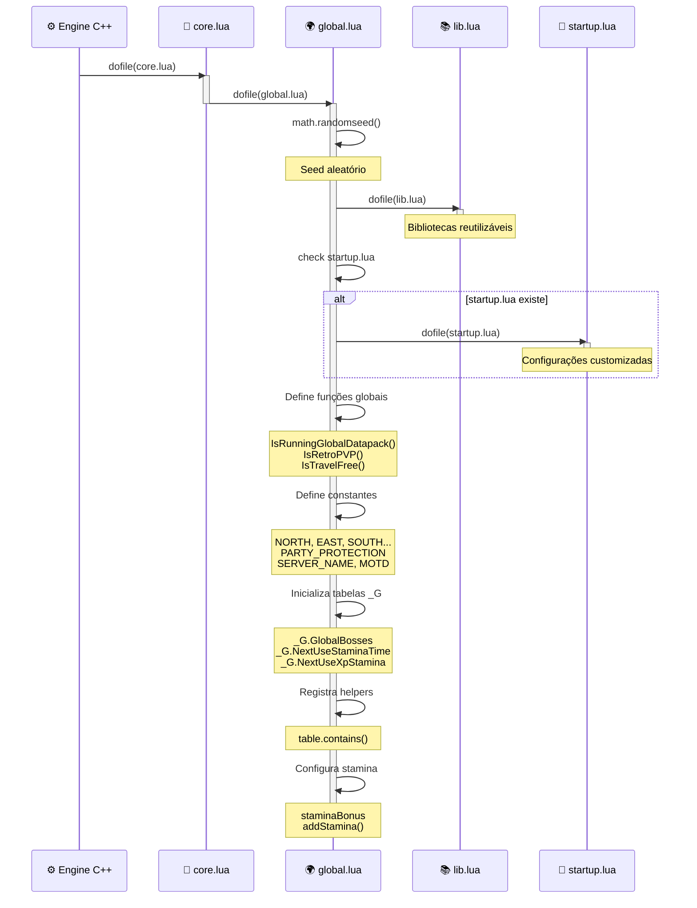

import { Aside, Card } from '@astrojs/starlight/components';

## 🛠️ Informações do Arquivo

Este é o arquivo de **inicialização global** do servidor **OpenTibiaBR/Canary**. Ele é responsável por estabelecer as constantes globais, políticas do servidor e tabelas compartilhadas que serão utilizadas por todos os scripts do datapack.

<Card title="Caminho Original" icon="document">
  `data/global.lua`
</Card>

<Aside type="tip">
  Este arquivo é carregado **logo após core.lua** como segundo passo da inicialização do servidor. Define as bases para toda a lógica de jogo. Qualquer erro aqui impede que o servidor inicie corretamente.
</Aside>

## 📄 Visão Geral do Código

### Resumo Executivo

`global.lua` é o segundo arquivo carregado durante a inicialização do servidor (após `core.lua`). Seu papel é estabelecer as **constantes globais, políticas do servidor e tabelas compartilhadas** que serão utilizadas por todos os scripts do datapack.


### Responsabilidades Principais

- ✅ Carregar bibliotecas essenciais (`lib.lua`)
- ✅ Carregar configurações de startup (se houver)
- ✅ Detectar qual datapack está em execução
- ✅ Configurar constantes globais (direções, matrimônio, stamina, etc.)
- ✅ Inicializar tabelas globais (`_G.*`) para sistemas
- ✅ Registrar helpers de uso comum (e.g., `table.contains`)
- ✅ Configurar políticas do servidor (PvP, Stamina, etc.)

---

### Fluxo de Execução

Abaixo está o fluxo de execução do arquivo global.lua durante a inicialização do servidor:



---

## 4. Variáveis Globais e Constantes

### 4.1 Seed Aleatório

```lua
math.randomseed(os.time())
```

**Propósito**: Inicializa o gerador de números aleatórios com o timestamp atual  
**Moment**: Executa no início do arquivo  
**Impacto**: Garante que cada inicialização do servidor tenha diferentes valores aleatórios

---

### 4.2 Detecção de Datapack

#### Função: `IsRunningGlobalDatapack()`

```lua
function IsRunningGlobalDatapack()
    if DATA_DIRECTORY == "data-otservbr-global" then
        return true
    else
        return false
    end
end
```

| Propriedade | Valor |
|------------|-------|
| **Tipo** | Function (Global) |
| **Parâmetros** | Nenhum |
| **Retorna** | boolean |
| **Propósito** | Detecta se o datapack em execução é o `data-otservbr-global` |
| **Uso Comum** | Condicionar comportamento por datapack |

**Exemplo de Uso**:
```lua
if IsRunningGlobalDatapack() then
    -- Comportamento específico para global datapack
    startGlobalContent()
else
    -- Comportamento para datapacks customizados
    startCustomContent()
end
```

---

### 4.3 Configurações de PvP e Modo Retro

#### Função: `IsRetroPVP()`

```lua
function IsRetroPVP()
    return configManager.getBoolean(configKeys.TOGGLE_SERVER_IS_RETRO)
end
```

| Propriedade | Valor |
|------------|-------|
| **Tipo** | Function (Global) |
| **Retorna** | boolean |
| **Propósito** | Verifica se servidor está em modo Retro PvP |
| **Configuração** | `configKeys.TOGGLE_SERVER_IS_RETRO` |

#### Função: `IsTravelFree()`

```lua
function IsTravelFree()
    return configManager.getBoolean(configKeys.TOGGLE_TRAVELS_FREE)
end
```

| Propriedade | Valor |
|------------|-------|
| **Tipo** | Function (Global) |
| **Retorna** | boolean |
| **Propósito** | Verifica se viagens são gratuitas |
| **Configuração** | `configKeys.TOGGLE_TRAVELS_FREE` |

---

### 4.4 Políticas do Servidor (Constantes)

```lua
-- NOTE: 0 is disabled.
PARTY_PROTECTION = (IsRetroPVP() and 0) or 1
ADVANCED_SECURE_MODE = (IsRetroPVP() and 0) or 1
```

| Constante | Valor | Descrição |
|-----------|-------|-----------|
| **PARTY_PROTECTION** | 0 ou 1 | Proteção contra dano de players da party. Desabilitado em Retro PvP |
| **ADVANCED_SECURE_MODE** | 0 ou 1 | Modo avançado de segurança. Desabilitado em Retro PvP |

---

### 4.5 Constantes de Direção

```lua
NORTH = DIRECTION_NORTH
EAST = DIRECTION_EAST
SOUTH = DIRECTION_SOUTH
WEST = DIRECTION_WEST
SOUTHWEST = DIRECTION_SOUTHWEST
SOUTHEAST = DIRECTION_SOUTHEAST
NORTHWEST = DIRECTION_NORTHWEST
NORTHEAST = DIRECTION_NORTHEAST

DIRECTIONS_TABLE = {
    DIRECTION_NORTH,
    DIRECTION_EAST,
    DIRECTION_SOUTH,
    DIRECTION_WEST,
    DIRECTION_SOUTHWEST,
    DIRECTION_SOUTHEAST,
    DIRECTION_NORTHWEST,
    DIRECTION_NORTHEAST,
}
```

**Propósito**: Criar aliases mais legíveis para direções e uma tabela com todas elas

**Uso Comum**:
```lua
-- Ao invés de DIRECTION_NORTH, pode usar NORTH
creature:move(NORTH)

-- Iterar sobre todas as direções
for _, direction in ipairs(DIRECTIONS_TABLE) do
    print("Direção:", direction)
end
```

---

### 4.6 Configurações de Servidor

```lua
SERVER_NAME = configManager.getString(configKeys.SERVER_NAME)
SERVER_MOTD = configManager.getString(configKeys.SERVER_MOTD)
AUTH_TYPE = configManager.getString(configKeys.AUTH_TYPE)
```

| Variável | Fonte | Descrição |
|----------|-------|-----------|
| **SERVER_NAME** | configManager | Nome do servidor (usado em mensagens de boas-vindas) |
| **SERVER_MOTD** | configManager | Mensagem do dia (exibida ao login) |
| **AUTH_TYPE** | configManager | Tipo de autenticação (token, password, etc.) |

---

### 4.7 Agendamento de Eventos (Schedule)

```lua
SCHEDULE_LOOT_RATE = 100
SCHEDULE_EXP_RATE = 100
SCHEDULE_BOSS_LOOT_RATE = 100
SCHEDULE_SKILL_RATE = 100
SCHEDULE_SPAWN_RATE = 100
```

| Variável | Padrão | Descrição |
|----------|--------|-----------|
| **SCHEDULE_LOOT_RATE** | 100 | Taxa de loot base |
| **SCHEDULE_EXP_RATE** | 100 | Taxa de experiência base |
| **SCHEDULE_BOSS_LOOT_RATE** | 100 | Taxa de loot de bosses |
| **SCHEDULE_SKILL_RATE** | 100 | Taxa de skills base |
| **SCHEDULE_SPAWN_RATE** | 100 | Taxa de spawn de criaturas |

> 💡 **Nota**: Esses valores são percentuais. 100 = 100%, 200 = 200%, 50 = 50%

---

### 4.8 Sistema de Matrimônio

```lua
PROPOSED_STATUS = 1
MARRIED_STATUS = 2
PROPACCEPT_STATUS = 3
LOOK_MARRIAGE_DESCR = true
ITEM_WEDDING_RING = 3004
ITEM_ENGRAVED_WEDDING_RING = 9585
```

| Constante | Valor | Descrição |
|-----------|-------|-----------|
| **PROPOSED_STATUS** | 1 | Status: Proposta de casamento |
| **MARRIED_STATUS** | 2 | Status: Casado |
| **PROPACCEPT_STATUS** | 3 | Status: Proposta aceita |
| **LOOK_MARRIAGE_DESCR** | true | Mostrar descrição de casamento no look |
| **ITEM_WEDDING_RING** | 3004 | ID do anel de casamento comum |
| **ITEM_ENGRAVED_WEDDING_RING** | 9585 | ID do anel gravado |

---

### 4.9 NPC Especial (Scarlett Etzel)

```lua
SCARLETT_MAY_TRANSFORM = 0
SCARLETT_MAY_DIE = 0
```

**Propósito**: Controlar comportamento especial do NPC Scarlett Etzel  
**Uso**: Bloquear ou permitir transformações e morte

---

### 4.10 Definições de Ambientes Especiais

```lua
ropeSpots = { 386, 421, 386, 7762, 12202, 12936, 14238, 17238, 23363, 21965, 21966, 21967, 21968 }
specialRopeSpots = { 12935 }
swimmingTiles = { 629, 630, 631, 632, 633, 634, 4809, 4810, 4811, 4812, 4813, 4814 }
```

| Variável | Descrição |
|----------|-----------|
| **ropeSpots** | Lista de IDs de tiles onde rope funciona |
| **specialRopeSpots** | Tiles especiais de rope (comportamento diferente) |
| **swimmingTiles** | Tiles onde o player pode nadar |

---

## 5. Tabelas Globais (_G)

### 5.1 Tabelas Inicializadas Condicionalmente

```lua
if not _G.GlobalBosses then
    _G.GlobalBosses = {}
end

if not _G.OnExerciseTraining then
    _G.OnExerciseTraining = {}
end
```

**Padrão**: Usar `if not _G.Table then` garante que a tabela não seja reinicializada se já existir

| Tabela | Propósito |
|--------|-----------|
| **_G.GlobalBosses** | Registra bosses globais e seu status |
| **_G.OnExerciseTraining** | Tracks de players em treinamento |

---

### 4.2 Tabelas de Stamina

```lua
if not _G.NextUseStaminaTime then
    _G.NextUseStaminaTime = {}
end

if not _G.NextUseXpStamina then
    _G.NextUseXpStamina = {}
end

if not _G.NextUseConcoctionTime then
    _G.NextUseConcoctionTime = {}
end
```

| Tabela | Chave | Valor | Propósito |
|--------|-------|-------|-----------|
| **NextUseStaminaTime** | playerId | timestamp | Última vez que stamina foi usado |
| **NextUseXpStamina** | playerId | timestamp | Último uso de XP stamina |
| **NextUseConcoctionTime** | playerId | timestamp | Última poção usada |

**Uso Interno**:
```lua
-- Verificar se jogador pode usar stamina novamente
if NextUseStaminaTime[playerId] and os.time() < NextUseStaminaTime[playerId] then
    -- Ainda está em cooldown
    return false
end
```

---

### 4.3 Familiaridades (Familiars)

```lua
FAMILIARSNAME = {
    "sorcerer familiar",
    "knight familiar",
    "druid familiar",
    "paladin familiar",
    "monk familiar",
}
```

**Propósito**: Nomes dos familiares por vocação  
**Uso**: Validar se criatura é um familiar ou nomear ao evocar

---

## 5. Tabela de Helpers Globais

### 5.1 Função Helper: `table.contains()`

```lua
table.contains = function(array, value)
    for _, targetColumn in pairs(array) do
        if targetColumn == value then
            return true
        end
    end
    return false
end
```

| Propriedade | Valor |
|------------|-------|
| **Tipo** | Function (Table Helper) |
| **Parâmetros** | array (table), value (any) |
| **Retorna** | boolean |
| **Propósito** | Verificar se value existe em array |
| **Escopo** | Global (acessível por `table.contains()`) |

**Exemplo**:
```lua
local vocations = {1, 2, 3, 4, 5}
if table.contains(vocations, player:getVocation()) then
    print("Vocação válida!")
end
```

---

## 6. Sistema de Stamina

<div className="stamina-section">

### 6.1 Configuração de Save Interval

```lua
SAVE_INTERVAL_TYPE = configManager.getString(configKeys.SAVE_INTERVAL_TYPE)
SAVE_INTERVAL_CONFIG_TIME = configManager.getNumber(configKeys.SAVE_INTERVAL_TIME)
SAVE_INTERVAL_TIME = 0

if SAVE_INTERVAL_TYPE == "second" then
    SAVE_INTERVAL_TIME = 1000
elseif SAVE_INTERVAL_TYPE == "minute" then
    SAVE_INTERVAL_TIME = 60 * 1000
elseif SAVE_INTERVAL_TYPE == "hour" then
    SAVE_INTERVAL_TIME = 60 * 60 * 1000
end
```

| Variável | Tipo | Descrição |
|----------|------|-----------|
| **SAVE_INTERVAL_TYPE** | string | Unidade: "second", "minute" ou "hour" |
| **SAVE_INTERVAL_CONFIG_TIME** | number | Valor do intervalo (ex: 5 minutos) |
| **SAVE_INTERVAL_TIME** | number | Intervalo convertido em milliseconds |

**Exemplo**:
- Se `SAVE_INTERVAL_TYPE = "minute"` e `SAVE_INTERVAL_CONFIG_TIME = 5`
- Então `SAVE_INTERVAL_TIME = 300000` (5 minutos em ms)

---

### 6.2 Tabela de Bônus de Stamina

```lua
staminaBonus = {
    target = "Training Machine",
    period = configManager.getNumber(configKeys.STAMINA_TRAINER_DELAY) * 60 * 1000,
    bonus = configManager.getNumber(configKeys.STAMINA_TRAINER_GAIN),
    eventsTrainer = {}, -- stamina em máquinas de treino
    eventsPz = {},      -- stamina em salas protegidas
}
```

| Campo | Tipo | Propósito |
|-------|------|-----------|
| **target** | string | Nome do alvo (Training Machine) |
| **period** | number | Intervalo entre regens (em ms) |
| **bonus** | number | Quantidade de stamina por regen |
| **eventsTrainer** | table | Eventos ativos em máquinas de treino |
| **eventsPz** | table | Eventos ativos em zonas protegidas |

---

### 6.3 Função: `addStamina()`

```lua
function addStamina(playerId, ...)
    -- Creature:onTargetCombat
    if playerId then
        local player = Player(playerId)
        if configManager.getBoolean(configKeys.STAMINA_TRAINER) then
            if not player then
                staminaBonus.eventsTrainer[playerId] = nil
            else
                local target = player:getTarget()
                if not target or target:getName() ~= staminaBonus.target then
                    staminaBonus.eventsTrainer[playerId] = nil
                else
                    player:setStamina(player:getStamina() + staminaBonus.bonus)
                    player:sendTextMessage(MESSAGE_FAILURE, 
                        string.format("%i of stamina has been refilled.", 
                        configManager.getNumber(configKeys.STAMINA_TRAINER_GAIN)))
                    staminaBonus.eventsTrainer[playerId] = addEvent(addStamina, staminaBonus.period, playerId)
                end
            end
        end
        return not configManager.getBoolean(configKeys.STAMINA_TRAINER)
    end

    -- Player:onChangeZone
    local localPlayerId, delay = ...
    -- ... resto da função
end
```

| Propriedade | Valor |
|------------|-------|
| **Tipo** | Function (Global) |
| **Parâmetros** | playerId (number), ... (varargs) |
| **Retorna** | boolean |
| **Propósito** | Gerenciar regen de stamina em treinadores e PZ |
| **Contextos** | `Creature:onTargetCombat` e `Player:onChangeZone` |

#### Comportamento Detalhado

**Modo 1: Treinador (quando `playerId` é fornecido)**
```lua
if playerId then
    -- Verifica se stamina trainer está ativo
    -- Se player está atacando a "Training Machine"
    -- Regenera stamina periodicamente
end
```

**Modo 2: Zona Protegida (quando `playerId` e `delay` são fornecidos)**
```lua
local localPlayerId, delay = ...
-- Regen basada no atual stamina:
-- Se 2340-2520: regen a cada 12 minutos (verde)
-- Se 2520: stamina cheio, para regeneração
-- Caso contrário: usa delay configurado
```

#### Diagramas: Fluxo de Stamina





</div>

---

## 7. Ordem de Carregamento (Timeline)



---

## 8. Padrões e Boas Práticas

<div className="patterns-section">

### ✅ Inicialização Condicional de Tabelas

```lua
if not _G.GlobalBosses then
    _G.GlobalBosses = {}
end
```

**Por quê?** Evita zerar tabelas se o arquivo for recarregado  
**Benefício**: Preserva estado entre reloads

---

### ✅ Funções Detectoras (Feature Flags)

```lua
function IsRunningGlobalDatapack()
    return DATA_DIRECTORY == "data-otservbr-global"
end

function IsRetroPVP()
    return configManager.getBoolean(configKeys.TOGGLE_SERVER_IS_RETRO)
end
```

**Por quê?** Centraliza lógica de detecção  
**Benefício**: Fácil manutenção, chamadas claras em todo código

---

### ✅ Aliases Legíveis para Enums

```lua
NORTH = DIRECTION_NORTH
EAST = DIRECTION_EAST
```

**Por quê?** `NORTH` é mais legível que `DIRECTION_NORTH`  
**Benefício**: Código mais limpo e fácil de ler

---

### ✅ Configurações Baseadas em ConfigManager

```lua
SERVER_NAME = configManager.getString(configKeys.SERVER_NAME)
AUTH_TYPE = configManager.getString(configKeys.AUTH_TYPE)
```

**Por quê?** Permite mudar configurações sem editar Lua  
**Benefício**: Separação entre código e configuração

---

### ✅ Event Management com Tables

```lua
staminaBonus.eventsTrainer = {}      -- Rastreia eventos ativos
staminaBonus.eventsTrainer[playerId] = addEvent(...)
```

**Por quê?** Permite cancelar eventos específicos depois  
**Benefício**: Controle fino sobre ciclo de vida de eventos

---

### ✅ Cálculos Dinâmicos de Tempo

```lua
SAVE_INTERVAL_TIME = 60 * 60 * 1000  -- converte 1 hora para ms
```

**Por quê?** Evita magic numbers  
**Benefício**: Cálculos explícitos e autoexplicativos

</div>

---

## 9. Variáveis Locais (Em Escopo de Função)

<Aside type="note">
O arquivo `global.lua` não utiliza variáveis locais em escopo global (todas são globais).
As variáveis locais aparecem apenas dentro da função `addStamina()`:

```lua
local player = Player(playerId)
local target = player:getTarget()
local actualStamina = player:getStamina()
local regen = configManager.getNumber(configKeys.STAMINA_PZ_GAIN)
```

Essas são localmente scoped à função e não afetam o escopo global.
</Aside>

---

## 10. Exemplos de Uso Prático

### Exemplo 1: Detectar Datapack e Agir

```lua
-- Em um script qualquer
if IsRunningGlobalDatapack() then
    -- Comportamento para OTServBR Global
    loadGlobalWorldContent()
else
    -- Comportamento para servidor customizado
    loadCustomContent()
end
```

### Exemplo 2: Usar Direções

```lua
-- Movimentar criatura em todas as direções
for _, direction in ipairs(DIRECTIONS_TABLE) do
    creature:move(direction)
    os.execute("sleep 1") -- espera 1 segundo
end
```

### Exemplo 3: Verificar Vocação com Helper

```lua
local allowedVocations = {1, 2, 3, 4}

if table.contains(allowedVocations, player:getVocation()) then
    player:sendTextMessage(MESSAGE_STATUS, "Acesso permitido!")
else
    player:sendTextMessage(MESSAGE_FAILURE, "Sua vocação não pode usar isso.")
end
```

### Exemplo 4: Configurar Policies por PvP Mode

```lua
-- Em um spell ou sistema
if IsRetroPVP() then
    -- Sem proteção de party
    damage = baseGammage
else
    -- Com proteção de party
    if PARTY_PROTECTION then
        if player:getParty() and player:getParty():isInvitedPlayer(target) then
            damage = 0
        end
    end
end
```

### Exemplo 5: Acessar Tabela Global de Bosses

```lua
-- Registrar um boss global
_G.GlobalBosses["BossName"] = {
    health = boss:getHealth(),
    location = boss:getPosition(),
    lastDamage = os.time()
}

-- Recuperar informação
local bossInfo = _G.GlobalBosses["BossName"]
if bossInfo then
    print("Boss health:", bossInfo.health)
end
```

---

## 11. Referência Rápida

<div className="quick-reference">

### Funções Globais

| Função | Retorna | Propósito |
|--------|---------|----------|
| `IsRunningGlobalDatapack()` | boolean | Detecta datapack |
| `IsRetroPVP()` | boolean | Verifica modo Retro |
| `IsTravelFree()` | boolean | Viagens gratuitas? |
| `addStamina(playerId, ...)` | boolean | Gerencia regen stamina |
| `table.contains(array, value)` | boolean | Search em array |

### Constantes de Direção

| Constante | Enum | Uso |
|-----------|------|-----|
| `NORTH` | DIRECTION_NORTH | Mover para norte |
| `EAST` | DIRECTION_EAST | Mover para leste |
| `SOUTH` | DIRECTION_SOUTH | Mover para sul |
| `WEST` | DIRECTION_WEST | Mover para oeste |
| `DIRECTIONS_TABLE` | todos | Iterar direções |

### Constantes de Configuração

| Constante | Fonte | Valor |
|-----------|-------|-------|
| `SERVER_NAME` | configManager | Nome do servidor |
| `SERVER_MOTD` | configManager | Mensagem do dia |
| `AUTH_TYPE` | configManager | Tipo de auth |
| `PARTY_PROTECTION` | Condicional | 0 ou 1 |
| `ADVANCED_SECURE_MODE` | Condicional | 0 ou 1 |

### Constantes de Matrimônio

| Constante | Valor | Descrição |
|-----------|-------|-----------|
| `PROPOSED_STATUS` | 1 | Proposta de casamento |
| `MARRIED_STATUS` | 2 | Casado |
| `PROPACCEPT_STATUS` | 3 | Proposta aceita |
| `ITEM_WEDDING_RING` | 3004 | Anel comum |
| `ITEM_ENGRAVED_WEDDING_RING` | 9585 | Anel gravado |

### Tabelas Globais (_G)

| Tabela | Chave | Tipo | Propósito |
|--------|-------|------|-----------|
| `_G.GlobalBosses` | bossName | table | Dados globais de bosses |
| `_G.OnExerciseTraining` | playerId | value | Players em treino |
| `_G.NextUseStaminaTime` | playerId | timestamp | Cooldown de stamina |
| `_G.NextUseXpStamina` | playerId | timestamp | Cooldown XP stamina |
| `_G.NextUseConcoctionTime` | playerId | timestamp | Cooldown poção |

### Listas Especiais

| Variável | Tipo | Propósito |
|----------|------|----------|
| `ropeSpots` | table | Tiles com rope |
| `specialRopeSpots` | table | Rope especial |
| `swimmingTiles` | table | Tiles de nado |
| `FAMILIARSNAME` | table | Nomes de familiares |

</div>

---

## 12. Fluxo de Stamina (Detalhado)

### Cenário 1: Player Ataca Training Machine

```
1. Player inicia combate com Training Machine
   ↓ (triggers onTargetCombat)
2. Chama addStamina(playerId)
3. Verifica: STAMINA_TRAINER ativo?
   ↓ Sim
4. Obtém target atual do player
5. Target == "Training Machine"?
   ↓ Sim
6. player:setStamina(currentStamina + bonus)
7. Envia mensagem de bônus
8. Registra próximo evento: addEvent(addStamina, period, playerId)
9. Aguarda 'period' milissegundos
10. Repete de 3-8 até player mudar de target ou deslogar
```

### Cenário 2: Player Entra em Zona Protegida

```
1. Player muda de zona → onChangeZone triggered
2. Chama addStamina(nil, localPlayerId, delay)
3. Verifica: evento já está ativo?
   ↓ Sim
4. Para o evento anterior (stopEvent)
5. Obtém stamina atual do player
6. if stamina <= 2340: usar delay padrão
7. if 2340 < stamina < 2520: usar delay de 12min (STAMINA_GREEN_DELAY)
8. if stamina == 2520: parar regen, retornar false
9. regen = configManager.getNumber(STAMINA_PZ_GAIN)
10. player:setStamina(stamina + regen)
11. Envia mensagem "X minutes of stamina refilled"
12. Registra novo evento para próximo ciclo
```

---

## 13. Checkpoint: O que foi Carregado até Aqui

Após `global.lua` ser executado, o servidor tem:

✅ **Constantes globais**: Direções, matrimônio, configurações  
✅ **Funções detectoras**: IsRunningGlobalDatapack, IsRetroPVP, etc.  
✅ **Tabelas globais**: GlobalBosses, NextUseStaminaTime, etc.  
✅ **Helpers**: table.contains()  
✅ **Sistema de Stamina**: staminaBonus + addStamina()  
✅ **Bibliotecas carregadas**: lib.lua foi dofile  
✅ **Configurações custom**: startup.lua foi carregado (se existir)  

### Próximo Passo: `libs.lua`
O próximo arquivo a ser carregado é `libs.lua`, que importa as bibliotecas core do `CORE_DIRECTORY` e expõe a API Lua ao datapack.

---

## 14. Conclusão

`global.lua` é o **arquivo de configuração global** que estabelece a base para todo o datapack. Ele define constantes, políticas, funções detectoras e inicializa tabelas compartilhadas que serão usadas por todos os scripts do jogo.

### Responsabilidades Resumidas
1. ✅ Seed aleatório
2. ✅ Carrega lib.lua
3. ✅ Carrega startup.lua (se existir)
4. ✅ Define funções detectoras
5. ✅ Define constantes globais
6. ✅ Inicializa tabelas _G
7. ✅ Registra helpers
8. ✅ Configura políticas (PvP, Stamina, etc.)

### Boas Práticas
- ✅ Use `if not _G.Table then` para inicializar condicionalmente
- ✅ Crie funções detectoras para lógica complexa
- ✅ Alias enums para melhor legibilidade
- ✅ Centralize configurações no configManager
- ✅ Use event tracking para controlar ciclos de vida

---

## 🤖 Informações da Documentação

<Aside type="note">
  Esta documentação foi **gerada automaticamente por IA** (Claude Haiku 4.5) utilizando análise estática de código. Todas as explicações técnicas foram produzidas por processamento inteligente do código-fonte, garantindo precisão e consistência com o padrão de documentação Starlight/Astro do projeto.
</Aside>

**Última Atualização**: Baseado no servidor **OpenTibiaBR/Canary** (Fork do OTServBR-Global)

**Repositório**: [opentibiabr/canary](https://github.com/opentibiabr/canary)

