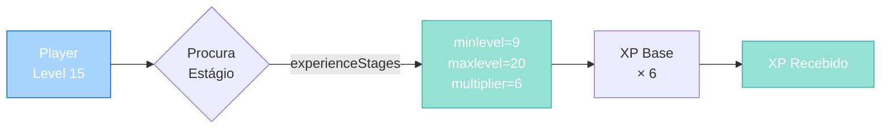
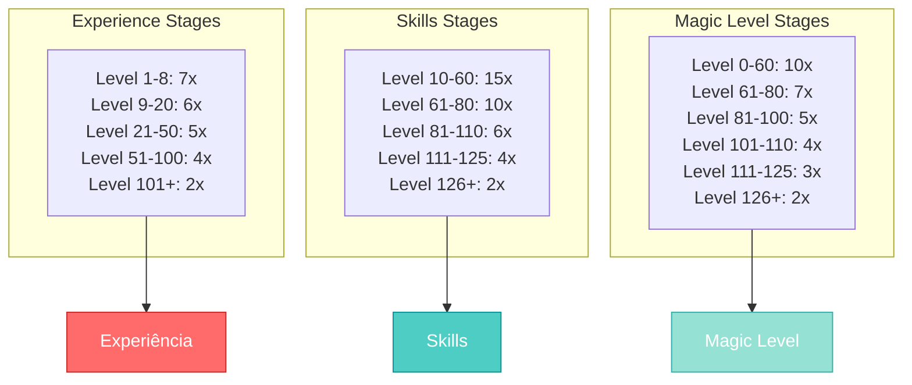
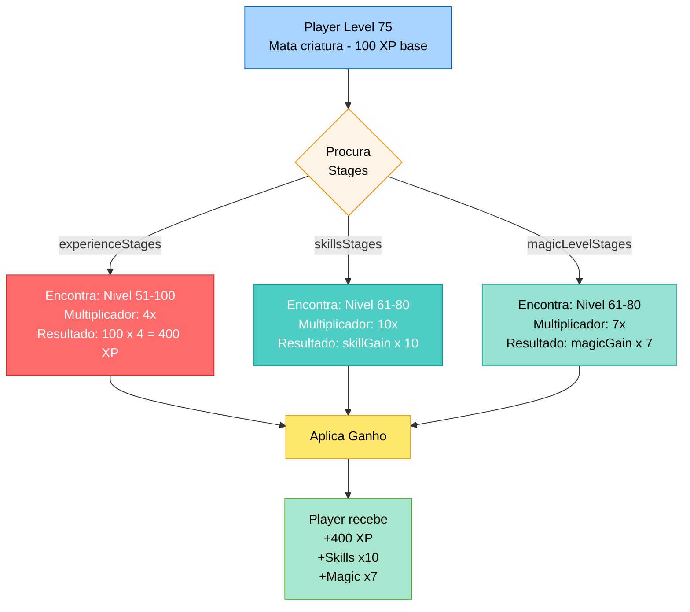

import { Aside, Card } from '@astrojs/starlight/components';

## 🛠️ Informações do Arquivo

Este é o arquivo de **configuração de estágios de experiência** do servidor **OpenTibiaBR/Canary**. Ele é responsável por definir as tabelas de multiplicadores de experiência, skills e magic level para diferentes faixas de nível.

<Card title="Caminho Original" icon="document">
  `data/stages.lua`
</Card>

<Aside type="tip">
  Este arquivo é carregado **durante a inicialização do servidor** (após global.lua). Define como a experiência e skills crescem em diferentes faixas de nível, permitindo ajuste fino da curva de progressão do jogo.
</Aside>

## 📄 Visão Geral do Código

### Resumo Executivo

`stages.lua` é um arquivo de configuração que define **3 tabelas principais** de multiplicadores:

1. **experienceStages**: Taxa de ganho de experiência por faixa de nível
2. **skillsStages**: Taxa de ganho de skills (melee, distância, defesa) por nível
3. **magicLevelStages**: Taxa de ganho de magic level por nível

Estas tabelas controlam **como a progressão de um player varia** conforme ele sobe de nível. É um sistema de "stages" - cada estágio define um intervalo de níveis com um multiplicador específico.

### Estrutura de um Estágio

Cada estágio é uma tabela Lua com a seguinte estrutura:

```lua
{
    minlevel = 1,          -- Nível mínimo (OBRIGATÓRIO)
    maxlevel = 8,          -- Nível máximo (OPCIONAL, infinito se omitido)
    multiplier = 7,        -- Multiplicador da taxa base (OBRIGATÓRIO)
}
```

| Campo | Tipo | Obrigatório | Descrição |
|-------|------|-------------|-----------|
| **minlevel** | number | ✅ Sim | Nível mínimo para este estágio |
| **maxlevel** | number | ⚠️ Opcional | Nível máximo. Se omitido, considera-se infinito |
| **multiplier** | number | ✅ Sim | Multiplicador da taxa de ganho neste estágio |

### Como os Estágios Funcionam



---

## 3. Tabelas de Estágios

### 3.1 Experience Stages (`experienceStages`)

Controla a taxa de ganho de **experiência (XP)** por nível.

```lua
experienceStages = {
    {
        minlevel = 1,
        maxlevel = 8,
        multiplier = 7,
    },
    {
        minlevel = 9,
        maxlevel = 20,
        multiplier = 6,
    },
    {
        minlevel = 21,
        maxlevel = 50,
        multiplier = 5,
    },
    {
        minlevel = 51,
        maxlevel = 100,
        multiplier = 4,
    },
    {
        minlevel = 101,
        multiplier = 2,
    },
}
```

#### Análise da Tabela

| Nível | Multiplicador | Descrição |
|-------|---------------|-----------|
| **1-8** | 7x | Início do jogo, rápido leveling |
| **9-20** | 6x | Early game, ainda rápido |
| **21-50** | 5x | Mid game, progressão normal |
| **51-100** | 4x | Advanced progression |
| **101+** | 2x | Endgame, crescimento lento |

#### Exemplo de Cálculo

Se a **XP base para matar uma criatura** é 100:

- Level 5 (minlevel=1): `100 × 7 = 700 XP`
- Level 15 (minlevel=9): `100 × 6 = 600 XP`
- Level 30 (minlevel=21): `100 × 5 = 500 XP`
- Level 150 (minlevel=101): `100 × 2 = 200 XP`

---

### 3.2 Skills Stages (`skillsStages`)

Controla a taxa de ganho de **skills** (melee, distância, defesa) por nível.

```lua
skillsStages = {
    {
        minlevel = 10,
        maxlevel = 60,
        multiplier = 15,
    },
    {
        minlevel = 61,
        maxlevel = 80,
        multiplier = 10,
    },
    {
        minlevel = 81,
        maxlevel = 110,
        multiplier = 6,
    },
    {
        minlevel = 111,
        maxlevel = 125,
        multiplier = 4,
    },
    {
        minlevel = 126,
        multiplier = 2,
    },
}
```

#### Análise da Tabela

| Nível | Multiplicador | Descrição |
|-------|---------------|-----------|
| **10-60** | 15x | Skill leveling muito rápido |
| **61-80** | 10x | Skill leveling rápido |
| **81-110** | 6x | Skill leveling normal |
| **111-125** | 4x | Skill leveling lento |
| **126+** | 2x | Skill leveling muito lento |

#### Notas

- O skill começa a contar apenas a partir do **nível 10**
- Primeiros 10 níveis **não ganham skills**
- Há um "pico" de leveling entre 10-60, depois diminui progressivamente

---

### 3.3 Magic Level Stages (`magicLevelStages`)

Controla a taxa de ganho de **magic level** por nível.

```lua
magicLevelStages = {
    {
        minlevel = 0,
        maxlevel = 60,
        multiplier = 10,
    },
    {
        minlevel = 61,
        maxlevel = 80,
        multiplier = 7,
    },
    {
        minlevel = 81,
        maxlevel = 100,
        multiplier = 5,
    },
    {
        minlevel = 101,
        maxlevel = 110,
        multiplier = 4,
    },
    {
        minlevel = 111,
        maxlevel = 125,
        multiplier = 3,
    },
    {
        minlevel = 126,
        multiplier = 2,
    },
}
```

#### Análise da Tabela

| Nível | Multiplicador | Descrição |
|-------|---------------|-----------|
| **0-60** | 10x | Magic leveling muito rápido |
| **61-80** | 7x | Magic leveling rápido |
| **81-100** | 5x | Magic leveling normal |
| **101-110** | 4x | Magic leveling moderado |
| **111-125** | 3x | Magic leveling lento |
| **126+** | 2x | Magic leveling muito lento |

#### Notas

- Magic level começa desde o nível **0**
- Todos os níveis podem ganhar magic level
- Curva mais suave comparada a skills (começa em 10x, não 15x)

---

## 4. Comparação das Três Tabelas



### Observações

1. **Todas as tabelas terminam em 2x** para endgame (126+)
2. **Skills** tem multiplicador mais alto que XP (começa em 15x vs 7x)
3. **Magic level** tem progressão mais suave que skills
4. **XP** é a curva mais suave (começa em 7x, cai para 2x)
5. Skills começa no **nível 10**, enquanto XP/Magic começam antes

---

## 5. Como as Stages são Utilizadas

### Fluxo de Procura de Estágio

Quando um player ganha XP, skills ou magic level, o servidor:

1. Obtém o **nível atual** do player
2. Procura na tabela apropriada (**experienceStages** / **skillsStages** / **magicLevelStages**)
3. Encontra o **primeiro** estágio onde `minlevel <= playerLevel <= maxlevel`
4. Usa o **multiplier** daquele estágio
5. Aplica: `baseGain × multiplier`

### Exemplo Prático

**Cenário**: Player level 75 mata uma criatura que dá 100 XP

1. **Para XP**: Procura experienceStages
   - Não está em 1-8 ✗
   - Não está em 9-20 ✗
   - Não está em 21-50 ✗
   - Não está em 51-100 ✓ (minlevel=51, maxlevel=100)
   - **Multiplicador = 4**
   - **XP Recebido = 100 × 4 = 400**

2. **Para Skills**: Procura skillsStages
   - Não está em 10-60 ✗
   - Está em 61-80 ✓ (minlevel=61, maxlevel=80)
   - **Multiplicador = 10**
   - **Skill Gain = baseGain × 10**

3. **Para Magic Level**: Procura magicLevelStages
   - Não está em 0-60 ✗
   - Está em 61-80 ✓ (minlevel=61, maxlevel=80)
   - **Multiplicador = 7**
   - **Magic Gain = baseGain × 7**



---

## 6. Variáveis Globais Disponibilizadas

Após `stages.lua` ser carregado, as seguintes variáveis globais estão disponíveis:

| Variável | Tipo | Propósito |
|----------|------|-----------|
| **experienceStages** | table | Tabela com estágios de XP |
| **skillsStages** | table | Tabela com estágios de skills |
| **magicLevelStages** | table | Tabela com estágios de magic level |

Acessáveis em qualquer script via:

```lua
-- Todos os estágios de XP
for i, stage in ipairs(experienceStages) do
    print("Stage", i, ":", stage.minlevel, "-", stage.maxlevel, "×", stage.multiplier)
end
```

---

## 7. Padrões e Boas Práticas

### ✅ Estrutura Progressiva

```lua
{
    minlevel = 1,
    maxlevel = 8,
    multiplier = 7,  -- Alto para começantes
}
```

**Por quê?** Mantém o flow do jogo rápido no início, depois desacelera gradualmente.

---

### ✅ Multiplicadores Decrescentes

À medida que o nível aumenta, o multiplicador diminui (7 → 6 → 5 → 4 → 2).

**Por quê?** Previne que o jogo fique muito "grindy" em altos níveis.

---

### ✅ Omitir maxlevel para Endgame

```lua
{
    minlevel = 101,
    multiplier = 2,  -- Sem maxlevel = infinito
}
```

**Por quê?** Simplifica a tabela e torna claro que este é o estágio final.

---

### ✅ Diferenciação por Tipo de Ganho

- **XP**: 7 estágios, multiplicador 7→2
- **Skills**: 5 estágios, começa em 10x
- **Magic**: 6 estágios, começa em 10x

**Por quê?** Permite curvas diferentes para cada sistema.

---

## 8. Customização e Ajustes

### Aumentar Velocidade Global

Para tornar o jogo **mais fácil**, multiplique todos os valores:

```lua
-- Exemplo: 2x mais rápido
experienceStages = {
    {
        minlevel = 1,
        maxlevel = 8,
        multiplier = 14,  -- 7 × 2
    },
    -- ... resto dos estágios ×2
}
```

### Criar Estágio Customizado

Para adicionar um novo intervalo (ex: Level 35-40 com boost especial):

```lua
{
    minlevel = 35,
    maxlevel = 40,
    multiplier = 10,  -- Boost especial
}
```

**Nota**: A ordem da tabela importa! Coloque em ordem crescente de minlevel.

### Ativar/Desativar Stages

Para desabilitar completamente o sistema de stages:

```lua
experienceStages = {
    {
        minlevel = 1,
        -- Sem maxlevel = infinito
        multiplier = 1,  -- Sem multiplicação
    }
}
```

---

## 9. Funções Globais (Em Escopo de Função)

<Aside type="note">
O arquivo `stages.lua` não define funções globais. Apenas define as 3 tabelas (`experienceStages`, `skillsStages`, `magicLevelStages`). 

As funções que **utilizam** estas tabelas estão no código C++ do engine ou em bibliotecas Lua carregadas depois.
</Aside>

---

## 10. Exemplos Práticos

### Exemplo 1: Visualizar Todos os Estágios de XP

```lua
-- Adicionar ao final de stages.lua para debug
for i, stage in ipairs(experienceStages) do
    local maxText = stage.maxlevel and tostring(stage.maxlevel) or "∞"
    print(string.format("Stage %d: Level %d-%s (×%d)", 
        i, stage.minlevel, maxText, stage.multiplier))
end
```

**Saída**:
```
Stage 1: Level 1-8 (×7)
Stage 2: Level 9-20 (×6)
Stage 3: Level 21-50 (×5)
Stage 4: Level 51-100 (×4)
Stage 5: Level 101-∞ (×2)
```

### Exemplo 2: Encontrar Estágio para um Nível

```lua
function findExperienceStage(playerLevel)
    for _, stage in ipairs(experienceStages) do
        local maxLevel = stage.maxlevel or math.huge
        if playerLevel >= stage.minlevel and playerLevel <= maxLevel then
            return stage
        end
    end
    return nil  -- Nível não encontrado
end

local stage = findExperienceStage(75)
if stage then
    print("Multiplicador para level 75:", stage.multiplier)  -- Output: 4
end
```

### Exemplo 3: Comparar Multiplicadores por Nível

```lua
function compareStages(level)
    local expStage = findExperienceStage(level, experienceStages)
    local skillStage = findExperienceStage(level, skillsStages)
    local magicStage = findExperienceStage(level, magicLevelStages)
    
    print(string.format("Level %d: XP×%d | Skills×%d | Magic×%d",
        level,
        expStage.multiplier,
        skillStage.multiplier,
        magicStage.multiplier
    ))
end

compareStages(30)  -- Output: Level 30: XP×5 | Skills×15 | Magic×10
compareStages(75)  -- Output: Level 75: XP×4 | Skills×10 | Magic×7
```

---

## 11. Referência Rápida

<div className="quick-reference">

### Tabelas Disponíveis

| Nome | Função | Níveis Abrangidos |
|------|--------|-------------------|
| **experienceStages** | Controla ganho de XP | 1-∞ |
| **skillsStages** | Controla ganho de skills | 10-∞ |
| **magicLevelStages** | Controla ganho de magic level | 0-∞ |

### Multiplicadores por Estágio (Default)

#### Experiência
```
Level 1-8: 7x (rápido)
Level 9-20: 6x
Level 21-50: 5x
Level 51-100: 4x
Level 101+: 2x (lento)
```

#### Skills
```
Level 10-60: 15x (muito rápido)
Level 61-80: 10x
Level 81-110: 6x
Level 111-125: 4x
Level 126+: 2x (lento)
```

#### Magic Level
```
Level 0-60: 10x (rápido)
Level 61-80: 7x
Level 81-100: 5x
Level 101-110: 4x
Level 111-125: 3x
Level 126+: 2x (lento)
```

### Campo Obrigatórios por Estágio

```lua
{
    minlevel = NUMBER,    -- ✅ OBRIGATÓRIO
    maxlevel = NUMBER,    -- ⚠️ OPCIONAL (default: infinito)
    multiplier = NUMBER,  -- ✅ OBRIGATÓRIO
}
```

</div>

---

## 12. Checkpoint: O que foi Carregado até Aqui

Após `stages.lua` ser executado, o servidor tem:

✅ **Tabela de estágios de XP**: Define multiplicadores por faixa de nível  
✅ **Tabela de estágios de Skills**: Define curva de leveling de skills  
✅ **Tabela de estágios de Magic**: Define curva de leveling de magic level  
✅ **Configuração completa de progressão**: Pronto para ser usado pelo engine

### Ordem de Carregamento Geral

```
1. core.lua
   ↓
2. global.lua (constantes, políticas)
   ↓
3. libs/libs.lua (classes, helpers)
   ↓
4. stages.lua ← VOCÊ ESTÁ AQUI
   ↓
5. Resto dos scripts do datapack
```

---

## 13. Conclusão

`stages.lua` é o arquivo de **configuração de progressão** do Canary. Define como players ganham experiência, skills e magic level conforme sobem de nível.

### Pontos Importantes

1. **3 Tabelas Principais**: experienceStages, skillsStages, magicLevelStages
2. **Multiplicadores Decrescentes**: Quanto mais alto o nível, mais lento o progresso
3. **Customizável**: Fácil ajustar multiplicadores para balancear o jogo
4. **Simples e Eficiente**: Apenas dados, nenhuma lógica complexa

### Use Para

- ✅ Ajustar velocidade de leveling
- ✅ Balancear diferentes sistemas (XP vs Skills vs Magic)
- ✅ Criar eventos com boost de XP (aumentar multiplicadores)
- ✅ Adaptar o jogo para diferentes públicos (casual, hardcore, etc)

---

## 🤖 Informações da Documentação

<Aside type="note">
  Esta documentação foi **gerada automaticamente por IA** (Claude Haiku 4.5) utilizando análise estática de código. Todas as explicações técnicas foram produzidas por processamento inteligente do código-fonte, garantindo precisão e consistência com o padrão de documentação Starlight/Astro do projeto.
</Aside>

**Última Atualização**: Baseado no servidor **OpenTibiaBR/Canary** (Fork do OTServBR-Global)

**Repositório**: [opentibiabr/canary](https://github.com/opentibiabr/canary)
