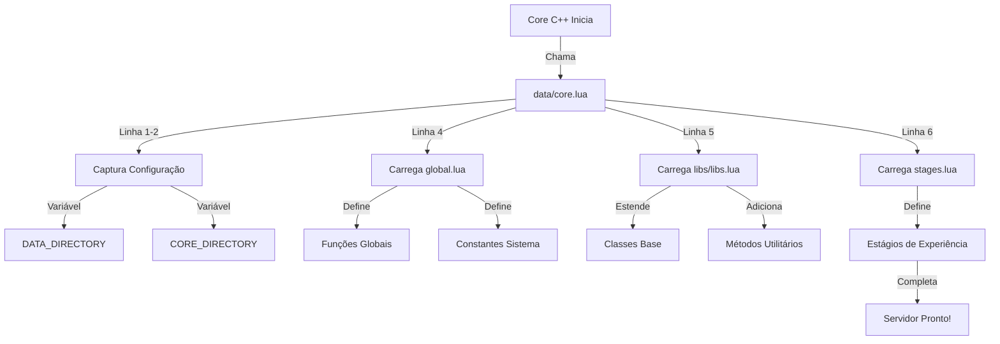
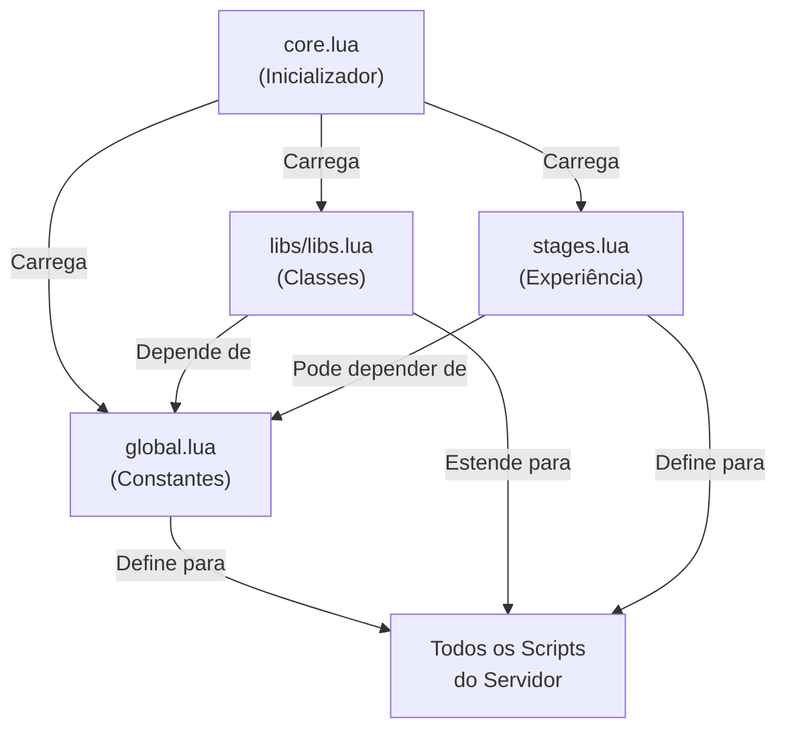

import { Aside, Card } from '@astrojs/starlight/components';

## 🛠️ Informações do Arquivo

Este é o arquivo de **bootstrap primário** do servidor **OpenTibiaBR/Canary** (fork open-source do OTServBR-Global). Ele é responsável por inicializar o ambiente Lua do servidor, configurar diretórios raiz e carregar os módulos essenciais que formam a base de todo o sistema de gameplay.

<Card title="Caminho Original" icon="document">
  `server/data/core.lua`
</Card>

<Aside type="tip">
  Este arquivo é executado **uma única vez** durante a inicialização do servidor. É o primeiro arquivo Lua carregado após o core C++ compilar. Qualquer erro aqui impede que o servidor inicie.
</Aside>

## 📄 Visão Geral do Código

### Resumo Executivo

O `core.lua` é um orquestrador de inicialização minimalisticamente projetado. Ele:

1. **Captura caminhos de configuração** do C++ via `configManager`.
2. **Define variáveis globais** que serão usadas em todo o projeto.
3. **Carrega recursivamente 3 módulos fundamentais** que definem a infraestrutura Lua.

Sua estrutura é linear e determinística - nenhuma condição ou loop. É um **arquivo criticamente importante** cuja falha impede a execução do servidor.

### Fluxo de Execução



---

## 🔧 Análise Detalhada

### Variáveis Globais de Configuração

#### `DATA_DIRECTORY` (Linha 1)
```lua
DATA_DIRECTORY = configManager.getString(configKeys.DATA_DIRECTORY)
```

**Propósito**: Armazena o caminho absoluto do diretório principal de dados do servidor.

**Detalhes**:
- **Fonte**: `configManager.getString()` - Função C++ que lê a configuração do servidor.
- **Chave**: `configKeys.DATA_DIRECTORY` - Constante que referencia a chave no arquivo de configuração (geralmente `config.lua` ou `config.php`).
- **Valor Típico**: Caminho como `/data` ou `C:/tibia/data` (relativo ou absoluto conforme `config.lua`).

**Uso**: Referenciado em scripts que precisam encontrar dados (arquivos XML, Lua, bancos de dados, etc).

<Aside type="note">
  Este não é o `CORE_DIRECTORY`. `DATA_DIRECTORY` aponta para `/data` (raiz de dados), enquanto `CORE_DIRECTORY` aponta para `/data/core` (módulos do core).
</Aside>

---

#### `CORE_DIRECTORY` (Linha 2)
```lua
CORE_DIRECTORY = configManager.getString(configKeys.CORE_DIRECTORY)
```

**Propósito**: Armazena o caminho absoluto do diretório core, onde residem todos os módulos Lua fundamentais.

**Detalhes**:
- **Fonte**: `configManager.getString()` - Mesmo mecanismo que `DATA_DIRECTORY`.
- **Chave**: `configKeys.CORE_DIRECTORY` - Constante para a chave de configuração.
- **Valor Típico**: `/data/core` ou `/data/libs/core`.

**Uso**: Base para construir caminhos aos arquivos listados abaixo (via concatenação com `..`).

<Aside type="tip">
  É convenção Lua usar `..` para concatenação de strings. Então `CORE_DIRECTORY .. "/global.lua"` resulta em `/data/core/global.lua`.
</Aside>

---

### Módulos Carregados

#### 1️⃣ `global.lua` (Linha 4)
```lua
dofile(CORE_DIRECTORY .. "/global.lua")
```

**Localização**: `server/data/core/global.lua`

**Responsabilidade**:
Define funções e constantes **globais** que são usadas em todo o projeto. Exemplos incluem:
- Funções utilitárias gerais (print wrappers, error handlers).
- Constantes do sistema (valores de retorno, códigos de erro).
- Enums e lookups estáticos.
- Configurações de comportamento (taxas, limites, etc).

**Ordem de Carregamento**: **Primeiro**, pois outros módulos podem depender de funções aqui definidas.

<Aside type="caution">
  **Erro Comum**: Se `global.lua` não existir ou tiver erro de sintaxe, o servidor não iniciará. O erro será reportado como `Error in core.lua` mas originou-se em `global.lua`.
</Aside>

---

#### 2️⃣ `libs/libs.lua` (Linha 5)
```lua
dofile(CORE_DIRECTORY .. "/libs/libs.lua")
```

**Localização**: `server/data/libs/libs.lua`

**Responsabilidade**:
Carrega a coleção de abstrações e extensões de classes Lua:
- Estende a classe `Creature` com novos métodos.
- Estende a classe `Player` com novos métodos.
- Define helpers para listas, tabelas, strings.
- Implementa sistemas avançados (buffs, eventos, etc).

**Ordem de Carregamento**: **Segundo**, após `global.lua`, pois as libs frequentemente usam constantes e funções globais.

**Estrutura Típica**:
```
data/libs/
  ├── libs.lua (carregador do arquivo)
  ├── core/
  │   ├── class.lua (sistema de classes Lua)
  │   └── ...
  ├── functions/
  │   ├── string.lua
  │   ├── table.lua
  │   └── ...
  └── systems/
      ├── reward.lua
      └── ...
```

<Aside type="note">
  O arquivo `libs.lua` é um "carregador" que provavelmente chama `dofile()` novamente para seus submódulos. Este padrão permite organização modular sem aumentar a complexidade de `core.lua`.
</Aside>

---

#### 3️⃣ `stages.lua` (Linha 6)
```lua
dofile(CORE_DIRECTORY .. "/stages.lua")
```

**Localização**: `server/data/core/stages.lua`

**Responsabilidade**:
Define a tabela de estágios (stages) de experiência do servidor. Exemplo:

```lua
EXPERIENCE_STAGES = {
  [1] = { basexp = 1.0, lowlevel = true },
  [2] = { basexp = 2.0 },
  [50] = { basexp = 1.5 },
  [100] = { basexp = 0.5 },
}
```

Permite que o servidor tenha diferentes **multiplicadores de XP** para diferentes faixas de niveau.

**Ordem de Carregamento**: **Terceiro**, após as libs carregarem, pois pode depender de funções utilitárias.

<Aside type="tip">
  Em alguns servidores, há múltiplas tabelas de stages para diferentes modos (PvP, PvE, Events). Se seu servidor tiver isso, `stages.lua` provavelmente carrega condicionalmente.
</Aside>

---

## 🔌 Fluxo de Integração com o Servidor

### Sequência Completa de Inicialização

```
┌─────────────────────────────────────────────────────────┐
│ 1. Core C++ Compila e Inicia                            │
│    - Aloca memória, inicializa threads                  │
│    - Carrega arquivos de configuração (config.lua)      │
│    - Prepara VM Lua                                     │
└─────────────────────────────────────┬───────────────────┘
                                      ↓
┌─────────────────────────────────────────────────────────┐
│ 2. Core C++ Executa: dofile("data/core.lua")            │
└─────────────────────────────────────┬───────────────────┘
                                      ↓
┌─────────────────────────────────────────────────────────┐
│ 3. core.lua Carrega Estrutura Lua                       │
│                                                         │
│   ├─→ DATA_DIRECTORY = "/data"                          │
│   ├─→ CORE_DIRECTORY = "/data/core"                     │
│   ├─→ dofile("core/global.lua")  ← Constantes e funções │
│   ├─→ dofile("libs/libs.lua")    ← Classes e métodos    │
│   └─→ dofile("core/stages.lua")  ← XP Stages           │
└─────────────────────────────────────┬───────────────────┘
                                      ↓
┌─────────────────────────────────────────────────────────┐
│ 4. Core C++ Continua Inicialização                      │
│   - Carrega dados de NPCs, criaturas, itens            │
│   - Registra eventos e callbacks                        │
│   - Inicia rede (socket, conexões de clientes)         │
│   - Servidor Pronto para Conectar                      │
└─────────────────────────────────────────────────────────┘
```

### Dependências Between Files



---

## ⚙️ Configuração e Customização

### Onde está `config.lua`?

O `configManager` que lê `DATA_DIRECTORY` e `CORE_DIRECTORY` depende de um arquivo de configuração (geralmente `config.lua` ou equivalente). Este arquivo **não é Lua**, mas sim um formato específico do servidor (pode ser JSON, INI, ou custom).

**Localização Típica**: Raiz do servidor ou `server/config.lua`.

<Aside type="caution">
  Se `configManager.getString()` retornar valores inesperados, verifique a configuração do servidor. Caminhos incorretos causarão "file not found" errors em `dofile()`.
</Aside>

### Como Customizar o Carregamento

Se você desejar **adicionar novos módulos ao core**, siga este padrão:

1. **Crie o arquivo** em `data/core/seu_modulo.lua`.
2. **Adicione a linha** em `core.lua`:
   ```lua
   dofile(CORE_DIRECTORY .. "/seu_modulo.lua")
   ```
3. **Coloque na ordem correta**:
   - Se depende de `global.lua`: Após linha 4.
   - Se depende de `libs.lua`: Após linha 5.
   - Se depende de `stages.lua`: Após linha 6.

<Aside type="note">
  Respeite a ordem de dependências! Carregar um módulo que depende de `global.lua` **antes** de `global.lua` causará erro de nil reference.
</Aside>

---

## ⚠️ Alertas e Observações Técnicas

<Aside type="danger">
  **Crítico**: Este arquivo não pode ter erros. Se alguma linha falhar, o servidor **não inicia**. Sempre teste suas alterações em um servidor de desenvolvimento antes de colocá-las em produção.
</Aside>

<Aside type="caution">
  **Caminhos Relativos vs Absolutos**: O `configManager` pode retornar caminhos relativos ou absolutos dependendo da configuração. Se você modificar manualmente `config.lua`, certifique-se de que os caminhos existem.
</Aside>

<Aside type="note">
  **Performance**: Este arquivo é executado uma única vez. Adicionar muitos `dofile()` não causa slow-down significativo, mas manter o número de módulos razoável melhora legibilidade.
</Aside>

<Aside type="tip">
  **Debug**: Se algo falhar silenciosamente, adicione `print()` statements entre as linhas para identificar qual módulo causou o problema:
  ```lua
  print("Carregando global.lua...")
  dofile(CORE_DIRECTORY .. "/global.lua")
  print("✓ global.lua carregado!")
  ```
</Aside>

---

## 📊 Variáveis Globais Disponíveis Após Carregamento

Após `core.lua` executar completamente, as seguintes variáveis globais estão disponíveis em **todos os scripts do servidor**:

| Variável | Tipo | Origem | Descrição |
|----------|------|--------|-----------|
| `DATA_DIRECTORY` | String | Linha 1 | Caminho para pasta `/data` |
| `CORE_DIRECTORY` | String | Linha 2 | Caminho para pasta `/data/core` |
| *(Definidos em global.lua)* | Vários | Linha 4 | Constantes, enums, funções globais |
| *(Classes estendidas em libs.lua)* | Functions | Linha 5 | Métodos adicionados a `Player`, `Creature`, etc |
| `EXPERIENCE_STAGES` | Table | Linha 6 | Tabela de multiplicadores de XP por nível |

---

## 🎯 Checklist de Verificação

Use este checklist se o servidor falhar ao iniciar:

- [ ] Arquivo `core.lua` existe em `data/core.lua`?
- [ ] Arquivo `global.lua` existe em `data/core/global.lua`?
- [ ] Arquivo `libs/libs.lua` existe em `data/libs/libs.lua`?
- [ ] Arquivo `stages.lua` existe em `data/core/stages.lua`?
- [ ] `config.lua` define `DATA_DIRECTORY` e `CORE_DIRECTORY` corretamente?
- [ ] Todos os caminhos terminam sem `/` (a concatenação com `..` já adiciona)?
- [ ] Não há caracteres especiais ou espaços não escapados nos caminhos?
- [ ] Logs do servidor mostram exatamente qual arquivo falhou ao carregar?

---

## 📋 Linha por Linha - Referência Rápida

| Linha | Código | Propósito |
|-------|--------|-----------|
| 1 | `DATA_DIRECTORY = configManager.getString(...)` | Define caminho de dados |
| 2 | `CORE_DIRECTORY = configManager.getString(...)` | Define caminho de core |
| 3 | *(vazio)* | Espaçamento |
| 4 | `dofile(CORE_DIRECTORY .. "/global.lua")` | Carrega constantes globais |
| 5 | `dofile(CORE_DIRECTORY .. "/libs/libs.lua")` | Carrega classes estendidas |
| 6 | `dofile(CORE_DIRECTORY .. "/stages.lua")` | Carrega tabela de XP |
| 7 | *(vazio)* | Fim de arquivo |

---

## 🤖 Informações da Documentação

<Aside type="note">
  Esta documentação foi **gerada automaticamente por IA** (Claude Haiku 4.5) utilizando análise estática de código. Todas as explicações técnicas foram produzidas por processamento inteligente do código-fonte, garantindo precisão e consistência com o padrão de documentação Starlight/Astro do projeto.
</Aside>

**Última Atualização**: Baseado no servidor **OpenTibiaBR/Canary** (Fork do OTServBR-Global)

**Repositório**: [opentibiabr/canary](https://github.com/opentibiabr/canary)
