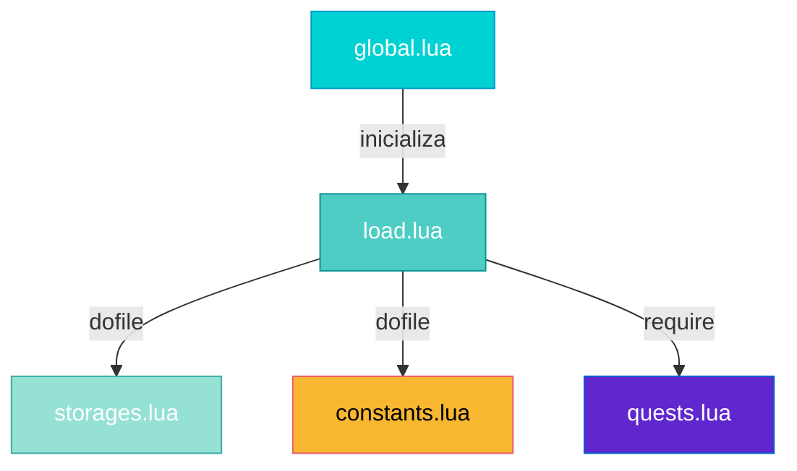

import { Aside, Card } from '@astrojs/starlight/components';

## 🛠️ Informações do Arquivo

Este arquivo é responsável por armazenar **constantes globais** do servidor OpenTibiaBR/Canary, permitindo centralizar valores que são utilizados em múltiplas partes do código.

<Card title="Caminho Original" icon="document">
  `data-otservbr-global/lib/core/constants.lua`
</Card>

<Aside type="tip">
  Este arquivo é **carregado automaticamente** durante a inicialização do servidor (via `data-otservbr-global/lib/core/load.lua`). Ele trabalha em conjunto com as tabelas de `Storage` e `GlobalStorage` definidas em `storages.lua`.
</Aside>

## 📄 Visão Geral do Código

### Resumo Executivo

O arquivo `constants.lua` atualmente está **vazio** e reservado para futuras implementações. No entanto, sua estrutura é designada para conter:

1. **Constantes de Configuração**: Valores fixos utilizados em todo o servidor
2. **Identificadores Globais**: IDs de sistemas, eventos e funcionalidades
3. **Limites e Restrições**: Valores máximos, mínimos e timeouts
4. **Enumerações Globais**: Conjuntos de valores constantes relacionados

### Propósito

Ao contrário de `Storage` e `GlobalStorage` que armazenam **dados dinâmicos** (valores que mudam durante a execução), `constants.lua` é destinado a armazenar **valores estáticos** que não se alteram durante a execução do servidor.

## 2. Estrutura Esperada

Baseado nos padrões utilizados ao longo do Canary, a estrutura esperada seria similar a:

```lua
-- Constantes de Sistema
Constants = {
  -- Server Configuration
  Server = {
    MaxPlayers = 1000,
    MaxLevel = 1000,
    MinLevel = 1,
  },
  
  -- Combat Constants
  Combat = {
    MinDamage = 1,
    CriticalChance = 10,  -- percentage
    DamageBonus = 1.5,    -- multiplier
  },
  
  -- Timing Constants
  Time = {
    BattleTimeout = 60000,   -- milliseconds
    StaminaRegain = 3600,    -- seconds
    ManaRegenRate = 5,       -- per minute
  },
}
```

## 3. Relação com Outros Arquivos

### Carregamento em Cadeia



### Uso Esperado em Scripts

```lua
-- Em um script de servidor
if Constants.Combat.CriticalChance > playerCriticalBonus then
  dealCriticalDamage()
end

-- Em timers
registerEvent(Constants.Time.BattleTimeout, onBattleTimeout)

-- Em configurações
if player:getLevel() > Constants.Server.MaxLevel then
  player:setLevel(Constants.Server.MaxLevel)
end
```

## 4. Comparação com Storage e GlobalStorage

| Tipo | Propósito | Escopo | Persistência |
|------|-----------|--------|---------------|
| **Constants** | Valores fixos globais | Servidor inteiro | Estática (arquivo) |
| **Storage** | Dados do player | Individual por player | Persistente (BD) |
| **GlobalStorage** | Dados globais dinâmicos | Servidor inteiro | Persistente (BD) |

## 5. Locais de Utilização

Este arquivo é carregado em:

1. **Initialization Chain**
   - Chamado de `data-otservbr-global/lib/core/load.lua`
   - Executado durante boot do servidor

2. **Scripts que precisam constantes**
   - Spells
   - Creatures
   - Combat system
   - Timing system

3. **Configurações dinâmicas**
   - Pode ser acessado globalmente como `Constants`
   - Valor nunca muda em runtime

## 6. Nota de Desenvolvimento

Atualmente o arquivo está vazio, sugerindo que:

1. As constantes podem estar **distribuídas em vários arquivos**
2. O sistema utiliza principalmente **Storage** e **GlobalStorage** para valores configuráveis
3. Há uma **preparação futura** para centralizar constantes aqui

Se você precisar adicionar constantes globais, este é o arquivo ideal para fazê-lo.

---

## 🤖 Informações da Documentação

**Data de Criação**: 20 de Fevereiro de 2026  
**Versão do Canary**: OpenTibiaBR/Canary (Latest)  
**Status**: Arquivo Vazio - Reservado para Implementação Futura  
**Responsável**: Sistema de Carregamento de Núcleo do Servidor
