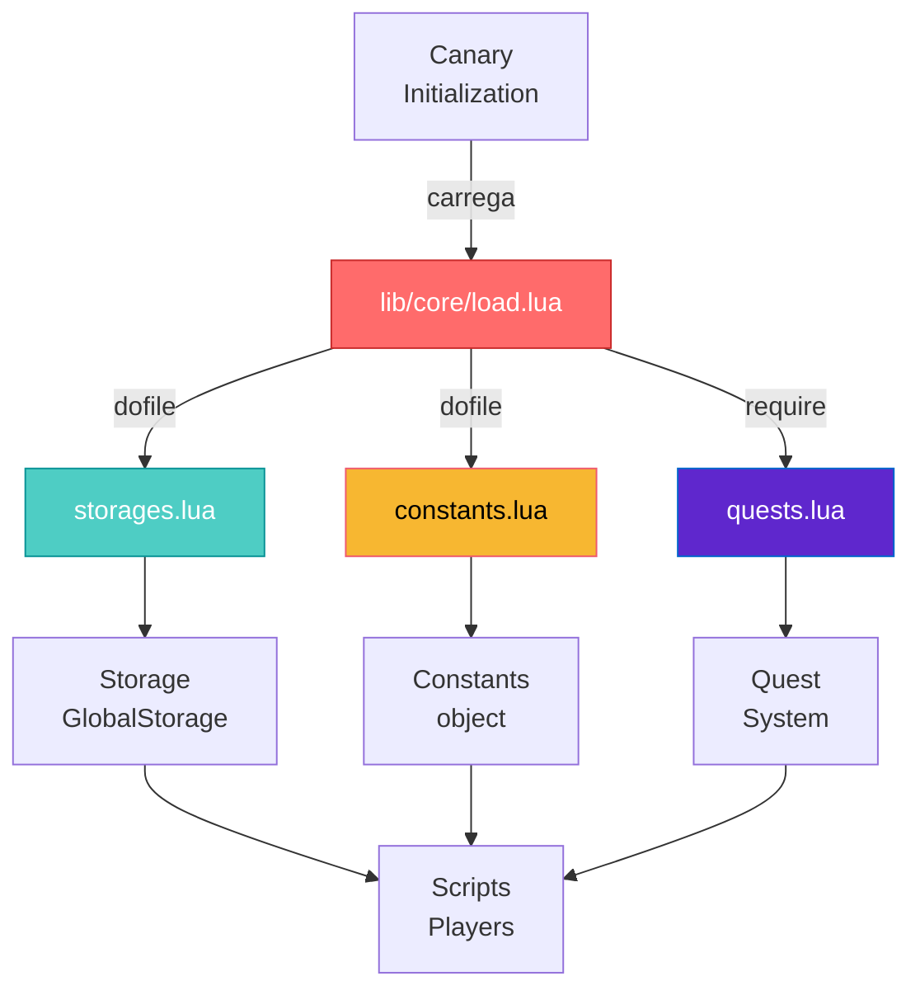
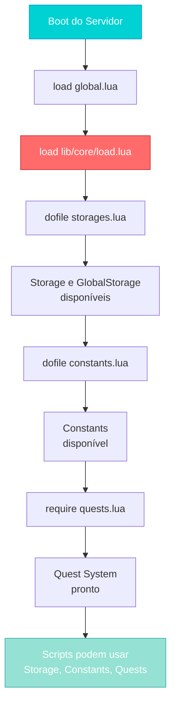

import { Aside, Card } from '@astrojs/starlight/components';

## 🛠️ Informações do Arquivo

Este arquivo atua como **orquestrador central** do carregamento de módulos essenciais do servidor OpenTibiaBR/Canary, garantindo que todas as dependências sejam carregadas na ordem correta.

<Card title="Caminho Original" icon="document">
  `data-otservbr-global/lib/core/load.lua`
</Card>

<Aside type="tip">
  Este é um arquivo **crítico** carregado durante a inicialização do servidor. Ele garante que os sistemas de storage, constantes e quests sejam disponibilizados para o resto do servidor na sequência correta.
</Aside>

## 📄 Visão Geral do Código

### Resumo Executivo

O arquivo `load.lua` é um **orquestrador de dependências** que:

1. **Carrega Storage**: Tabelas de armazenamento do player e servidor
2. **Carrega Constantes**: Definições de constantes globais
3. **Carrega Quests**: Sistema de quests do servidor

```lua
dofile(DATA_DIRECTORY .. "/lib/core/storages.lua")
dofile(DATA_DIRECTORY .. "/lib/core/constants.lua")
require("data-otservbr-global.lib.core.quests")
```

### Padrão de Carregamento

O arquivo utiliza **dois métodos** de carregamento:

| Método | Função | Uso |
|--------|--------|-----|
| `dofile()` | Carrega e executa arquivo Lua local | Storage, Constants |
| `require()` | Carrega módulo com namespace | Quests (módulo Lua) |

## 2. Fluxo de Carregamento

```mermaid
graph LR
    Start["Inicialização<br/>do Servidor"] --> LoadStore["dofile<br/>storages.lua"]
    LoadStore --> LoadConst["dofile<br/>constants.lua"]
    LoadConst --> LoadQuest["require<br/>quests.lua"]
    LoadQuest --> Complete["Núcleo<br/>Pronto"]
    
    style Start fill:#4ecdc4,stroke:#0a9396,color:#fff
    style LoadStore fill:#95e1d3,stroke:#38ada9,color:#fff
    style LoadConst fill:#f7b731,stroke:#ee5a6f,color:#000
    LoadQuest fill:#5f27cd,stroke:#0066cc,color:#fff
    style Complete fill:#00d2d3,stroke:#0099cc,color:#fff
```

## 3. Arquivos Carregados

### 3.1 Storage (storages.lua)

```lua
dofile(DATA_DIRECTORY .. "/lib/core/storages.lua")
```

**Responsabilidade**: Define as tabelas `Storage` e `GlobalStorage` com valores fixos utilizados para persistência de dados.

**Conteúdo**:
- Faixas de IDs reservadas para quests
- Estrutura organizada por versão (U5.0, U6.1, etc.)
- Identificadores para doors, rewards, timers

**Acesso Pós-Carregamento**:
```lua
player:getStorageValue(Storage.Quest.U8_0.BarbarianArena.Arena)
```

### 3.2 Constants (constants.lua)

```lua
dofile(DATA_DIRECTORY .. "/lib/core/constants.lua")
```

**Responsabilidade**: Define constantes globais do servidor (atualmente vazio).

**Uso**:
- Valores estáticos que não mudam em runtime
- Limites de sistema, timeouts, configurações

**Acesso Pós-Carregamento**:
```lua
if player:getLevel() > Constants.Server.MaxLevel then
  -- handle max level
end
```

### 3.3 Quests (quests.lua)

```lua
require("data-otservbr-global.lib.core.quests")
```

**Responsabilidade**: Carrega o sistema de quests utilizado pelo servidor.

**Diferença**: Em vez de `dofile()`, usa `require()` porque o quests é um **módulo Lua** com namespace.

**Acesso Pós-Carregamento**:
```lua
local questLoader = require("data.lib.core.quests.loader")
questLoader.load(DATA_DIRECTORY)
```

## 4. Contexto de Variables Globais

### DATA_DIRECTORY

O arquivo utiliza a variável global `DATA_DIRECTORY` para construir caminhos:

```lua
dofile(DATA_DIRECTORY .. "/lib/core/storages.lua")
```

- **Valor típico**: `"data"` ou `"data-otservbr-global"`
- **Tipo**: string
- **Definido por**: Sistema de inicialização do Canary

### Exemplo de Contexto

Assumindo `DATA_DIRECTORY = "data-otservbr-global"`:

```lua
dofile("data-otservbr-global" .. "/lib/core/storages.lua")
-- Resulta em: dofile("data-otservbr-global/lib/core/storages.lua")
```

## 5. Estrutura de Dependências



## 6. Ordem de Carregamento (Crítica)

A ordem deve ser **mantida exatamente como está**:

1. **storages.lua** (primeiro)
   - Define as tabelas globais de storage
   - Necessário para quests usarem IDs de storage

2. **constants.lua** (segundo)
   - Define constantes (mais de uma vez só afeta memory)
   - Não depende de nada anterior

3. **quests.lua** (ultimo)
   - Pode depender de Storage
   - Precisa que Storage esteja disponível

## 7. Fluxo Completo de Boot



## 8. Exceções e Tratamento de Erros

Como este arquivo é **carregado durante o boot**, qualquer erro fará o servidor falhar ao iniciar.

**Erros Comuns**:

| Erro | Causa | Solução |
|------|-------|---------|
| `cannot open file` | Arquivo não encontrado | Verificar caminho/DATA_DIRECTORY |
| `unexpected symbol` | Sintaxe Lua inválida em dependency | Validar arquivo carregado |
| `duplicate key` | Chaves duplicadas em Storage | Revisar storages.lua |

## 9. Relacionamento com Outros Cores

Este arquivo está integrado com:

- **global.lua**: Carrega o arquivo de boot global
- **lib/core/storages.lua**: Define os storages
- **lib/core/constants.lua**: Define as constantes
- **lib/core/quests.lua**: Define o sistema de quests

## 10. Notas Importantes

> ⚠️ **Critico**: Alterar a ordem de `dofile` e `require` pode quebrar o servidor ao boot. Storage DEVE vir antes de Quests.

> 💡 **Tip**: Se você adicionar novos módulos críticos, adicione-os aqui mantendo a ordem de dependências.

---

## 🤖 Informações da Documentação

**Data de Criação**: 20 de Fevereiro de 2026  
**Versão do Canary**: OpenTibiaBR/Canary (Latest)  
**Tipo**: Orquestrador de Inicialização  
**Criticidade**: 🔴 CRÍTICO - Falha impede boot do servidor  
**Responsável**: Sistema de Carregamento de Núcleo
