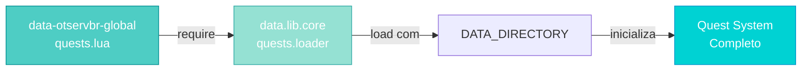
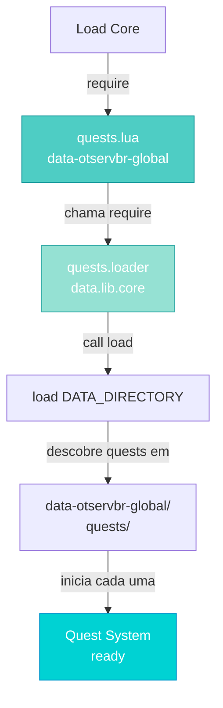
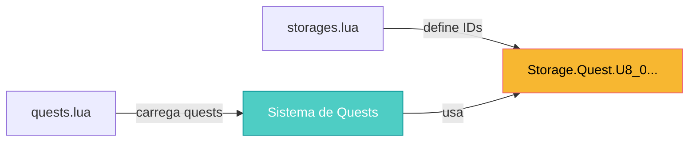
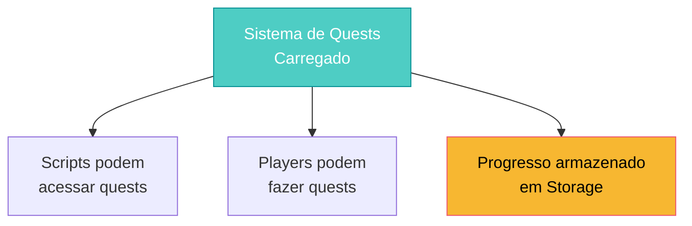

import { Aside, Card } from '@astrojs/starlight/components';

## 🛠️ Informações do Arquivo

Este arquivo serve como **ponto de entrada** para o sistema de quests do OpenTibiaBR/Canary, delegando o carregamento para um módulo interno de quests.

<Card title="Caminho Original" icon="document">
  `data-otservbr-global/lib/core/quests.lua`
</Card>

<Aside type="tip">
  Este arquivo é **carregado via `require()`** durante a inicialização do servidor (via `data-otservbr-global/lib/core/load.lua`). Ele atua como um **adapter** que conecta o datapack global ao sistema de quests centralizado do servidor.
</Aside>

## 📄 Visão Geral do Código

### Resumo Executivo

O arquivo `quests.lua` é um **loader minimalista** que realiza uma única operação:

```lua
return require("data.lib.core.quests.loader").load(DATA_DIRECTORY)
```

Ele faz três coisas em sequência:

1. **require()**: Carrega o módulo `data.lib.core.quests.loader`
2. **.load()**: Chama a função de inicialização
3. **DATA_DIRECTORY**: Passa o diretório de dados como parâmetro

### Padrão: Loader Delegation

Este é um padrão comum em engines modernas onde um arquivo wrapper (este) funciona como **adapter** para um sistema más complexo (o loader de quests).



## 2. Análise do Código

### Estrutura

```lua
return require("data.lib.core.quests.loader").load(DATA_DIRECTORY)
```

#### Componentes:

| Componente | Tipo | Descrição |
|------------|------|-----------|
| `return` | Keyword | Retorna o resultado do load() |
| `require()` | Function | Carrega módulo Lua com namespace |
| `"data.lib.core.quests.loader"` | Module Path | Caminho do módulo de quests |
| `.load()` | Method | Função que inicializa as quests |
| `DATA_DIRECTORY` | Variable | Diretório base (ex: "data") |

### O que cada parte faz:

1. **require("data.lib.core.quests.loader")**
   - Localiza o arquivo em `data/lib/core/quests/loader.lua`
   - Carrega-o como um módulo Lua
   - Retorna a tabela/função do módulo

2. **.load(DATA_DIRECTORY)**
   - Chama a função `load()` do módulo carregado
   - Passa o diretório de dados como argumento
   - O loader inicializa todas as quests neste diretório

3. **return**
   - Retorna o resultado do `load()`
   - Permite que o arquivo seja `require()`-ado por outro

## 3. Fluxo de Inicialização



## 4. Por que usar require() vs dofile()?

### dofile() (usado em storages.lua)

```lua
dofile(DATA_DIRECTORY .. "/lib/core/storages.lua")
```

- Executa diretamente o arquivo
- Cria variáveis globais (`Storage`, `GlobalStorage`)
- Simples, mas sem isolamento

### require() (usado em quests.lua)

```lua
require("data-otservbr-global.lib.core.quests")
```

- Carrega como módulo com namespace
- Evita poluição do escopo global
- Permite estrutura más clara
- Suporta caching (não carrega 2x se já foi carregado)

## 5. DATA_DIRECTORY

Este é uma **variável global do servidor** que indica qual datapack está sendo utilizado.

### Valores Comuns:

| Valor | Significado | Uso |
|-------|-------------|-----|
| `"data"` | Datapack base padrão | Server core |
| `"data-otservbr-global"` | Datapack global OTServBR | Server expansão |
| Custom | Datapack customizado | Servidores privados |

### Exemplo Prático:

Se `DATA_DIRECTORY = "data"`:

```lua
require("data.lib.core.quests.loader").load("data")
-- Carrega quests de: data/lib/core/quests/loader.lua
-- Inicializa quests em: data/quests/
```

## 6. Relação com storages.lua

As quests frequentemente utilizam **Storage IDs** para rastrear progresso:



### Ordem de Carregamento (Crítica):

```lua
-- Em load.lua
dofile(DATA_DIRECTORY .. "/lib/core/storages.lua")    -- PRIMEIRO!
dofile(DATA_DIRECTORY .. "/lib/core/constants.lua")   -- SEGUNDO
require("data-otservbr-global.lib.core.quests")       -- TERCEIRO!
```

**Storage DEVE ser carregado ANTES de quests** porque as quests precisam dos IDs de storage.

## 7. Estrutura de Quests Esperada

O loader de quests provavelmente procura por:

```
data-otservbr-global/
├── quests/
│   ├── quest1/
│   ├── quest2/
│   └── ...
└── lib/
    └── core/
        └── quests/
            └── loader.lua  ← Arquivo que inicializa tudo
```

## 8. Ligação com o Resto do Servidor

Após o carregamento:



## 9. Interação com NPCs e Eventos

As quests podem ser acionadas por:

- **NPCs**: Dialog que abre quest
- **Items**: Uso de item que inicia quest
- **Eventos**: Globalevents que disparam quests
- **Actions**: Clique em objeto que requer quest

## 10. Notas Importantes

> ⚠️ **Ordem Crítica**: Storage.lua DEVE carregar antes de quests.lua

> 💡 **Tip**: Se adicionar novo tipo de quest, considere adicionar `require()` aqui

> 🔍 **Debug**: Se quests não carregam, verifique se `data.lib.core.quests.loader` existe

---

## 🤖 Informações da Documentação

**Data de Criação**: 20 de Fevereiro de 2026  
**Versão do Canary**: OpenTibiaBR/Canary (Latest)  
**Tipo**: Loader / Adapter Pattern  
**Localização Real**: `data.lib.core.quests.loader` no módulo de dados  
**Responsável**: Sistema de Quests Global  
**Criticidade**: 🟡 IMPORTANTE - Sistema de quests depende deste loader
