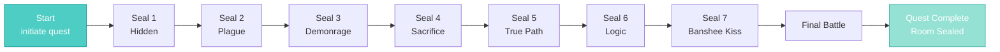
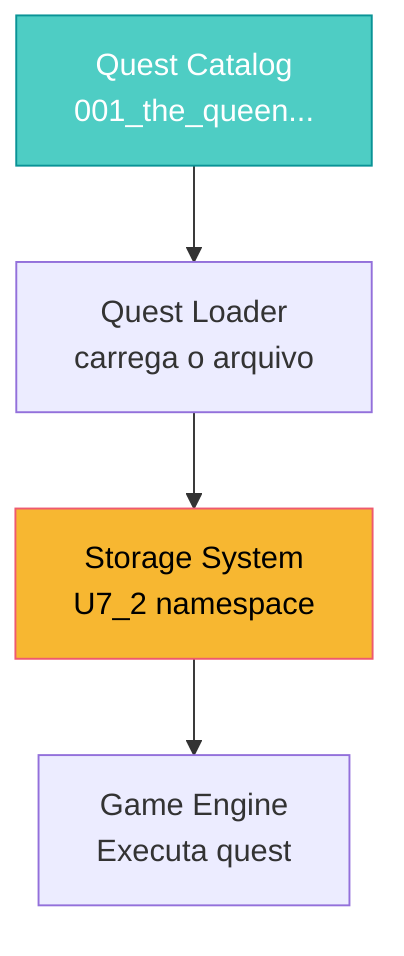

import { Aside, Card } from '@astrojs/starlight/components';

## 🛠️ Informações do Arquivo

Este arquivo define a **estrutura de dados** da quest "The Queen of the Banshees", uma das quests mais clássicas do Tibia. Contém múltiplas etapas representadas como **8 missões progressivas**.

<Card title="Caminho Original" icon="document">
  `data-otservbr-global/lib/core/quests/catalog/001_the_queen_of_the_banshees.lua`
</Card>

<Aside type="tip">
  Esta quest é carregada como parte do **catálogo de quests** do servidor. Cada etapa é rastreada via `Storage.Quest.U7_2.TheQueenOfTheBanshees.*` com valores binários (1 = concluída).
</Aside>

## 📄 Visão Geral do Código

### Resumo Executivo

O arquivo define uma **tabela de configuração** que descreve a quest "The Queen of the Banshees". A estrutura principal é:

```lua
local quest = {
  name = "The Queen of the Banshees",           -- Nome da quest
  startStorageId = Storage.Quest.U7_2...,      -- ID para iniciar
  startStorageValue = 1,
  missions = {                                  -- 8 missões
    [1] = { ... },  -- The Hidden Seal
    [2] = { ... },  -- The Plague Seal
    ...
    [8] = { ... },  -- The Final Battle
  },
}
```

## 2. Estrutura de Missões

### 2.1 Formato Geral de Missão

Cada missão segue este padrão:

```lua
[missionIndex] = {
  name = "Mission Name",
  storageId = Storage.Quest.U7_2.TheQueenOfTheBanshees.SealName,
  missionId = uniqueId,      -- ID global único
  startValue = 1,
  endValue = 1,              -- Valor final
  description = "Text",
}
```

| Campo | Tipo | Descrição |
|-------|------|-----------|
| **name** | string | Nome da missão no GUI |
| **storageId** | number | ID do storage no banco de dados |
| **missionId** | number | ID único da missão globalmente |
| **startValue** | number | Valor inicial do storage |
| **endValue** | number | Valor final (concluída quando atinge) |
| **description** | string | Texto exibido ao player |

## 3. Missões da Quest

### 3.1 The Hidden Seal (Missão 1)

```lua
[1] = {
  name = "The Hidden Seal",
  storageId = Storage.Quest.U7_2.TheQueenOfTheBanshees.FirstSeal,
  missionId = 1,
  startValue = 1,
  endValue = 1,
  description = "You broke the first seal.",
}
```

**Objetivo**: Explorar e quebrar o primeiro seal  
**Storage**: `FirstSeal` = 1 quando concluída  
**Progression**: A missão é binária (completa = 1)

### 3.2 The Plague Seal (Missão 2)

```lua
[2] = {
  name = "The Plague Seal",
  storageId = Storage.Quest.U7_2.TheQueenOfTheBanshees.SecondSeal,
  missionId = 2,
  startValue = 1,
  endValue = 1,
  description = "You broke the second seal.",
}
```

**Objetivo**: Quebrar o segundo seal  
**Progressão**: Task progressiva através do dungeon

### 3.3 The Seal of Demonrage (Missão 3)

```lua
[3] = {
  name = "The Seal of Demonrage",
  storageId = Storage.Quest.U7_2.TheQueenOfTheBanshees.ThirdSeal,
  missionId = 3,
  startValue = 1,
  endValue = 1,
  description = "You broke the third seal.",
}
```

**Desafio**: Combater criaturas demoníacas  
**Boss**: Área guarda por inimigos fortes

### 3.4 Outras Missões (4-7)

As missões 4, 5, 6 seguem o mesmo padrão:

- **Missão 4**: The Seal of Sacrifice (`FourthSeal`)
- **Missão 5**: The Seal of True Path (`FifthSeal`)
- **Missão 6**: The Seal of Logic (`SixthSeal`)
- **Missão 7**: The Kiss of the Banshee Queen (`LastSeal`)

Cada uma com seu próprio **storage ID** e **descrição temática**.

### 3.5 The Final Battle (Missão 8)

```lua
[8] = {
  name = "The Final Battle",
  storageId = Storage.Quest.U7_2.TheQueenOfTheBanshees.FinalBattle,
  missionId = 8,
  startValue = 1,
  endValue = 1,
  description = "You have braved all dangers of the Banshee Quest and escaped the dungeon alive. The end room is sealed for you from now on.",
}
```

**Objetivo Final**: Derrotar a Rainha Banshee e escapar  
**Reward Lock**: Após concluir, a sala final fica selada ("sealed for you from now on")

## 4. Fluxo Progressivo



## 5. Storage Mapping

Todos os storages utilizam o namespace `Storage.Quest.U7_2.TheQueenOfTheBanshees`:

| Missão | Storage | ID Range |
|--------|---------|----------|
| 1 | `FirstSeal` | 10073 |
| 2 | `SecondSeal` | 10075 |
| 3 | `ThirdSeal` | 10077 |
| 4 | `FourthSeal` | 10080 |
| 5 | `FifthSeal` | 10082 |
| 6 | `SixthSeal` | 10085 |
| 7 | `LastSeal` | 10087 |
| 8 | `FinalBattle` | 10090 |

## 6. Variáveis Locais

```lua
local quest = {
  -- Tabela principal que define toda a quest
  -- Retornada ao final do arquivo
}

return quest  -- Exporta a tabela para o loader
```

**Escopo**: Local ao arquivo  
**Visibilidade**: Exportada via `return`

## 7. Valores de Storage

Todos os valores de storage nesta quest são **binários**:

```lua
startValue = 1   -- Missão começa quando storage = 1
endValue = 1     -- Missão termina quando storage = 1
```

Diferente de quests com **progressão numérica** (ex: 0 → 100 pontos), esta quest usa **estados binários simples**.

## 8. Descrições Temáticas

Cada descrição reflete a progressão na narrativa:

```
Progressão das descrições:
"You broke the first seal."
  ↓
"You broke the second seal."
  ↓
... (seals 3-6)
  ↓
"The Banshee Queen kissed you. This meant your death..."
  ↓
"You have braved all dangers... The end room is sealed for you from now on."
```

## 9. Relação com o Sistema Global



## 10. Como é Utilizado

### Em um Script de Quest:

```lua
local questData = require("path_to_001")
local player = Player({name = "Adventurer"})

-- Obter dados da missão
local mission = questData.missions[1]
local storageValue = player:getStorageValue(mission.storageId)

-- Verificar progresso
if storageValue >= mission.startValue then
  print("Missão desbloqueada!")
end

-- Completar missão
player:setStorageValue(mission.storageId, mission.endValue)
```

---

## 🤖 Informações da Documentação

**Data de Criação**: 20 de Fevereiro de 2026  
**Versão do Tibia**: 7.2 (U7_2)  
**Tipo**: Quest Definition / Catalog Entry  
**Total de Missões**: 8  
**Storage Namespace**: `Storage.Quest.U7_2.TheQueenOfTheBanshees`  
**Padrão**: Missões Binárias (Completa/Incompleta)  
**Dificuldade**: Avançada (Requer múltiplas etapas e combate)
