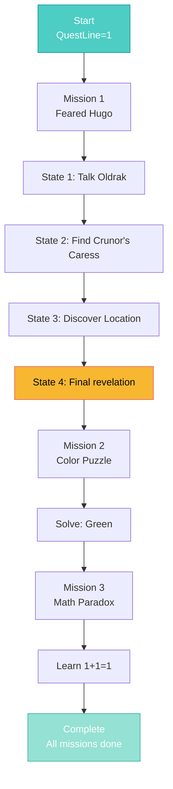

import { Aside, Card } from '@astrojs/starlight/components';

## 🛠️ Informações do Arquivo

Este arquivo define a **estrutura de dados** da quest "The Paradox Tower", uma quest de exploração e coleta de informações com **3 missões de múltiplos estados**.

<Card title="Caminho Original" icon="document">
  `data-otservbr-global/lib/core/quests/catalog/002_the_paradox_tower.lua`
</Card>

<Aside type="tip">
  Esta quest utiliza um **sistema de estados** (states) para rastrear o progresso dentro de cada missão, permitindo narrativa progressiva com 2-4 etapas por missão.
</Aside>

## 📄 Visão Geral do Código

### Resumo Executivo

A quest "The Paradox Tower" implementa um **sistema de progresso multi-estágio** onde cada missão pode ter vários estados:

```lua
local quest = {
  name = "The Paradox Tower",
  startStorageId = Storage.Quest.U7_24.TheParadoxTower.QuestLine,
  startStorageValue = 1,
  missions = {
    [1] = {
      name = "The Feared Hugo",
      storageId = ...,
      states = {
        [1] = "Story stage 1...",
        [2] = "Story stage 2...",
        [3] = "Story stage 3...",
        [4] = "Story stage 4...",
      }
    },
    -- ... mais 2 missões
  }
}
```

## 2. Estrutura com States

### 2.1 Diferença: Estados vs Descrição

| Tipo | Use Case | Exemplo |
|------|----------|---------|
| **description** | String fixa | "Complete this task" |
| **states** | Array de strings | [1] = "Talk to X", [2] = "Talk to Y" |

Este arquivo utiliza **states array**, permitindo narrativa dinâmica baseada no valor de storage.

## 3. Missão 1: The Feared Hugo

```lua
[1] = {
  name = "The Feared Hugo",
  storageId = Storage.Quest.U7_24.TheParadoxTower.TheFearedHugo,
  missionId = 9,
  startValue = 1,
  endValue = 4,
  states = {
    [1] = "Oldrak told you that the fearsome Hugo was accidentally created by the mage Yenny the Gentle. Try to find out more about this.",
    [2] = "Zoltan told you about Crunor's Caress, a druid order originating from Carlin. Try to find out more about this.",
    [3] = "Padreia told you that Crunor's Caress founded the inn Crunor's Cottage south of Mt. Sternum. Try to find out more about this.",
    [4] = "Lubo told you about a magical experiment that went wrong and created a demonbunny. Someone might be interested in this...",
  },
}
```

**Progressão**:
- State 1: Falar com Oldrak sobre Hugo
- State 2: Investigar Crunor's Caress com Zoltan
- State 3: Descobrir local do Crunor's Cottage com Padreia
- State 4: Investigação completa, dica final de Lubo

**Storage Range**: 1 → 4 (4 etapas)

## 4. Missão 2: Favorite Colour: Green

```lua
[2] = {
  name = "Favorite colour: Green",
  storageId = Storage.Quest.U7_24.TheParadoxTower.FavoriteColour,
  missionId = 10,
  startValue = 1,
  endValue = 2,
  states = {
    [1] = "Favorite colour is the green.",
    [2] = "Favorite colour is the green.",  -- Mesmo texto em ambos estados
  },
}
```

**Peculiaridade**: O texto é idêntico em ambos estados.  
**Range**: 1 → 2 (2 estados)  
**Tipo**: Puzzle/Riddle solução

## 5. Missão 3: The Secret of Mathemagics

```lua
[3] = {
  name = "The Secret of Mathemagics",
  storageId = Storage.Quest.U7_24.TheParadoxTower.Mathemagics,
  missionId = 11,
  startValue = 1,
  endValue = 2,
  states = {
    [1] = "You learnt Mathemagics. Everything is based on the simple fact that 1+1=1.",
    [2] = "You learnt Mathemagics. Everything is based on the simple fact that 1+1=1.",
  },
}
```

**Conceito**: Paradoxo matemático (1+1=1)  
**Metáfora**: A "Paradox Tower" ensinando paradoxos  
**Range**: 1 → 2

## 6. Fluxo de Progressão



## 7. Estado vs Valor de Storage

### Mapeamento States → Storage Value

```lua
-- Se storage = 1, exibe states[1]
-- Se storage = 2, exibe states[2]
-- Se storage = 3, exibe states[3]
-- Se storage = 4, exibe states[4]
```

**Implementação esperada**:

```lua
local stateText = mission.states[player:getStorageValue(mission.storageId)]
if stateText then
  print(stateText)
end
```

## 8. Tipo de Quest: Investigação

Esta quest é do tipo **Investigation/Exploration**:

- ✅ Múltiplas NPCs para conversar
- ✅ Progressão narrativa linear
- ✅ Informações coletadas de forma sequencial
- ✅ Puzzles simples (cor favorita, paradoxo)
- ❌ Sem combate
- ❌ Sem itens para coletar em massa

## 9. Variáveis Globais Utilizadas

```lua
Storage.Quest.U7_24.TheParadoxTower = {
  QuestLine = ???,           -- Inicializador
  TheFearedHugo = ???,       -- Missão 1
  FavoriteColour = ???,      -- Missão 2
  Mathemagics = ???,         -- Missão 3
}
```

Estes IDs devem estar definidos em `storages.lua`.

## 10. Relacionamentos com NPCs

### Missão 1 - Entrevistas:

| NPC | Informação | Estado |
|-----|-----------|--------|
| Oldrak | Hugo criado por Yenny | 1 |
| Zoltan | Crunor's Caress druid order | 2 |
| Padreia | Local Crunor's Cottage | 3 |
| Lubo | Magical experiment fallacy | 4 |

### Missão 2:

| Puzzle | Solução |
|--------|---------|
| Cor favorita | Green |

### Missão 3:

| Conceito | Aprendizado |
|----------|------------|
| Mathemagics | O paradoxo 1+1=1 |

## 11. Return e Estrutura

```lua
local quest = { ... }
return quest  -- Exporta ao loader
```

**Padrão**: Arquivo retorna uma única tabela contendo toda quest data.

---

## 🤖 Informações da Documentação

**Data de Criação**: 20 de Fevereiro de 2026  
**Versão do Tibia**: 7.24 (U7_24)  
**Tipo**: Quest Definition / Investigation  
**Total de Missões**: 3  
**Total de Estados**: 8 (1+2+2)  
**Storage Namespace**: `Storage.Quest.U7_24.TheParadoxTower`  
**Padrão**: Progressão Linear com States Narrativos  
**Dificuldade**: Fácil (Investigação, sem combate)
