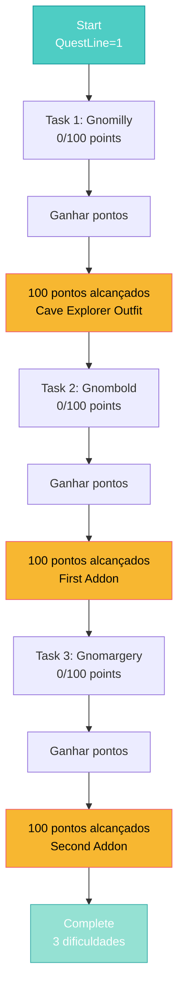

import { Aside, Card } from '@astrojs/starlight/components';

## 🛠️ Informações do Arquivo

Este arquivo define a **estrutura de dados** da quest "Spike Task", uma quest de **sistema de pontos progressivos** com 3 níveis de dificuldade que utilizam **funções para descrições dinâmicas**.

<Card title="Caminho Original" icon="document">
  `data-otservbr-global/lib/core/quests/catalog/003_spike_task.lua`
</Card>

<Aside type="tip">
  Esta quest implementa um padrão **inovador** onde a `description` é uma **função anônima** que recebe o player como parâmetro e retorna uma string formatada dinamicamente com seu progresso atual.
</Aside>

## 📄 Visão Geral do Código

### Resumo Executivo

A quest "Spike Task" é estruturada em **3 dificuldades progressivas**, cada uma rastreando pontos de 0-100:

```lua
local quest = {
  name = "Spike Task",
  startStorageId = Storage.Quest.U10_20.SpikeTaskQuest.QuestLine,
  startStorageValue = 1,
  missions = {
    [1] = {
      name = "First Task",
      description = function(player)
        -- Função dinâmica que calcula progresso
        return string.format("You have %d points. You need 100...", points)
      end,
    },
    [2] = { ... },
    [3] = { ... },
  }
}
```

## 2. Descrições Dinâmicas com Funções

### 2.1 Padrão Function vs String

```lua
-- Padrão anterior (static):
description = "You have 50 points"

-- Padrão nesta quest (dynamic):
description = function(player)
  return string.format("You have %d points", player:getStorageValue(...))
end
```

### 2.2 Vantagens da Abordagem Funcional

| Aspecto | Static | Dynamic (Function) |
|--------|--------|-------------------|
| **Atualização** | Precisa editar arquivo | Automático |
| **Progresso Real** | Mostra valor fixo | Mostra valor atual |
| **Flexibilidade** | Limitada | Total |
| **Performance** | Rápida | Chamada de função |

## 3. Missão 1: First Task (Gnomilly)

```lua
[1] = {
  name = "First Task",
  storageId = Storage.Quest.U10_20.SpikeTaskQuest.Gnomilly,
  missionId = 1021,
  startValue = 0,
  endValue = 100,
  description = function(player)
    return string.format(
      "You have %d points of task. You need 100 points to take Cave Explorer outfit.",
      (math.max(player:getStorageValue(Storage.Quest.U10_20.SpikeTaskQuest.Gnomilly), 0))
    )
  end,
}
```

**Detalhes**:
- **NPC**: Gnomilly
- **Objetivo**: Acumular 100 pontos
- **Recompensa**: Cave Explorer outfit
- **Cálculo**: `math.max(..., 0)` previne valores negativos

### 2.1 Análise da Função

```lua
function(player)
  -- Obtém valor atual do storage
  local currentPoints = player:getStorageValue(
    Storage.Quest.U10_20.SpikeTaskQuest.Gnomilly
  )
  
  -- math.max garante que não retornar valor negativo
  currentPoints = math.max(currentPoints, 0)
  
  -- Formata string com progresso
  return string.format(
    "You have %d points of task. You need 100 points to take Cave Explorer outfit.",
    currentPoints
  )
end
```

## 4. Missão 2: Second Task (Gnombold)

```lua
[2] = {
  name = "Second Task",
  storageId = Storage.Quest.U10_20.SpikeTaskQuest.Gnombold.Points,
  missionId = 1022,
  startValue = 0,
  endValue = 100,
  description = function(player)
    return string.format(
      "You have %d points of task. You need 100 points to take first addon.",
      (math.max(player:getStorageValue(Storage.Quest.U10_20.SpikeTaskQuest.Gnombold.Points), 0))
    )
  end,
}
```

**Diferenças da Missão 1**:
- **NPC**: Gnombold (não Gnomilly)
- **Storage**: `Gnombold.Points` (estrutura aninhada!)
- **Recompensa**: "first addon" (addon outfit)
- **Mensagem**: Referencia "first addon"

### 4.1 Storage Aninhado

Note o padrão de storage aninhado:

```lua
storageId = Storage.Quest.U10_20.SpikeTaskQuest.Gnombold.Points
--                                              ^^^^^^^^        ^^^^^^
--                                              NPC            Campo
```

## 5. Missão 3: Third Task (Gnomargery)

```lua
[3] = {
  name = "Third Task",
  storageId = Storage.Quest.U10_20.SpikeTaskQuest.Gnomargery.Points,
  missionId = 1023,
  startValue = 0,
  endValue = 100,
  description = function(player)
    return string.format(
      "You have %d points of task. You need 100 points to take second addon.",
      (math.max(player:getStorageValue(Storage.Quest.U10_20.SpikeTaskQuest.Gnomargery.Points), 0))
    )
  end,
}
```

**Padrão Consistente**:
- Cada dificuldade = 100 pontos
- Cada uma tem NPC diferente
- Cada uma tem recompensa progressiva (outfit → addons)

## 6. Fluxo de Progressão



## 7. Padrão de Função de Descrição

### 7.1 Signature da Função

```lua
description = function(player: Player): string
  -- Retorna uma string formatada
end
```

### 7.2 Elementos Chave

```lua
function(player)
  -- 1. Obter dados do player
  local value = player:getStorageValue(storageId)
  
  -- 2. Sanitizar (evitar negativos)
  value = math.max(value, 0)
  
  -- 3. Formatar com string.format
  return string.format("You have %d points...", value)
end
```

## 8. Valores de Storage

### Padrão Numérico (0-100)

Diferente das quests binárias, esta utiliza **range numérico**:

```lua
startValue = 0    -- Começa em 0
endValue = 100    -- Completa em 100
```

**Sistema de Pontos**:
- Player ganha 1 ponto por atividade
- Descrição atualiza automaticamente via função
- GUI mostra ao vivo: "You have 45 points. You need 100..."

## 9. Como é Chamado (Esperado)

```lua
local questData = require("path_to_003")
local player = Player({name = "Adventurer"})
local mission = questData.missions[1]

-- Obter descrição dinâmica
local currentDescription = mission.description(player)
print(currentDescription)  -- Output: "You have 45 points of task. You need 100..."

-- Depois de 55 pontos:
print(mission.description(player))  -- Output: "You have 100 points..."
```

## 10. Armazenamento de Pontos

| Task | Storage Location | Rastreamento |
|------|------------------|-------------|
| 1 | `Gnomilly` | Simples |
| 2 | `Gnombold.Points` | Estrutura |
| 3 | `Gnomargery.Points` | Estrutura |

## 11. Peculiaridades Técnicas

### math.max Utilização

```lua
math.max(player:getStorageValue(...), 0)
```

**Razão**: Se storage não inicializado, retorna `nil` (erro em string.format).  
**Solução**: `math.max(nil, 0)` → `0`

### string.format

```lua
string.format("You have %d points. You need 100 points...", value)
```

- `%d` = substituir por inteiro
- Seguro e rápido

---

## 🤖 Informações da Documentação

**Data de Criação**: 20 de Fevereiro de 2026  
**Versão do Tibia**: 10.20 (U10_20)  
**Tipo**: Quest Definition / Points-Based Task  
**Total de Missões**: 3 (Dificuldades)  
**Padrão de Storage**: Numérico (0-100)  
**Storage Namespace**: `Storage.Quest.U10_20.SpikeTaskQuest`  
**Inovação**: Descrições Dinâmicas com Functions  
**Dificuldade**: Média (Requer progressão cumulativa)
