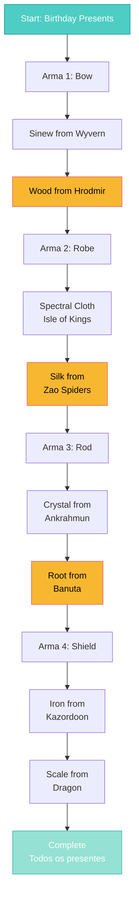

import { Aside, Card } from '@astrojs/starlight/components';

## 🛠️ Informações do Arquivo

Este arquivo define a **estrutura de dados** da quest "A Father's Burden", uma **quest de crafting mágico** com múltiplas etapas onde o jogador coleta materiais para forjar armas especiais como presente de aniversário.

<Card title="Caminho Original" icon="document">
  `data-otservbr-global/lib/core/quests/catalog/004_a_father_s_burden.lua`
</Card>

<Aside type="tip">
  Esta quest é uma das mais longas do catálogo, com **9+ missões** para coletar materiais (sinew, wood, cloth, silk, crystal, root, iron, scale) e criar 3 armas mágicas diferentes (bow, robe, shield, rod).
</Aside>

## 📄 Visão Geral do Código

### Resumo Executivo

A quest "A Father's Burden" é uma **quest narrativa de crafting**:

```
Tereban (pai) precisa de presentes de aniversário para seus filhos.
↓
Player coleta MÚLTIPLOS materiais específicos
↓
Cada material é usado para craftar 3 armas mágicas:
  - Bow (arco): sinew + wood
  - Robe (ropa): cloth + silk
  - Rod (varinha): crystal + root
  - Shield (escudo): iron + scale
```

**Total de Missões**: 9+ (cada material = 1 missão)

## 2. Estrutura de Missão Base

```lua
[1] = {
  name = "The Birthday Presents",
  storageId = Storage.Quest.U8_6.AFathersBurden.Status,
  missionId = 1024,
  startValue = 1,
  endValue = 2,
  states = {
    [1] = "Gather the material Tereban listed...",
    [2] = "You brought all the required materials...",
  },
}
```

## 3. Missão 1: The Birthday Presents (Setup)

```lua
[1] = {
  name = "The Birthday Presents",
  storageId = Storage.Quest.U8_6.AFathersBurden.Status,
  missionId = 1024,
  startValue = 1,
  endValue = 2,
  states = {
    [1] = "Gather the material Tereban listed. \z
      Talk to him about your mission when you have given him everything he was looking for.",
    [2] = "You brought all the required materials to Tereban and guaranteed his sons a great birthday party.",
  },
}
```

**Objetivo**: Coletar materiais gerais para a festa de aniversário  
**Progressão**: State 1 → 2 quando todos os materiais entregues

## 4. Arma 1: Magic Bow

### 4.1 Sinew (Tendão de Wyvern)

```lua
[2] = {
  name = "The Magic Bow - Sinew",
  storageId = Storage.Quest.U8_6.AFathersBurden.Sinew,
  missionId = 1025,
  startValue = 1,
  endValue = 2,
  states = {
    [1] = "Find the wyvern Heoni in the Edron mountains and take his sinew to Tereban.",
    [2] = "You delivered Heoni's sinew to Tereban.",
  },
}
```

**Location**: Edron mountains  
**Creature**: Wyvern Heoni  
**Material**: Sinew (tendão)

### 4.2 Wood (Madeira Especial)

```lua
[3] = {
  name = "The Magic Bow - Wood",
  storageId = Storage.Quest.U8_6.AFathersBurden.Wood,
  missionId = 1026,
  startValue = 1,
  endValue = 2,
  states = {
    [1] = "Find the special wood in the barbarian camps of Hrodmir and bring it to Tereban. \z
      It might be a good idea to start looking in the northernmost camp.",
    [2] = "You delivered the Wood to Tereban.",
  },
}
```

**Location**: Barbarian camps, Hrodmir  
**Dica**: Northern camp  
**Material**: Special wood

## 5. Arma 2: Magic Robe

### 5.1 Spectral Cloth

```lua
[4] = {
  name = "The Magic Robe - Cloth",
  storageId = Storage.Quest.U8_6.AFathersBurden.Cloth,
  missionId = 1027,
  startValue = 1,
  endValue = 2,
  states = {
    [1] = "Find the spectral cloth hidden deep in the crypts of the isle of the kings and bring it to Tereban. \z
      You might have to look for a secret entrance.",
    [2] = "You delivered the spectral cloth to Tereban.",
  },
}
```

**Location**: Isle of Kings - crypts subterrâneas  
**Desafio**: Secret entrance needed  
**Material**: Spectral cloth

### 5.2 Exquisite Silk

```lua
[5] = {
  name = "The Magic Robe - Silk",
  storageId = Storage.Quest.U8_6.AFathersBurden.Silk,
  missionId = 1028,
  startValue = 1,
  endValue = 2,
  states = {
    [1] = "Find exquisite silk in the spider caves of southern Zao and deliver it to Tereban.",
    [2] = "You brought Tereban the required silk.",
  },
}
```

**Location**: Spider caves, South Zao  
**Fonte**: Spider creatures  
**Material**: Exquisite silk

## 6. Arma 3: Magic Rod

### 6.1 Magic Crystal

```lua
[6] = {
  name = "The Magic Rod - Crystal",
  storageId = Storage.Quest.U8_6.AFathersBurden.Crystal,
  missionId = 1029,
  startValue = 1,
  endValue = 2,
  states = {
    [1] = "Find a magic crystal in the tomb buried under the sand east of Ankrahmun and bring it to Tereban.",
    [2] = "Tereban received the magic crystal he was looking for.",
  },
}
```

**Location**: Tomb bajo areia, east Ankrahmun  
**Material**: Magic crystal

### 6.2 Mystic Root

```lua
[7] = {
  name = "The Magic Rod - Root",
  storageId = Storage.Quest.U8_6.AFathersBurden.Root,
  missionId = 1030,
  startValue = 1,
  endValue = 2,
  states = {
    [1] = "Find the mystic root under the city of Banuta and bring it to Tereban.",
    [2] = "The magic root was delievered to Tereban.",
  },
}
```

**Location**: Under Banuta city  
**Material**: Mystic root

## 7. Arma 4: Magic Shield

### 7.1 Old Iron

```lua
[8] = {
  name = "The Magic Shield - Iron",
  storageId = Storage.Quest.U8_6.AFathersBurden.Iron,
  missionId = 1031,
  startValue = 1,
  endValue = 2,
  states = {
    [1] = "Find some old iron in the mines of Kazordoon for Tereban. Don't get lost - \z
      start searching close to the city.",
    [2] = "Tereban got the old iron he required.",
  },
}
```

**Location**: Mines of Kazordoon  
**Conselho**: Begin near city  
**Material**: Old iron

### 7.2 Dragon Scale

**Esperado** em continuação (linha 9):

```lua
[9] = {
  name = "The Magic Shield - Scale",
  storageId = Storage.Quest.U8_6.AFathersBurden.Scale,
  missionId = 1032,
  startValue = 1,
  endValue = 2,
  states = {
    [1] = "Find dragon scale and bring to Tereban.",
    [2] = "You delivered the dragon scale.",
  },
}
```

## 8. Fluxo de Coleta



## 9. Organização de Storage

Todos os storages usam namespace `Storage.Quest.U8_6.AFathersBurden`:

| Material | Field | Mission ID |
|----------|-------|-----------|
| Initial | Status | 1024 |
| Bow - Sinew | Sinew | 1025 |
| Bow - Wood | Wood | 1026 |
| Robe - Cloth | Cloth | 1027 |
| Robe - Silk | Silk | 1028 |
| Rod - Crystal | Crystal | 1029 |
| Rod - Root | Root | 1030 |
| Shield - Iron | Iron | 1031 |
| Shield - Scale | Scale | 1032 |

## 10. Padrão de String Continuation

Note o uso de `\z` para continuar strings em lua:

```lua
states = {
  [1] = "Find the special wood in the barbarian camps of Hrodmir and bring it to Tereban. \z
    It might be a good idea to start looking in the northernmost camp.",
}
```

`\z` ignora whitespace após quebra de linha, mantendo legibilidade.

## 11. Tipo de Quest: Material Collection

### Características:

- ✅ Múltiplas locações (Edron, Hrodmir, Zao, etc)
- ✅ Coletáveis espalhados pelo mundo
- ✅ Narrative progressiva (presentes de aniversário)
- ✅ Longo (9+ etapas)
- ✅ Recompensas ao final (armas mágicas)
- ❌ Sem combate obrigatório (alguns itens requerem)

## 12. Relaçãocom Sistema de Crafting

Esperado que o servidor tenha sistema de **crafting mágico** onde:

```
Tereban recebe: Sinew + Wood → Magic Bow
Tereban recebe: Cloth + Silk → Magic Robe
Tereban recebe: Crystal + Root → Magic Rod
Tereban recebe: Iron + Scale → Magic Shield
```

---

## 🤖 Informações da Documentação

**Data de Criação**: 20 de Fevereiro de 2026  
**Versão do Tibia**: 8.6 (U8_6)  
**Tipo**: Quest Definition / Material Collection  
**Total de Missões**: 9+  
**Storage Namespace**: `Storage.Quest.U8_6.AFathersBurden`  
**Padrão**: Material Collection com Narrativa  
**Locações**: 8+ (Edron, Hrodmir, Zao, Ankrahmun, Banuta, Kazordoon, Isle of Kings, etc)  
**Dificuldade**: Avançada (Viagens longas)
