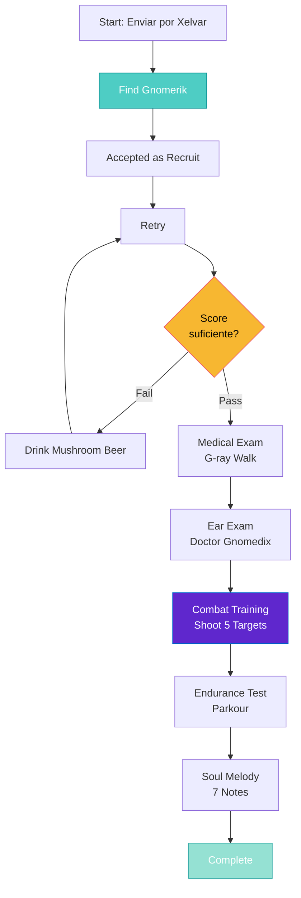

import { Aside, Card } from '@astrojs/starlight/components';

## 🛠️ Informações do Arquivo

Este arquivo define a **estrutura de dados** da quest "Bigfoot's Burden", uma **quest de recrutamento** com múltiplas **etapas de treinamento** incluindo testes, minigames e puzzles.

<Card title="Caminho Original" icon="document">
  `data-otservbr-global/lib/core/quests/catalog/005_bigfoot_s_burden.lua`
</Card>

<Aside type="tip">
  Esta é uma das quests mais complexas do catálogo com **10+ missões** que simulam um processo de recrutamento trabalhista completo com psicologia, medical exams, combat training, e puzzles.
</Aside>

## 📄 Visão Geral do Código

### Resumo Executivo

"Bigfoot's Burden" simula um **processo de recrutamento militar/corporativo**:

```
Objetivo: Ser recrutado para a Bigfoot Company (força armada gnômica)
↓
Etapas obrigatórias:
  1. Encontrar Gnomerik (recruiter)
  2. Teste psicológico
  3. Exame médico (G-ray)
  4. Exame de audição
  5. Treinamento de combate (minigame)
  6. Teste de resistência (parkour)
  7. Teste de melodia da alma (puzzle sonoro)
  8+ Mais testes e missões
```

## 2. Estrutura das 10+ Missões

### 2.1 Missão 1: Looking for Gnomerik (Busca)

```lua
[1] = {
  name = "Looking for Gnomerik",
  storageId = Storage.Quest.U9_60.BigfootsBurden.QuestLine,
  missionId = 1033,
  startValue = 1,
  endValue = 2,
  description = "The dwarf Xelvar has sent you to meet the gnome Gnomerik. \z
    He can recruit you to the Bigfoot Company. \z
    Use the teleporter near Xelvar to enter the gnomish base and start looking for Gnomerik.",
}
```

**Objetivo**: Localizar Gnomerik (NPC recruiter)  
**Instrução**: Usar teleportador perto de Xelvar  
**Tipo**: Navegação

### 2.2 Missão 2: A New Recruit (Aceitação)

```lua
[2] = {
  name = "A New Recruit",
  storageId = Storage.Quest.U9_60.BigfootsBurden.QuestLine,
  missionId = 1034,
  startValue = 3,
  endValue = 4,
  description = "You have found the gnomish recruiter and are ready to become a Bigfoot.",
}
```

**Status**: Aceito como recruta  
**Range**: Value 3 → 4 (indica progresso na storage)

### 2.3 Missão 3: Psychological Test

```lua
[3] = {
  name = "Recruitment: A Test in Gnomology",
  storageId = Storage.Quest.U9_60.BigfootsBurden.QuestLine,
  missionId = 1035,
  startValue = 5,
  endValue = 7,
  states = {
    [5] = "Pass Gnomerik's test by answering his questions. \z
      If you fail to get a high enough score drink a mushroom beer and start again.",
    [6] = "You have passed the gnomish psychology test and can proceed to the medical exam. \z
      Talk to Gnomespector about your next examination.",
  },
}
```

**Tipo**: Quiz/Teste de Psicologia  
**Mecânica**: Answering questions para passar (retest com mushroom beer)  
**Range**: 5 → 7 (múltiplos estados dentro do intervalo)

### 2.4 Missão 4: Medical Examination

```lua
[4] = {
  name = "Recruitment: Medical Examination",
  storageId = Storage.Quest.U9_60.BigfootsBurden.QuestLine,
  missionId = 1036,
  startValue = 8,
  endValue = 9,
  description = "Walk through the g-ray apparatus for your g-raying.",
}
```

**Tipo**: Exame de equipamento  
**Mechanic**: Caminhar através de máquina especial  
**Tema**: "G-ray" (radioativo para gnômica)

### 2.5 Missão 5: Ear Examination

```lua
[5] = {
  name = "Recruitment: Ear Examination",
  storageId = Storage.Quest.U9_60.BigfootsBurden.QuestLine,
  missionId = 1037,
  startValue = 10,
  endValue = 12,
  states = {
    [10] = "You have been g-rayed... Now you are ready for your ear examination. \z
      Walk up to doctor Gnomedix and wait for him to finish your ear examination.",
    [11] = "You passed the ear examination... Now talk to Gnomaticus about your next test.",
  },
}
```

**Status**: G-ray completo, proceeding com exame de audição  
**Range**: 10 → 12

### 2.6 Missão 6: Combat Training (Minigame)

```lua
[6] = {
  name = "Recruitment: Gnomish Warfare",
  storageId = Storage.Quest.U9_60.BigfootsBurden.Shooting,
  missionId = 1038,
  startValue = 0,
  endValue = 5,
  description = function(player)
    return string.format(
      "Hit five targets in a row. \z
      Don't hit an innocent target as it will reset your hit counter. %d / 5",
      (math.max(player:getStorageValue(Storage.Quest.U9_60.BigfootsBurden.Shooting), 0))
    )
  end,
}
```

**Tipo**: Minigame de Combate  
**Mechanic**: Hit 5 diferentes targets em sequência (reset se errar)  
**Descrição Dinâmica**: Mostra progresso "3 / 5"

## 3. Variáveis Especiais: Shooting Counter

A Missão 6 introduz um **contador de variável** diferente:

```lua
storageId = Storage.Quest.U9_60.BigfootsBurden.Shooting  -- Contador
missionId = 1038
startValue = 0   -- Começa em 0
endValue = 5     -- Completado em 5 (5 targets acertados)
```

Padrão similar ao da quest #3 (Spike Task) com range numérico.

## 4. Fluxo Completo de Recrutamento



## 5. Tipos de Testes

| # | Tipo | Mecânica | Storage |
|---|------|----------|---------|
| 3 | Psicologia | Q&A + Retry | Range (5-7) |
| 4 | Médico | Walk-through | Range (8-9) |
| 5 | Audição | Esperar completion | Range (10-12) |
| 6 | Combate | Shooting targets | Counter (0-5) |
| 8 | Resistência | Parkour/Maze | Range (17-20) |
| 9 | Melodia | Puzzle sonoro | Range (21-23+) |

## 6. Missão 7: Continue Combat Training

```lua
[7] = {
  name = "Recruitment: Gnomish Warfare",
  storageId = Storage.Quest.U9_60.BigfootsBurden.QuestLine,
  missionId = 1039,
  startValue = 15,
  endValue = 16,
  description = "You are now ready for your endurance test. Talk to Gnomewart about it.",
}
```

**Nota**: Nome duplicado com Missão 6, mesma temática  
**Range**: 15 → 16 (progresso em QuestLine)

## 7. Padrão de Estados Progressivos

A quest usa um padrão inteligente onde **Storage = versão mini** de etapas:

```lua
-- QuestLine tracks overall progress: 1, 3, 5, 8, 10, 15, 17, 21, ...
-- Shooting tracks mini-progression: 0 → 1 → 2 → 3 → 4 → 5
-- Each test pode ter seus próprios states dentro do range
```

## 8. Características Principais

### ✅ do Design:

1. **Imersão**: Simula processo real de recrutamento
2. **Múltiplos Testes**: Psicologia, Médico, Físico, Mental
3. **Minigames**: Incorpora gameplay interativo (shooting, melody)
4. **Replayable**: Alguns testes podem ser retentados
5. **Progressão Clara**: Score visível (5/5 targets, 7 notes)

### ❌ Desafios Potenciais:

- Quest muito longa
- Múltiplas NPCs a conhecer
- Memoração de locações
- Puzzles complexos (melody)

## 9. Namespace de Storage

```lua
Storage.Quest.U9_60.BigfootsBurden = {
  QuestLine = ???,        -- Rastreador principal
  Shooting = ???,         -- Contador de targets
  ... (mais campos)
}
```

## 10. Elementos de UX

### Descrições Dinâmicas

Missão 6 usa função para mostrar:

```
"Hit five targets in a row. Don't hit an innocent target... 3 / 5"
-- Atualiza conforme player avança
```

### Mensagens de Feedback

Estados descrevem completeness:

```
[10] = "Walk up to doctor... wait for him to finish"
[11] = "You passed the ear examination... talk to Gnomaticus"
-- Guia o player ao próximo passo
```

---

## 🤖 Informações da Documentação

**Data de Criação**: 20 de Fevereiro de 2026  
**Versão do Tibia**: 9.60 (U9_60)  
**Tipo**: Quest Definition / Recruitment Chain  
**Total de Missões**: 10+  
**Storage Namespace**: `Storage.Quest.U9_60.BigfootsBurden`  
**Padrão**: Linear com Minigames  
**Testes Inclusos**: Psicologia, Médico, Auditivo, Combate, Resistência, Melodia  
**Dificuldade**: Avançada (Requer múltiplas etapas + puzzle)  
**Tema**: Recrutamento militar/corporativo gnômico
