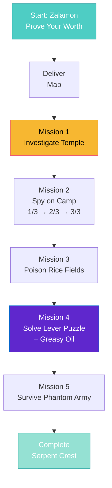

import { Aside, Card } from '@astrojs/starlight/components';

## 🛠️ Informações do Arquivo

Este arquivo define a **estrutura de dados** da quest "Children of the Revolution", uma **quest de espionagem e sabotagem** com 6 missões progressivas onde o player trabalha para Zalamon contra o império lizard.

<Card title="Caminho Original" icon="document">
  `data-otservbr-global/lib/core/quests/catalog/006_children_of_the_revolution.lua`
</Card>

<Aside type="tip">
  Esta é uma quest de **missões de espionagem** onde cada missão tem múltiplos estados narrativos. O player trabalha para revolucionários contra o governo imperial lizard do Zao.
</Aside>

## 📄 Visão Geral do Código

### Resumo Executivo

"Children of the Revolution" estrutura uma **campanha de resistência** com 6 missões:

```
Contexto: Zalamon recruta o player para sabotar o império Zao
↓
Missões de Espionagem:
  1. Prove Your Worth (entregar mapa)
  2. Corruption Investigation (explorar templo)
  3. Spy on Camp (3 prédios)
  4. Poison Fields (sabotagem alimentos)
  5. Secret Passages (quebrar enigmas)
  6. Phantom Army (sobreviver ondas)
```

## 2. Estrutura Base da Quest

```lua
local quest = {
  name = "Children of the Revolution",
  startStorageId = Storage.Quest.U8_54.ChildrenOfTheRevolution.Questline,
  startStorageValue = 1,
  missions = {
    [1] = { ... },  -- Prove Your Worzz!
    [2] = { ... },  -- Mission 1: Corruption
    ...
    [6] = { ... },  -- Mission 5: Phantom Army
  }
}
```

## 3. Missão 1: Prove Your Worzz! (Prova Inicial)

```lua
[1] = {
  name = "Prove Your Worzz!",
  storageId = Storage.Quest.U8_54.ChildrenOfTheRevolution.Mission00,
  missionId = 1058,
  startValue = 1,
  endValue = 2,
  states = {
    [1] = "Your Mission is to go to a little camp of lizards at north-east of the Dragonblaze Peaks. \z
      You have to find and deliver the Tactical map complete the mission.",
    [2] = "You delivered the Tactical map to Zalamon.",
  },
}
```

**Objetivo**: Entregar mapa tático de campo lizard  
**Local**: Lizard camp, NE de Dragonblaze Peaks  
**Tipo**: Delivery/Reconnaissance  
**Range**: 1 → 2

## 4. Missão 2: Mission 1 - Corruption

```lua
[2] = {
  name = "Mission 1: Corruption",
  storageId = Storage.Quest.U8_54.ChildrenOfTheRevolution.Mission01,
  missionId = 1059,
  startValue = 1,
  endValue = 3,
  states = {
    [1] = "Go to the Temple of Equilibrium (it's marked on your map) and find out what happened there.",
    [2] = "The temple has been corrupted and is lost. Zalamon should be informed about this as soon as possible.",
    [3] = "You already reported Zalamon about the Temple! Ask him for new mission!",
  },
}
```

**Objetivo**: Investigar Temple of Equilibrium  
**Descoberta**: Templo foi corrompido  
**Range**: 1 → 3 (três estados de progression)

## 5. Missão 3: Mission 2 - Imperial Secret Weapons

```lua
[3] = {
  name = "Mission 2: Imperial Zzecret Weaponzz",
  storageId = Storage.Quest.U8_54.ChildrenOfTheRevolution.Mission02,
  missionId = 1060,
  startValue = 1,
  endValue = 5,
  states = {
    [1] = "Go into the small camp Chaochai to the north of the Dragonblaze Peaks \z
      (Zalamon marks the entrance on your map). There are 3 buildings which you have to spy",
    [2] = "You spied 1 of 3 buildings of the camp.",
    [3] = "You spied 2 of 3 buildings of the camp.",
    [4] = "You spied 3 of 3 buildings of the camp. Zalamon should be informed about this as soon as possible.",
    [5] = "You already reported Zalamon about the camp! Ask him for new mission!",
  },
}
```

**Tipo**: Multi-Stage Espionage  
**Objetivo**: Spy em 3 buildings diferentes  
**Mechanic**: Progresso incrementado (1/3 → 2/3 → 3/3)  
**Range**: 1 → 5

## 6. Missão 4: Mission 3 - Killing Fields

```lua
[4] = {
  name = "Mission 3: Zee Killing Fieldzz",
  storageId = Storage.Quest.U8_54.ChildrenOfTheRevolution.Mission03,
  missionId = 1061,
  startValue = 1,
  endValue = 3,
  states = {
    [1] = "Get the poison from Zalamon's storage room. Then go to the teleporter to the Muggy Plains and head \z
      east from there to the rice fields. Go to the very top rice field and use the poison anywhere on the water.",
    [2] = "The rice has been poisoned. This will weaken the Emperor's army significantly. \z
      Return and tell Zalamon about your success.",
    [3] = "You already reported Zalamon about your success! Ask him for new mission!",
  },
}
```

**Tipo**: Sabotagem Agrícola  
**Objetivo**: Envenenar campos de arroz imperiais  
**Mechanic**: Pegar poison → aplicar → reportar  
**Range**: 1 → 3

## 7. Missão 5: Mission 4 - The Way of Stones

```lua
[5] = {
  name = "Mission 4: Zze Way of Zztonezz",
  storageId = Storage.Quest.U8_54.ChildrenOfTheRevolution.Mission04,
  missionId = 1062,
  startValue = 1,
  endValue = 6,
  states = {
    [1] = "Your mission is to find a way to enter the north of the valley and find a \z
      passage to the great gate itself. Search any temples or settlements you come across for hidden passages.",
    [2] = "Report Zalamon about the strange symbols that you found.",
    [3] = "Get the greasy oil from Zalamon's storage room and put them on the levers that you found.",
    [4] = "Due to being extra greasy, the leavers can now be moved.",
    [5] = "You found the right combination for the puzzle in the mountains and triggered some kind of mechanism. \z
      You should head back to Zalamon to report your success.",
    [6] = "You already reported Zalamon about your success! You got a Tome of Knowledge as reward! \z
      Ask him for new mission!",
  },
}
```

**Tipo**: Puzzle + Lever Mechanism  
**Objetivo**: 
  1. Encontrar símbolos estranhos
  2. Obter óleo greasy
  3. Aplicar em levers
  4. Resolver puzzle
5. Reportar sucesso  
**Reward**: Tome of Knowledge  
**Range**: 1 → 6

## 8. Missão 6: Mission 5 - Phantom Army

```lua
[6] = {
  name = "Mission 5: Phantom Army",
  storageId = Storage.Quest.U8_54.ChildrenOfTheRevolution.Mission05,
  missionId = 1063,
  startValue = 1,
  endValue = 3,
  states = {
    [1] = "Zalamon has sent you on a quest to find out what lies beneath the secret portal in the temple. Find it and explore the other side.",
    [2] = "Eternal guardians and lizard chosen has been awaken. Survive them and report it to Zalamon!",
    [3] = "You Survived the Waves and reported Zalamon about your success! You got a Serpent Crest as reward!",
  },
}
```

**Tipo**: Combat Challenge  
**Objetivo**: Sobreviver ondas de inimigos (Eternal Guardians, Lizard Chosen)  
**Reward**: Serpent Crest  
**Range**: 1 → 3

## 9. Fluxo de Missões



## 10. Tipo de Quest: Resistance Campaign

### Características:

- ✅ Narrativa de espionagem/sabotagem
- ✅ Múltiplas fases de operação
- ✅ Progression visual (1/3 buildings spied)
- ✅ Puzzles e mazes inclusos
- ✅ Combate final épico (phantom army)
- ✅ Rewards temáticos (Serpent Crest)

### Tema "Zzecret" vs "Secret":

Nota o padrão de textura Z's para dialeto lizard:

```
"Zzecret Weaponzz"  → "Secret Weapons"
"Zee Killing"       → "The Killing"
"Zze Way"           → "The Way"
"Zztonezz"          → "Stones"
```

Adiciona imersão ao mundo (sotaque lizard).

## 11. Organização de Storage

```lua
Storage.Quest.U8_54.ChildrenOfTheRevolution = {
  Questline = ???,         -- Main tracker
  Mission00 = ???,         -- Prove Your Worth
  Mission01 = ???,         -- Corruption
  Mission02 = ???,         -- Secret Weapons
  Mission03 = ???,         -- Killing Fields
  Mission04 = ???,         -- Way of Stones
  Mission05 = ???,         -- Phantom Army
}
```

## 12. Tipo de Progression

| Missão | Type | Range | Mechanic |
|--------|------|-------|----------|
| 1 | Delivery | 1-2 | Entregar item |
| 2 | Investigation | 1-3 | Explorar local |
| 3 | Espionage | 1-5 | Spy 3 locations |
| 4 | Sabotage | 1-3 | Envenenar |
| 5 | Puzzle | 1-6 | Lever + Oil |
| 6 | Combat | 1-3 | Sobreviver ondas |

---

## 🤖 Informações da Documentação

**Data de Criação**: 20 de Fevereiro de 2026  
**Versão do Tibia**: 8.54 (U8_54)  
**Tipo**: Quest Definition / Resistance Campaign  
**Total de Missões**: 6  
**Storage Namespace**: `Storage.Quest.U8_54.ChildrenOfTheRevolution`  
**Padrão**: Linear Campaign com Múltiplas Etapas  
**Tema**: Espionagem/Sabotagem contra Império Zao  
**Dificuldade**: Avançada (Requer exploração, puzzles, combate)  
**Rewards**: Tome of Knowledge, Serpent Crest
