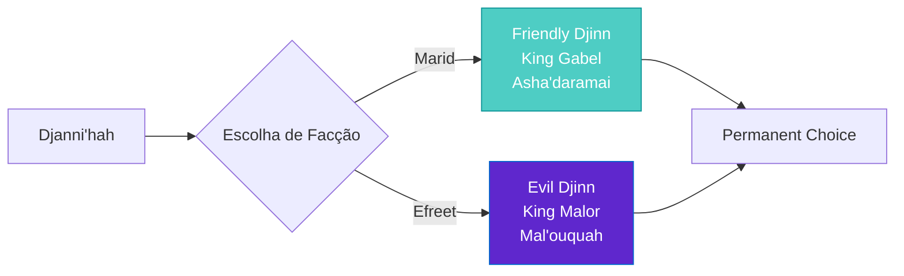
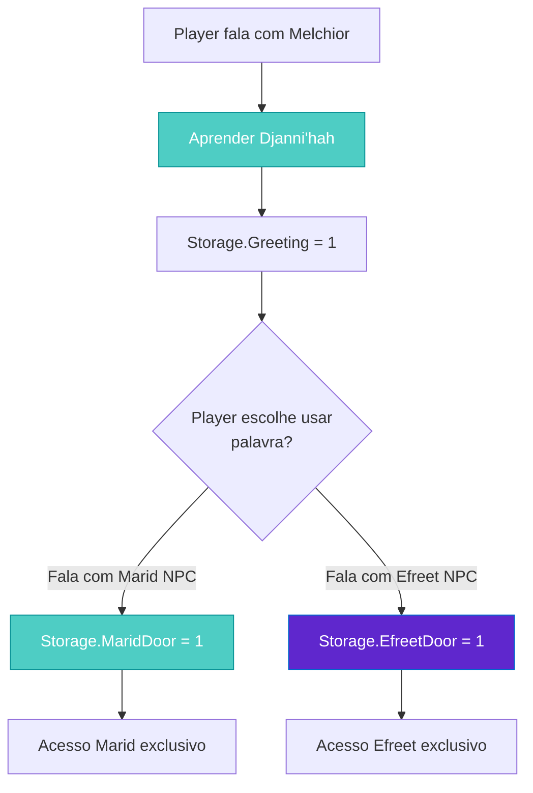

import { Aside, Card } from '@astrojs/starlight/components';

## 🛠️ Informações do Arquivo

Este arquivo define a **estrutura de dados** da quest "Factions", uma **quest de escolha de aliança** onde o player seleciona apoiar os Marid (djinn azuis amigáveis) ou Efreet (djinn verdes maliciosos).

<Card title="Caminho Original" icon="document">
  `data-otservbr-global/lib/core/quests/catalog/007_factions.lua`
</Card>

<Aside type="tip">
  Esta é uma das quests mais curtas do catálogo com apenas **3 missões**, cada uma representando uma escolha permanente de facção que não pode ser desfeita ("you cannot switch sides anymore").
</Aside>

## 📄 Visão Geral do Código

### Resumo Executivo

"Factions" é uma **quest de decisão binária** com 3 missões:

```lua
local quest = {
  name = "Factions",
  startStorageId = Storage.Quest.U7_4.DjinnWar.Factions,
  startStorageValue = 1,
  missions = {
    [1] = {
      name = "Djinn Greeting",
      -- Aprenda a palavra mágica
    },
    [2] = {
      name = "Marid Faction",
      -- Escolha: Djinn azul amigável
    },
    [3] = {
      name = "Efreet Faction",
      -- Escolha: Djinn verde maligno
    },
  }
}
```

## 2. Estrutura Simplificada

Diferente de outras quests, as missões são **muito breves**:

```lua
[index] = {
  name = "Name",
  storageId = Storage.Quest.U7_4.DjinnWar.Faction.FieldName,
  missionId = uniqueId,
  startValue = 1,
  endValue = 2,
  states = {
    [1] = "Text when starting",
    [2] = "",  -- Vazio após completar (peculiaridade)
  },
}
```

## 3. Missão 1: Djinn Greeting (Tutorial)

```lua
[1] = {
  name = "The Marid and the Efreet - Djinn Greeting",
  storageId = Storage.Quest.U7_4.DjinnWar.Faction.Greeting,
  missionId = 1064,
  startValue = 1,
  endValue = 2,
  states = {
    [1] = "Melchior told you the word \"Djanni'hah\" which can be used to talk to Djinns. \z
      Be aware that once you become an ally of one Djinn race, you cannot switch sides anymore.",
    [2] = "",
  },
}
```

**Objetivo**: Aprender palavra mágica "Djanni'hah"  
**NPC**: Melchior  
**Aviso Crítico**: "Cannot switch sides anymore" (decisão permanente)  
**State 2**: Vazio (peculiaridade do design)

## 4. Missão 2: Marid Faction (Escolha Azul)

```lua
[2] = {
  name = "The Marid and the Efreet - Marid Faction",
  storageId = Storage.Quest.U7_4.DjinnWar.Faction.MaridDoor,
  missionId = 1065,
  startValue = 1,
  endValue = 2,
  states = {
    [1] = "You have joined the Marid. These friendly, blue Djinns are honest and fair allies. \z
      You have pledged eternal loyalty to King Gabel and may enter Asha'daramai freely. Djanni'hah!",
    [2] = "",
  },
}
```

**Escolha**: Marid (Djinn Azul)  
**Características**: Friendly, honest, fair  
**Líder**: King Gabel  
**Acesso**: Asha'daramai  
**Jura de Lealdade**: Eterna

## 5. Missão 3: Efreet Faction (Escolha Verde)

```lua
[3] = {
  name = "The Efreet and the Efreet - Efreet Faction",
  storageId = Storage.Quest.U7_4.DjinnWar.Faction.EfreetDoor,
  missionId = 1066,
  startValue = 1,
  endValue = 2,
  states = {
    [1] = "You have joined the Efreet. These evil, green Djinns are always up to mischievous pranks. \z
      You have pledged eternal loyalty to King Malor and may enter Mal'ouquah freely. Djanni'hah!",
    [2] = "",
  },
}
```

**Escolha**: Efreet (Djinn Verde)  
**Características**: Evil, mischievous  
**Líder**: King Malor  
**Acesso**: Mal'ouquah  
**Jura de Lealdade**: Eterna

## 6. Comparação de Facções

### Marid vs Efreet:



## 7. Tipo de Quest: Choice Quest

### Características:

- ✅ Simples (apenas 3 missões)
- ✅ Decisão moral/factional
- ✅ Consequências permanentes
- ✅ Duas ramificações diferentes
- ✅ Acesso a áreas exclusivas por facção
- ❌ Impossível de reverter
- ❌ Sem progresso (binário 1→2)

### Nota Estrutural:

O arquivo cataloga **ambas opções** como se fossem "missões", quando na verdade é **uma escolha entre duas**. Esperado que o sistema saiba que apenas uma pode ser completada.

## 8. Padrão Peculiar: States Vazios

Nota que toda missão tem:

```lua
states = {
  [1] = "Long narrative text",
  [2] = "",  -- Empty string!
}
```

**Razão**: Provavelmente para manter consistência de padrão.  
**Alternativamente**: State 2 pode ser destinado a texto que nunca é exibido.

## 9. Elemento Narrativo: Lealdade Permanente

O texto menciona explicitamente:

> "You have pledged eternal loyalty to King Gabel/Malor"

Isto implica no lore:

- Escolha é **vinculante magicamente**
- Player é **propriedade da facção**
- Não há volta atrás
- Determina futuro do character no mundo

## 10. Organização de Storage

```lua
Storage.Quest.U7_4.DjinnWar = {
  Factions = ???,                    -- Inicializador
  Faction = {
    Greeting = ???,                  -- Tutorial
    MaridDoor = ???,                 -- Acesso Marid
    EfreetDoor = ???,                -- Acesso Efreet
  },
  -- ... outra estrutura Marid/Efreet
}
```

## 11. Efeitos da Quest

### Acesso a Áreas:

**Se escolhe Marid**:
- ✅ Pode entrar Asha'daramai
- ❌ Pode ser bloqueado de Mal'ouquah

**Se escolhe Efreet**:
- ✅ Pode entrar Mal'ouquah
- ❌ Pode ser bloqueado de Asha'daramai

### Sistema Esperado:

```lua
-- Esperado em scripts de door/teleporter:
if player:getStorageValue(Storage.Quest.U7_4.DjinnWar.Faction.MaridDoor) == 1 then
  allowEntry()  -- Permite entrada em Asha'daramai
end
```

## 12. MissionIDs

| Missão | ID | Type |
|--------|-----|------|
| Greeting | 1064 | Tutorial/Info |
| Marid | 1065 | Choice A |
| Efreet | 1066 | Choice B |

## 13. Fluxo Esperado em GameObject



---

## 🤖 Informações da Documentação

**Data de Criação**: 20 de Fevereiro de 2026  
**Versão do Tibia**: 7.4 (U7_4)  
**Tipo**: Quest Definition / Faction Choice  
**Total de Missões**: 3 (1 tutorial + 2 choices)  
**Storage Namespace**: `Storage.Quest.U7_4.DjinnWar`  
**Padrão**: Binary Choice (Marid OR Efreet)  
**Decisão**: Permanente e Irreversível  
**Dificuldade**: Fácil (Apenas conversação)  
**Impacto**: Determina acesso a áreas e faccionalismo do mundo
