import { Aside, Card } from '@astrojs/starlight/components';

## 🛠️ Informações do Arquivo

Este arquivo define a **estrutura de dados** da quest "Friends and Traders", uma **quest de relacionamento com NPCs** que oferece serviços de comercio especial e bênção mágica em troca de tarefas.

<Card title="Caminho Original" icon="document">
  `data-otservbr-global/lib/core/quests/catalog/008_friends_and_traders.lua`
</Card>

<Aside type="tip">
  Esta quest contém **3 missões**, cada uma oferecendo um serviço único: forja de aço (Cyclops), criação de fio (Mermaid), e bênção mágica (Priest Prayer). A missão 3 é notavelmente longa com 12 estados.
</Aside>

## 📄 Visão Geral do Código

### Resumo Executivo

"Friends and Traders" é uma **quest de relacionamento** que oferece acesso a NPCs especiais:

```
Objetivo: Fazer amizade com 3 NPCs especiais
↓
Recompensa: Acesso a serviços exclusivos
  1. Big Ben → Forja aço (steel)
  2. Marina → Criar fio (spool of yarn)
  3. Quentin/Priests → Bênção mágica (blessed stake)
```

## 2. Estrutura Base

```lua
local quest = {
  name = "Friends and Traders",
  startStorageId = Storage.Quest.U7_8.FriendsAndTraders.DefaultStart,
  startStorageValue = 1,
  missions = {
    [1] = { ... },  -- Sweaty Cyclops
    [2] = { ... },  -- Mermaid Marina
    [3] = { ... },  -- Blessed Stake
  }
}
```

## 3. Missão 1: The Sweaty Cyclops

```lua
[1] = {
  name = "The Sweaty Cyclops",
  storageId = Storage.Quest.U7_8.FriendsAndTraders.TheSweatyCyclops,
  missionId = 1067,
  startValue = 1,
  endValue = 2,
  states = {
    [1] = "Big Ben, the cyclops in Ab'Dendriel sends you to bring him 3 bast skirts for his woman. \z
      After this he will help you to forge different steel.",
    [2] = "Big Ben, the cyclops in Ab'Dendriel will help you to forge different steel now. \z
      Just ask him if you need something.",
  },
}
```

**Objeto**: Cyclops chamado "Big Ben"  
**Local**: Ab'Dendriel  
**Tarefa**: Trazer 3 bast skirts para sua mulher  
**Recompensa**: Serviço de forja de aço (steel forging)  
**Range**: 1 → 2

### 3.1 Serviço de Forja

Uma vez completado (state 2), o player pode solicitar:
- Forja de itens de aço
- "Different steel" (provavelmente diferentes tipos)

## 4. Missão 2: The Mermaid Marina

```lua
[2] = {
  name = "The Mermaid Marina",
  storageId = Storage.Quest.U7_8.FriendsAndTraders.TheMermaidMarina,
  missionId = 1068,
  startValue = 1,
  endValue = 2,
  states = {
    [1] = "Marina, the mermaid north of Sabrehaven sends you to bring her 50 honeycombs. \z
      After this she will help you create spool of yarn.",
    [2] = "Marina, the mermaid north of Sabrehaven will help you to create a spool of yarn \z
      from 10 pieces of spider silk. Just ask her if you need something.",
  },
}
```

**NPC**: Mermaid chamada "Marina"  
**Local**: North of Sabrehaven  
**Tarefa**: Trazer 50 honeycombs  
**Recompensa**: Criar "spool of yarn" (fio) de 10 spider silks  
**Range**: 1 → 2

### 4.1 Serviço de Craft

Após completar, Marina pode:
- Converter 10 spider silk → 1 spool of yarn

## 5. Missão 3: The Blessed Stake (Epic)

```lua
[3] = {
  name = "The Blessed Stake",
  storageId = Storage.Quest.U7_8.FriendsAndTraders.TheBlessedStake,
  missionId = 1069,
  startValue = 1,
  endValue = 12,
  states = {
    [1] = "Quentin told you about an old prayer which can bind holy energy to an object. \z
      Each of its ten lines has to be recited by a different priest though. Bring Quentin a wooden stake from Gamon to start.",
    [2] = 'You received Quentin\'s prayer: "Light shall be near - and darkness afar". Now, bring your stake to Tibra in the Carlin church for the next line of the prayer.',
    [3] = 'You received Tibra\'s prayer: "Hope may fill your heart - doubt shall be banned". Now, bring your stake to Maealil in the Elven settlement for the next line of the prayer.',
    [4] = 'You received Maealil\'s prayer: "Peace may fill your soul - evil shall be cleansed". Now, bring your stake to Yberius in the Venore temple for the next line of the prayer.',
    [5] = 'You received Yberius\' prayer: "Protection will be granted - from dangers at hand". Now, bring your stake to Isimov in the dwarven settlement for the next line of the prayer.',
    [6] = 'You received Isimov\'s prayer: "Unclean spirits shall be repelled". Now, bring your stake to Amanda in Edron for the next line of the prayer.',
    [7] = 'You received Amanda\'s prayer: "Wicked curses shall be broken". Now, bring your stake to Kasmir in Darashia for the next line of the prayer.',
    [8] = 'You received Kasmir\'s prayer: "Let there be honor and humility". Now, bring your stake to Rahkem in Ankrahmun for the next line of the prayer.',
    [9] = 'You received Rahkem\'s prayer: "Let there be power and compassion". Now, bring your stake to Brewster in Port Hope for the next line of the prayer.',
    [10] = 'You received Brewster\'s prayer: "Your hand shall be guided - your feet shall walk in harmony". Now, bring your stake to Tyrias in Liberty Bay for the next line of the prayer.',
    [11] = "You received Tyrias' prayer: \"Your mind shall be a vessel for joy, light and wisdom\". He wasn't exactly happy though and said that if you need some mumbo jumbo again, you should rather go to Chondur.",
    [12] = "Chondur was surprised to hear that you had to travel through all of Tibia to have your wooden stake blessed. He offered you help with the blessing if you should need one again in the future.",
  },
}
```

**Tipo**: Epic Quest dentro de Quest  
**Objetivo**: Colecionar bênção de 10 priests  
**Mechanic**: Visitar cada priest → contar cada linha de oração  
**Range**: 1 → 12

### 5.1 Progressão Detalhada

```
State 1: Começar com Quentin (Gamon)
  ↓ Trazer stake
State 2: Visitar Tibra (Carlin church)
  ↓ Stake recebe linha 1
State 3: Visitar Maealil (Elf settlement)
  ↓ Stake recebe linha 2
... (6 mais states) ...
State 11: Visitar Tyrias (Liberty Bay)
  ↓ Stake recebe linha 9
State 12: Visitar Chondur (alternate holy NPC)
  ↓ Stake totalmente abençoado
```

## 6. As 10 Linhas de Oração

A oração é composta de 10 linhas recebidas de diferentes priests:

| State | Priest | Local | Linha |
|-------|--------|-------|-------|
| 1 | Quentin | Gamon | (Setup) |
| 2 | Tibra | Carlin | "Light shall be near..." |
| 3 | Maealil | Elf Settlement | "Hope may fill..." |
| 4 | Yberius | Venore | "Peace may fill..." |
| 5 | Isimov | Dwarf Settlement | "Protection will be..." |
| 6 | Amanda | Edron | "Unclean spirits..." |
| 7 | Kasmir | Darashia | "Wicked curses..." |
| 8 | Rahkem | Ankrahmun | "Let there be honor..." |
| 9 | Brewster | Port Hope | "Your hand shall..." |
| 10 | Tyrias | Liberty Bay | "Your mind shall..." |
| 11 | (Continue) | - | Tyrias feedback |
| 12 | Chondur | - | Final blessing |

## 7. Locações Visitadas

```mermaid
graph LR
    Gamon["Gamon<br/>Start"] --> Carlin["Carlin<br/>Tibra"]
    Carlin --> Elf["Elf Settlement<br/>Maealil"]
    Elf --> Venore["Venore<br/>Yberius"]
    Venore --> Dwarf["Dwarf Settlement<br/>Isimov"]
    Dwarf --> Edron["Edron<br/>Amanda"]
    Edron --> Darashia["Darashia<br/>Kasmir"]
    Darashia --> Ankrahmun["Ankrahmun<br/>Rahkem"]
    Ankrahmun --> PortHope["Port Hope<br/>Brewster"]
    PortHope --> Liberty["Liberty Bay<br/>Tyrias"]
    Liberty --> Chondur["Chondur<br/>Final"]
    
    style Gamon fill:#4ecdc4,stroke:#0a9396,color:#fff
    style Chondur fill:#95e1d3,stroke:#38ada9,color:#fff
```



## 8. Padrão de Quest: Triple Tier

A quest é estruturada em 3 tiers:

| Tier | Missão | Complexidade | Tempo |
|------|--------|--------------|-------|
| 1 | Cyclops | Simples | Curto |
| 2 | Mermaid | Simples | Curto |
| 3 | Blessed Stake | Épico | Muito longo |

## 9. Narrativa Temática

### Cyclops:
"Forja de aço" → Força, Durabilidade

### Mermaid:
"Fio de seda" → Arte, Delicadeza

### Prayer:
"Bênção mágica" → Espiritualidade, Proteção

## 10. Tipo de Quest: Service Quest

### Características:

- ✅ Oferece serviços úteis (forja, craft, bênção)
- ✅ Relacionamento NPC
- ✅ Uma longa cadeia (stake)
- ✅ Mundo aberto (múltiplas cidades)
- ✅ Pode ser feito em qualquer ordem
- ✅ Recompensas permanentes

## 11. Peculiaridade: Escape Characters

Nota o uso de `\'` para apóstrofos em Lua:

```lua
"You received Quentin\'s prayer"  -- Escape apostrophe
"Chondur was surprised..."
```

## 12. Padrão de Narrativa

Cada state instrui o player:

```
State N: "You received X's prayer: [line]. Now, bring your stake to Y..."
```

Isso cria **automação de UI** onde o player sabe exatamente aonde ir próximo.

---

## 🤖 Informações da Documentação

**Data de Criação**: 20 de Fevereiro de 2026  
**Versão do Tibia**: 7.8 (U7_8)  
**Tipo**: Quest Definition / Service Quest  
**Total de Missões**: 3  
**Storage Namespace**: `Storage.Quest.U7_8.FriendsAndTraders`  
**Padrão**: Trading/Relationship Quest  
**Serviços**: Forja de Aço, Craft de Fio, Bênção Mágica  
**Dificuldade**: Média-Alta (Viagens extensas para stake)  
**Impacto World**: Acesso permanente a serviços úteis
