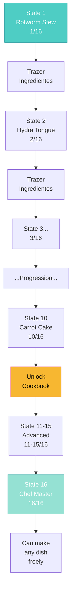

import { Aside, Card } from '@astrojs/starlight/components';

## 🛠️ Informações do Arquivo

Este arquivo define a **estrutura de dados** da quest "Hot Cuisine", uma **quest de culinária** onde o jogador aprende a preparar 16 pratos diferentes como aprendiz de um grande chef francês.

<Card title="Caminho Original" icon="document">
  `data-otservbr-global/lib/core/quests/catalog/009_hot_cuisine.lua`
</Card>

<Aside type="tip">
  Única caracterização: Esta é uma quest com apenas **1 missão, mas 16 estados** onde cada estado representa um novo prato aprendido. É mais uma cadeia de treinamento profissional do que exploração de dungeon.
</Aside>

## 📄 Visão Geral do Código

### Resumo Executivo

"Hot Cuisine" é uma **quest de progressão culinária**:

```
Objetivo: Aprender todos os 16 pratos da culinária
↓
Instructor: Maltre Jean Pierre (Chef francês)
↓
Progressão: 1 → 16 pratos
  1.  Rotworm Stew
  2.  Hydra Tongue Salad
  3.  Roasted Dragon Wings
  ... até
  16. Complete all dishes mastery
```

## 2. Estrutura Única

Diferente de outras quests, esta tem:

- **1 Missão apenas**
- **1 Storage ID para toda quest**
- **16 Estados (1-16)**
- **Range numérico: 1 → 16**

```lua
local quest = {
  name = "Hot Cuisine",
  startStorageId = Storage.Quest.U8_5.HotCuisineQuest.QuestStart,
  startStorageValue = 1,
  missions = {
    [1] = {
      name = "Hot Cuisine",
      storageId = Storage.Quest.U8_5.HotCuisineQuest.QuestLog,
      missionId = 1070,
      startValue = 1,
      endValue = 16,
      states = {
        [1] = "First dish...",
        [2] = "Second dish...",
        ...
        [16] = "Master chef!"
      }
    }
  }
}
```

## 3. Estrutura de Estados (1-16)

### Estados 1-10 (Aprendizado Básico)

| Estado | Prato | Instrução | Progression |
|--------|-------|-----------|------------|
| 1 | Rotworm Stew | Trazer ingredientes | 1/16 |
| 2 | Hydra Tongue Salad | Trazer ingredientes | 2/16 |
| 3 | Roasted Dragon Wings | Trazer ingredientes | 3/16 |
| 4 | Tropical Fried Terrorbird | Trazer ingredientes | 4/16 |
| 5 | Banana Chocolate Shake | Trazer ingredientes | 5/16 |
| 6 | Veggie Casserole | Trazer ingredientes | 6/16 |
| 7 | Filled Jalapeno Peppers | Trazer ingredientes | 7/16 |
| 8 | Blessed Steak | Trazer ingredientes | 8/16 |
| 9 | Northern Fishburger | Trazer ingredientes | 9/16 |
| 10 | Carrot Cake | Trazer ingredientes | 10/16 |

### Estados 11-15 (Aprendizado Avançado)

```lua
[11] = "You have completed the tenth dish. You are now able to obtain the cookbook from \z
  Jean Pierre's room upstairs.",
[12] = "The eleventh dish he will teach you to prepare is Coconut Shrimp Bake. \z
  Bring him the ingredients he told you.",
[13] = "You have completed the eleventh dish, the twelfth dish he will teach you to prepare is Blackjack. \z
  Bring him the ingredients he told you.",
[14] = "You have completed the twelfth dish, the thirteenth dish he will teach you to \z
  prepare is Demonic Candy Balls. Bring him the ingredients he told you.",
[15] = "You have completed the thirteenth dish, the fourteenth dish he will teach you to \z
  prepare is Sweet Mangonaise Elixir. Bring him the ingredients he told you.",
```

### Estado 16 (Mastership)

```lua
[16] = "You have completed all the dishes. You are now able to make all the dishes in any order you want.",
```

**Significado**: Player agora é um chef mestre e pode fazer qualquer prato livremente.

## 4. Detalhes dos Pratos

### Padrão de Nomes

Notável que os nomes são **bem criativos** e temáticos:

- **Com ingredientes animais**: Rotworm, Hydra, Dragon, Terrorbird, Fishburger
- **Com sabores**: Chocolate, Jalapeno, Mango
- **Com preparações**: Fried, Roasted, Stewed, Salad, Casserole

### Padrão de Progressão

Estados 1-10 usam padrão consistente:

```
"You've become the apprentice... The [X]th dish he will teach you..."
  ↓ (Player traz ingredientes)
"You have completed the [X]th dish, the [X+1]th dish is [next dish]..."
```

## 5. Mecânica de Checkpoint

**Estado 11** marca um milestone especial:

```lua
[11] = "You have completed the tenth dish. You are now able to obtain the cookbook from \z
  Jean Pierre's room upstairs.",
```

**Significado**:
- Unlock de item (cookbook)
- Marca 50% de progresso (10/16)
- Ponto de salvação/checkpoint narrativo

## 6. Padrão de String Continuation

Como em outras quests, usa `\z` para quebras de linha:

```lua
"You've become the apprentice of Maltre Jean Pierre. \z
  The first dish he will teach you to prepare is Rotworm Stew. \z
  Bring him the ingredients he told you."
```

Mantém código legível e strings bem formatadas.

## 7. Tipo de Quest: Progression Chain

### Características:

- ✅ Linear simples (1→2→3...)
- ✅ Nenhuma volta atrás
- ✅ Cada passo prepara para próximo
- ✅ Narrativa consistente
- ✅ Rewards ao atingir milestones (cookbook)
- ✅ Final clara (chef master)
- ❌ Sem combate/exploração
- ❌ Sem escolhas alem seguir passos

## 8. Narração Temática

### Culinary Terms Francês Esperado:

- "Maltre Jean Pierre" → Master Jean Pierre (francês/inglês misto)
- "Cuisine" (nome da quest)
- Pratos com nomes sofisticados

Imersão em ambiente de cooking show/chef training.

## 9. Fluxo de Missão



## 10. Armazenamento de Dados

```lua
Storage.Quest.U8_5.HotCuisineQuest = {
  QuestStart = ???,     -- Inicializador
  QuestLog = ???,       -- Tracker principal (1-16)
}
```

Simples: apenas 1 storage id para rastrear toda a progression.

## 11. Reward Expected

### Cookbook Access:

Em state 11, permite acessar "Jean Pierre's room upstairs"  
Presumivelmente para obter um livro de receitas com todos os pratos.

### Mastery Reward:

Em state 16, player pode:
- Preparar qualquer dos 16 pratos
- Sem precisar trazer ingredientes cada vez?
- Ou desbloqueou receitas permanentemente?

## 12. Tipo de Experiência

Diferente de combat/exploration quests, esta oferece:

- **Educational emulation** (aprender culinária)
- **Soft roleplay** (trabalhar como aprendiz)
- **Reward collection** (recipes, cookbook)
- **Progression clarity** (visível onde você está)

---

## 🤖 Informações da Documentação

**Data de Criação**: 20 de Fevereiro de 2026  
**Versão do Tibia**: 8.5 (U8_5)  
**Tipo**: Quest Definition / Progression Chain  
**Total de Missões**: 1 (com 16 estados internos)  
**Storage Namespace**: `Storage.Quest.U8_5.HotCuisineQuest`  
**Padrão**: Linear Progression (16 passos)  
**Pratos Ensinados**: 16  
**Dificuldade**: Fácil (Apenas conversação + coleta de itens)  
**Tema**: Culinary Training / Chef Apprenticeship  
**Reward**: Cookbook Access + Mastery of Cooking
