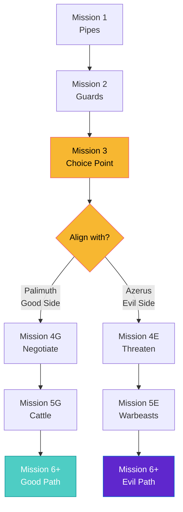

import { Aside, Card } from '@astrojs/starlight/components';

## 🛠️ Informações do Arquivo

Este arquivo define a **estrutura de dados** da quest "In Service of Yalahar", uma **quest de megaduração** com **10+ missões progressivas** e escolha de facção (Good vs Evil side), ambientada na cidade de Yalahar.

<Card title="Caminho Original" icon="document">
  `data-otservbr-global/lib/core/quests/catalog/010_in_service_of_yalahar.lua`
</Card>

<Aside type="tip">
  Esta é uma das quests mais longas do catálogo com múltiplas ramificações. Cada missão oferece escolhas morais (ajudar Palimuth vs Azerus) que afetam a progressão subsequente.
</Aside>

## 📄 Visão Geral do Código

### Resumo Executivo

"In Service of Yalahar" é uma **mega-quest com questões morais**:

```
Contexto: Ser recrutado para trabalhar em Yalahar (cidade mágica)
↓
Mentor: Palimuth (good side) OR Azerus/Yalahari (evil side)
↓
Progressão: 10+ Missões com choices que divergem o story
  Missão 1: Limpeza de esgoto
  Missão 2: Espionagem de guardas
  Missão 3: Morte de inimigos
  ... até Missão 10+
```

## 2. Estrutura Geral

```lua
local quest = {
  name = "In Service of Yalahar",
  startStorageId = Storage.Quest.U8_4.InServiceOfYalahar.Questline,
  startStorageValue = 5,  -- Começa em 5, não 1!
  missions = {
    [1] = { ... },  -- Mission 01: Something Rotten
    [2] = { ... },  -- Mission 02: Watching the Watchmen
    ... (até 10+)
  }
}
```

**Peculiaridade**: `startStorageValue = 5` (não 1!)

## 3. Missão 1: Something Rotten (Esgoto)

```lua
[1] = {
  name = "Mission 01: Something Rotten",
  storageId = Storage.Quest.U8_4.InServiceOfYalahar.Mission01,
  missionId = 1071,
  startValue = 1,
  endValue = 6,
  states = {
    [1] = "Palimuth asked you to help with some sewer malfunctions. \z
      You will need a Crowbar, there are 4 places where you need to go marked with an X on your map.",
    [2] = "You cleaned 1 pipe of 4 from the garbage.",
    [3] = "You cleaned 2 pipes of 4 from the garbage.",
    [4] = "You cleaned 3 pipes of 4 from the garbage.",
    [5] = "You cleaned 4 pipes of 4 from the garbage. Go back to Palimuth and report your mission",
    [6] = "You cleaned all pipes from the garbage! Go back to Palimuth and ask for mission.",
  },
}
```

**Tipo**: Maintenance Task  
**Objetivo**: Limpar 4 pipes diferentes (minigame/repetição)  
**Tool**: Crowbar  
**Mechanic**: Counter incrementa (1/4 → 2/4 → 3/4 → 4/4)  
**Range**: 1 → 6

## 4. Missão 2: Watching the Watchmen (Espionagem)

```lua
[2] = {
  name = "Mission 02: Watching the Watchmen",
  storageId = Storage.Quest.U8_4.InServiceOfYalahar.Mission02,
  missionId = 1072,
  startValue = 1,
  endValue = 8,
  states = {
    [1] = "You have to find all 7 guards and give a report to them. \z
      You should start by Foreign Quarter or by Trade Quarter and follow the order of the path..",
    [2] = "You reported to 1 of 7 guards",
    [3] = "You reported to 2 of 7 guards",
    ... (5-7 similar)
    [8] = "You reported to 7 of 7 guards! Go back to Palimuth and ask for mission.",
  },
}
```

**Tipo**: Reconnaissance (Espionagem)  
**Objetivo**: Encontrar e reportar para 7 guards distintos  
**Mechanic**: Counter (1/7 → 2/7 → ... → 7/7)  
**Range**: 1 → 8

## 5. Missão 3: Death to the Deathbringer (Divisão de Facção)

```lua
[3] = {
  name = "Mission 03: Death to the Deathbringer",
  storageId = Storage.Quest.U8_4.InServiceOfYalahar.Mission03,
  missionId = 1073,
  startValue = 1,
  endValue = 6,
  states = {
    [1] = "Get the notes in Palimuths room and read them. Talk to Palimuth again when you've read the notes.",
    [2] = "Talk to Azerus the Yalahari in the city centre to get your next mission.",
    [3] = "Get the notes behind the Yalahari and read them. \z
      Talk to Azerus again and ask him for mission when you've read the notes.",
    [4] = "Ask Palimuth for mission.",
    [5] = "First you will need to kill the three plague bearers and then get The Alchemists' Formulas. \z
      When this have been done head back to either Palimuth (good side) or Yalahari (Azerus) (bad side).",
    [6] = "Ask Azerus the Yalahari for a mission.",
  },
}
```

**Tipo**: Choice Point (Good vs Evil)  
**Objetivo**: Matar "three plague bearers" + obter "Alchemist's Formulas"  
**Escolha**:
- State 4: Sugestão de voltar à Palimuth (good)
- State 6: Sugestão de reportar à Azerus (evil)  
**Range**: 1 → 6

### 5.1 Escolha de Facção

Esta é a **primeira brecha real** na narrativa:

```
Palimuth (Good Path)          Azerus/Yalahari (Evil Path)
  ↓                                 ↓
Report ao bom mentor          Report ao mentor maligno
  ↓                                 ↓
Futuras missões mudam         Futuras missões mudam
```

## 6. Missão 4: Good to be Kingpin (Escolha Politica)

```lua
[4] = {
  name = "Mission 04: Good to be Kingpin",
  storageId = Storage.Quest.U8_4.InServiceOfYalahar.Mission04,
  missionId = 1074,
  startValue = 1,
  endValue = 6,
  states = {
    [1] = "Ask Palimuth for mission.",
    [2] = "For this mission you are asked to go to the Trade Quarter and negotiate or threaten Mr. West. \z
      Once again you will gain access to the mechanism although if you \z
      choose to help Palimuth you should go through the sewers.",
    [3] = "You decided to help Palimuth, report him your mission.",
    [4] = "You decided to help Azerus, report him your mission.",
    [5] = "Get back to Azerus and report him your mission.",
    [6] = "Ask Azerus for a mission.",
  },
}
```

**Escolha Duvidosa**: Negotiate (good) vs Threaten (evil)  
**NPC**: Mr. West (Trade Quarter)  
**Mecânica**: Divergence baseada em ação anterior

## 7. Missão 5: Food or Fight (Teste de Combate)

```lua
[5] = {
  name = "Mission 05: Food or Fight",
  storageId = Storage.Quest.U8_4.InServiceOfYalahar.Mission05,
  missionId = 1075,
  startValue = 1,
  endValue = 8,
  states = {
    [1] = "Ask Palimuth for mission.",
    [2] = "On this mission you are asked to find a druid by the name of Tamerin, on the Arena Quarter. \z
      You now have permission to use the gates mechanism.",
    [3] = "The first is to bring Tamerin a flask of Animal Cure, \z
      you can buy this from Siflind on Nibelor (northeast of Svargrond).",
    [4] = "now you have to kill Morik the Gladiator and bring his helmet to Tamerin as proof.",
    [5] = "Report back to Tamerin... you can now make your choice: \z
      Cattle for Palimuth (good side), Warbeasts for Yalahari (Azerus) (bad side).",
    [6] = "You decided to help Palimuth, report him your mission.",
    [7] = "You decided to help Azerus, report him your mission.",
    [8] = "Ask Azerus for a mission.",
  },
}
```

**Tipo**: Multi-choice (3 sub-steps)  
1. Encontrar Tamerin
2. Trazer Animal Cure
3. Derrotar Morik the Gladiator  
4. **Escolher align**: Cattle (good) vs Warbeasts (evil)

## 8. Fluxo de Divisão de Facção



## 9. Missão 6: Frightening Fuel (Continuação)

```lua
[6] = {
  name = "Mission 06: Frightening Fuel",
  storageId = Storage.Quest.U8_4.InServiceOfYalahar.Mission06,
  missionId = 1076,
  startValue = 1,
  endValue = 5,  -- (truncado na read)
  ...
}
```

**Continuação da quest além de 6 missões** (arquivo tem 180 linhas, apenas 100 foram lidas).

## 10. Padrão de Multiple Endings

A quest oferece:

### Ending A: Good Side (Palimuth)

- Ajudar legalidade
- Fornecer Cattle
- Provavelmente reward: benevolente/justiça

### Ending B: Evil Side (Azerus/Yalahari)

- Ameaçar/forçar
- Fornecer Warbeasts
- Provavelmente reward: poder/dark magic

## 11. Tipo de Quest: Faction Allegiance

### Características:

- ✅ Mega-quest (10+ missões)
- ✅ Escolha de facção permanente
- ✅ Divergência narrativa
- ✅ Múltiplos NPCs
- ✅ Múltiplos tipos de tasks (limpeza, spy, combat, craft)
- ✅ Rewards divergentes
- ❌ Muito longa (pode demorar semanas)
- ❌ Dificil rastrear progresso

## 12. Organização de Storage

```lua
Storage.Quest.U8_4.InServiceOfYalahar = {
  Questline = ???,            -- Main tracker
  Mission01 = ???,            -- Pipes
  Mission02 = ???,            -- Guards
  ...
  Mission06 = ???,            -- Fuel
  -- Mais armazenamento abaixo...
}
```

Cada missão tem seu próprio storage ID, permitindo progresso independente.

## 13. Narrative Pattern

Cada missão segue padrão:

```
"Talk to Palimuth/Azerus for mission"
  ↓ (State 1-5: Complete task)
"Report back to Palimuth/Azerus"
  ↓ (State 6+: Ask for next mission)
```

Automatição clara da progressão.

## 14. Localização da Ação

- **Questline Base**: Yalahar city
- **Areas**: Foreign Quarter, Trade Quarter, Arena Quarter, Sewers, Nibelor (Svargrond)
- **Multiple Zones**: Quest expande por vários mapas

---

## 🤖 Informações da Documentação

**Data de Criação**: 20 de Fevereiro de 2026  
**Versão do Tibia**: 8.4 (U8_4)  
**Tipo**: Quest Definition / Faction Allegiance  
**Total de Missões**: 10+ (arquivo truncado)  
**Storage Namespace**: `Storage.Quest.U8_4.InServiceOfYalahar`  
**Padrão**: Linear com Divergência de Facção (Missão 3+)  
**Factions**: Palimuth (Good) / Azerus-Yalahari (Evil)  
**Tipos de Tasks**: Cleaning, Reconnaissance, Combat, Crafting, Building Relationships  
**Dificuldade**: Avançada (Muito longa, requer múltiplas etapas)  
**Impacto**: Determina storyline e rewards subsequentes da cidade
