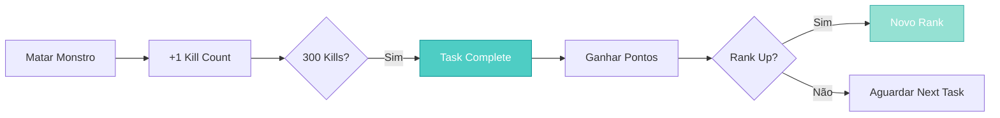

import { Aside, Card } from '@astrojs/starlight/components';

## 🛠️ Informações do Arquivo

Este arquivo define a **estrutura de dados** da quest "Killing in the Name of...", uma **quest de sistema de ranking de caçador** onde players completam tarefas de caça repetidas para ganhar pontos e subir de rank.

<Card title="Caminho Original" icon="document">
  `data-otservbr-global/lib/core/quests/catalog/011_killing_in_the_name_of.lua`
</Card>

<Aside type="tip">
  Esta é uma quest **com 1200+ linhas** que oferece 13+ missões de caça diferentes, cada uma rastreando kills de um tipo específico de monstro. Com sistema de ranking progressivo: Huntsman → Ranger → Big Game Hunter → Trophy Hunter → Elite Hunter.
</Aside>

## 📄 Visão Geral do Código

### Resumo Executivo

"Killing in the Name of..." é uma **quest de grinding/farming** estruturada como:

```
Contexto: "Paw and Fur - Hunting Elite" (organização de caçadores)
↓
Mentor: Grizzly Adams
↓
Sistema de Pontos:
  - POINTSSTORAGE: Pontos normais
  - BossPoints: Pontos de boss (raros)
↓
6 Ranks Progressivos:
  1. Huntsman (0 pontos)
  2. Ranger (2+)
  3. Big Game Hunter (4+)
  4. Trophy Hunter (5+)
  5. Elite Hunter (7+)
```

## 2. Estrutura Base

```lua
local quest = {
  name = "Killing in the Name of...",
  startStorageId = 100157,
  startStorageValue = 1,
  missions = {
    [1] = { ... },    -- Hunting Elite (Tracker)
    [2] = { ... },    -- Rank: Huntsman
    [3] = { ... },    -- Rank: Ranger
    [4] = { ... },    -- Rank: Big Game Hunter
    [5] = { ... },    -- Rank: Trophy Hunter
    [6] = { ... },    -- Rank: Elite Hunter
    [7..20] = { ... } -- Tarefas específicas (Crocodiles, Badgers, etc)
  }
}
```

## 3. Missão 1: Hunting Elite (Info Display)

```lua
[1] = {
  name = "Paw and Fur - Hunting Elite",
  storageId = Storage.Quest.U8_5.KillingInTheNameOf.QuestLogEntry,
  missionId = 1081,
  startValue = 0,
  endValue = 1,
  description = function(player)
    return string.format(
      "You joined the 'Paw and Fur - Hunting Elite'. Ask Grizzly Adams for some hunting tasks. \z
      You already gained %d points. You currently have %d boss points.",
      (math.max(player:getStorageValue(POINTSSTORAGE), 0)),
      (math.max(player:getStorageValue(Storage.Quest.U8_5.KillingInTheNameOf.BossPoints), 0))
    )
  end,
}
```

**Tipo**: Info/Tracker  
**Dinâmico**: Usa `function(player)` para calcular display em tempo real  
**Exibe**: Pontos totais + Boss points

## 4. Missões 2-6: Ranking System

```lua
[2] = {
  name = "Paw and Fur - Rank: Huntsman",
  storageId = Storage.Quest.U8_5.KillingInTheNameOf.PawAndFurRank,
  missionId = 1082,
  startValue = 0,
  endValue = 1,
  description = "You have been promoted to the rank of a 'Huntsman' in the 'Paw and Fur - Hunting Elite'.",
}

[3] = {
  name = "Paw and Fur - Rank: Ranger",
  storageId = Storage.Quest.U8_5.KillingInTheNameOf.PawAndFurRank,
  missionId = 1083,
  startValue = 2,
  endValue = 3,
  description = "You have been promoted to the rank of a 'Ranger' in the 'Paw and Fur - Hunting Elite'.",
}

[4] = { -- Big Game Hunter (startValue 4, endValue 5)
[5] = { -- Trophy Hunter (startValue 5, endValue 6)
[6] = { -- Elite Hunter (startValue 7, endValue 8)
```

**Padrão**: Cada rank usa mesmo Storage ID mas diferentes startValue ranges  
**Trigger**: Quando player atinge pontos necessários, rank muda  
**Progressão**: Não linear (3→5, não 3→4)

## 5. Missões de Caça (7-20+): Monster Counts

```lua
[7] = {  -- Crocodiles
  name = "Paw and Fur: Crocodiles",
  storageId = 65001,
  missionId = 1087,
  startValue = 0,
  endValue = 2,
  states = {
    [0] = function(player)
      return string.format(
        "You already hunted %d/300 crocodiles.",
        player:getStorageValue(Storage.Quest.U8_5.KillingInTheNameOf.MonsterKillCount.CrocodileCount)
      )
    end,
    [1] = "You successfully hunted 300 crocodiles. If you want to you may complete this task again.",
    [2] = "You succesfully hunted 300 crocodiles.",
  },
}

[8] = {  -- Badgers
  name = "Paw and Fur: Badgers",
  storageId = 65002,
  missionId = 1088,
  startValue = 0,
  endValue = 2,
  states = {
    [0] = function(player)
      return string.format(
        "You already hunted %d/300 badgers.",
        player:getStorageValue(Storage.Quest.U8_5.KillingInTheNameOf.MonsterKillCount.BadgerCount)
      )
    end,
    [1] = "You successfully hunted 300 badgers. If you want to you may complete this task again.",
    [2] = "You succesfully hunted 300 badgers.",
  },
}
```

### 5.1 Lista de Tarefas de Caça

| Missão | Monstro | Target | Storage |
|--------|---------|--------|---------|
| 7 | Crocodiles | 300 | 65001 |
| 8 | Badgers | 300 | 65002 |
| 9 | Tarantulas | 300 | 65003 |
| 10 | Carniphilas | 150 | 65004 |
| 11 | Stone Golems | 200 | 65005 |
| 12 | Mammoths | 300 | 65006 |
| 13 | Gnarlhounds | 300 | 65007 |
| 14+ | (Mais monstros...) | Vários | Vários |

## 6. Padrão: Description Dinâmico

State 0 usa função para calcular:

```lua
[0] = function(player)
  return string.format(
    "You already hunted %d/%d monsters.",
    player:getStorageValue(MONSTER_KILL_STORAGE),
    TARGET_NUMBER
  )
end
```

Permite UI atualizada em tempo real mostrando progresso.

## 7. Repeatable Quests

Todas as tarefas de caça indicam:

```
"If you want to you may complete this task again."
```

Significa quests farming **são repetíveis indefinidamente**.

## 8. Tipo de Quest: Ranking/Progression System

### Características:

- ✅ Sistema de ranking com 6 níveis
- ✅ Múltiplas tarefas de caça (13+)
- ✅ Cada tarefa rastreia kill count específico
- ✅ Quests repetiáveis infinitamente
- ✅ Descrição dinâmica com stats em tempo real
- ✅ Sistema de pontos paralelo (regular + boss)
- ❌ Muito grindy (300 kills por task)
- ❌ Sem storyline narrativa

## 9. Organização de Storage

```lua
Storage.Quest.U8_5.KillingInTheNameOf = {
  QuestLogEntry = ???,                    -- Tracker principal
  PawAndFurRank = ???,                    -- Current rank (0-8)
  BossPoints = ???,                       -- Pontos de boss
  MonsterKillCount = {
    CrocodileCount = ???,
    BadgerCount = ???,
    TarantulaCount = ???,
    CarniphilasCount = ???,
    StoneGolemCount = ???,
    MammothCount = ???,
    GnarlhoundCount = ???,
    -- ... more
  }
}
```

## 10. Sistema de Pontos



---

## 🤖 Informações da Documentação

**Data de Criação**: 20 de Fevereiro de 2026  
**Versão do Tibia**: 8.5 (U8_5)  
**Tipo**: Quest Definition / Ranking System  
**Total de Missões**: 13+ (6 ranks + múltiplos tasks)  
**Storage Namespace**: `Storage.Quest.U8_5.KillingInTheNameOf`  
**Padrão**: Grinding/Farming com Ranking  
**Ranks**: 6 (Huntsman → Elite Hunter)  
**Dificuldade**: Fácil (Repetitivo, não complexo)  
**Impacto**: Sistema de meritocracia de caçadores, rewards permanentes
