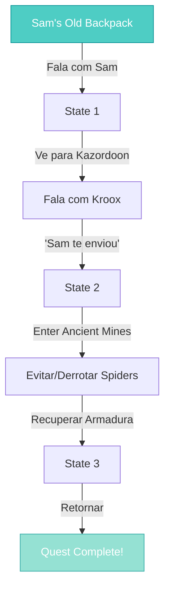

import { Aside, Card } from '@astrojs/starlight/components';

## 🛠️ Informações do Arquivo

Este arquivo define a **estrutura de dados** da quest "Sam's Old Backpack", uma **quest minimal de apenas 1 missão** sobre obter armadura anã especial através de Kroox em Kazordoon.

<Card title="Caminho Original" icon="document">
  `data-otservbr-global/lib/core/quests/catalog/013_sam_s_old_backpack.lua`
</Card>

<Aside type="tip">
  Uma das quests mais simples do catálogo com apenas **1 missão e 3 estados**. Serve como intermediária para acesso a armadura anã rara localizada nas minas.
</Aside>

## 📄 Visão Geral do Código

### Resumo Executivo

"Sam's Old Backpack" é uma **quest gateway** bem curta:

```
Objetivo: Obter permissão para armadura anã
↓
NPC: Sam (quem oferece quest)
↓
Intermediária: Kroox (em Kazordoon)
↓
Missão: Dwarven Armor Quest (única)
  - State 1: Sam envia para Kroox
  - State 2: Permissão concedida
  - State 3: Quest completada
```

## 2. Estrutura Simples

```lua
local quest = {
  name = "Sam's Old Backpack",
  startStorageId = Storage.Quest.U7_5.SamsOldBackpack.SamsOldBackpackNpc,
  startStorageValue = 1,
  missions = {
    [1] = { -- Única missão
      name = "Dwarven Armor Quest",
      storageId = Storage.Quest.U7_5.SamsOldBackpack.SamsOldBackpackNpc,
      missionId = 10187,
      startValue = 1,
      endValue = 3,
      states = { [1..3] }
    }
  }
}
```

## 3. Missão Única: Dwarven Armor Quest

```lua
[1] = {
  name = "Dwarven Armor Quest",
  storageId = Storage.Quest.U7_5.SamsOldBackpack.SamsOldBackpackNpc,
  missionId = 10187,
  startValue = 1,
  endValue = 3,
  states = {
    [1] = "Sam sends you to see Kroox in Kazordoon to get a special dwarven armor. \z
      Just tell him, his old buddy Sam is sending you.",
    [2] = "You have the permission to retrive a dwarven armor from the mines. \z
      The problem is, some giant spiders made the tunnels where the storage is their new home.",
    [3] = "You have completed Dwarven Armor Quest!",
  },
}
```

### 3.1 Progressão de Estados

| State | Evento | Descrição |
|-------|--------|-----------|
| 1 | Quest Start | Sam te manda para Kroox |
| 2 | Kroox Acceptance | Permissão concedida, aviso sobre spiders |
| 3 | Quest Complete | Sucesso! Armadura obtida |

## 4. Fluxo Narrativo



## 5. Localização e NPCs

**Sam**: Local desconhecido (provavelmente perto de minas)  
**Kroox**: Kazordoon (cidade anã)  
**Localidade**: Ancient Mines / Minas Anãs  
**Obstáculo**: Giant Spiders (combate)

## 6. Tipo de Quest: Gateway Quest

### Características:

- ✅ Bem curta (1 missão, 3 estados)
- ✅ Serve como intro para conteúdo específico
- ✅ NPC intermediária clara (Kroox)
- ✅ Dificuldade baixa
- ✅ Missão linear sem branches
- ❌ Sem escolhas
- ❌ Sem rewards explícitos (acesso apenas é reward)

## 7. Storage Namespace

```lua
Storage.Quest.U7_5.SamsOldBackpack = {
  SamsOldBackpackNpc = ???  -- Única entrada usada tanto para start quanto track
}
```

Interessante: Usa **mesmo storage ID** para inicio e rastreamento.

## 8. Mission ID

| Field | Valor |
|-------|-------|
| Mission ID | 10187 |
| Storage ID | U7_5.SamsOldBackpack.SamsOldBackpackNpc |
| Quest Name | Dwarven Armor Quest |

---

## 🤖 Informações da Documentação

**Data de Criação**: 20 de Fevereiro de 2026  
**Versão do Tibia**: 7.5 (U7_5)  
**Tipo**: Quest Definition / Gateway Quest  
**Total de Missões**: 1  
**Storage Namespace**: `Storage.Quest.U7_5.SamsOldBackpack`  
**Padrão**: Linear Gateway (intro quest)  
**Dificuldade**: Muito Fácil (Apenas direcionamento)  
**Localização**: Kazordoon → Ancient Mines  
**Obstáculo**: Giant Spiders  
**Acesso**: Armadura anã especial
