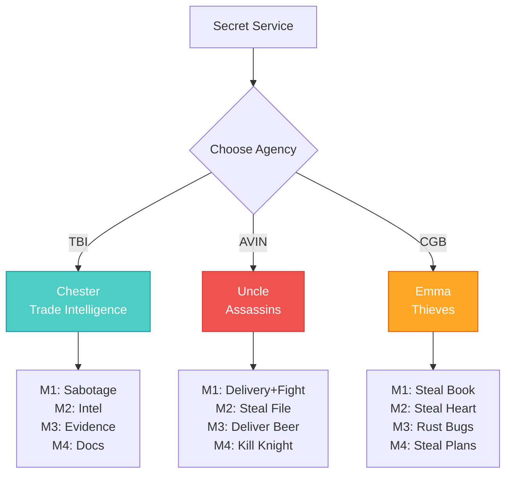

import { Aside, Card } from '@astrojs/starlight/components';

## 🛠️ Informações do Arquivo

Este arquivo define a **estrutura de dados** da quest "Secret Service", uma **mega-quest de espionagem** com **12+ missões** organizadas em **3 agências secretas** distintas, cada uma com seu próprio mentor e linha de trabalho.

<Card title="Caminho Original" icon="document">
 `data-otservbr-global/lib/core/quests/catalog/015_secret_service.lua`
</Card>

<Aside type="tip">
  Uma das quests mais longas com **3 agências paralelas**: TBI (Trade Bureau Intelligence), AVIN (Assassin's Agency), CGB (Crystal Guard Bureau). Cada uma com 4 missões e objetivos temáticos diferentes.
</Aside>

## 📄 Visão Geral do Código

### Resumo Executivo

"Secret Service" é um **sistema de espionagem com múltiplas fações**:

```
3 Agências Paralelas:
  1. TBI (Trade Bureau Intelligence) - Chester mentor
     └─ Missões: Venore threat, Green Claw, Port Hope, Hellgate
  
  2. AVIN (Assassin's Agency) - Uncle mentor
     └─ Missões: Thais delivery, Guard tasks, Castle ops, Black Knight
  
  3. CGB (Crystal Guard Bureau) - Emma mentor
     └─ Missões: Academy theft, Tree heart, Rust bugs, Ship plans
```

## 2. Estrutura Base

```lua
local quest = {
  name = "Secret Service",
  startStorageId = Storage.Quest.U8_1.SecretService.Quest,
  startStorageValue = 1,
  missions = {
    [1] = { TBI Mission 01 ... },     -- Mission 1: From Thais with Love
    [2] = { AVIN Mission 01 ... },    -- Mission 1: For Your Eyes Only
    [3] = { CGB Mission 01 ... },     -- Mission 1: Borrowed Knowledge
    [4] = { TBI Mission 02 ... },     -- Mission 2: Operation Green Claw
    [5] = { AVIN Mission 02 ... },    -- Mission 2: A File Between Friends
    [6] = { CGB Mission 02 ... },     -- Mission 2: Codename: Lumberjack
    ... (até 12)
  }
}
```

## 3. TBI (Trade Bureau Intelligence) - Chester

### Missão 01: From Thais with Love (Estado 3)

```lua
[1] = {
  name = "Mission 1: From Thais with Love",
  storageId = Storage.Quest.U8_1.SecretService.TBIMission01,
  missionId = 10191,
  startValue = 1,
  endValue = 3,
  states = {
    [1] = "Your first mission is to deliver a warning to the Venoreans. \z
      Get a fire bug from Liberty Bay and set their shipyard on fire.",
    [2] = "You have set the Venoreans shipyard on fire, report back to Chester!",
    [3] = "You have reported back that you have completed your mission, ask Chester for a new mission!",
  },
}
```

**Objetivo**: Sabotagem (queimar shipyard de Venore)  
**Item**: Fire bug (de Liberty Bay)  
**Padrão**: Task → Report → Next mission

### Missão 02-04: Outras TBI

```
Mission 2: Operation Green Claw
  → Encontrar informação em Green Claw Swamp
  
Mission 3: Treachery in Port Hope
  → Recuperar evidência de traição

Mission 4: Objective Hellgate
  → Investigar documentos em Hellgate
```

## 4. AVIN (Assassin's Agency) - Uncle

### Missão 01: For Your Eyes Only (Estado 4)

```lua
[2] = {
  name = "Mission 1: For Your Eyes Only",
  storageId = Storage.Quest.U8_1.SecretService.AVINMission01,
  missionId = 10192,
  startValue = 1,
  endValue = 4,
  states = {
    [1] = "Your first task is to deliver a letter to Gamel in thais, If he is a bit reluctant, be persuasive.",
    [2] = "Gamel sent his thugs on you, defeat them and deliver the letter to Gamel!",
    [3] = "After defeating Gamel's thugs, he found you to be persuasive enough to accept the letter. \z
      Report back to Uncle!",
    [4] = "You have reported back that you have completed your task. Ask Uncle for a new mission!",
  },
}
```

**Objetivo**: Delivery + Combate (gegen Gamel's thugs)  
**Escalação**: Peaceful → Force → Success  
**Mentor**: Uncle (vs Chester da TBI)

### Missão 02-04: Outras AVIN

```
Mission 2: A File Between Friends
  → Recuperar arquivo AH-X17L89

Mission 3: What Men are Made of
  → Deliver barrel of beer (com combat vs amazons)

Mission 4: Pawn Captures Knight
  → Kill Black Knight em sua villa
```

## 5. CGB (Crystal Guard Bureau) - Emma

### Missão 01: Borrowed Knowledge (Estado 2)

```lua
[3] = {
  name = "Mission 1: Borrowed Knowledge",
  storageId = Storage.Quest.U8_1.SecretService.CGBMission01,
  missionId = 10193,
  startValue = 1,
  endValue = 2,
  states = {
    [1] = "Emma has requested that you steal a Nature Magic Spellbook in the Edron academy.",
    [2] = "You have delivered the Nature Magic Spellbook to Emma, ask her for a new mission!",
  },
}
```

**Objetivo**: Roubo (steal book from academy)  
**Mentor**: Emma (thief-focused)  
**Tone**: Criminoso (explicit "steal")

### Missão 02-04: Outras CGB

```
Mission 2: Codename: Lumberjack
  → Steal Rotten Heart of Tree from Black Knight Villa

Mission 3: Rust in Peace
  → Use Rust Bugs para danificar Ironhouse cellar

Mission 4: Plot for A Plan
  → Retrieve Building Plans de shipyard
```

## 6. Padrão de Organização

As 12 missões estão **intercaladas por agência**:

```
Index 1,4,7,10 → TBI (Chester)
Index 2,5,8,11 → AVIN (Uncle)
Index 3,6,9,12 → CGB (Emma)
```

Permite players escolher qual agência seguir, ou fazer todas em paralelo.

## 7. Tipo de Quest: Multiple Agency System

### Características:

- ✅ 3 agências paralelas independentes
- ✅ 4 missões por agência (12 total)
- ✅ Diferentes tipos: Sabotage (TBI), Assassination (AVIN), Theft (CGB)
- ✅ Mentores temáticos com personalidades
- ✅ Escalação de dificuldade gradual
- ✅ Missões podem ser feitas em qualquer ordem
- ✅ Rewards provavelmente por agência

## 8. Temas por Agência

| Agência | Mentor | Tema | Objetivo |
|---------|--------|------|----------|
| TBI | Chester | Trade/Commerce | Sabotagem econômica |
| AVIN | Uncle | Assassinato | Eliminar alvo |
| CGB | Emma | Roubo | Roubar item |

## 9. Mechanic: Escalation

Muitas missões têm escalação:

```
Mission 1 (AVIN): "Be persuasive" → Combat escalates
Mission 3 (TBI): Info + Report
Mission 3 (AVIN): Task + Combat vs Amazons
```

Não é sempre pacífico; requer combate.

## 10. Storage Organization

```lua
Storage.Quest.U8_1.SecretService = {
  Quest = ???,                    -- Main tracker
  TBIMission01 = ???,
  AVINMission01 = ???,
  CGBMission01 = ???,
  TBIMission02 = ???,
  AVINMission02 = ???,
  CGBMission02 = ???,
  TBIMission03 = ???,
  AVINMission03 = ???,
  CGBMission03 = ???,
  TBIMission04 = ???,
  AVINMission04 = ???,
  CGBMission04 = ???,
}
```

## 11. Fluxo de Agência



---

## 🤖 Informações da Documentação

**Data de Criação**: 20 de Fevereiro de 2026  
**Versão do Tibia**: 8.1 (U8_1)  
**Tipo**: Quest Definition / Multiple Agency System  
**Total de Missões**: 12 (4 por agência x 3)  
**Storage Namespace**: `Storage.Quest.U8_1.SecretService`  
**Padrão**: Parallel Faction Quests  
**Agências**: TBI (Commerce), AVIN (Assassins), CGB (Thieves)  
**Dificuldade**: Média (Multiple locales, some combat)  
**Impacto**: Provavelmente reputation com agências específicas
