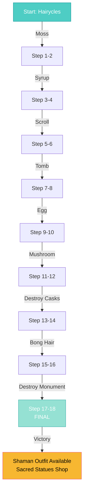

import { Aside, Card } from '@astrojs/starlight/components';

## 🛠️ Informações do Arquivo

Este arquivo define a **estrutura de dados** da quest "The Ape City", uma **mega-missão de 18 estados** onde o player ajuda Hairycles a proteger a cidade dos Ape em Banuta contra corrupção e magia dark.

<Card title="Caminho Original" icon="document">
  `data-otservbr-global/lib/core/quests/catalog/017_the_ape_city.lua`
</Card>

<Aside type="tip">
  Uma única missão com **18 estados progressivos** e múltiplas subtasks: coleta de items, exploração de dungeons, combates, liderança espiritual. Resultado final: venda de estatuetas sagradas.
</Aside>

## 📄 Visão Geral do Código

### Resumo Executivo

"The Ape City" é uma **epic single-mission storyline**:

```
Objetivo: Proteger Banuta Ape City de corrupção
Mentor: Hairycles (ape wiseman)
Progressão de 18 estados:
  1-2: Mosgo collection
  3-4: Cough syrup
  5-6: Magical scroll
  7-8: Tomb exploration
  9-10: Hydra egg
  11-12: Witches' cap
  13-14: Destroy casks
  15-16: Bong hair
  17-18: Monument destruction
```

## 2. Estrutura Única de 1 Missão

```lua
local quest = {
  name = "The Ape City",
  startStorageId = Storage.Quest.U7_6.TheApeCity.Started,
  startStorageValue = 1,
  missions = {
    [1] = {
      name = "Hairycles' Missions",
      storageId = Storage.Quest.U7_6.TheApeCity.Questline,
      missionId = 10217,
      startValue = 1,
      endValue = 18,
      states = { [1..18] }
    }
  }
}
```

## 3. Estados 1-6: Coleta de Items Especiais

### Estado 1-2: Whisper Moss

```lua
[1] = "Find whisper moss in the dworc settlement south of Port Hope and bring it back to Hairycles.",
[2] = "You have completed the first mission. Hairycles was happy about the whisper moss you gave to him. \z
  He might have another mission for you.",
```

**Task**: Coleta de Whisper Moss  
**Local**: Dworc settlement (south of Port Hope)

### Estado 3-4: Cough Syrup

```lua
[3] = "Hairycles asked you to bring him cough syrup from a human settlement. \z
  A healer might know more about this medicine.",
[4] = "You have completed the second mission. Hairycles was happy about the cough syrup you gave to him. \z
  He might have another mission for you.",
```

**Task**: Trazer medicine (cough syrup)  
**Hint**: Procurar healer em human settlement

### Estado 5-6: Magical Scroll

```lua
[5] = "Hairycles asked you to bring him a magical scroll from the lizard settlement Chor.",
[6] = "You have completed the third mission. Hairycles appreciated that you brought \z
  the scroll to him and will try to read it. Maybe he has another mission for you later.",
```

**Task**: Obter scroll mágico  
**Local**: Lizard settlement Chor

## 4. Estados 7-10: Exploração e Combate

### Estado 7-8: Tomb Exploration

```lua
[7] = "Since Hairycles was not able to read the scroll you brought him, he asked you dig for a tomb in the \z
  desert to the east. Proceed in this tomb until you find an obelisk between red stones and read it.",
[8] = "You have completed the fourth mission. \z
  Hairycles read your mind and can now translate the lizard scroll. \z
  He might have another mission for you.",
```

**Task**: Encontrar tomb no desert, ler obelisk entre red stones  
**Resultado**: Translation de scroll obtida via mind-reading

### Estado 9-10: Hydra Egg

```lua
[9] = "Hairycles wants to create a life charm for the ape people. \z
  He needs a hydra egg since it has strong regenerating powers.",
[10] = "You have completed the fifth mission. \z
  Hairycles attempts to create a might charm for the protection of the ape people. \z
  He might have another mission for you later.",
```

**Task**: Obter Hydra Egg  
**Propósito**: Craft life charm (regeneração)  
**Nota**: "might charm" (typo provável, deveria ser "life charm")

## 5. Estados 11-14: Coleta e Destruição

### Estado 11-12: Witches' Cap Mushroom

```lua
[11] = "Hairycles need a witches' cap mushroom which is supposed to be hidden in a dungeon deep under Fibula.",
[12] = "You have completed the sixth mission. You brought the witches' cap mushroom back to Hairycles. \z
  He might have another mission for you.",
```

**Localização**: Deep dungeon under Fibula  
**Dificuldade**: Exploração profunda

### Estado 13-14: Destroy Snake Casks

```lua
[13] = "Hairycles is worried about an ape cult which drinks some strange fluid that the lizards left behind. \z
  Go to the old lizard temple under Banuta and destroy three of the casks there with a crowbar.",
[14] = "You have completed the seventh mission. \z
  You found the old lizard ruins under Banuta and destroyed three of the casks with snake blood. \z
  Hairycles might have another mission for you.",
```

**Task**: Destruir 3 casks com crowbar  
**Local**: Old lizard temple under Banuta  
**Propósito**: Prevenir culto de ape que bebe "snake blood"

## 6. Estados 15-18: Leadership e Final Boss

### Estado 15-16: Sacred Hair of Bong

```lua
[15] = "The apes now need a symbol of their faith. \z
  Speak with the blind prophet in a cave to the northeast and go to the Forbidden Land. \z
  Find a hair of the giant, holy ape Bong and bring it back.",
[16] = "You completed the eighth mission. Hairycles gladly accepted the hair of the ape \z
  god which you brought him. He told you to have one final mission for you.",
```

**Quest**: Hair of Bong (ape god)  
**Locação**: Forbidden Land (northeast cave)  
**Spiritual**: Hair of god = símbolo religiosos

### Estado 17-18: Monument of Snake God Destruction

```lua
[17] = "Go into the deepest catacombs under Banuta and destroy the monument of \z
  the snake god with the hammer that Hairycles gave to you.",
[18] = "You successfully destroyed the monument of the snake god. \z
  As reward, you can buy sacred statues from Hairycles. \z
  If you haven't done so yet, you should also ask him for a shaman outfit.",
```

**Final Task**: Destroy snake god monument (final boss?)  
**Tool**: Hammer given by Hairycles  
**Reward**: Venda de statues + Shaman outfit

## 7. Fluxo Épico de 18 Passos



## 8. Tipo de Quest: Cultural Protection Quest

### Características:

- ✅ Única missão, 18 estados
- ✅ Protectionista narrative (salvar cultura ape)
- ✅ Variety de tasks (coleta, combate, exploração)
- ✅ Spiritual elements (bong hair, monument)
- ✅ Clear progression
- ✅ Final reward shop (statues)
- ✅ Bonus outfit (shaman)

## 9. Tema Narrativo: Corrupted Ape City

```
Problema: Ape city  em perigo por:
  - Snake cult bevendo blood
  - Snake god monument dominando
  - Corrupted lizard influence

Solução: Coletar 8 items sagrados e destruir monument

Vitória: City cleansed, apes prosperam
```

---

## 🤖 Informações da Documentação

**Data de Criação**: 20 de Fevereiro de 2026  
**Versão do Tibia**: 7.6 (U7_6)  
**Tipo**: Quest Definition / Single Epic Mission  
**Total de Missões**: 1 (com 18 estados)  
**Storage Namespace**: `Storage.Quest.U7_6.TheApeCity`  
**Padrão**: Linear Single-Mission Epic  
**Estados**: 18 progressivos  
**Tema**: Proteção Cultural (vs Snake Corruption)  
**Dificuldade**: Média (Exploração extensiva, múltiplos locais)  
**Rewards**: Shaman Outfit, Sacred Statues Shop
