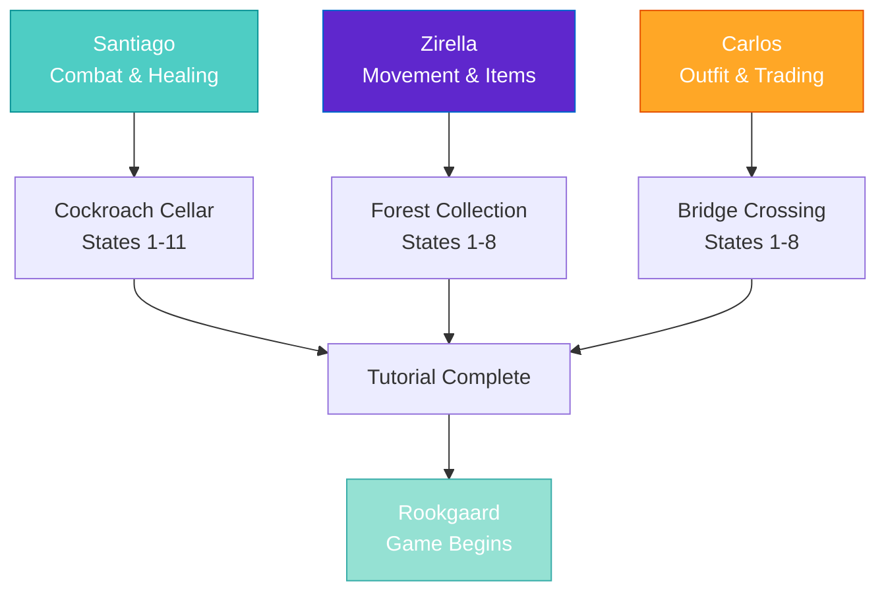

import { Aside, Card } from '@astrojs/starlight/components';

## 🛠️ Informações do Arquivo

Este arquivo define a **estrutura de dados** da quest "The Beginning", uma **quest tutorial** que ensina novas players os mecânicas básicas do jogo através de 3 NPCs diferentes e 11 passos progressivos.

<Card title="Caminho Original" icon="document">
  `data-otservbr-global/lib/core/quests/catalog/018_the_beginning.lua`
</Card>

<Aside type="tip">
  A **quest tutorial do jogo** com 3 missões ensinando: Combat (Santiago), Movement (Zirella), Outfit Changing & Trading (Carlos). Elemento especial: pode ser skipped com comando "skip tutorial".
</Aside>

## 📄 Visão Geral do Código

### Resumo Executivo

"The Beginning" é um **tutorial interativo** estruturado em 3 NPCs:

```
Objetivo: Aprender mecânicas básicas
↓
NPCs Tutoriais:
  1. Santiago (Cockroach Plague)
     → Combat, Equipment, Healing
  
  2. Zirella (Collecting Wood)
     → Movement, Item interaction, Drag & Drop
  
  3. Carlos (Hungry Tailor)
     → Outfit changing, Trading
↓
Final: Skip bridge em Rookgaard
```

## 2. Estrutura Tutorial

```lua
local quest = {
  name = "The Beginning",
  startStorageId = Storage.Quest.U8_2.TheBeginningQuest.SantiagoQuestLog,
  startStorageValue = 1,
  missions = {
    [1] = { The Cockroach Plague (Santiago) ... },   -- 11 states
    [2] = { Collecting Wood (Zirella) ... },          -- 8 states
    [3] = { A Hungry Tailor (Carlos) ... },           -- 8 states
  }
}
```

## 3. Missão 1: The Cockroach Plague (Santiago, 11 States)

```lua
[1] = {
  name = "The Cockroach Plague",
  storageId = Storage.Quest.U8_2.TheBeginningQuest.SantiagoQuestLog,
  missionId = 10218,
  startValue = 1,
  endValue = 11,
  states = {
    [1] = "You have found a fisherman called Santiago, who has a little problem. \z
      Maybe you should talk to him again to find out more.",
    [2] = "Santiago asked you to go into his house. Upstairs you will find a chest. \z
      You can keep what you find inside of it. Once you got that, talk to Santiago again.",
    [3] = "You have found Santiago's Coat and reported back to him. \z
      Your quest is not done yet, you should talk to him a bit more.",
    [4] = "Santiago gave you a weapon. After equipping it, go to the cellar of his house to find out \z
      about the cockroach plague.",
    [5] = "You brought the cockroach legs to Santiago. He still has something to tell you though.",
    [6] = "Santiago asked you, if those cockroaches hurt you. You should reply to him!",
    [7] = "Santiago has a valuable lesson for you. You should talk to him again.",
    [8] = "Santiago showed you how some monsters might hurt you. \z
      Better to talk to him to learn a way to heal yourself.",
    [9] = "Santiago gave you some fish! Just 'use' it to eat it and regain health. \z
      Afterwards, you should talk to Santiago again.",
    [10] = "Santiago asked you if you had seen Zirella. Don't let him wait for the answer.",
    [11] = "You have helped Santiago a lot by killing the cokcroaches in his cellar. \z
      In exchange, he gave you equipment and some valuable experience. Well done!",
  },
}
```

### 3.1 Teaching Progression

| State | Lesson | Mechanic |
|-------|--------|----------|
| 1-3 | Finding NPC, chest opening | Exploration |
| 4-5 | Combat, looting | Combat basics |
| 6-9 | Damage taken, healing | Health system |
| 10-11 | Dialogue progression | NPC interaction |

**Tools**: Weapon (equipped), Fish (healing item)  
**NPC Loop**: Talk → Find item → Report → Learn → Reward

## 4. Missão 2: Collecting Wood (Zirella, 8 States)

```lua
[2] = {
  name = "Collecting Wood",
  storageId = Storage.Quest.U8_2.TheBeginningQuest.ZirellaQuestLog,
  missionId = 10219,
  startValue = 1,
  endValue = 8,
  states = {
    [1] = "You have a vague idea that Zirella might need you for collecting firewood, \z
      but you don't know yet where to get it. You should talk to her again.",
    [2] = "You know that the branches Zirella needs might be gotten from dead trees in \z
      the forest south of here, but you don't know the details yet. You should talk to her \z
        but there is some information missing. You should talk to Zirella again.",
    [4] = "You have learned that you can push the branch which you've broken from a dead tree by \z
      'Drag & Drop', but you still need some information. You should talk to Zirella again.",
    [5] = "You know that you have to 'Use' the branch. Then leftclick with the changed cursor on the cart. \z
      Now you just have to tell Zirella that you will help her.",
    [6] = "Go into the forest south of here and look for trees without leaves. 'Use' one to break a branch \z
      from it, then drag & drop the branch back to her cart and 'Use' it with the cart.",
    [7] = "You have brought a branch to Zirella, congratulations! You should talk to her again for your reward.",
    [8] = "You have helped Zirella by collecting wood for her. The reward can be found in her house.",
  },
}
```

### 4.1 New Mechanics Taught

| State | Mechanic | Key Words |
|-------|----------|-----------|
| 1-2 | Gathering info | Talk to NPC |
| 4-5 | Drag & Drop | "Push the branch" |
| 5-6 | Use item + Click | "Use" + "left click" |
| 7-8 | Item delivery | Complete task |

**Nota**: State 3 está faltando! (Jump de 2→4)

**UI Elements**: Dead trees (without leaves), cart, branch  
**Mechanics**: Quebrar branch, arrastar, usar item

## 5. Missão 3: A Hungry Tailor (Carlos, 8 States)

```lua
[3] = {
  name = "A Hungry Tailor",
  storageId = Storage.Quest.U8_2.TheBeginningQuest.CarlosQuestLog,
  missionId = 10220,
  startValue = 1,
  endValue = 8,
  states = {
    [1] = "You found another person named Carlos. You should talk to him learn how to change your outfit.",
    [2] = "Carlos taught you how to change your outfit. Now he seems to be wanting a small favour from you. \z
      Talk to him again to learn more.",
    [3] = "Carlos asked you whether you could bring him some food. \z
      Talk to him again to learn how to find food here.",
    [4] = "Carlos asked you to hunt some deer and rabbits and loot them to find a piece of ham or meat. \z
      However you haven't agreed yet, so you should tell him that you'll do it.",
    [5] = "You agreed to bring Carlos some food. \z
      Hunt some deer or rabbit until you find a piece of meat or ham talk to Carlos again.",
    [6] = "To sell the meat or ham to Carlos, talk to him and ask him for a 'trade'.",
    [7] = "You sucessfully learnt how to change your outfit and how to trade with NPCs. \z
      Time to head over the bridge to Rookgaard!",
    [8] = "You have passed the bridge to Rookgaard and have sucessfully completed the Tutorial. \z
      If you want to skip the tutorial in the future with a new character, simply say 'skip tutorial' to Santiago.",
  },
}
```

### 5.1 Final Mechanics

| State | Mechanic | Purpose |
|-------|----------|---------|
| 1-2 | Outfit changing | Cosmetic customization |
| 3-6 | Hunting + Trading | Combat + Economy |
| 7-8 | Bridge + Outro | Tutorial complete |

**Special**: State 8 menciona como skippar tutorial ("skip tutorial" command)

## 6. Teaching Architecture



## 7. Special Feature: Tutorial Skip

```lua
"If you want to skip the tutorial in the future with a new character, simply say 'skip tutorial' to Santiago."
```

Permite players experienced pularem o tutorial inteiro falando "skip tutorial" para o primeiro NPC.

## 8. Tipo de Quest: Tutorial/Onboarding

### Características:

- ✅ 3 fases temáticas (Combat, Movement, Economy)
- ✅ Progressive learning (básico → intermédio)
- ✅ Clear step-by-step instructions
- ✅ Practical exercises (não apenas teoria)
- ✅ NPC characters com personality
- ✅ Skip option para players experienced
- ✅ Bridge crossing marks "real game start"

## 9. Localidades

| NPC | Local | Tema |
|-----|-------|------|
| Santiago | Casa com cellar | Combat training |
| Zirella | Floresta south | Resource gathering |
| Carlos | Unspecified | Trading hub |
| Bridge | Final | World gate |

---

## 🤖 Informações da Documentação

**Data de Criação**: 20 de Fevereiro de 2026  
**Versão do Tibia**: 8.2 (U8_2)  
**Tipo**: Quest Definition / Tutorial Quest  
**Total de Missões**: 3 (Serial Learning)  
**Storage Namespace**: `Storage.Quest.U8_2.TheBeginningQuest`  
**Padrão**: Progressive Tutorial  
**NPCs**: Santiago (Combat), Zirella (Movement), Carlos (Trading)  
**Dificuldade**: Muito Fácil (Tutorial)  
**Duração**: 27 estados totais (11+8+8)  
**Elemento Especial**: Skippable via command
