import { Aside, Card } from '@astrojs/starlight/components';

## 🛠️ Informações do Arquivo

Uma questline épica de exploração das ilhas de gelo focada na proteção de Svargrond contra invasores. Implementada como tabela Lua estruturada com 12 missões progressivas.

<Card title="Caminho Original" icon="document">
  data-otservbr-global/lib/core/quests/catalog/022_the_ice_islands_quest.lua
</Card>

<Aside type="tip">
  **Quest IDs:** 10233-10244 | **Tipo:** Questline Linear | **Dificuldade:** Média-Alta | **Missões:** 12
</Aside>

---

## 📄 Visão Geral do Código

**The Ice Islands Quest** é uma questline épica de exploração e defesa territorial. Os jogadores progressam através de 12 missões envolvendo amizade com shamans, sabotagem ecológica, coleta de ingredientes e descoberta de segredos místicos nas minas de Formorgar.

### Resumo Executivo

- **Nome da Quest**: The Ice Islands Quest
- **Mentor Principal**: Iskan (musher), Hjaern (shaman), NPCs regionais
- **Mecânica Principal**: Coleta multi-estágio, contadores de progresso, explorações em cadeia
- **Reward Sistema**: Acesso a Formorgar Mines + Norseman Outfit
- **Storage Namespace**: Storage.Quest.U8_0.TheIceIslands.*

---
� Estrutura do Código

### Variáveis Locais

```lua
local quest = {
  name = "The Ice Islands Quest",
  startStorageId = Storage.Quest.U8_0.TheIceIslands.Questline,
  startStorageValue = 1,
  missions = { ... }
}
```

| Variável | Tipo | Descrição |
|----------|------|-----------|
| `quest` | table | Tabela raiz contendo metadados e missões |
| `quest.name` | string | Nome da questline exibido ao jogador |
| `quest.startStorageId` | number | Storage ID de inicialização |
| `quest.startStorageValue` | number | Valor inicial de storage (1) |
| `quest.missions` | table | Array com 12 missões estruturadas |

### Estrutura de Missões

Cada missão segue o padrão:

```lua
[missionNumber] = {
  name = "Mission Title",
  storageId = Storage.Quest.U8_0.TheIceIslands.MissionNN,
  missionId = 10233 + offset,
  startValue = 1,
  endValue = numStates,
  states = {
    [1] = "Initial instruction",
    [2] = "Progress message",
    [endValue] = "Completion message"
  }
}
```

---

## �
## 🗺️ Estrutura das Missões

### Progressão Visual

```mermaid
graph LR
    M1["1. Befriend Musher<br/>Estados 1-3"] -->
    M2["2. Breaking Ice<br/>Estados 1-5<br/>Contador 1/3-3/3"] -->
    M3["3. Ecological Terrorism<br/>Estados 1-3"] -->
    M4["4. Artful Sabotage<br/>Estados 1-2"] -->
    M5["5. Berserk Brewery<br/>Estados 1-6<br/>5 ingredientes"]
    
    M5 -->
    M6["6. Cure Dogs<br/>Estados 1-8<br/>7 ingredientes"] -->
    M7["7. Secret of Helheim<br/>Estados 1-3"] -->
    M8["8. The Contact<br/>Estados 1-4"] -->
    M9["9. Formorgar Mines 1<br/>Estados 1-2"]
    
    M9 -->
    M10["10. Formorgar Mines 2<br/>Estados 1-2"] -->
    M11["11. Formorgar Mines 3<br/>Estados 1-2"] -->
    M12["12. Retaliation<br/>Estados 1-6<br/>NORSEMAN OUTFIT"]
    
    style M1 fill:#87CEEB
    style M12 fill:#4169E1
```



### Detalhamento das Missões

| # | Missão | missionId | estados | Mecânica |
|---|--------|-----------|---------|----------|
| 1 | Befriend Musher | 10233 | 1→3 | Conversa e alimentação |
| 2 | Breaking Ice | 10234 | 1→5 | Contador 1/3 rompimentos |
| 3 | Ecological Terrorism | 10235 | 1→3 | Libertar formigas |
| 4 | Artful Sabotage | 10236 | 1→2 | Pintar selos |
| 5 | Berserk Brewery | 10237 | 1→6 | Coleta 5 ingredientes |
| 6 | Cure Dogs | 10238 | 1→8 | Coleta 7 ingredientes |
| 7 | Secret of Helheim | 10239 | 1→3 | Exploração |
| 8 | The Contact | 10240 | 1→4 | Localizar NPC Nor |
| 9 | Formorgar Mines 1 | 10241 | 1→2 | Exploração inicial |
| 10 | Formorgar Mines 2 | 10242 | 1→2 | Conversa ghost |
| 11 | Formorgar Mines 3 | 10243 | 1→2 | Informar shamans |
| 12 | Retaliation | 10244 | 1→6 | 4 obeliscos + OUTFIT |

## 🔄 Mecânicas Especiais

### Contadores de Progresso

A quest implementa contadores em 2 missões principais:

**Missão 2 - Breaking Ice (1/3 → 2/3 → 3/3):**

Estados progressivos onde cada ação quebra uma passagem de gelo:

- Estado 1: Instrução inicial
- Estado 2: Primeiro rompimento (1/3)
- Estado 3: Segundo rompimento (2/3)
- Estado 4: Terceiro rompimento (3/3)
- Estado 5: Completar com NPC

**Missão 6 - Cure Dogs (7 ingredientes sequenciais):**

Estados descrevem coleta progressiva de ingredientes naturais.

### Coleta Multi-Estágio

A quest agrupa ingredientes por tema:

**Brewery Ingredients (Missão 5):**
- Bat Wing
- Bear Paw
- Bonelord Eye
- Fish Fin
- Green Dragon Scale

**Cure Ingredients (Missão 6):**
- Sun Adorer Cactus
- Geyser Water
- Sulphur
- Frostbite Herb
- Purple Kiss Blossom
- Hydra Tongue
- Glimmercap Mushroom Spores

---

## 📊 Storage Mapping

```lua
Storage.Quest.U8_0.TheIceIslands = {
  Questline = storageBaseId,
  Mission01 = storageBaseId + 1,
  Mission02 = storageBaseId + 2,
  Mission03 = storageBaseId + 3,
  Mission04 = storageBaseId + 4,
  Mission05 = storageBaseId + 5,
  Mission06 = storageBaseId + 6,
  Mission07 = storageBaseId + 7,
  Mission08 = storageBaseId + 8,
  Mission09 = storageBaseId + 9,
  Mission10 = storageBaseId + 10,
  Mission11 = storageBaseId + 11,
  Mission12 = storageBaseId + 12,
}

Storage.Quest.U8_0.BarbarianTest = {
  Mission01 = storageBaseId + 13,
  Mission02 = storageBaseId + 14,
  Mission03 = storageBaseId + 15,
  Questline = storageBaseId + 16,
}
```

---

## 🎮 Notas de Implementação

### Requisitos de Acesso
- **Nível Recomendado:** 50+
- **Pré-requisitos:** Nenhum
- **Tempo Estimado:** 8+ horas de jogo

### NPCs Críticos

| NPC | Função | Localização |
|-----|--------|-------------|
| Iskan | Musher mentor | Svargrond |
| Hjaern | Shaman coordinator | Nibelor/Svargrond |
| Siflind | Quest intermediária | Nibelor |
| Nilsor | Teste de cura | Inukaya |
| Lurik | Explorer contact | Svargrond |
| Nor | Artifact trader | Barbarian Camp sul |
| Sven | Barbarian test master | Svargrond |

### Sistemas Especiais

A quest também inclui os **Barbarian Tests** (Missões 13-16):
- Test 1: Drinking challenge (honey para mead)
- Test 2: Bear hugging (fisicamente abraçar urso)
- Test 3: Mammoth pushing (derrubar mamute)
- Final: Honorary Barbarian status

---

## 🤖 Informações da Documentação

**Versão Documentada:** Canary (OTServBR-Global)  
**Status:** ✅ Completo  
**Padrão:** MDX/Astro Starlight  
**Data:** 2024
