import { Aside, Card } from '@astrojs/starlight/components';

## 🛠️ Informações do Arquivo

Questline de carreira postal com 11 missões focadas em entregas, coleta e progressão de rank.

<Card title="Caminho Original" icon="document">
  data-otservbr-global/lib/core/quests/catalog/024_the_postman_missions.lua
</Card>

<Aside type="tip">
  **Quest IDs:** 10260-10270 | **Tipo:** Career | **Dificuldade:** Baixa | **Missões:** 11
</Aside>

---

## 📄 Visão Geral do Código

**The Postman Missions** é uma questline temática simples focada em entregas, coleta de medidas e trabalho postal. Os jogadores progressam através de **11 missões distintas** sob a mentoria do **Kevin**, o postmaster. A quest é acessível e oferece recompensas progressivas sem combate intenso.

### Resumo Executivo
- **Nome da Quest:** The Postman Missions
- **Mentor Principal:** Kevin (Postmaster)
- **Mecânica Principal:** Delivery, Fetch quests, Coleta com contadores
- **Reward Sistema:** Rank progression, Ferramentas postais
- **Storage Namespace:** `Storage.Quest.U7_24.ThePostmanMissions.*`

---

## 🗺️ Estrutura das Missões

### Progressão Visual

```mermaid
graph LR
    M1["1. Check Postal Routes<br/>6 States"] -->
    M2["2. Fix Mailbox<br/>3 States"] -->
    M3["3. Bill Delivery<br/>3 States"] -->
    M4["4. Aggressive Dogs<br/>2 States"] -->
    M5["5. Present Delivery<br/>4 States"]
    
    M5 -->
    M6["6. New Uniforms<br/>13 States<br/>Complex Chain"] -->
    M7["7. Measurements<br/>9 States<br/>Counter: 6 Officers"]
    
    M7 -->
    M8["8. Missing Courier<br/>3 States"] -->
    M9["9. Dear Santa<br/>4 States"] -->
    M10["10. Mintwallin<br/>3 States"] -->
    M11["11. Postman Rank"]
    
    style M1 fill:#FFD700
    style M11 fill:#FFA500
```



### Detalhamento das Missões

| # | Missão | Quest ID | Estados | Mecânica | Itens |
|---|--------|----------|---------|----------|-------|
| 1 | Check Postal Routes | 10260 | 1 → 6 | Travel com captains | Route maps |
| 2 | Fix Mailbox | 10261 | 1 → 3 | Crowbar repair | Crowbar, Mailbox |
| 3 | Bill Delivery | 10262 | 1 → 3 | Entregar para mago | Bill (item) |
| 4 | Aggressive Dogs | 10263 | 1 → 2 | Entregar 20 bones | Bones (x20) |
| 5 | Present Delivery | 10264 | 1 → 4 | Entregar presente para Fibula | Gift box |
| 6 | New Uniforms | 10265 | 1 → 13 | Complex order chain | Uniforms (Hugo, Talphion, Eloise, Noodles) |
| 7 | Measurements | 10266 | 1 → 9 | Coleta de 6 medidas | Counter: 1/6 → 6/6 |
| 8 | Missing Courier | 10267 | 1 → 3 | Waldo rescue | Search mechanics |
| 9 | Dear Santa | 10268 | 1 → 4 | Christmas letter delivery | Letter (item) |
| 10 | Mintwallin | 10269 | 1 → 3 | Royal delivery | Royal package |
| 11 | Postman Rank | 10270 | (final) | Career completion | Rank title |

---

## 🎯 Fluxo de Jogo

### Fase 1: Early Tasks (Missões 1-4)
- **Objetivo:** Aprender rotas postais e ofício básico
- **Dificuldade:** Muito Baixa (walk-throughs)
- **NPCs:** Route captains, Kevin
- **Desafio:** Nenhum combate

### Fase 2: Standard Deliveries (Missões 5-7)
- **Objetivo:** Realizar entregas padrão e coleta de medidas
- **Mecânica:** Missão 6 é complexa (multi-NPC ordering)
- **Contador:** Missão 7 usa contador (6 officers)
- **Dificuldade:** Baixa

### Fase 3: Special Deliveries (Missões 8-11)
- **Objetivo:** Resolver casos especiais (Missing Courier) e entregas temáticas
- **Temática:** Christmas (Missão 9), Royal (Missão 10)
- **Final:** Rank title completion
- **Dificuldade:** Baixa

---

## 🔄 Mecânicas Especiais

### Complex Chain: New Uniforms (Missão 6)
A Missão 6 é a mais complexa com 13 estados sequenciais:
```lua
Estado 1-2: Conversar com Hugo (1º uniforme)
Estado 3-4: Conversar com Talphion (2º uniforme)
Estado 5-6: Conversar com Eloise (3º uniforme)
Estado 7-8: Conversar com Noodles (4º uniforme)
Estado 9-13: Pattern completion e final delivery
```

### Contador de Medidas (Missão 7)
```lua
-- 6 officers necessários
-- Estados progressivos:
-- Estado 1: "Take measurements from 6 officers"
-- Estado 2: "1/6 officers measured"
-- Estado 3: "2/6 officers measured"
-- Estado 4: "3/6 officers measured"
-- Estado 5: "4/6 officers measured"
-- Estado 6: "5/6 officers measured"
-- Estado 7: "6/6 officers measured"
-- Estado 8: "Take measurements back"
-- Estado 9: "Mission complete"
```

### Temática Sazonal (Missão 9)
A Missão 9 ("Dear Santa") incorpora temática natalina:
- Letter delivery para Santa
- Missão decorativa (sem reward especial além do rank)

---

## 📊 Storage Mapping

```lua
Storage.Quest.U7_24.ThePostmanMissions = {
  CheckPostalRoutes = 50501,   -- Missão 1
  FixMailbox = 50502,           -- Missão 2
  BillDelivery = 50503,         -- Missão 3
  AggressiveDogs = 50504,       -- Missão 4
  PresentDelivery = 50505,      -- Missão 5
  NewUniforms = 50506,          -- Missão 6
  Measurements = 50507,         -- Missão 7
  MissingCourier = 50508,       -- Missão 8
  DearSanta = 50509,            -- Missão 9
  Mintwallin = 50510,           -- Missão 10
  PostmanRank = 50511,          -- Missão 11
}
```

---

## 🎮 Notas de Implementação

### Requisitos de Acesso
- **Nível Mínimo:** Nenhum (todas as idades acessíveis)
- **Pré-requisitos:** Nenhum
- **Ferramenta:** Nenhuma necessária (purely narrative)

### NPCs Críticos
- **Kevin:** Quest giver principal (postmaster)
- **Route Captains:** Navios para rotas
- **6 Officers:** Para coleta de medidas (Missão 7)
- **Hugo, Talphion, Eloise, Noodles:** Uniform chain (Missão 6)

### Padrão de Progressão
- **States Curtos:** 2-4 estados (maioria das missões)
- **States Longos:** 13 estados (Missão 6)
- **Contador Dedicado:** Missão 7 (6/6)

---

## 🤖 Informações da Documentação

**Data da Última Atualização:** 2024  
**Versão Documentada:** Canary (OTServBR-Global)  
**Status:** ✅ Completo  
**Revisor:** GitHub Copilot

---
