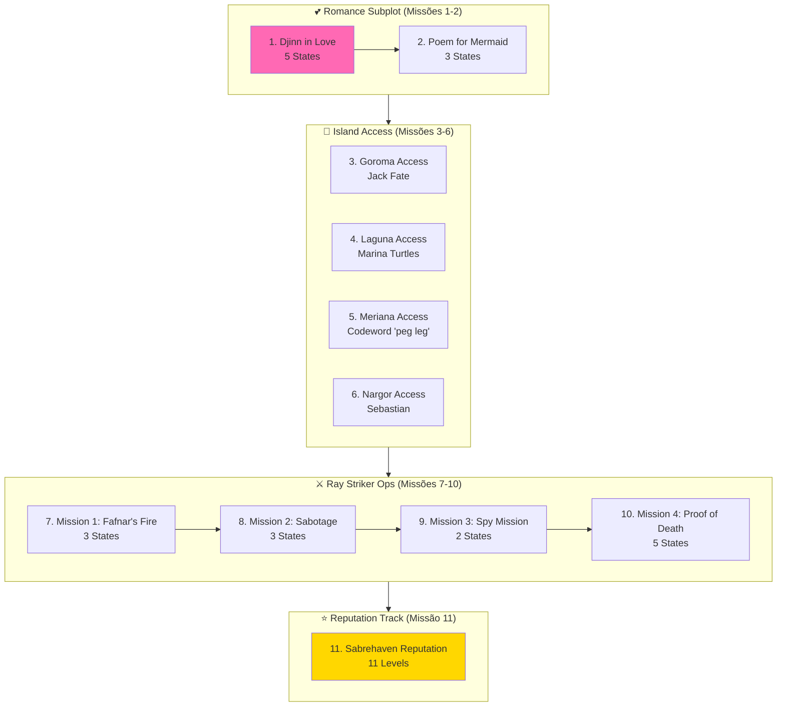

import { Aside, Card } from '@astrojs/starlight/components';

## 🛠️ Informações do Arquivo

Sistema híbrido combinando romance narrativo, operações militares e rastreamento de reputação em 11 missões.

<Card title="Caminho Original" icon="document">
  data-otservbr-global/lib/core/quests/catalog/025_the_shattered_isles.lua
</Card>

<Aside type="tip">
  **Quest IDs:** 10271-10280 | **Tipo:** Hybrid System | **Dificuldade:** Média | **Missões:** 11
</Aside>

---

## 📄 Visão Geral do Código

**The Shattered Isles** é uma questline inovadora que combina **três subsistemas distintos**: romance narrativo (Djinn love story), operações militares (Ray Striker missions), e sistema de reputação (Sabrehaven tracking). Os jogadores exploram múltiplas ilhas enquanto constroem relacionamentos e acumulam reputação.

### Resumo Executivo
- **Nome da Quest:** The Shattered Isles
- **Mentor Principal:** Ray Striker (operações), Ocelus/Marina (romance)
- **Mecânica Principal:** Romance subplot, Island access gating, Reputation system, Military operations
- **Reward Sistema:** Unlock de ilhas + Acumulação de reputação (11 níveis)
- **Storage Namespace:** `Storage.Quest.U7_8.TheShatteredIsles.*`

---

## 🗺️ Estrutura Tripartida

### Visão Geral das Missões



### Detalhamento das Missões

| # | Missão | Quest ID | Estados | Tipo | Mecânica Especial |
|---|--------|----------|---------|------|-------------------|
| 1 | Djinn in Love | 10271 | 1 → 5 | Romance | Ocelus/Marina choice |
| 2 | Poem for Mermaid | 10272 | 1 → 3 | Romance/Break Spell | Magic interaction |
| 3 | Goroma Access | 10273 | (desc) | Access-Only | Description quest, state=1 |
| 4 | Laguna Access | 10274 | (desc) | Access-Only | Description quest, state=1 |
| 5 | Meriana Access | 10275 | (desc) | Access-Only | Codeword unlock, state=1 |
| 6 | Nargor Access | 10276 | (desc) | Access-Only | Sebastian contact, state=1 |
| 7 | Ray's Mission 1 | 10277 | 1 → 3 | Deception Task | Infiltration mission |
| 8 | Ray's Mission 2 | 10278 | 1 → 3 | Sabotage | Catapult destruction |
| 9 | Ray's Mission 3 | 10279 | 1 → 2 | Spy Mission | Tavern espionage |
| 10 | Ray's Mission 4 | 10280 | 1 → 5 | Proof Task | Pillow trick mechanic |
| 11 | Sabrehaven Rep | (varied) | 1 → 11 | Progression | Reputation levels |

---

## 🎯 Três Subsistemas

### 1. 💕 Romance Narrative (Missões 1-2)

**Context:** Ocelus, um Djinn, está apaixonado por Marina, uma sereia. Os jogadores devem ajudá-los a superar obstáculos mágicos.

```lua
Estado 1 (M1): "Ocelus pede ajuda com seu amor"
Estado 2 (M1): "Conhecer Marina"
Estado 3 (M1): "Discover the love curse"
Estado 4 (M1): "Break the curse together"
Estado 5 (M1): "Ocelus e Marina unified"

-- Missão 2: Breaking the magical barrier
```

**Reward:** Acesso às próximas fases (access quests desbloqueadas)

### 2. 🔐 Access Quest System (Missões 3-6)

**Inovação Importante:** Estas missões são **description-only**, não possuem progressão de estados:

```lua
-- Características únicas:
- startValue = 1
- endValue = 1 (mesmo valor!)
- states = { [1] = "Description text only" }
-- Essencialmente: "Leia isto para desbloquear acesso"
```

**Ilhas e Contatos:**
| Ilha | NPC | Método de Acesso | Quest ID |
|------|-----|------------------|----------|
| Goroma | Jack Fate | Contact NPC | 10273 |
| Laguna | Marina | Turtle interaction | 10274 |
| Meriana | (Multiple) | Codeword "peg leg" | 10275 |
| Nargor | Sebastian | Meeting with pirate captain | 10276 |

### 3. ⚔️ Ray Striker Operations (Missões 7-10)

**Context:** Ray Striker, comandante pirata, requisita operações covert:

**Missão Structure:**
- **Mission 1 (Fafnar's Fire):** Deceptive infiltration at dragon camp
- **Mission 2 (Sabotage):** Destroy enemy catapult
- **Mission 3 (Spy Mission):** Tavern intelligence gathering (shortest: 2 states)
- **Mission 4 (Proof of Death):** Elaborate "pillow trick" to fake death (longest: 5 states)

### 4. ⭐ Sabrehaven Reputation System (Missão 11)

**11-Level Progression:**

```lua
Level 1-3: Low standing (newbie status)
Level 4-6: Medium standing (accepted)
Level 7-9: High standing (respected)
Level 10-11: Legendary standing (war hero)
```

Cada nível tem seu próprio estado e descrição única. Sistema de reputação incremental baseado em operações completadas.

---

## 🔄 Mecânicas Especiais

### Access-Only Quests
Uma inovação única no sistema Canary:
```lua
-- Exemplo: Goroma Access
[3] = {
  name = "Goroma Access",
  startValue = 1,
  endValue = 1,  -- Mesmo endpoint!
  states = {
    [1] = "You have access to Goroma. Jack Fate will guide you..."
  }
}
-- Uma simples descrição para unlock de área
```

### Description Functions
Algumas missões usam funções Lua para descrições dinâmicas:
```lua
description = function(player)
  return string.format("Reputation: %d/11", player:getStorageValue(...))
end
```

---

## 📊 Storage Mapping

```lua
Storage.Quest.U7_8.TheShatteredIsles = {
  DjinnInLove = 50800,           -- Missão 1
  PoemForMermaid = 50801,        -- Missão 2
  GaromaAccess = 50802,          -- Missão 3 (access-only)
  LagunaAccess = 50803,          -- Missão 4 (access-only)
  MerianaAccess = 50804,         -- Missão 5 (access-only)
  NargorAccess = 50805,          -- Missão 6 (access-only)
  RayMission1 = 50806,           -- Missão 7
  RayMission2 = 50807,           -- Missão 8
  RayMission3 = 50808,           -- Missão 9
  RayMission4 = 50809,           -- Missão 10
  SabrehravenReputation = 50810, -- Missão 11
}
```

---

## 🎮 Notas de Implementação

### Requisitos de Acesso
- **Nível Recomendado:** 35+
- **Pré-requisitos:** Nenhum
- **Ferramentas:** Depends on specific missions

### NPCs Críticos
- **Ocelus:** Djinn (amor)
- **Marina:** Sereia (amada)
- **Ray Striker:** Pirate commander
- **Jack Fate, Sebastian:** Island contact points

### Localizações
- **Goroma, Laguna, Meriana, Nargor:** 4 ilhas exploráveis
- **Sabrehaven:** Base pirata
- **Various Dungeons:** Para operações

---

## 🤖 Informações da Documentação

**Data da Última Atualização:** 2024  
**Versão Documentada:** Canary (OTServBR-Global)  
**Status:** ✅ Completo  
**Revisor:** GitHub Copilot

---
