import { Aside, Card } from '@astrojs/starlight/components';

## 🛠️ Informações do Arquivo

Questline de crime e intriga focada em roubo, furto, chantagem com 8 missões progressivas.

<Card title="Caminho Original" icon="document">
  data-otservbr-global/lib/core/quests/catalog/026_the_thieves_guild.lua
</Card>

<Aside type="tip">
  **Quest IDs:** 10281-10287 | **Tipo:** Crime & Intrigue | **Dificuldade:** Média-Alta | **Missões:** 8
</Aside>

---

## 📄 Visão Geral do Código

**The Thieves Guild** é uma questline temática focada em atividades criminosas: roubo, furto, chantagem e intriga. Os jogadores trabalham sob a mentoria do **Dorian**, mestre da guilda, completando crimes progressivamente mais complexos. O auge é o acesso ao trader **Black Bert** após completar todas as missões.

### Resumo Executivo
- **Nome da Quest:** The Thieves Guild
- **Mentor Principal:** Dorian (Guild Master)
- **Mecânica Principal:** Theft coordination, Multi-NPC chains, Document forgery, Blackmail
- **Reward Sistema:** Access merchant (Black Bert) após conclusão
- **Storage Namespace:** `Storage.Quest.U8_2.TheThievesGuildQuest.*`

---

## 🗺️ Estrutura das Missões

### Progressão Visual

```mermaid
graph LR
    M1["1. Ivory Poaching<br/>2 States"] -->
    M2["2. Burglary<br/>3 States"] -->
    M3["3. Invitation<br/>3 States"] -->
    M4["4. Bridge Robbery<br/>8 States<br/>Multi-NPC Chain"]
    
    M4 -->
    M5["5. Enforcing Debts<br/>2 States"] -->
    M6["6. Fishnapping<br/>4 States<br/>Key Dependency"] -->
    M7["7. Blackmail<br/>2 States"] -->
    M8["8. Message<br/>3 States<br/>Final: Black Bert"]
    
    style M1 fill:#2F4F4F
    style M8 fill:#1C1C1C
```



### Detalhamento das Missões

| # | Missão | Quest ID | Estados | Mecânica | Complexidade |
|---|--------|----------|---------|----------|--------------|
| 1 | Ivory Poaching | 10281 | 1 → 2 | Hunt elephants (10 tusks) | ⭐ Baixa |
| 2 | Burglary | 10282 | 1 → 3 | Steal vase from Sarina | ⭐⭐ Média |
| 3 | Invitation | 10283 | 1 → 3 | Convince Oswald (social) | ⭐⭐ Média |
| 4 | Bridge Robbery | 10284 | 1 → 8 | Multi-NPC chain (forger) | ⭐⭐⭐⭐ Muito Alta |
| 5 | Enforcing Debts | 10285 | 1 → 2 | Retrieve goblet | ⭐ Baixa |
| 6 | Fishnapping | 10286 | 1 → 4 | Steal fish (key req) | ⭐⭐ Média |
| 7 | Blackmail | 10287 | 1 → 2 | Get compromising letter | ⭐⭐ Média |
| 8 | Message | (final) | 1 → 3 | Dark cathedral delivery | ⭐⭐ Média |

---

## 🎯 Fluxo de Jogo

### Fase 1: Simple Crimes (Missões 1-3)
- **Objetivo:** Aprender técnicas básicas de roubo
- **Mecânica:** Hunt, Burglary, Social manipulation
- **Dificuldade:** Baixa a Média
- **NPCs Simples:** Sarina, Oswald

### Fase 2: Complex Heist (Missão 4 - Bridge Robbery)
- **Objetivo:** Executar o roubo mais complexo da guilda
- **Mecânica:** Multi-stage NPC coordination
- **Cadeia de NPCs:** Snake Eye → Ahmet → Percybald → Nurik
- **Dificuldade:** Muito Alta
- **Estados:** 8 estados progressivos com passos específicos

### Fase 3: Advanced Operations (Missões 5-8)
- **Objetivo:** Operações avançadas e finalização
- **Missão 6:** Requer key de Chantalle (dependency)
- **Missão 8:** Entrega final no Dark Cathedral
- **Reward:** Unlock Black Bert trader

---

## 🔄 Mecânicas Especiais

### Bridge Robbery - Epic Multi-NPC Chain

A Missão 4 é notável por sua complexidade narrativa:

```lua
-- Estados do Bridge Robbery (8 total):
Estado 1: Conversar com Dorian (início)
Estado 2: Contatar Snake Eye (fencing)
Estado 3: Snake Eye envia para Ahmet (intermediário)
Estado 4: Ahmet envia para Percybald (forger maestro)
Estado 5: Percybald cria documentos falsos
Estado 6: Documentos prontos, retorna a Dorian
Estado 7: Planejamento final com Nurik
Estado 8: Roubo executado com sucesso
```

**NPC Coordination Pattern:**
```
Player → Snake Eye → Ahmet → Percybald → Nurik → Mission Complete
```

Cada NPC representa um papel na organização criminosa.

### Fishnapping - Item Dependency System

A Missão 6 (Fishnapping) implementa um requisito de item:

```lua
-- Estado 1: "Steal Theodore's fish"
-- REQUIREMENT: Obter chave de Chantalle (item separado)
-- Estado 2: Abrir aquário com chave
-- Estado 3: Roubar peixe (Theodore's fish)
-- Estado 4: Retornar para Dorian

-- Key dependency:
-- player:getStorageValue(Storage.Key.Chantalle) needed
```

### Blackmail Information Gathering

A Missão 7 requer encontrar informações comprometedoras:

```lua
-- Mecânica: Encontrar uma carta/evidência
-- que possa ser usada para chantagem
-- Implementado como simple item quest
```

---

## 📊 NPC Map - Bridge Robbery

```mermaid
graph LR
    A["Player<br/>(Thief)"]
    B["Snake Eye<br/>(Fence)"]
    C["Ahmet<br/>(Intermediary)"]
    D["Percybald<br/>(Document Forger)"]
    E["Nurik<br/>(Security Expert)"]
    F["Dorian<br/>(Guild Master)"]
    
    A -->|Contact| B
    B -->|Refer| C
    C -->|Refer| D
    D -->|Create Documents| E
    E -->|Plan Robbery| F
    
    style A fill:#FF6347
    style F fill:#4B0000
```



---

## 📊 Storage Mapping

```lua
Storage.Quest.U8_2.TheThievesGuildQuest = {
  IvoryPoaching = 50400,       -- Missão 1
  Burglary = 50401,            -- Missão 2
  Invitation = 50402,          -- Missão 3
  BridgeRobbery = 50403,       -- Missão 4 (Epic)
  EnforcingDebts = 50404,      -- Missão 5
  Fishnapping = 50405,         -- Missão 6
  Blackmail = 50406,           -- Missão 7
  Message = 50407,             -- Missão 8 (Final)
}

-- Item Dependencies
Storage.Key.Chantalle = 12345  -- Needed for Missão 6
```

---

## 🎮 Notas de Implementação

### Requisitos de Acesso
- **Nível Recomendado:** 40+
- **Pré-requisitos:** Nenhum
- **Alignment:** Crime-aligned characters (no good alignment)

### NPCs Críticos

| NPC | Função | Missão |
|-----|--------|--------|
| Dorian | Guild Master (starter/mentor) | 1-8 |
| Sarina | Vítima de burglary | 2 |
| Oswald | Social manipulation target | 3 |
| Snake Eye | Fence/Fencer | 4 |
| Ahmet | Intermediário | 4 |
| Percybald | Forger de documentos | 4 |
| Nurik | Security expert | 4 |
| Chantalle | Key holder | 6 |
| Black Bert | Final reward merchant | 8 (unlock) |

### Localizações Críticas
- **Guild Hall:** Dorian base
- **Various Houses:** Burglary/Theft locations
- **Outlaw Camp:** Snake Eye location
- **Forger Workshop:** Percybald location
- **Dark Cathedral:** Final message delivery

---

## 🤖 Informações da Documentação

**Data da Última Atualização:** 2024  
**Versão Documentada:** Canary (OTServBR-Global)  
**Status:** ✅ Completo  
**Revisor:** GitHub Copilot

---
