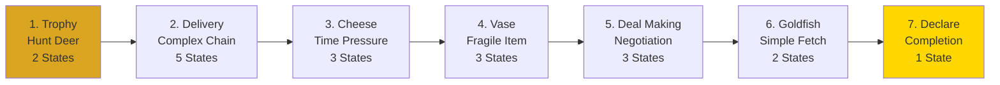
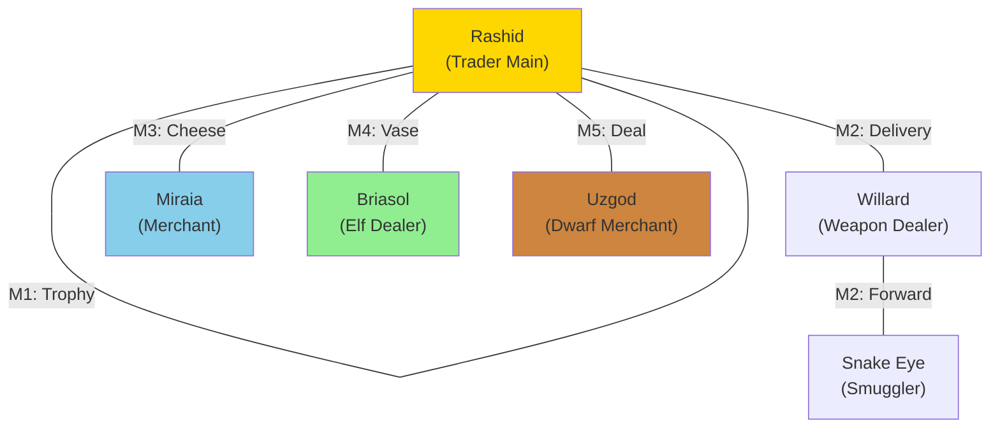

import { Aside, Card } from '@astrojs/starlight/components';

## 🛠️ Informações do Arquivo

Questline comercial com 7 missões focadas em aprender habilidades de negócio com o viajante Rashid.

<Card title="Caminho Original" icon="document">
  data-otservbr-global/lib/core/quests/catalog/027_the_travelling_trader_quest.lua
</Card>

<Aside type="tip">
  **Quest IDs:** 10288-10294 | **Tipo:** Trading | **Dificuldade:** Baixa | **Missões:** 7
</Aside>

---

## 📄 Visão Geral do Código

**The Travelling Trader Quest** é uma questline comercial focada em aprender habilidades de negócio. Os jogadores trabalham com **Rashid**, o viajante comerciante nômade, completando sete tarefas progressivas de comércio. Ao final, ganham o título de "recognized trader" e acesso ilimitado aos serviços de Rashid.

### Resumo Executivo
- **Nome da Quest:** The Travelling Trader Quest
- **Mentor Principal:** Rashid (Travelling Salesman)
- **Mecânica Principal:** Fetch quests, Commerce tasks, NPC locating
- **Reward Sistema:** Trader status + Permanent Rashid access
- **Storage Namespace:** `Storage.Quest.U8_1.TheTravellingTrader.*`

---

## 🗺️ Estrutura das Missões

### Progressão Visual



### Detalhamento das Missões

| # | Missão | Quest ID | Estados | Mecânica | Itens |
|---|--------|----------|---------|----------|-------|
| 1 | Trophy | 10288 | 1 → 2 | Hunt deer trophy | Deer Trophy |
| 2 | Delivery | 10289 | 1 → 5 | Complex supply chain | Package (intermediários) |
| 3 | Cheese | 10290 | 1 → 3 | Time-sensitive delivery | Scarab Cheese |
| 4 | Vase | 10291 | 1 → 3 | Fragile item transport | Elven Vase |
| 5 | Deal Making | 10292 | 1 → 3 | Price negotiation | Crimson Sword (&lt;400g) |
| 6 | Goldfish | 10293 | 1 → 2 | Simple fetching | Goldfish Bowl |
| 7 | Declare | 10294 | 1 → 1 | Final completion | (narrative) |

---

## 🎯 Fluxo de Jogo

### Fase 1: Resource Gathering (Missões 1-2)
- **Objetivo:** Obter recursos específicos (trophy, delivery package)
- **Mecânica:** Hunt físico + NPC chain navigation
- **Missão 2:** Complexa - Willard → Snake Eye → Outlaw Camp → Back to Rashid
- **Dificuldade:** Baixa a Média

### Fase 2: Commerce Tasks (Missões 3-5)
- **Objetivo:** Aprender nuances do comércio a longa distância
- **Missão 3:** Time pressure (cheese rots em high temperature)
- **Missão 4:** Handling fragile goods (vase fractures em queda)
- **Missão 5:** Negotiation skills (comprar espada por < 400g)
- **Dificuldade:** Média

### Fase 3: Master Trader Status (Missões 6-7)
- **Objetivo:** Finalizar treinamento e ganhar confiança de Rashid
- **Missão 6:** Simple item fetching (consolidation)
- **Missão 7:** Final narrative declaration
- **Reward:** Permanent trader status

---

## 🔄 Mecânicas Especiais

### Mission 2 - Complex Supply Chain Navigation

```lua
-- Estados progressivos do delivery:
Estado 1: "Get package from Willard at Edron"
Estado 2: "Willard tells you to get from Snake Eye at Outlaw Camp"
Estado 3: "Pick up package from Snake Eye (next door)"
Estado 4: "Bring package back to Rashid"
Estado 5: "Mission complete - Rashid satisfied"
```

**NPC Chain:**
```
Rashid → Willard (Edron) → Snake Eye (Outlaw Camp) → Rashid
```

Este padrão introduz a mecânica de intermediários e supply chains.

### Mission 3 - Time Pressure Mechanic

A Missão 3 (Cheese) implementa conceito de deterioração temporal:

```lua
-- Fluff text:
"You have to be quick, Scarab cheese can rot 
 really fast in high temperature."

-- Mecânica: Jogador deve ir rápido
-- para Darashia (hot region) e voltar
-- Possível timeout/deterioration após X minutos
```

### Mission 5 - Negotiation Constraints

A Missão 5 (Deal Making) requer compra dentro de parâmetros:

```lua
-- Restrições:
- Item: Crimson Sword
- Preço máximo: 400 gold coins
- Qualidade: Must be perfect
- NPC: Uzgod

-- Mecânica: Buscar por oferta melhor
-- ou negociar desconto
```

---

## 📊 NPC Geography Map



---

## 📊 Storage Mapping

```lua
Storage.Quest.U8_1.TheTravellingTrader = {
  Mission01 = 50800,  -- Trophy
  Mission02 = 50801,  -- Delivery
  Mission03 = 50802,  -- Cheese
  Mission04 = 50803,  -- Vase
  Mission05 = 50804,  -- Deal Making
  Mission06 = 50805,  -- Goldfish
  Mission07 = 50806,  -- Declare
}
```

---

## 🎮 Notas de Implementação

### Requisitos de Acesso
- **Nível Mínimo:** 10+
- **Pré-requisitos:** Nenhum
- **Alinhamento:** Merchant-neutral

### NPCs Críticos

| NPC | Localização | Função | Missões |
|-----|-------------|--------|---------|
| Rashid | Nomadic (travels) | Mentor/Trainer | 1-7 |
| Willard | Edron | Weapon dealer | 2 |
| Snake Eye | Outlaw Camp | Smuggler | 2 |
| Miraia | Darashia | Cheese merchant | 3 |
| Briasol | Ab'Dendriel | Elf vase merchant | 4 |
| Uzgod | Kazordoon | Dwarf weapon dealer | 5 |

### Padrão de Progressão
- **Estados Curtos:** 1-3 estados (minoria)
- **Estados Médios:** 2-3 estados (maioria)
- **Estados Longos:** 5 estados máximo (Missão 2)
- **Final State:** 1 único estado (narrativa pura)

---

## 🤖 Informações da Documentação

**Data da Última Atualização:** 2024  
**Versão Documentada:** Canary (OTServBR-Global)  
**Status:** ✅ Completo  
**Revisor:** GitHub Copilot

---
