import { Aside, Card } from '@astrojs/starlight/components';

## 🛠️ Informações do Arquivo

A maior questline: 17 missões de exploração, coleta de artefatos culturais e descoberta de segredos mundiais.

<Card title="Caminho Original" icon="document">
  data-otservbr-global/lib/core/quests/catalog/028_the_explorer_society.lua
</Card>

<Aside type="tip">
  **Quest IDs:** 10295-10311 | **Tipo:** Exploration Mastery | **Dificuldade:** Média-Alta | **Missões:** 17
</Aside>

---

## 📄 Visão Geral do Código

**The Explorer Society** é uma questline épica de **17 missões distintas** centrada na exploração do mundo, coleta de artefatos culturais e descoberta de segredos antigos. Os jogadores trabalham para a **Explorer Society Representative** completando missões de pesquisa que desbloqueiam portais interdimensionais e acesso a conteúdo secreto.

### Resumo Executivo
- **Nome da Quest:** The Explorer Society
- **Mentor Principal:** Explorer Society Representative
- **Mecânica Principal:** Item collection, Spatial navigation, Portal unlocking, Artifact hunting
- **Reward Sistema:** Portal access (Astral Portals) + Item rewards + Map knowledge
- **Storage Namespace:** `Storage.Quest.U7_6.ExplorerSociety.*`
- **Total Missões:** 17 (a maior até agora!)

---

## 🗺️ Estrutura em Fases

### Phase Map

```mermaid
graph TB
    subgraph Phase1["Phase 1: Foundation (M1-2)"]
        M1["1. Joining the Explorers<br/>5 States<br/>Pickaxe quest"]
        M2["2. The Ice Delivery<br/>3 States<br/>Time pressure"]
    end
    
    subgraph Phase2["Phase 2: Specimen Collection (M3-4)"]
        M3["3. Butterfly Hunt<br/>9 States<br/>3 butterflies"]
        M4["4. Plant Collection<br/>9 States<br/>3 plants"]
    end
    
    subgraph Phase3["Phase 3: Artifact Discovery (M5-10)"]
        M5["5. Lizard Urn<br/>3 States"]
        M6["6. Bonelord Secret<br/>3 States"]
        M7["7. Orc Powder<br/>3 States"]
        M8["8. Elven Poetry<br/>3 States"]
        M9["9. Memory Stone<br/>3 States"]
        M10["10. Rune Writings<br/>3 States"]
    end
    
    subgraph Phase4["Phase 4: Advanced (M11-17)"]
        M11["11. Ectoplasm<br/>3 States<br/>Ghost hunt"]
        M12["12. Spectral Dress<br/>3 States<br/>Banshee Queen"]
        M13["13. Spectral Stone<br/>4 States<br/>Portal prep"]
        M14["14. Astral Portals<br/>1 State<br/>UNLOCK!"]
        M15["15. Island of Dragons<br/>3 States<br/>Okolnir"]
        M16["16. Ice Music<br/>3 States<br/>Resonance crystal"]
        M17["17. Undersea Kingdom<br/>3 States<br/>Calassa"]
    end
    
    Phase1 --> Phase2
    Phase2 --> Phase3
    Phase3 --> Phase4
    
    style M14 fill:#4169E1
    style M17 fill:#00CED1
```



---

## 📊 Tabela Completa de Missões

| # | Missão | Quest ID | Estados | Tipo | Localização |
|---|--------|----------|---------|------|-------------|
| 1 | Joining Explorers | 10295 | 1 → 5 | Tool gathering | Kazordoon |
| 2 | Ice Delivery | 10296 | 6 → 8 | Time pressure | Folda caves |
| 3 | Butterfly Hunt | 10297 | 9 → 17 | Specimen (3x) | Various zones |
| 4 | Plant Collection | 10298 | 18 → 26 | Specimen (3x) | Jungle areas |
| 5 | Lizard Urn | 10299 | 27 → 29 | Artifact | Tiquanda |
| 6 | Bonelord Secret | 10300 | 30 → 32 | Document | Darashia pyramid |
| 7 | Orc Powder | 10301 | 33 → 35 | Resource | Orc fort |
| 8 | Elven Poetry | 10302 | 36 → 38 | Book | Hellgate |
| 9 | Memory Stone | 10303 | 39 → 41 | Artifact | Edron ruins |
| 10 | Rune Writings | 10304 | 42 → 44 | Documentation | Banuta |
| 11 | Ectoplasm | 10305 | 45 → 47 | Ghost essence | Ghost spawn |
| 12 | Spectral Dress | 10306 | 48 → 50 | NPC loot | Ghostlands |
| 13 | Spectral Stone | 10307 | 51 → 55 | Portal prep | 2 bases |
| 14 | Astral Portals | 10308 | 56 → 56 | UNLOCK | Portal activation |
| 15 | Island of Dragons | 10309 | 57 → 59 | Exploration | Okolnir |
| 16 | Ice Music | 10310 | 60 → 62 | Sound recording | Hrodmir |
| 17 | Undersea Kingdom | 10311 | 1 → 3 | Shipwreck | Calassa |

---

## 🎯 Sistema de Fases

### Phase 1: Foundation & Skills (M1-2)
- **Objetivo:** Aprender equipamentos e técnicas básicas
- **Pickaxe Task:** Uzgod holds key tool
- **Family Brooch Chain:** Mission 1 involves Dwacatra rescue
- **Ice Delivery Mechanic:** 10-minute timer (defrosts if too slow)

### Phase 2: Specimen Mastery (M3-4)
- **Butterfly Hunt (9 estados):** Coleta progressiva
  - Purple butterfly (prep kit #1)
  - Blue butterfly (prep kit #2)
  - Red butterfly (prep kit #3)
  
- **Plant Collection (9 estados):** Similar pattern
  - Jungle Bells
  - Witches Cauldron
  - Giant Jungle Rose

### Phase 3: Cultural Artifacts (M5-10)
- **6 Artifact Quests** - Each ~3 states
- **Localizações Mundiais:** Tiquanda, Darashia, Orc Fort, Hellgate, Edron, Banuta
- **Tema:** Coletar artefatos culturais de diferentes civilizações

**Artifacts:**
| Artefato | Cultura | Localização |
|----------|---------|-------------|
| Lizard Urn | Reptilian | Tiquanda temple |
| Wrinkled Parchment | Bonelord | Darashia pyramid |
| Strange Powder | Orcish | Orc training fort |
| Elven Poetry Book | Elven | Hellgate |
| Memory Stone | Ancient | Edron ruins |
| Rune Writings | Prehistoric | Banuta catacombs |

### Phase 4: Spectral & Portal (M11-17)
- **Spectral Collection (M11-13):** Fase paranormal
  - Ectoplasm gathering (do ghosts)
  - Spectral dress (de Banshee Queen)
  - Spectral essence (para carving activation)

- **Portal Unlock (M14):** Única missão de 1 estado
  - Requer tanto "Orichalcum Pearl" como energia
  - Ativa viagem interdimensional

- **Post-Portal Exploration (M15-17):** Acesso a 3 regiões finais
  - Okolnir (dragon evidence)
  - Hrodmir (sound recording)
  - Calassa (sunken shipwrecks)

---

## 🔄 Mecânicas Especiais

### 1. State Numbering System
A quest usa **numeração não-sequencial**:
```lua
-- Exemplo: Ice Delivery
startValue = 6  -- Começa com 6, não 1!
endValue = 8,
states = {
  [6] = "State 6 text...",
  [7] = "State 7 text...",
  [8] = "State 8 text...",
}
```

Este sistema permite compatibilidade com outras quests que compartilham storage base.

### 2. Multi-Step Collection Sequences

**Butterfly Hunt Pattern (9 états):**
```lua
[9] = "Get prep kit for PURPLE butterfly"
[10] = "Return prepared butterfly"
[11] = "Ask for another"
[12] = "Get prep kit for BLUE butterfly"
[13] = "Return prepared butterfly"
[14] = "Ask for another"
[15] = "Get prep kit for RED butterfly"
[16] = "Return prepared butterfly"
[17] = "Complete - you collected all 3"
```

### 3. Portal Activation Mechanics

**Mission 14 - Astral Portals (1 state):**
```lua
[56] = "Both carvings now charged and harmonised. 
        You can travel from base to base instantly 
        if you have an orichalcum pearl for power."
```

**Requirement:** Orichalcum Pearl (item power source)

### 4. Location-Based Puzzles

**Mission 13 - Spectral Stone (4 states):**
- Estado 51: Go to second base (mail request)
- Estado 52: Confirm mail sent
- Estado 53: Use spectral essence on carving (Main base)
- Estado 54: Use spectral essence on carving (Second base)

---

## 📊 Storage Mapping

```lua
Storage.Quest.U7_6.ExplorerSociety = {
  QuestLine = 50600,              -- Main start storage
  JoiningTheExplorers = 50601,    -- M1
  TheIceDelivery = 50602,         -- M2
  TheButterflyHunt = 50603,       -- M3
  ThePlantCollection = 50604,     -- M4
  TheLizardUrn = 50605,           -- M5
  TheBonelordSecret = 50606,      -- M6
  TheOrcPowder = 50607,           -- M7
  TheElvenPoetry = 50608,         -- M8
  TheMemoryStone = 50609,         -- M9
  TheRuneWritings = 50610,        -- M10
  TheEctoplasm = 50611,           -- M11
  TheSpectralDress = 50612,       -- M12
  TheSpectralStone = 50613,       -- M13
  TheAstralPortals = 50614,       -- M14
  TheIslandofDragons = 50615,     -- M15
  TheIceMusic = 50616,            -- M16
  CalassaQuest = 50617,           -- M17
}
```

---

## 🎮 Notas de Implementação

### Requisitos de Acesso
- **Nível Recomendado:** 45+
- **Habilidades:** Travel, Dungeon navigation
- **Tempo Estimado:** 10+ horas (17 missões)

### NPCs Críticos

| NPC | Função | Missões |
|-----|--------|---------|
| Explorer Rep | Quest giver principal | 1-16 |
| Uzgod | Pickaxe source | 1 |
| Buddel | Dragon lore guide | 15 |
| Lurik | Portal master | 14-16 |
| Berenice | Calassa coordinator | 17 |
| Captain Max | Calassa transport | 17 |

### Critical Items
- **Orichalcum Pearl:** Portal power (M14)
- **Ice Pick:** Ice delivery (M2)
- **Prep Kits:** Specimen collection (M3-4)
- **Botanist's Container:** Plant gathering (M4)
- **Resonance Crystal:** Sound recording (M16)

---

## 🤖 Informações da Documentação

**Data da Última Atualização:** 2024  
**Versão Documentada:** Canary (OTServBR-Global)  
**Status:** ✅ Completo  
**Revisor:** GitHub Copilot

---
