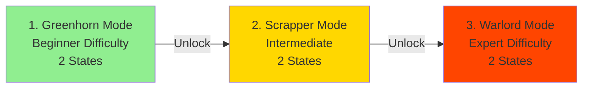

import { Aside, Card } from '@astrojs/starlight/components';

## 🛠️ Informações do Arquivo

Sistema de Barbarian Arena com 3 níveis de dificuldade progressivos (Greenhorn, Scrapper, Warlord).

<Card title="Caminho Original" icon="document">
  data-otservbr-global/lib/core/quests/catalog/029_the_ultimate_challenges.lua
</Card>

<Aside type="tip">
  **Quest IDs:** 10312-10314 | **Tipo:** Arena Battle | **Dificuldade:** Muito Alta | **Missões:** 3
</Aside>

---

## 📄 Visão Geral do Código

**The Ultimate Challenges** é uma questline focada em **Barbarian Arena**, um sistema de batalhas progressivas com três níveis de dificuldade. Os jogadores enfrentam ondas crescentes de inimigos, desbloqueando modos mais desafiadores conforme avançam.

### Resumo Executivo
- **Nome da Quest:** The Ultimate Challenges
- **Mentor Principal:** Arena Master (implied)
- **Mecânica Principal:** Boss rush waves, Difficulty progression, Combat endurance
- **Reward Sistema:** Mode completions unlock harder content
- **Storage Namespace:** `Storage.Quest.U8_0.BarbarianArena.*`
- **Total Missões:** 3 (simples mas intensa)

---

## 🗺️ Estrutura das Missões

### Progressão Visual



### Detalhamento das Missões

| # | Missão | Quest ID | Dificuldade | Estados | Inimigos |
|---|--------|----------|------------|---------|----------|
| 1 | Greenhorn Mode | 10312 | ⭐ Fácil | 1 → 2 | Weak creatures |
| 2 | Scrapper Mode | 10313 | ⭐⭐⭐ Médio | 1 → 2 | Moderate foes |
| 3 | Warlord Mode | 10314 | ⭐⭐⭐⭐⭐ Muito Difícil | 1 → 2 | Epic bosses |

---

## 🎯 Sistema de Arenas

### Arena Structure

Cada modo segue o padrão idêntico:
```lua
{
  name = "[Mode Name]",
  storageId = Storage.Quest.U8_0.BarbarianArena.QuestLog[Mode],
  missionId = 10312 + (index - 1),
  startValue = 1,
  endValue = 2,
  states = {
    [1] = "You have to defeat all enemies in this mode.",
    [2] = "You have defeated all enemies in this mode.",
  },
}
```

### Progressão de Dificuldade

**Greenhorn Mode (Beginner)**
- Inimigos fracs ou nível 1-10
- Padrão: Walk-throughs ou combate básico
- Objetivo: Tutorial para a mecânica de arena

**Scrapper Mode (Intermediate)**
- Inimigos moderados (nível 20-30)
- Padrão: Múltiplas ondas
- Objetivo: Teste de resistência

**Warlord Mode (Expert)**
- Inimigos épicos/bosses (nível 50+)
- Padrão: Confrontação final
- Objetivo: Teste ultimate de skill

---

## 🔄 Mecânicas Especiais

### Boss Rush Pattern

Cada modo implementa um padrão "wave-based":
```
State 1: "You have to defeat all enemies in this mode."
         ↓
         [Player fights wave 1, 2, 3, ...]
         ↓
State 2: "You have defeated all enemies in this mode."
         [Storage updated to 2]
```

### No Complex Sub-States

Diferente de outras quests com múltiplos estados intermediários, este sistema é **simples**:
- Start (state 1): início do challenge
- Complete (state 2): todos inimigos derrotados

Não há contador de progresso ou estados intermediários.

---

## 📊 Storage Mapping

```lua
Storage.Quest.U8_0.BarbarianArena = {
  QuestLogGreenhorn = 52000,  -- Mode 1 storage
  QuestLogScrapper = 52001,   -- Mode 2 storage
  QuestLogWarlord = 52002,    -- Mode 3 storage
}
```

---

## 🎮 Notas de Implementação

### Requisitos de Acesso
- **Greenhorn:** Nível 10+
- **Scrapper:** Nível 30+
- **Warlord:** Nível 50+
- **Pré-requisitos:** Completar modo anterior para desbloquear próximo

### Mecânica de Combate

**System Patterns:**
1. Jogador entra em arena isolada
2. Ondas de inimigos aparecem sequencialmente
3. Cada onda mais forte que anterior
4. Após todas ondas vencidas: Storage = 2 (completo)

**Wave Structure (generalizado):**
```
Greenhorn:  3-5 waves de creatures fracas
Scrapper:   5-7 waves de creatures moderadas
Warlord:    7+ waves de bosses épicos
```

### Acesso Sequencial


---

## 📊 Comparação com Outros Quest Types

| Feature | Other Quests | Barbarian Arena |
|---------|-------------|-----------------|
| Estados | 2-17+ | 2 only |
| Submissões | Múltiplas | 3 minimalista |
| Contador | Frequente | Nenhum |
| NPCs | Múltiplos | Arena master (implied) |
| Narrativa | Detalhada | Mínima |
| Foco | Exploração/Commerce | Combat puro |

---

## 🤖 Informações da Documentação

**Data da Última Atualização:** 2024  
**Versão Documentada:** Canary (OTServBR-Global)  
**Status:** ✅ Completo  
**Revisor:** GitHub Copilot

---
