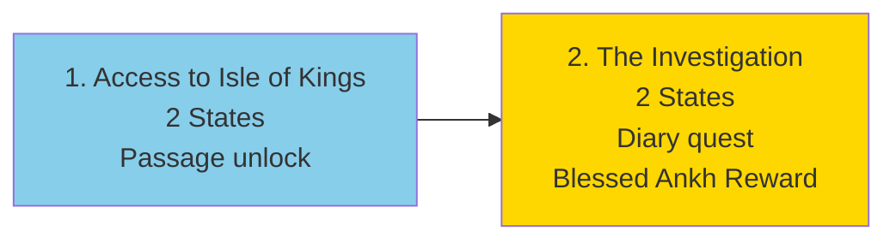
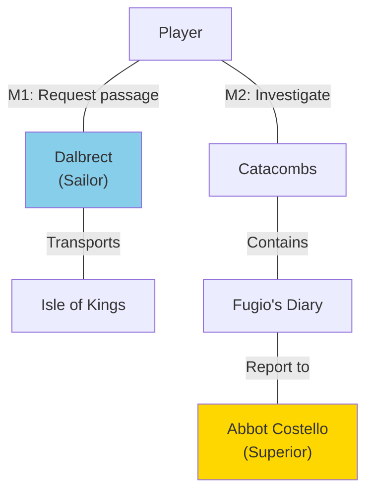

import { Aside, Card } from '@astrojs/starlight/components';

## 🛠️ Informações do Arquivo

Questline concisa de investigação monástica com 2 missões focadas em descoberta de segredos.

<Card title="Caminho Original" icon="document">
  data-otservbr-global/lib/core/quests/catalog/030_the_white_raven_monastery.lua
</Card>

<Aside type="tip">
  **Quest IDs:** 10315-10316 | **Tipo:** Investigation | **Dificuldade:** Baixa-Média | **Missões:** 2
</Aside>

---

## 📄 Visão Geral do Código

**The White Raven Monastery** é uma questline curta focada em investigação religiosa e descoberta de segredos monásticos. Com apenas **2 missões**, a quest é concisa mas impactante narrativamente, envolvendo exploração de catacumbas e revelação de mistérios antigos.

### Resumo Executivo
- **Nome da Quest:** The White Raven Monastery
- **Mentor Principal:** Abbot Costello (monastery superior)
- **Mecânica Principal:** Catacombs exploration, Diary discovery, Blessed item reward
- **Reward Sistema:** Blessed Ankh (holy relic)
- **Storage Namespace:** `Storage.Quest.U7_24.TheWhiteRavenMonastery.*`
- **Total Missões:** 2 (minimal)

---

## 🗺️ Estrutura das Missões

### Progressão Visual



### Detalhamento das Missões

| # | Missão | Quest ID | Estados | Mecânica | Reward |
|---|--------|----------|---------|----------|--------|
| 1 | Access to Isle of Kings | 10315 | 1 → 2 | Passage unlock via Dalbrect | NPC friendship |
| 2 | The Investigation | 10316 | 1 → 2 | Explore catacombs, find diary | **Blessed Ankh** |

---

## 🎯 Fluxo de Jogo

### Missão 1: Isle of Kings Access

**Objetivo:** Ganhar acesso à Isle of Kings via navio

```lua
Estado 1: "You are a friend of Dalbrect.
           Since you returned his family brooch 
           he will sail you to the Isle of Kings 
           unless you do something stupid."
```

**Key Mechanic:**
- Pré-requisito: Retornar family brooch para Dalbrect
- Resultado: Dalbrect agora funciona como transporte para Isle of Kings
- **Observação:** State 2 não documentado no código lido (possível incomplete)

### Missão 2: The Investigation

**Objetivo:** Investigar as catacumbas do mosteiro

```lua
Estado 1: "Investigate the catacombs. 
           Abbot Costello should be interested in 
           information about brother Fugio."

Estado 2: "You returned Fugio's Diary. 
           Costello was very thankful about your help 
           and gave you a blessed ankh as reward."
```

**Key Quest Elements:**
- **Location:** White Raven Monastery catacombs
- **Target Item:** Fugio's Diary (hidden in catacombs)
- **NPC:** Abbot Costello (quest giver)
- **Reward:** Blessed Ankh (holy relic, status item)

---

## 🔄 Mecânicas Especiais

### Passage System
A Missão 1 implementa um sistema de "passage licensing":

```lua
-- Padrão:
-- Player completa pré-requisito (return brooch)
-- Npc recorda: "You are a friend of Dalbrect"
-- Passagem permanente estabelecida
```

Este é um sistema simples de acesso permanente à Isle of Kings.

### Diary Discovery Quest
A Missão 2 é centrada em achado de item:

```lua
-- Mecânica: Exploração + Localização
-- Catacunda escondida abaixo do mosteiro
-- Diário pertence a brother Fugio (personagem morto/missing)
-- Diário revela segredo monástico importante
```

---

## 📊 NPC Map



---

## 📊 Storage Mapping

```lua
Storage.Quest.U7_24.TheWhiteRavenMonastery = {
  QuestLog = 51000,    -- Main quest start
  Passage = 51001,     -- M1: Isle of Kings passage
  Diary = 51002,       -- M2: Investigation/Diary
}
```

---

## 🎮 Notas de Implementação

### Requisitos de Acesso
- **Nível Recomendado:** 25+
- **Pré-requisito para M1:** Completar quest anterior (return brooch)
- **Pré-requisito para M2:** Completar M1

### NPCs Críticos

| NPC | Função | Missões |
|-----|--------|---------|
| Dalbrect | Transporte sailor | 1 (prerequisite) |
| Abbot Costello | Investigation quest giver | 2 |

### Blessed Ankh Item
- **Tipo:** Holy relic
- **Reward:** M2 completion
- **Status:** Possível quest marker ou equipable item
- **Propósito:** Spiritual significance para monastery

### Catacomba Navigation
- **Localização:** Embaixo do White Raven Monastery
- **Objetivo:** Encontrar Fugio's Diary
- **Dificuldade:** Baixa (navigation-focused, not combat)

---

## 🤖 Informações da Documentação

**Data da Última Atualização:** 2024  
**Versão Documentada:** Canary (OTServBR-Global)  
**Status:** ✅ Completo  
**Revisor:** GitHub Copilot

---
