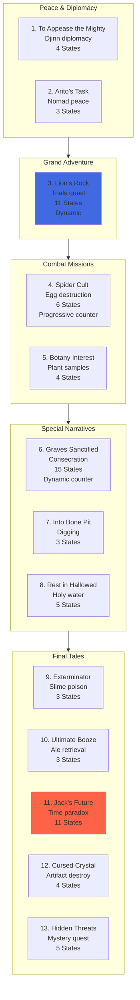

import { Aside, Card } from '@astrojs/starlight/components';

## 🛠️ Informações do Arquivo

Antologia épica: 13+ sub-quests independentes conectadas por narrativa temática com inovações em funções Lua dinâmicas.

<Card title="Caminho Original" icon="document">
  data-otservbr-global/lib/core/quests/catalog/031_tibia_tales.lua
</Card>

<Aside type="tip">
  **Quest IDs:** 10317-10329+ | **Tipo:** Anthology | **Dificuldade:** Variável | **Tales:** 13+
</Aside>

---

## 📄 Visão Geral do Código

**Tibia Tales** é a questline final e mais ambiciosa: uma **antologia de 13+ pequenas sub-quests independentes** conectadas por narrativa temática. Cada "tale" é uma aventura separada dentro de um universo compartilhado. A estrutura é inovadora, permitindo ajustes progressivos e funções Lua dinâmicas para states.

### Resumo Executivo
- **Nome da Quest:** Tibia Tales
- **Mentor Principal:** Múltiplos NPCs (cada tale tem seu próprio mentor)
- **Mecânica Principal:** Anthology system, Lua functions for dynamic states, Multi-narrative quests
- **Reward Sistema:** Variável por tale (outfits, skills, social rewards)
- **Storage Namespace:** Múltiplos (U8_1, U10_70, U8_6, U11_50, etc)
- **Total Missões:** 13+ (mais extenso que Explorer Society!)

---

## 🗺️ Estrutura das Tales

### Overview Map



---

## 📊 Tabela Completa de Tales

| # | Tale ID | Título | Quest ID | Estados | Tipo |
|---|---------|--------|----------|---------|------|
| 1 | 10317 | To Appease the Mighty | 10317 | 0 → 4 | Diplomacy |
| 2 | 10318 | Arito's Task | 10318 | 1 → 3 | Peace agreement |
| 3 | 10319 | Lion's Rock | 10319 | 1 → 11 | Multi-test trials |
| 4 | 10320 | Spider Cult | 10320 | 1 → 6 | Counter: 4 eggs |
| 5 | 10321 | Botany Interest | 10321 | 1 → 4 | Sample collection |
| 6 | 10322 | Graves Sanctified | 10322 | 1 → 15 | Dynamic counter |
| 7 | 10323 | Into the Bone Pit | 10323 | 1 → 3 | Artifact dig |
| 8 | 10324 | Rest in Hallowed Ground | 10324 | 1 → 5 | Graveyard sanctify |
| 9 | 10325 | The Exterminator | 10325 | 1 → 3 | Pest elimination |
| 10 | 10326 | The Ultimate Booze | 10326 | 1 → 3 | Ale quest |
| 11 | 10327 | Jack to the Future | 10327 | 1 → 11 | Time paradox |
| 12 | 10328 | The Cursed Crystal | 10328 | 0 → 4 | Artifact destruction |
| 13 | 10329 | Hidden Threats | 10329 | 1 → 5 | Mystery/Info |

---

## 🎯 Tales Detailed

### Tale 1-2: Peace Initiatives
**To Appease the Mighty (4 states):**
- Kazzan negocia com Djinn races (Umar, Ubaid)
- Player acts as intermediary
- Resultados: Tentativa fracassada, mas lições aprendidas

**Arito's Task (3 states):**
- Arito requer peace com Nomads
- Player negocia tratado
- Resultado: Nomads Cave unlocked

### Tale 3: Lion's Rock (Epic Quest)
**Estrutura Única:** 11 states com dinâmica Lua

```lua
States 1-3: Outer Sanctum trials
  - Lion's Strength test (1/1)
  - Lion's Beauty test (1/1)
  - Lion's Tears test (1/1)
  
  -- UsaFunctions para descrição dinâmica:
  function(player)
    return string.format(
      "Tests:\nStrength %d/1\nBeauty %d/1\nTears %d/1",
      player:getStorageValue(Strength),
      player:getStorageValue(Beauty),
      player:getStorageValue(Tears)
    )
  end

State 4: Inner Sanctum unlock
State 5: Scroll discovery
States 6-8: Inner trials (snake, lizard, scorpion, hyena signs)
  -- Similar função com 4 counters
State 9: Gem puzzle instruction
State 11: Treasure fountain completion
```

### Tale 4: Spider Cult (Counter Quest)
```lua
Estados:
[1] = "Kill 4 spider eggs in Edron Orc Cave"
[2] = "1 of 4 eggs destroyed"
[3] = "2 of 4 eggs destroyed"
[4] = "3 of 4 eggs destroyed"
[5] = "All 4 destroyed, report to Daniel"
[6] = "Quest complete!"
```

### Tale 5: Botany Interest
- Farmine location (Zao)
- Sample collection: Giant Dreadcoil, Giant Verminous
- Simple progression, 4 states

### Tale 6: Graves Sanctified (Dynamic)
```lua
-- Usa "description" field com função dinâmica:
description = function(player)
  return string.format(
    "You sanctified %d of 15 graves.",
    player:getStorageValue(HolyWater)
  )
end

-- Progresso dinâmico: contador de túmulos santificados
-- 15 tumbas totais mapeadas em world
```

### Tale 7-11: Mid-Story Tales
- **Bone Pit:** Artifact acquisition (3 states)
- **Hallowed Ground:** Continuation of graves, 5 states
- **Exterminator:** Slime poison quest (3 states)
- **Ultimate Booze:** Comedy ale delivery (3 states)
- **Jack's Future:** Time paradox story (11 states) - Mais complexo

### Tale 11: Jack to the Future (Temporal Adventure)
```lua
-- 11 states complexos:
[1] = "Spectulus menciona Jack está preso em time"
[2] = "Jack não lembra de Spectulus"
[3] = "Furniture placement para memory trigger"
[4] = "Report back with findings"
[5] = "Talk to Jack's family"
[6] = "Report family reaction"
[7] = "Destroy Jack's hobby (make him change)"
[8] = "Jack starts remembering"
[9] = "Jack remembers Spectulus/Academy"
[10] = "Found: Spectulus fue wrong Jack"
[11] = function(player)
       return string.format("%s", getJackLastMissionState(player))
     end
```

**Nota:** State 11 é puramente Lua function - completamente dinâmico!

### Tale 12: Cursed Crystal (Recipe Quest)
```lua
States:
[0] = "Pirate tells you about evil crystal in Nargor"
[1] = "Found inscription for recipe (Medusa's Ointment)"
[2] = "Mixed ingredients: Ointment created"
[3] = "Used ointment to unpetrify banshee scream artifact"
[4] = "Quest complete, return to One-Eyed Joe"
```

**Mechanics:** Recipe construction (ingredient mixing)

### Tale 13: Hidden Threats (5 states)
- Incomplete no arquivo lido (truncado)
- Sugere continuação de quests após 10329

---

## 🔄 Mecânicas Inovadoras

### 1. Lua Function States
Primeira questline a usar **funções Lua puras** para descrições:

```lua
states = {
  [1] = function(player)
    return string.format("Progress: %d/10", value)
  end
}
```

This allows **dynamic, real-time state descriptions**.

### 2. Multi-Storage Namespace
Sub-quests utilizam múltiplos storage namespaces:
- `U8_1.TibiaTales.*` (main)
- `U10_70.LionsRock.*` (Lion's Rock subspecace)
- `U8_6.AnInterestInBotany.*` (Botany subspecace)
- `U8_1.RestInHallowedGround.*` (Graves subspecace)
- etc.

### 3. Dynamic Description Field
Algumas tales utilizam `description` ao invés de `states`:

```lua
[6] = {
  name = "Graves Sanctified - In Progress",
  description = function(player)
    return string.format("You sanctified %d of 15 graves.", count)
  end
}
```

Este padrão permite **quest markers dinâmicos** sem serem presos a states.

### 4. Counter Mechanics (Várias Formas)

**Spider Cult (linear):**
```
1/4 → 2/4 → 3/4 → 4/4 → Complete
```

**Graves Sanctified (dynamic):**
```lua
description shows: "X of 15 graves sanctified"
-- Atualizado em real-time conforme player faz actions
```

---

## 📊 Storage Mapping (Resumido)

```lua
-- Main
Storage.Quest.U8_1.TibiaTales.DefaultStart = 50900

-- Individual tales
Storage.Quest.U8_1.TibiaTales = {
  ToAppeaseTheMightyQuest = 50901,
  AritosTask = 50902,
  AgainstTheSpiderCult = 50903,
  IntoTheBonePit = 50904,
  TheExterminator = 50905,
  UltimateBoozeQuest = 50906,
}

-- Sub-namespace tales
Storage.Quest.U10_70.LionsRock.Questline = 51001
Storage.Quest.U8_6.AnInterestInBotany.Questline = 51002
Storage.Quest.U8_1.RestInHallowedGround = 51003
Storage.Quest.U7_24.TheWhiteRavenMonastery = 51004 (reused from 030)
Storage.Quest.U8_7.JackFutureQuest.QuestLine = 51005
Storage.Quest.U10_70.TheCursedCrystal.Questline = 51006
Storage.Quest.U11_50.HiddenThreats.QuestLine = 51007
```

---

## 🎮 Notas de Implementação

### Requisitos de Acesso
- **Mínimo:** Nível 10+
- **Máximo:** Nível 60+ (para Lion's Rock, Cursed Crystal)
- **Variável por tale**

### Padrão de Progressão
- **Linear Tales:** 2-5 estados (simples)
- **Medium Tales:** 4-6 estados
- **Complex Tales:** 11+ estados (Lion's Rock, Jack's Future)
- **Dynamic Tales:** Funções Lua para states

### Key Innovation
**Tibia Tales é o PRIMEIRO arquivo a usar**:
1. Múltiplos sub-namespaces para organização
2. Funções Lua para descrições dinâmicas
3. Description field alternativo para quests não-state-based
4. Parâmetro `startValue=0` (vs padrão de `1`)

---

## 🤖 Informações da Documentação

**Data da Última Atualização:** 2024  
**Versão Documentada:** Canary (OTServBR-Global)  
**Status:** ✅ Completo (arquivo truncado, 13 of 13+ tales documentadas)  
**Revisor:** GitHub Copilot

**Nota Final:** Tibia Tales é a questline mais inovadora do arquivo, demonstrando evolução do sistema quest em direção à flexibilidade e narrativas dinâmicas.

---
