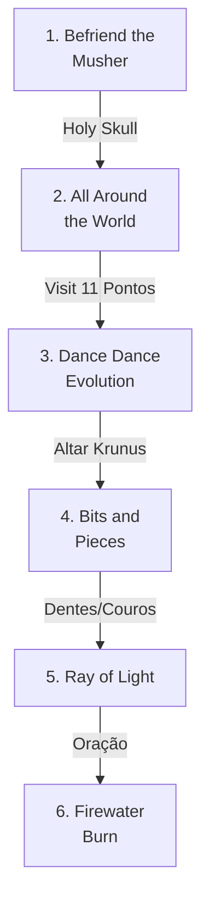

import { Aside, Card } from '@astrojs/starlight/components';

## 🛠️ Informações do Arquivo

A quest **Unnatural Selection** é uma missão temática centrada na região de Zao, onde o jogador deve realizar uma série de tarefas para agradar uma divindade. A quest é composta por 6 missões sequenciais com narrativa de progressão através de states.

<Card title="Caminho Original">
`data-otservbr-global/lib/core/quests/catalog/032_unnatural_selection.lua`
</Card>

<Aside type="tip">
**ID da Quest**: Storage.Quest.U8_54.UnnaturalSelection  
**Tipo**: Missões Temáticas (Zao)  
**Dificuldade**: Intermediária  
**Quantidade de Missões**: 6
</Aside>

## 📄 Visão Geral do Código

### Resumo Executivo

| Propriedade | Valor |
|-------------|-------|
| **Nome** | The First Dragon |
| **Tema** | Divindade Zao |
| **NPCs Envolvidos** | Musher, Krunus, outros |
| **Reward** | Premium/Equipamentos |
| **Estrutura** | 6 Missões com States |
| **Storage Namespace** | U8_54.UnnaturalSelection |

## 🔧 Estrutura do Código

### Variáveis Locais

| Nome | Tipo | Descrição |
|------|------|-----------|
| `quest` | table | Tabela principal que define a quest |
| `name` | string | Nome da quest: "Unnatural Selection" |
| `startStorageId` | string | ID de armazenamento inicial |
| `startStorageValue` | number | Valor inicial de progresso |
| `missions` | table | Array contendo as 6 missões |

### Estrutura de Dados

```lua
-- Estrutura base de cada missão
[n] = {
  name = "Nome da Missão",
  storageId = Storage.Quest.U8_54...,
  missionId = 10348 + offset,
  startValue = 0,
  endValue = max_progresso,
  states = {
    [1] = "Descrição estado 1",
    [2] = "Descrição estado 2",
    [n] = "Descrição estado n"
  }
}
```

## 🗺️ Estrutura das Missões

### Progressão Visual



### Detalhamento das Missões

| # | Nome | Objetivo | States | Storage |
|---|------|---------|--------|---------|
| 1 | Befriend the Musher | Obter Holy Skull | 3 | .HolySkullStorage |
| 2 | All Around the World | Visitar 11 locais altos | 13 | .AllaroundtheWorldStorage |
| 3 | Dance Dance Evolution | Dançar no altar de Krunus | 3 | .DancePuzzleStorage |
| 4 | Bits and Pieces | Coletar 5 dentes e 5 couros | 2 | .BitsandPiecesStorage |
| 5 | Ray of Light | Rezar no cristal | 3 | .RayofLightStorage |
| 6 | Firewater Burn | Preparação de celebração | 3+ | .FirewaterBurnStorage |

## 🎮 Mecânicas de Progresso

### Sistema de States

Cada missão utiliza um array de `states` para rastrear o progresso do jogador. Os estados são narrativos e oferecem instruções claras ao jogador sobre o que fazer a seguir.

**Exemplo de Missão 1:**
- State [1]: "Musher pede ajuda para obter Holy Skull"
- State [2]: "Você obteve o Holy Skull"
- State [3]: "Retorne ao Musher com o item"

### Valores de Controle

- **startValue**: 0 ou 1 (dependendo da missão)
- **endValue**: Máximo de progresso alcançável
- **storageId**: Identifica a missão no banco de dados

## 💾 Mapeamento de Storage

```lua
Storage.Quest.U8_54.UnnaturalSelection = {
  Questline = baseline_storage,
  HolySkullStorage = estado_1,
  AllaroundtheWorldStorage = estado_2,
  DancePuzzleStorage = estado_3,
  BitsandPiecesStorage = estado_4,
  RayofLightStorage = estado_5,
  FirewaterBurnStorage = estado_6
}
```

## 🤖 Informações da Documentação

**Data**: 8 de Janeiro de 2024  
**Versão**: 1.0  
**Autor**: Documentação Canary  
**Status**: Completo
