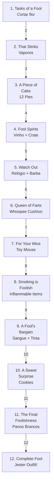

import { Aside, Card } from '@astrojs/starlight/components';

## 🛠️ Informações do Arquivo

A quest **What a Foolish Quest** é uma missão de tema cômico onde o jogador segue um mentor palhaço chamado Bozo através de 12 missões hilariantes. Cada missão envolve tarefas absurdas que resultam em recompensas temáticas de Jester.

<Card title="Caminho Original">
`data-otservbr-global/lib/core/quests/catalog/033_what_a_foolish_quest.lua`
</Card>

<Aside type="tip">
**ID da Quest**: Storage.Quest.U8_1.WhatAFoolishQuest  
**Tipo**: Missão Cômica/Criativa  
**Dificuldade**: Fácil a Intermediária  
**Quantidade de Missões**: 12  
**Reward**: Jester Outfit
</Aside>

## 📄 Visão Geral do Código

### Resumo Executivo

| Propriedade | Valor |
|-------------|-------|
| **Nome** | What a Foolish Quest |
| **Mentor** | Bozo |
| **Tema** | Comédia/Palhaçaria |
| **NPCs Envolvidos** | Bozo, Theodore Loveless, Avar Tar, Simon, etc. |
| **Reward Principal** | Jester Outfit |
| **Estrutura** | 12 Missões com States (1-11 states por missão) |
| **Storage Namespace** | U8_1.WhatAFoolishQuest |

## 🔧 Estrutura do Código

### Variáveis Locais

| Nome | Tipo | Descrição |
|------|------|-----------|
| `quest` | table | Tabela principal que define a quest |
| `name` | string | Nome da quest: "What a Foolish Quest" |
| `missions` | table | Array contendo 12 missões |
| `startStorageId` | string | ID de armazenamento inicial |
| `startStorageValue` | number | 1 (padrão) |

### Estrutura de Dados

```lua
-- Estrutura de cada missão
[n] = {
  name = "What a foolish Quest - Nome da Missão",
  storageId = Storage.Quest.U8_1.WhatAFoolishQuest.MissionN,
  missionId = 10338 + n,
  startValue = 1,
  endValue = max_states,
  states = {
    [1] = "Descrição estado 1",
    [n] = "Descrição estado final"
  }
}
```

## 🗺️ Estrutura das Missões

### Progressão Visual



### Detalhamento das Missões

| # | Nome | Objetivo | States | Notas |
|---|------|---------|--------|-------|
| 1 | Tasks of a Fool | Cortar flor com elfos | 2 | Simples |
| 2 | That Stinks! | Coletar vapores nocivos | 2 | Item químico |
| 3 | A Piece of Cake | Obter 12 bolos | 2 | Culinária |
| 4 | Fool Spirits | Vinho + contrato crate | 3 | Negociação |
| 5 | Watch Out | Roubar relógio + barba | 3 | Roubo |
| 6 | Queen of Farts | Whoopee cushion no trono | 5 | **MAIS LONGA** |
| 7 | For Your Mice | Assustar Carina | 2 | Rato de brinquedo |
| 8 | Smoking is Foolish | Itens inflamáveis | 5 | Diverso |
| 9 | A Fool's Bargain | Sangue stalker + tinta | 5 | Componentes |
| 10 | A Sweet Surprise | Cookies para 11 NPCs | 2 | **ÚNICA: visitação em massa** |
| 11 | The Final Foolishness | Panos brancos + disfarce | 4 | Disfarce mútmia |
| 12 | Complete Fool | Obter Jester Outfit | 1 | **RECOMPENSA FINAL** |

## 🎮 Mecânicas Especiais

### Missão 10: A Sweet Surprise

Única entre todas as missões por exigir visitação a 11 NPCs para entregar bolos:
- **NPCs**: Avar Tar, Simon, Ariella, Lorbas, King Markwin, Hjaern, Wyda, Hairycles, Orc King
- **Bonus**: EITHER Yaman OR Nah'Bob (escolher um dos dois)
- **Total**: 10 NPCs obrigatórios + 1 opcional = 11 entregas

## 💾 Mapeamento de Storage

```lua
Storage.Quest.U8_1.WhatAFoolishQuest = {
  Questline = progresso_geral,
  Mission1 = estado_1,
  Mission2 = estado_2,
  -- ... (missões 3-11) ...
  Mission11 = estado_11,
  JesterOutfit = estado_12_reward
}
```

## 🎭 Tema e Narrativa

A quest segue uma narrativa cômica onde o jogador é instruído por um palhaço chamado Bozo a realizar tarefas cada vez mais absurdas. A progressão culmina no jogador obtendo um disfarce de múmia para assustar um califa, completando assim a transformação em um verdadeiro tolo.

**Reward Final**: Jester Outfit (roupa de palhaço/bobão)

## 🤖 Informações da Documentação

**Data**: 8 de Janeiro de 2024  
**Versão**: 1.0  
**Autor**: Documentação Canary  
**Status**: Completo
