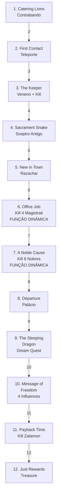

import { Aside, Card } from '@astrojs/starlight/components';

## 🛠️ Informações do Arquivo

A quest **Wrath of the Emperor** é uma missão épica de rebelião contra um Imperador em Farmine/Razachai. A quest apresenta 12 missões com narrativa de conspiração, incluindo inovação no sistema de rastreamento através de funções Lua dinâmicas que substituem o tradicional array de states.

<Card title="Caminho Original">
`data-otservbr-global/lib/core/quests/catalog/034_wrath_of_the_emperor.lua`
</Card>

<Aside type="tip">
**ID da Quest**: Storage.Quest.U8_6.WrathOfTheEmperor  
**Tipo**: Missão Épica/Rebelião  
**Dificuldade**: Avançada  
**Quantidade de Missões**: 12  
**Boss Final**: Zalamon
</Aside>

## 📄 Visão Geral do Código

### Resumo Executivo

| Propriedade | Valor |
|-------------|-------|
| **Nome** | Wrath of the Emperor |
| **Tema** | Rebelião/Conspiração |
| **NPCs Principais** | Zizzle (contato), Zalamon (boss) |
| **Região** | Farmine/Razachai |
| **Padrão** | Hybrid: States + Funções Dinâmicas |
| **Storage Namespace** | U8_6.WrathOfTheEmperor |

## 🔧 Estrutura do Código

### Variáveis Locais

| Nome | Tipo | Descrição |
|------|------|-----------|
| `quest` | table | Tabela principal que define a quest |
| `name` | string | Nome da quest |
| `missions` | table | Array de 12 missões |
| `startStorageId` | string | ID de armazenamento |
| `startStorageValue` | number | 1 (início) |

### Padrões de Implementação

**Padrão 1: States Tradicionais** (Missões 1-5, 8-12)
```lua
states = {
  [1] = "Descrição narrativa",
  [2] = "Próximo passo",
  [n] = "Estado final"
}
```

**Padrão 2: Funções Dinâmicas** (Missões 6-7)
```lua
description = function(player)
  return string.format("Kill count: %d", 
    player:getStorageValue(Storage.Quest.U8_6.WrathOfTheEmperor.MissionN))
end
```

## 🗺️ Estrutura das Missões

### Progressão Visual



### Detalhamento das Missões

| # | Nome | Objetivo | Padrão | States |
|---|------|---------|--------|--------|
| 1 | Catering Lions Den | Contrabando de crates | States | 3 |
| 2 | First Contact | Reparar teleportes | States | 3 |
| 3 | The Keeper | Veneno + kill | States | 3 |
| 4 | Sacrament Snake | Montar Sceptro | States | 3 |
| 5 | New in Town | Contato Razachai | States | 3 |
| 6 | Office Job | Matar 4 Magistrati | **Função** | - |
| 7 | A Noble Cause | Matar 6 Nobres | **Função** | - |
| 8 | [Unnamed] | Túnel escape | States | 2 |
| 9 | The Sleeping Dragon | Liberar mente do dragão | States | 2 |
| 10 | Message of Freedom | Destruir 4 influências | States | 6 |
| 11 | Payback Time | Matar Zalamon | States | 2 |
| 12 | Just Rewards | Coletar recompensas | States | 2 |

## 🎮 Mecânicas Avançadas

### Missões com Funções Dinâmicas

**Missão 6: Office Job**
- Objetivo: Matar 4 magistrados do Imperador
- Sem states tradicionais
- Descrição dinâmica que exibe contador em tempo real
- Storage: rastreia kills individuais

**Missão 7: A Noble Cause**
- Objetivo: Matar 6 nobres
- Sem states tradicionais
- Função dinâmica similar à Missão 6
- Contador atualizado a cada kill

### Missão 10: Message of Freedom

A mais longa da quest com **6 states** descrevendo destruição progressiva:
1. Possuição da Spiritual Charm
2. Instruções de entrada nas realms
3. Destruição de 1 de 4 influências
4. Destruição de 2 de 4 influências
5. Destruição de 3 de 4 influências
6. Destruição completa

## 💾 Mapeamento de Storage

```lua
Storage.Quest.U8_6.WrathOfTheEmperor = {
  Questline = progresso_geral,
  Mission01 = estado_1,
  -- ... (2-12) ...
  Mission06KillCount = contador_dinamico,
  Mission07KillCount = contador_dinamico,
  -- ... etc
}
```

## 🎭 Narrativa de Rebelião

A quest segue uma narrativa de conspiração onde o jogador gradualmente se envolve em uma rebelião contra o Imperador de Farmine. Começa com tarefas simples de contrabando e culmina no enfrentamento direto com Zalamon, o boss final, e reivindicação de tesouro imperial.

## 🤖 Informações da Documentação

**Data**: 8 de Janeiro de 2024  
**Versão**: 1.0  
**Autor**: Documentação Canary  
**Status**: Completo
