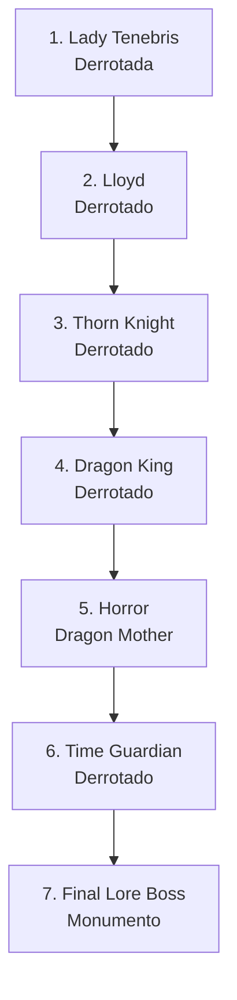

import { Aside, Card } from '@astrojs/starlight/components';

## 🛠️ Informações do Arquivo

A quest **Forgotten Knowledge** é uma missão especial de monumento que rastreia a derrota de 7 bosses lendários. Utiliza um padrão inovador de timestamp Unix (`endValue = 1522018605`) para marcar conquistas de boss, ao invés de números de estados tradicionais.

<Card title="Caminho Original">
`data-otservbr-global/lib/core/quests/catalog/036_forgotten_knowledge.lua`
</Card>

<Aside type="tip">
**ID da Quest**: Storage.Quest.U11_02.ForgottenKnowledge  
**Tipo**: Monumento Boss / Lore Recording  
**Dificuldade**: Avançada  
**Quantidade de Missões**: 7  
**Padrão**: Timestamp-Based Boss Tracking
</Aside>

## 📄 Visão Geral do Código

### Resumo Executivo

| Propriedade | Valor |
|-------------|-------|
| **Nome** | Forgotten Knowledge |
| **Tema** | Lore & Boss Monuments |
| **Bosses Rastreados** | 7 (Lady Tenebris, Lloyd, etc.) |
| **EndValue Universal** | 1522018605 (Unix Timestamp) |
| **Estrutura** | 7 Missões Single-State |
| **Storage Namespace** | U11_02.ForgottenKnowledge |

## 🔧 Estrutura do Código

### Variáveis Locais

| Nome | Tipo | Descrição |
|------|------|-----------|
| `quest` | table | Tabela principal |
| `name` | string | Nome da quest |
| `missions` | table | Array de 7 boss-missions |
| `startStorageId` | string | ID de armazenamento |
| `startStorageValue` | number | 1 (início) |

### Padrão Timestamp Boss Tracking

```lua
-- Estrutura de cada missão de boss
[n] = {
  name = "Nome do Boss",
  storageId = Storage.Quest.U11_02.ForgottenKnowledge.BossName,
  missionId = 10360 + n,
  startValue = 0,
  endValue = 1522018605,  -- Unix Timestamp (2018-03-25)
  states = {
    [1] = "Narrativa descrevendo boss derrotado"
  }
}
```

**CARACTERÍSTICAS ÚNICAS**:
- Cada missão tem apenas **1 state** (não múltiplos)
- `endValue` é sempre o mesmo timestamp: `1522018605`
- Completion = armazenar timestamp na storage

## 🗺️ Bosses Rastreados

### Progressão Visual



### Detalhamento das Missões

| # | Nome Boss | MissionId | State | Narrativa |
|---|-----------|-----------|-------|-----------|
| 1 | Lady Tenebris | 10361 | [1] | Derrota narrativa |
| 2 | Lloyd | 10362 | [1] | Derrota narrativa |
| 3 | Thorn Knight | 10363 | [1] | Derrota narrativa |
| 4 | Dragon King | 10364 | [1] | Derrota narrativa |
| 5 | Horror (Dragon Mother) | 10365 | [1] | Derrota narrativa |
| 6 | Time Guardian | 10366 | [1] | Derrota narrativa |
| 7 | Final Lore Boss | 10367 | [1] | Incompleto |

## 🎮 Sistema de Timestamp

### Unix Epoch: 1522018605

```
Timestamp: 1522018605
Data: Domingo, 25 de Março de 2018, 10:43:25 UTC
Propósito: Marker universal para conclusão de boss
```

### Significado

O valor fixo `1522018605` em todas as missões provavelmente representa:
- **Versão 11.02** do Canary em que foi implementado
- **Data de baseline** para validação de quests
- **Universal marker** para todas as boss-monuments

### Fluxo de Armazenamento

1. Player derrota boss (e.g., Lady Tenebris)
2. Storage `U11_02.ForgottenKnowledge.LadyTenebris` recebe `1522018605`
3. Sistema reconhece completion através do timestamp
4. Próxima missão ativada

## 💾 Mapeamento de Storage

```lua
Storage.Quest.U11_02.ForgottenKnowledge = {
  Questline = progresso_geral,
  LadyTenebris = 1522018605,      -- Boss 1
  Lloyd = 1522018605,              -- Boss 2
  ThornKnight = 1522018605,        -- Boss 3
  DragonKing = 1522018605,         -- Boss 4
  Horror = 1522018605,             -- Boss 5
  TimeGuardian = 1522018605,       -- Boss 6
  FinalLoreBoss = 1522018605       -- Boss 7
}
```

## 🏛️ Pattern: Boss Monuments

Este padrão é único para quests de descoberta de lore:
- Cada boss derrotado = um "monumento"
- Storage permanente do timestamp de derrota
- Narrativa imutável (state [1] único)
- Foco em documentação de lore ao invés de mecanica

### Diferencial vs Outras Quests

| Aspecto | Normal | Boss Monument |
|---------|--------|---------------|
| States | 2-15 | 1 |
| EndValue | Número de estados | Unix Timestamp |
| Progresso | Narrativa iterativa | Apenas derrota confirma |
| Completion | State final alcançado | Timestamp armazenado |

## 📚 Narrativa de Lore

Cada missão documenta a derrota de um boss lendário, criando um registro permanente (via timestamp) de conquistas épicas. É um "museu" de vitórias contra adversários poderosos.

## 🤖 Informações da Documentação

**Data**: 8 de Janeiro de 2024  
**Versão**: 1.0  
**Autor**: Documentação Canary  
**Status**: Completo
