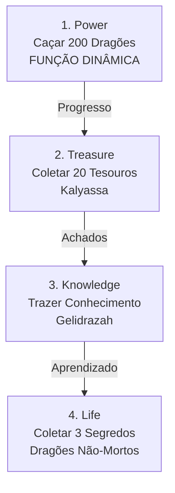

import { Aside, Card } from '@astrojs/starlight/components';

## 🛠️ Informações do Arquivo

A quest **The First Dragon** é uma missão épica dedicada ao primeiro dragão lendário, estruturada em 4 missões que representam diferentes aspectos: Poder (caça de dragões), Tesouro (coleta de artifacts), Conhecimento (aprender lore) e Vida (segredos antigos).

<Card title="Caminho Original">
`data-otservbr-global/lib/core/quests/catalog/037_the_first_dragon.lua`
</Card>

<Aside type="tip">
**ID da Quest**: Storage.Quest.U11_02.TheFirstDragon  
**Tipo**: Missão Épica Dragon-Themed  
**Dificuldade**: Avançada  
**Quantidade de Missões**: 4  
**Padrão Hibrido**: Função Dinâmica + String Description
</Aside>

## 📄 Visão Geral do Código

### Resumo Executivo

| Propriedade | Valor |
|-------------|-------|
| **Nome** | The First Dragon |
| **Tema** | Lore Dragão Antigo |
| **Missões** | 4 (Power, Treasure, Knowledge, Life) |
| **Boss Especial** | Gelidrazah (Frost Dragon) |
| **Padrão** | Híbrido: 1 função + 3 strings |
| **Storage Namespace** | U11_02.TheFirstDragon |

## 🔧 Estrutura do Código

### Variáveis Locais

| Nome | Tipo | Descrição |
|------|------|-----------|
| `quest` | table | Tabela principal |
| `name` | string | Nome: "The First Dragon" |
| `missions` | table | Array de 4 missões |
| `startStorageId` | string | ID de armazenamento |
| `startStorageValue` | number | 1 (início) |

### Padrões Implementados

**Padrão 1: Função Dinâmica** (Missão 1)
```lua
description = function(player)
  return ("You already hunted %d/200 dragons."):format(
    player:getStorageValue(Storage.Quest.U11_02.TheFirstDragon.DragonCounter)
  )
end
```

**Padrão 2: String Description** (Missões 2-4)
```lua
description = "Instrução narrativa fixa em string"
```

## 🗺️ Estrutura das Missões

### Progressão Visual



### Detalhamento das Missões

| # | Nome | Objetivo | Tipo | EndValue |
|---|------|---------|------|----------|
| 1 | Power | Caçar 200 dragões/dragon lords | Função | 200 |
| 2 | Treasure | Encontrar 20 tesouros de Kalyassa | String | 20 |
| 3 | Knowledge | Trazer conhecimento a Gelidrazah | String | 1 |
| 4 | Life | Coletar 3 segredos de dragões não-mortos | String | 3 |

## 🎮 Mecânicas Temáticas

### Missão 1: Power - Contador Dinâmico

Única missão com **função dinâmica** que rastreia contador em tempo real:
```lua
storageId = Storage.Quest.U11_02.TheFirstDragon.DragonCounter
missionId = 10368
startValue = 0
endValue = 200
```

**Jogabilidade**: Each dragon/dragon lord killed increments counter. Message updates dinamicamente.

### Missão 2: Treasure - Artefatos Espalhados

```lua
storageId = Storage.Quest.U11_02.TheFirstDragon.ChestCounter
missionId = 10369
startValue = 0
endValue = 20
```

**Descrição Narrativa**:
> "Treasure is the favorite of the dragon lords. Find and take Kalyassa's treasures spread across the world."

### Missão 3: Knowledge - Acesso a Boss

```lua
storageId = Storage.Quest.U11_02.TheFirstDragon.GelidrazahAccess
missionId = 10370
startValue = 0
endValue = 1
```

**Narrativa**:
> "You learned that frost dragon's incitement is the thirst for knowledge, perhaps if you bring some to Gelidrazah's you'll meet him."

### Missão 4: Life - Segredos Antigos

```lua
storageId = Storage.Quest.U11_02.TheFirstDragon.SecretsCounter
missionId = 10371
startValue = 0
endValue = 3
```

**Narrativa**:
> "Undead dragons aspires for life. No better way to see life as it grows around the world, is there?"

## 💾 Mapeamento de Storage

```lua
Storage.Quest.U11_02.TheFirstDragon = {
  Questline = progresso_geral,
  DragonCounter = contador_dragoes,      -- Para função dinâmica M1
  ChestCounter = contador_tesouros,      -- M2
  GelidrazahAccess = acesso_boss,        -- M3
  SecretsCounter = contador_segredos     -- M4
}
```

## 🐉 Boss Lendário: Gelidrazah

Frost Dragon (Dragão de Gelo) que pede conhecimento: é o "primeiro dragão" referenciado na quest, representando uma entidade antiga com fome de saber.

## 🎭 Narrativa Temática

A quest segue quatro pilares da lenda do primeiro dragão:
1. **Poder** (violência/caça)
2. **Tesouro** (riqueza/ganância)
3. **Conhecimento** (sabedoria)
4. **Vida** (imortalidade/eternidade)

Completar tudo permite encontrar/derrotar Gelidrazah.

## 🤖 Informações da Documentação

**Data**: 8 de Janeiro de 2024  
**Versão**: 1.0  
**Autor**: Documentação Canary  
**Status**: Completo
