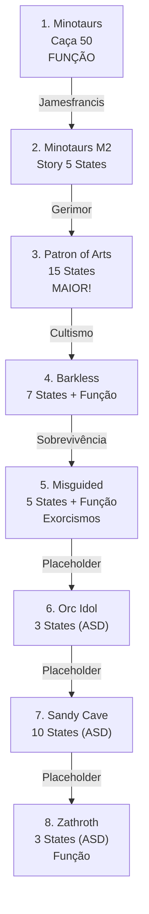

import { Aside, Card } from '@astrojs/starlight/components';

## 🛠️ Informações do Arquivo

A quest **Cults of Tibia** é uma missão épica de investigação de múltiplos cultos temáticos: Minotauros, Artes, Barkless, Desguiados, Ídolo Orc, Caverna Arenosa e Remanescentes de Zathroth. A quest utiliza padrões híbridos complexos e contém alguns placeholders de desenvolvimento ("ASD").

<Card title="Caminho Original">
`data-otservbr-global/lib/core/quests/catalog/038_cults_of_tibia.lua`
</Card>

<Aside type="tip">
**ID da Quest**: Storage.Quest.U11_40.CultsOfTibia  
**Tipo**: Investigação Multi-Culto  
**Dificuldade**: Muito Avançada  
**Quantidade de Missões**: 8  
**Observação**: Contém placeholders de trabalho em progresso
</Aside>

## 📄 Visão Geral do Código

### Resumo Executivo

| Propriedade | Valor |
|-------------|-------|
| **Nome** | Cults of Tibia |
| **Tema** | Investigação de Cultos |
| **Mentor** | Gerimor (Druid of Cronor) |
| **Cultos** | 8 temáticos |
| **Maior Missão** | Patron of Arts (15 states!) |
| **Storage Namespace** | U11_40.CultsOfTibia |

## 🔧 Estrutura do Código

### Variáveis Locais

| Nome | Tipo | Descrição |
|------|------|-----------|
| `quest` | table | Tabela principal |
| `missions` | table | 8 missões complexas |
| `startStorageValue` | number | 1 (início) |

### Padrões Identificados

**Padrão A**: Função dinâmica simples (M1)
**Padrão B**: Estados narrativos puros (M2-5)
**Padrão C**: Estados com funções inline (M4, M5, M8)
**Padrão D**: Placeholders "ASD" (M6-8)

## 🗺️ Estrutura das Missões

### Progressão Visual



### Detalhamento das Missões

| # | Nome | Objetivo | States | Padrão | Notas |
|---|------|---------|--------|--------|-------|
| 1 | Minotaurs Strengthening | Caçar 50 minotauros empoderados | - | Função Dinâmica | Counter em tempo real |
| 2 | Minotaurs (Story) | Investigação em caverna | 5 | States Puros | Jamesfrancis mentor |
| 3 | Patron of Arts | Museum investigation | 15 | States Puros | **MAIOR MISSÃO** |
| 4 | Barkless | Investigar líder cultista | 7 | States + Função [3] | Trial extremo |
| 5 | Misguided | Amulet + exorcismos | 5 | States + Função [3] | Counter de exorcismos |
| 6 | The Orc Idol | Ídolo adoração | 3 | States (ASD) | **PLACEHOLDER** |
| 7 | Secret Sandy Cave | Investigação arenosa | 10 | States (ASD) | **PLACEHOLDER LONGO** |
| 8 | Zathroth Remnants | Remanescentes cultistas | 3 | States + Função [1] | **PLACEHOLDER** |

## 🎮 Missão 3: Patron of Arts - A Maior

Com **15 states**, é a missão mais longa de todas as quests analisadas:

```
[1-2] = Introdução museum e roubo
[3-5] = Investigação crime + ransom
[6-8] = Magnifier investigation
[9-10] = Fraude descoberta
[11-12] = Failure path (sem quadro replacement)
[13-14] = Access patron floor
[15] = Conclusão com Druid
```

## ⚠️ Placeholders de Desenvolvimento

Missões 6-8 contêm a string "ASD" em vários estados:

```lua
[1] = "ASD",  -- Placeholder incompleto
[2] = "ASD",  -- Placeholder incompleto
```

Provavelmente aguardando preenchimento de narrativa oficial.

### Estados com Placeholders (M6-8)

- **Missão 6** [1-2]: ASD placeholders
- **Missão 7** [1-2]: ASD placeholders, [3-10]: narrativas reais
- **Missão 8** [1-2]: ASD placeholders, [3]: narrativa real

## 💾 Mapeamento de Storage

```lua
Storage.Quest.U11_40.CultsOfTibia = {
  Questline = progresso_geral,
  Minotaurs = {
    JamesfrancisTask = contador,    -- M1 função
    Mission = estado_m2              -- M2 states
  },
  MotA = {
    Mission = estado_m3              -- Patron of Arts
  },
  Barkless = {
    Mission = estado_m4,             -- Com função inline
    Objects = contador_m4            -- Função estado [3]
  },
  Misguided = {
    Mission = estado_m5,
    Exorcisms = contador_m5          -- Função estado [3]
  },
  Orcs = {
    Mission = estado_m6              -- Placeholders
  },
  Life = {
    Mission = estado_m7              -- Placeholders + ASD
  },
  Humans = {
    Mission = estado_m8              -- Placeholders
  }
}
```

## 🔧 Estrutura Técnica Avançada

### Função Inline em State (Missão 4)

```lua
states = {
  [1] = "Narrativa simples",
  [2] = "Outro text",
  [3] = function(player)  -- FUNÇÃO DENTRO DE STATE!
    return string.format("Progress: %d/10", 
      player:getStorageValue(Storage...))
  end,
  -- resto narrativa
}
```

Esta é primeira vez que vemos **função Lua dentro do array states**, não apenas description.

## 🎭 Narrativa de Cultos

Quest investiga 8 diferentes cultos em Tibia, cada um com narrativa única:
- Minotauros (força)
- Artes (beleza)
- Barkless (autodegradação)
- Desguiados (obtenção)
- Ídolo Orc (adoração)
- Caverna Arenosa (mistério)
- Zathroth (lore maligna)

## ⚠️ AVISO DE DESENVOLVIMENTO

**Esta quest contém placeholders em progresso**. Estados com "ASD" devem ser preenchidos com narrativas oficiais.

## 🤖 Informações da Documentação

**Data**: 8 de Janeiro de 2024  
**Versão**: 1.0  
**Autor**: Documentação Canary  
**Status**: Documentação Completa (Quest parcialmente em progresso no código)
