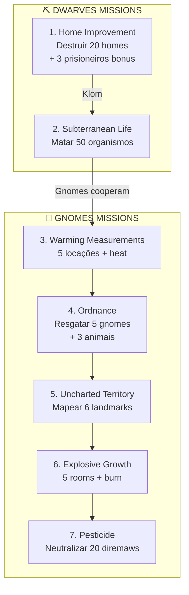

import { Aside, Card } from '@astrojs/starlight/components';

## 🛠️ Informações do Arquivo

A quest **Dangerous Depths** é uma missão cooperativa de profundidades subterrâneas onde Dwarves e Gnomes trabalham juntos contra ameaças. Todas as 7 missões utilizam **funções dinâmicas dentro do array states** para rastreamento em tempo real de progresso.

<Card title="Caminho Original">
`data-otservbr-global/lib/core/quests/catalog/039_dangerous_depths.lua`
</Card>

<Aside type="tip">
**ID da Quest**: Storage.Quest.U11_50.DangerousDepths  
**Tipo**: Cooperação Subterrânea  
**Dificuldade**: Avançada  
**Quantidade de Missões**: 7  
**Padrão**: Estados com Funções Inline (100% das missões)
</Aside>

## 📄 Visão Geral do Código

### Resumo Executivo

| Propriedade | Valor |
|-------------|-------|
| **Nome** | Dangerous Depths |
| **Tema** | Defesa Subterrânea |
| **Facções** | Dwarves (3 M) + Gnomes (4 M) |
| **Líderes** | Klom Stonecutter, Gnomus, Lardoc |
| **Padrão** | 100% Estados com Funções Inline |
| **Storage Namespace** | U11_50.DangerousDepths |

## 🔧 Estrutura do Código

### Variáveis Locais

| Nome | Tipo | Descrição |
|------|------|-----------|
| `quest` | table | Tabela principal |
| `missions` | table | 7 missões |
| `startStorageId` | string | ID armazenamento |
| `startStorageValue` | number | 1 (início) |

### Padrão Universal: Funções em States

**INOVAÇÃO**: TODAS as 7 missões utilizam **funções Lua dentro do array states**:

```lua
states = {
  [1] = function(player)
    local count1 = player:getStorageValue(Storage.Quest.U11_50.DangerousDepths.Counter1)
    local count2 = player:getStorageValue(Storage.Quest.U11_50.DangerousDepths.Counter2)
    return string.format("Progresso: %d/%d", count1, count2)
  end,
  [2] = "Narrativa conclusão",
}
```

## 🗺️ Estrutura das Missões

### Progressão Visual



### Detalhamento das Missões

| # | Nome | Tipo | Objetivo Principal | Secondary | Funções |
|---|------|------|-------------------|-----------|---------|
| 1 | Home Improvement | Dwarves | 20 Lost Exiles | 3 Prisoners bonus | State [1] |
| 2 | Subterranean Life | Dwarves | 50 Organismos | - | State [1] |
| 3 | Warming Measurements | Gnomes | 5 Locations | Heat tracking | State [1] |
| 4 | Ordnance | Gnomes | 5 Gnomes | 3 Crawlers | State [2] |
| 5 | Uncharted Territory | Gnomes | 6 Landmarks | Exploração | State [1] |
| 6 | Explosive Growth | Scouts | 5 Rooms | Burn barrels | State [1] |
| 7 | Pesticide | Scouts | 20 Diremaws | Spawn control | State [1] |

## 🎮 Detalhamento de Cada Missão

### Missão 1: Home Improvement

**Objetivo Duplo**:
```lua
Lost Exiles: %d/20
Prisoners (bonus): %d/3
```

- Destruir acampamentos inimigos
- Bônus por capturar prisioneiros
- Função em state [1] rastreia ambos contadores

### Missão 2: Subterranean Life

```lua
Subterranean organisms: %d/50
```

- Massacre de criaturas subterrâneas
- Simples contador único
- Função em state [1]

### Missão 3: Warming Measurements

**5 Locações Diferentes**:
```lua
Location A: %d/1
Location B: %d/1
Location C: %d/1
Location D: %d/1
Location E: %d/1
```

- Exploração de calor geotérmico
- 5 locations para visitar/medir
- Função em state [1] rastreia 5 contadores independentes

### Missão 4: Ordnance

**Duplo Objetivo**:
```lua
Rescued gnomes: %d/5
Rescued animals: %d/3
```

- Resgate de unidades gnômicas
- Proteção de pack animals
- Função em state [2] (não state [1]!)

### Missão 5: Uncharted Territory

**6 Landmarks para Mapear**:
```lua
Old Gate: %d/1
The Gaze: %d/1
Lost Ruin: %d/1
Outpost: %d/1
Bastion: %d/1
Broken Tower: %d/1
```

- Exploração cartográfica completa
- 6 pontos de interesse distintos
- Função em state [1]

### Missão 6: Explosive Growth

**5 Rooms para Queimar**:
```lua
First Room: %d/1
Second room: %d/1
Third room: %d/1
Fourth room: %d/1
Fifth room: %d/1
```

- Combate a crescimento verminoso
- Queima controlada em múltiplas câmaras
- Função em state [1]

### Missão 7: Pesticide

**Controle de Diremaw**:
```lua
Neutralised: %d/20
```

- Pesticide application a ovos de diremaw
- Controle de população spawn
- Função em state [1], simples contador

## 💾 Mapeamento de Storage

```lua
Storage.Quest.U11_50.DangerousDepths = {
  Questline = progresso_geral,
  Dwarves = {
    Home = estado_m1,
    LostExiles = contador_m1,      -- Função state [1]
    Prisoners = contador_m1_bonus,  -- Função state [1]
    Subterranean = estado_m2,
    Organisms = contador_m2         -- Função state [1]
  },
  Gnomes = {
    Measurements = estado_m3,
    LocationA = contador_m3,        -- Função state [1] x5
    LocationB = contador_m3,
    LocationC = contador_m3,
    LocationD = contador_m3,
    LocationE = contador_m3,
    Ordnance = estado_m4,
    GnomesCount = contador_m4,      -- Função state [2]
    CrawlersCount = contador_m4,    -- Função state [2]
    Charting = estado_m5,
    OldGate = contador_m5,          -- Função state [1] x6
    TheGaze = contador_m5,
    LostRuin = contador_m5,
    Outpost = contador_m5,
    Bastion = contador_m5,
    BrokenTower = contador_m5
  },
  Scouts = {
    Growth = estado_m6,
    FirstBarrel = contador_m6,      -- Função state [1] x5
    SecondBarrel = contador_m6,
    ThirdBarrel = contador_m6,
    FourthBarrel = contador_m6,
    FifthBarrel = contador_m6,
    Diremaw = estado_m7,
    DiremawsCount = contador_m7     -- Função state [1]
  }
}
```

## 🎯 Padrão de Design: Funções em States

Este padrão é **único nesta quest**: 100% das missões usam funções dentro de states:

### Vantagens

- ✅ Contador em tempo real atualizado
- ✅ Descrição dinâmica do progresso
- ✅ Múltiplos contadores rastreados simultaneamente
- ✅ Flexibilidade narrativa com progresso

### Comparação com Outras Quests

| Quest | Padrão | Contadores |
|-------|--------|----------|
| 034 (Wrath) | Função simples | 1-2 |
| 036 (Forgotten) | Estados puros | Nenhum |
| 037 (Dragon) | Função + strings | 1 |
| **039 (Depths)** | **Funções em states** | **1-6 por missão!** |

## 🤖 Informações da Documentação

**Data**: 8 de Janeiro de 2024  
**Versão**: 1.0  
**Autor**: Documentação Canary  
**Status**: Completo

---

**NOTA TÉCNICA**: Esta quest representa o pico de complexidade em rastreamento dinâmico, com até 6 contadores independentes em uma única missão.
