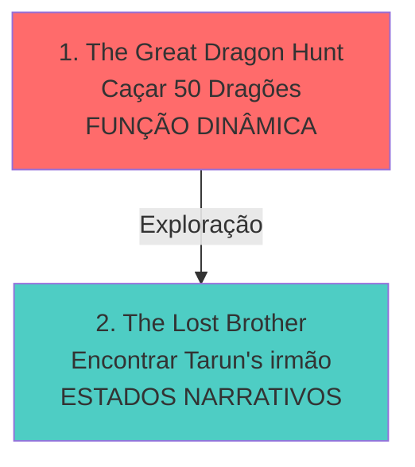

import { Aside, Card } from '@astrojs/starlight/components';

## 🛠️ Informações do Arquivo

A quest **Adventurers Guild** é uma missão da guilda de aventureiros focada em dois objetivos: caça de dragões épicas e investigação de um irmão desaparecido. A quest utiliza padrão híbrido com função dinâmica para caça e estados narrativos para investigação.

<Card title="Caminho Original">
`data-otservbr-global/lib/core/quests/catalog/040_adventurers_guild.lua`
</Card>

<Aside type="tip">
**ID da Quest**: Storage.Quest.U9_80.AdventurersGuild  
**Tipo**: Aventura Múltipla  
**Dificuldade**: Avançada  
**Quantidade de Missões**: 2  
**Padrão**: Híbrido (Função + Estados)
</Aside>

## 📄 Visão Geral do Código

### Resumo Executivo

| Propriedade | Valor |
|-------------|-------|
| **Nome** | Adventurers Guild |
| **Tema** | Caça Épica + Mistério |
| **Região** | Kha'zeel |
| **Mentor** | Tarun (merchant) |
| **Padrão** | Função + Estados |
| **Storage Namespace** | U9_80.AdventurersGuild (e U10_80) |

## 🔧 Estrutura do Código

### Variáveis Locais

| Nome | Tipo | Descrição |
|------|------|-----------|
| `quest` | table | Tabela principal |
| `name` | string | Nome da quest |
| `missions` | table | Array de 2 missões |
| `startStorageId` | string | ID armazenamento |
| `startStorageValue` | number | 1 (início) |

### Espaços de Armazenamento Múltiplos

**INUSITADO**: Quest usa múltiplos namespaces de storage:
- `Storage.Quest.U9_80.AdventurersGuild` (inicial)
- `Storage.Quest.U10_80.TheGreatDragonHunt` (missão 1)
- `Storage.Quest.U10_80.TheLostBrotherQuest` (missão 2)

This suggests progression através de versões/updates: U9_80 → U10_80

## 🗺️ Estrutura das Missões

### Progressão Visual



### Detalhamento das Missões

| # | Nome | Objetivo | MissionId | Padrão | States |
|---|------|---------|-----------|--------|--------|
| 1 | The Great Dragon Hunt | Matar 50 dragões/dragon lords | 10388 | Função | - |
| 2 | The Lost Brother | Encontrar irmão desaparecido | 11000 | Estados | 3 |

## 🎮 Detalhamento de Cada Missão

### Missão 1: The Great Dragon Hunt

**Padrão**: Função Dinâmica

```lua
storageId = Storage.Quest.U10_80.TheGreatDragonHunt.WarriorSkeleton
startValue = 0
endValue = 2  -- Limite curioso!

description = function(player)
  return ("You are exploring the Kha'zeel Dragon Lairs. Others obviously found a terrible end here. \z
  But the dragon hoards might justify the risks. You killed %d/50 dragons and dragon lords."):format(
    math.max(player:getStorageValue(Storage.Quest.U10_80.TheGreatDragonHunt.DragonCounter), 0)
  )
end
```

**Características**:
- Contador dinâmico: 0 até 50 dragons
- `endValue = 2` é arbitrário (não indica 2 estados)
- Descrição em primeira pessoa narrativa
- Incentivo de tesouro

### Missão 2: The Lost Brother

**Padrão**: Estados Narrativos Puros

```lua
storageId = Storage.Quest.U10_80.TheLostBrotherQuest
startValue = 1
endValue = 3

states = {
  [1] = "At the Kha'zeel Mountains you met the merchant Tarun. 
         His brother has gone missing and was last seen following 
         a beautiful woman into a palace. Tarun fears this woman 
         might have been a demon.",
  [2] = "You found the remains of Tarun's brother containing a message. 
         Go back to Tarun and report his brother's last words.",
  [3] = "You told Tarun about his brother's sad fate. He was very 
         downhearted but gave you his sincere thanks. The beautiful 
         asuri have taken a young man's life and the happiness of another one."
}
```

**Narrativa**:
1. Encontrar Tarun no Kha'zeel
2. Descobrir irmão morto (asuri demon)
3. Reportar má notícia

## 💾 Mapeamento de Storage

```lua
-- Início da quest
Storage.Quest.U9_80.AdventurersGuild = {
  QuestLine = progresso_geral
}

-- Progressão M1
Storage.Quest.U10_80.TheGreatDragonHunt = {
  WarriorSkeleton = estado_m1,
  DragonCounter = contador_dinamico    -- Função state [1]
}

-- Progressão M2
Storage.Quest.U10_80.TheLostBrotherQuest = {
  -- States: 1 = encontrar, 2 = descobrir, 3 = reportar
  questline = estado_m2
}
```

## 📜 Narrativa de Kha'zeel

A quest leva o jogador às lendárias **Kha'zeel Dragon Lairs**, um cemitério de aventureiros onde dragões lendários guardam tesouros imensuráveis. A subplot de Tarun adiciona peso emocional ao desvendarem uma conspiração de asuri (demônios).

### Tema Dual

| Aspecto | Missão 1 | Missão 2 |
|---------|--------|---------|
| **Foco** | Ação/Caça | Narrativa/Mistério |
| **Teste** | Combate | Investigação |
| **Prêmio** | Tesouro Dragon | Recompensa Tarun |
| **Tone** | Épico/Ganância | Trágico/Romance |

## 🎯 Design da Quest

A quest combina dois estilos:
- **Missão 1**: Silhueta tradicional de caça (grinding/combat)
- **Missão 2**: Missão narrativa com twist trágico

Esta combinação oferece variedade mecânica dentro de uma única quest.

## 🤖 Informações da Documentação

**Data**: 8 de Janeiro de 2024  
**Versão**: 1.0  
**Autor**: Documentação Canary  
**Status**: Completo
