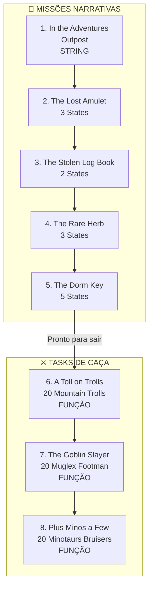

import { Aside, Card } from '@astrojs/starlight/components';

## 🛠️ Informações do Arquivo

A quest **Dawnport** é a missão introdutória do acampamento de aventureiros, onde heróis jovens recebem treinamento em combate e caça. A quest possui 8 missões: 5 narrativas de iniciação + 3 tasks de caça com contadores dinâmicos. Ideal para jogadores que começam a progressão.

<Card title="Caminho Original">
`data-otservbr-global/lib/core/quests/catalog/041_dawnport.lua`
</Card>

<Aside type="tip">
**ID da Quest**: Storage.Quest.U10_55.Dawnport  
**Tipo**: Iniciação/Treinamento  
**Dificuldade**: Fácil a Intermediária  
**Quantidade de Missões**: 8  
**Nível Mínimo**: 8 (para sair para Mainland)
</Aside>

## 📄 Visão Geral do Código

### Resumo Executivo

| Propriedade | Valor |
|-------------|-------|
| **Nome** | Dawnport |
| **Tema** | Treinamento Militar |
| **NPCs**: | Mr Morris, Woblin, Inigo |
| **Estrutura** | 5 Missões narrativas + 3 Tasks de caça |
| **Padrão** | Híbrido: Strings + Estados + Funções |
| **Storage Namespace** | U10_55.Dawnport |

## 🔧 Estrutura do Código

### Variáveis Locais

| Nome | Tipo | Descrição |
|------|------|-----------|
| `quest` | table | Tabela principal |
| `name` | string | Nome: "Dawnport" |
| `missions` | table | Array de 8 missões |
| `startStorageId` | string | ID armazenamento |
| `startStorageValue` | number | 1 (início) |

### Três Padrões Presentes

**Padrão A**: String Description (Missão 1)
**Padrão B**: Estados Narrativos (Missões 2-5)
**Padrão C**: Funções Dinâmicas (Missões 6-8)

## 🗺️ Estrutura das Missões

### Progressão Visual



### Detalhamento das Missões

| # | Nome | Objetivo | MissionId | Padrão | Dados |
|---|------|---------|-----------|--------|-------|
| 1 | In Adventures Outpost | Exploração Inicial | 10389 | String | - |
| 2 | The Lost Amulet | Encontrar amuleto | 10390 | Estados | 3 |
| 3 | The Stolen Log Book | Recuperar livro roubado | 10391 | Estados | 2 |
| 4 | The Rare Herb | Colher erva rara | 10392 | Estados | 3 |
| 5 | The Dorm Key | Encontrar chave dormitório | 10393 | Estados | 5 |
| 6 | A Toll on Trolls | Matar 20 trolls montanhosos | 10394 | Função | - |
| 7 | The Goblin Slayer | Matar 20 Muglex Footmen | 10395 | Função | - |
| 8 | Plus Minos a Few | Matar 20 Minotaurs Bruisers | 10396 | Função | - |

## 🎮 Detalhamento de Cada Missão

### Missão 1: In the Adventures Outpost

**Padrão**: String Description

```lua
description = "You have reached the Outpost, where young heroes are trained in combat 
and hunting. When you have reached level 8 at least, you can leave for the Mainland. 
Talk to Inigo if you have questions."
```

- Simples instrução/briefing
- Sem progression tracking
- Informa level requirement (8)
- Mentor: Inigo

### Missão 2: The Lost Amulet

**Padrão**: Estados Narrativos (3 states)

```lua
states = {
  [1] = "Mr Morris tasked you to find an ancient amulet that was lost 
         somewhere on Dawnport - probably next to a corpse somewhere.",
  [2] = "Come back to Mr Morris.",
  [3] = "Mr Morris thanks for you the help."
}
```

**Progressão**: Tarefa → Retorno → Recompensa

### Missão 3: The Stolen Log Book

**Padrão**: Estados Narrativos (2 states - MENOR)

```lua
states = {
  [1] = "Mr Morris urged you to find a log book that was stolen by trolls.",
  [2] = "Mr Morris thanks you for the help."
}
```

**Simplicidade**: Apenas 2 estados

### Missão 4: The Rare Herb

**Padrão**: Estados Narrativos (3 states)

```lua
states = {
  [1] = "Mr Morris needs the rare Dawnfire herb harvested and brought to him. 
         It grows on gray sand only, he said.",
  [2] = "Come back to Mr Morris.",
  [3] = "Mr Morris thanks you for the help."
}
```

**Mecânica**: Coleta de item com localização específica

### Missão 5: The Dorm Key

**Padrão**: Estados Narrativos (5 states - MAIOR!)

```lua
states = {
  [1] = "The key to the adventurer's dormitory has disappeared. Maybe you can 
         find it. Ask around to find out who was the last to have seen it.",
  [2] = "Use the fishing rod in the nearby lake to fish Old Nasty.",
  [3] = "Come back to Woblin with Old Nasty",
  [4] = "Come back to Mr Morris with Key 0010",
  [5] = "Mr Morris thanks for the help"
}
```

**Mecânica Complexa**: 
- Investigação
- Fishing reward
- Item hand-off
- Final reward

### Missões 6-8: Combat Tasks

**Padrão**: Funções Dinâmicas

**Missão 6**:
```lua
description = function(player)
  return string.format("You already hunted %d/20 Mountain Trolls.", 
    math.max(player:getStorageValue(Storage.Quest.U10_55.Dawnport.MorrisTrollCount), 0))
end
```

**Missão 7**:
```lua
description = function(player)
  return string.format("You already hunted %d/20 Muglex Clan Footman.", 
    math.max(player:getStorageValue(Storage.Quest.U10_55.Dawnport.MorrisGoblinCount), 0))
end
```

**Missão 8**:
```lua
description = function(player)
  return string.format("You already hunted %d/20 Minotaurs Bruisers.", 
    math.max(player:getStorageValue(Storage.Quest.U10_55.Dawnport.MorrisMinosCount), 0))
end
```

Cada task marca 20 kills como objetivo.

## 💾 Mapeamento de Storage

```lua
Storage.Quest.U10_55.Dawnport = {
  Questline = progresso_geral,
  -- Missões narrativas
  GoMain = estado_m1,              -- String
  TheLostAmulet = estado_m2,        -- 3 States
  TheStolenLogBook = estado_m3,     -- 2 States
  TheRareHerb = estado_m4,          -- 3 States
  TheDormKey = estado_m5,           -- 5 States
  -- Tasks de caça
  MorrisTrollCount = contador_m6,   -- Função dinâmica
  MorrisGoblinCount = contador_m7,  -- Função dinâmica
  MorrisMinosCount = contador_m8    -- Função dinâmica
}
```

## 🎯 Estrutura Pedagógica

A quest foi cuidadosamente projetada como **tutorial progressivo**:

| Fase | Missões | Objetivo | Mecânica |
|------|---------|----------|----------|
| Briefing | 1 | Contextualização | String simples |
| Coleta Fácil | 2-4 | Exploração/Coleta | Estados narrativos curtos |
| Puzzle | 5 | Lógica/Exploração | Estados mais longos |
| Combat | 6-8 | Caça repetida | Contadores dinâmicos |

**Progressão**: Narrativa → Exploração → Puzzle → Combate

## 📊 Curva de Dificuldade

```
Dificuldade
    ▲
    │     Tasks (6-8)
    │        ▲▲▲
    │   M5 ▲
    │   ▲▲
    │ ▲▲▲
    │ M1▲
    └─────────────────────► Número da Missão
       1  2  3  4  5  6  7  8
```

Aumento gradual de complexidade mecânica.

## 🤖 Informações da Documentação

**Data**: 8 de Janeiro de 2024  
**Versão**: 1.0  
**Autor**: Documentação Canary  
**Status**: Completo

---

**NOTA PEDAGÓGICA**: Dawnport é excelente exemplo de design educativo de quest, guiando novatos progressivamente através de mecânicas do jogo.
