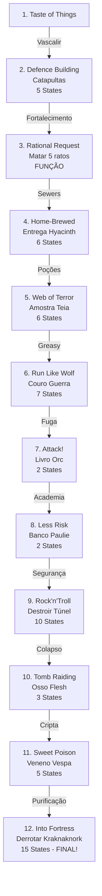

import { Aside, Card } from '@astrojs/starlight/components';

## 🛠️ Informações do Arquivo

A quest **The Rookie Guard** é a missão principal de treinamento em Rookgaard, onde o jogador segue uma narrativa épica de 12 missões sob o comando de Vascalir, culminando no combate contra o boss Kraknaknork e salvação da aldeia.

<Card title="Caminho Original">
`data-otservbr-global/lib/core/quests/catalog/042_the_rookie_guard.lua`
</Card>

<Aside type="tip">
**ID da Quest**: Storage.Quest.U9_1.TheRookieGuard  
**Tipo**: Treinamento/Iniciação  
**Dificuldade**: Fácil a Avançada (progressão)  
**Quantidade de Missões**: 12  
**Boss Final**: Kraknaknork
</Aside>

## 📄 Visão Geral do Código

### Resumo Executivo

| Propriedade | Valor |
|-------------|-------|
| **Nome** | The Rookie Guard |
| **Región** | Rookgaard |
| **Mentor** | Vascalir |
| **Tema** | Defesa da Aldeia contra Orcs |
| **Boss Final** | Kraknaknork |
| **Estrutura** | 12 Missões com Narrativa Épica |
| **Storage Namespace** | U9_1.TheRookieGuard |

## 🔧 Estrutura do Código

### Variáveis Locais

| Nome | Tipo | Descrição |
|------|------|-----------|
| `quest` | table | Tabela principal |
| `missions` | table | 12 missões sequenciais |
| `startStorageId` | string | ID armazenamento |
| `startStorageValue` | number | 1 (início) |

### Padrões Implementados

- **Missão 1**: Empty (placeholder)
- **Missão 3**: Função dinâmica para contador
- **Missions 2,4-12**: Estados narrativos puros (2-15 states)

## 🗺️ Estrutura das Missões

### Progressão Visual



### Detalhamento das Missões

| # | Nome | Objetivo | States | Tipo |
|---|------|---------|--------|------|
| 1 | A Taste of Things | Placeholder | 1 | Empty |
| 2 | Defence! | Carregar 2 catapultas | 5 | Estados |
| 3 | A Rational Request | Matar 5 ratos | - | Função |
| 4 | Home-Brewed | Entregar ervas | 6 | Estados |
| 5 | Web of Terror | Amostra teia | 6 | Estados |
| 6 | Run Like a Wolf | Couro de lobo | 7 | Estados |
| 7 | Attack! | Salvar livro orc | 2 | Estados |
| 8 | Less Risk - More Fun | Banco + Paulie | 2 | Estados |
| 9 | Rock 'n Troll | Destruir 5 vigas | 10 | Estados |
| 10 | Tomb Raiding | Osso flesh cripta | 3 | Estados |
| 11 | Sweet Poison | Veneno vespa | 5 | Estados |
| 12 | Into The Fortress | Derrotar Kraknaknork | 15 | Estados (**MAIOR**!) |

## 🎮 Destaque: Missão 12 - Infiltração da Fortaleza Orc

**A missão final é épica com 15 states descrevendo infiltração estratégica:**

1. Obter itens
2. Entrar na fortaleza
3. Derrotar orc
4. Disfarçar-se como orc
5. Distrair guarda
6. Entrar níveis inferiores
7. Envenenar sopa Kraknaknork
8. Ativo trap tarantula
9. Fuga por teleporter
10. Quebrar barreiras
11. Resolver enigmas
12. Duelar Kraknaknork (**COMBATE FINAL**)
13. Vindita - tesouro
14. Teleporte saída
15. Paz para Rookgaard

## 💾 Mapeamento de Storage

```lua
Storage.Quest.U9_1.TheRookieGuard = {
  Questline = progresso_geral,
  Mission01 = placeholder,
  Mission02 = estado_defesa,
  RatKills = contador_dinamico,     -- M3 função
  Mission04 = estado_herbas,
  Mission05 = estado_teia,
  Mission06 = estado_lobo,
  Mission07 = estado_livro,
  Mission08 = estado_banco,
  Mission09 = estado_vigas,
  Mission10 = estado_cripta,
  Mission11 = estado_veneno,
  Mission12 = estado_final_boss     -- 15 states!
}
```

## 🏰 Narrativa de Salvação

Rookie Guard é a jornada completa de iniciação de um herói em Rookgaard, desde exercícios simples até a infiltração e derrotá de um warlord orc que ameaça a aldeia.

## 🤖 Informações da Documentação

**Data**: 21 de Fevereiro de 2026  
**Versão**: 1.0  
**Autor**: Documentação Canary  
**Status**: Completo
