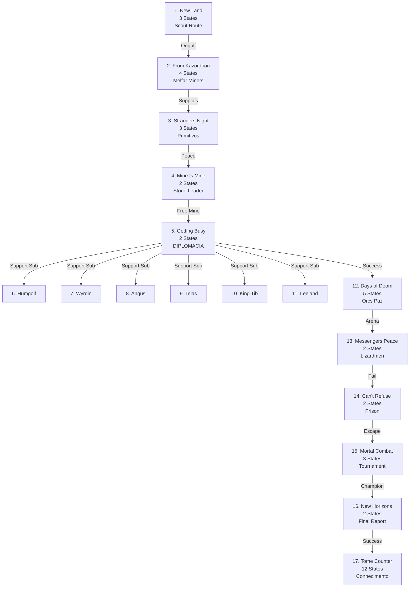

import { Aside, Card } from '@astrojs/starlight/components';

## 🛠️ Informações do Arquivo

A quest **The New Frontier** é a epic quest de expansão territorial onde o jogador auxilia na colonização de Farmine e exploração de Zao. Inclui 17 missões complexas: 12 sub-missões da Missão 5 (negociação diplomática) e 5 principais mais 1 contador de Tomes.

<Card title="Caminho Original">
`data-otservbr-global/lib/core/quests/catalog/043_the_new_frontier.lua`
</Card>

<Aside type="tip">
**ID da Quest**: Storage.Quest.U8_54.TheNewFrontier  
**Tipo**: Expansão Territorial/Exploração  
**Dificuldade**: Muito Avançada  
**Quantidade de Missões**: 17 (17 branches!)  
**Tema**: Negociação + Exploração
</Aside>

## 📄 Visão Geral do Código

### Resumo Executivo

| Propriedade | Valor |
|-------------|-------|
| **Nome** | The New Frontier |
| **Comandante** | Ongulf (Farmine) |
| **Tema** | Colonização/Exploração |
| **Regiões** | Farmine, Zao, Kazordoon, Edron |
| **Estrutura** | 16 Missões + 1 Contador (Tomes) |
| **Storage Namespace** | U8_54.TheNewFrontier |

## 🔧 Estrutura do Código

### Variáveis Locais

| Nome | Tipo | Descrição |
|------|------|-----------|
| `quest` | table | Tabela principal |
| `missions` | table | 17 branches |
| `startStorageId` | string | ID armazenamento |
| `startStorageValue` | number | 1 (início) |

### Estrutura Especial: Missão 5 Multi-Branch

**Missão 5** possui 7 sub-branches diplomáticas:
- [6] Humgolf (Worm Tamer)
- [7] Wyrdin (Edron Academy)
- [8] Angus (Explorer Society)
- [9] Telas (Inventor)
- [10] King Tibianus (Thais)
- [11] Leeland Slim (Venorean Traders)

## 🗺️ Estrutura das Missões

### Progressão Visual



### Detalhamento das Missões Principais

| # | Nome | Objetivo | States |
|---|------|---------|--------|
| 1 | New Land | Explorar montanha | 3 |
| 2 | From Kazordoon | Marcar 3 árvores | 4 |
| 3 | Strangers Night | Negociar humanos primitivos | 3 |
| 4 | The Mine Is Mine | Matar líder criaturas pedra | 2 |
| 5 | Getting Things Busy | Diplomacia com 6 NPCs | 2 |
| 12 | Days of Doom | Sobreviver arena minotauro | 5 |
| 13 | Messengers Peace | Contatar lizardmen | 2 |
| 14 | Can't Refuse | Escapar prisão | 2 |
| 15 | Mortal Combat | Ganhar torneio | 3 |
| 16 | New Horizons | Reportar Ongulf | 2 |
| 17 | Tome of Knowledge | Coletar 12 tomes | 12 |

## 🎮 Missão 17: Tome of Knowledge Counter

**Única missão com 12 states descrevendo coleta de conhecimento:**

Cada tome desbloqueado oferece suportes comerciais:
- [1] Tomes = Dragon Tapestries
- [2] Tomes = Minotaur Backpacks
- [3] Tomes = Lizard Weapon Racks
- [4] Tomes = Rice Balls Trade
- [5] Tomes = Lizard Backpacks
- [6] Tomes = War Drums
- [7] Tomes = Snake Teleport Access
- [8] Tomes = Corruption Hole Access
- [9] Tomes = Buy Lizard Equipment
- [10] Tomes = Zao Palace Access
- [11] Tomes = Dragon Statues
- [12] Tomes = Dragon Throne + 5000 XP/extra

## 💾 Mapeamento de Storage

```lua
Storage.Quest.U8_54.TheNewFrontier = {
  Questline = progresso_geral,
  Mission01 = estado_scouting,
  Mission02 = { [1] = estado_melfar },
  Mission03 = estado_primitivos,
  Mission04 = estado_mine,
  Mission05 = { [1] = estado_diplomacia },
  Mission05 = {
    Humgolf = estado_worm,
    Wyrdin = estado_magician,
    Angus = estado_explorer,
    Telas = estado_inventor,
    KingTibianus = estado_king,
    Leeland = estado_traders
  },
  Mission06 = estado_doom,
  Mission07 = { [1] = estado_messenger },
  Mission08 = estado_prison,
  Mission09 = { [1] = estado_tournament },
  Mission10 = { [1] = estado_report },
  TomeofKnowledge = estado_12_benefits
}
```

## 🏛️ Tema: Colonização Estratégica

A quest segue a narrativa de expansão de Farmine em Zao, requerendo:
- Exploração geográfica
- Negociação diplomática (6 facções)
- Pacificação militar
- Registro de conhecimento cultural

## 🤖 Informações da Documentação

**Data**: 21 de Fevereiro de 2026  
**Versão**: 1.0  
**Autor**: Documentação Canary  
**Status**: Completo
