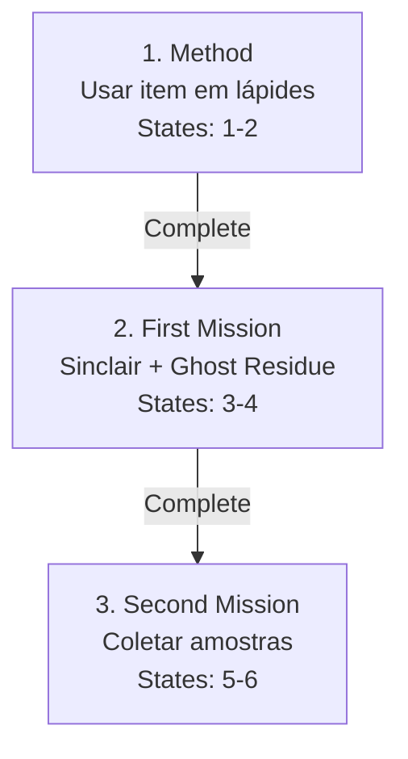

import { Aside, Card } from '@astrojs/starlight/components';

## 🛠️ Informações do Arquivo

A quest **Spirithunters Quest** é uma quest breve de caça a espíritos com 3 missões que envolvem investigação de lápides e coleta de resíduos de fantasmas.

<Card title="Caminho Original">
`data-otservbr-global/lib/core/quests/catalog/044_spirithunters_quest.lua`
</Card>

<Aside type="tip">
**ID da Quest**: Storage.Quest.U8_7.SpiritHunters  
**Tipo**: Caça Sobrenatural  
**Dificuldade**: Intermediária  
**Quantidade de Missões**: 3  
**Padrão**: States Simples (2-2 máx)
</Aside>

## 📄 Visão Geral do Código

### Resumo Executivo

| Propriedade | Valor |
|-------------|-------|
| **Nome** | Spirithunters Quest |
| **Tema** | Investigação Espíritos |
| **NPC Mentor** | Sinclair |
| **Estrutura** | 3 Missões Curtas |
| **Storage Namespace** | U8_7.SpiritHunters |

## 🔧 Estrutura do Código

### Variáveis Locais

| Nome | Tipo | Descrição |
|------|------|-----------|
| `quest` | table | Tabela principal |
| `name` | string | Nome da quest |
| `missions` | table | Array de 3 missões |
| `startStorageId` | string | Storage.Quest.U8_7.SpiritHunters.Mission01 |
| `startStorageValue` | number | 1 (início) |

### Padrão: Estados Sequenciais com StartValues Não-Padrão

**INUSITADO**: Cada missão usa diferentes `startValue`:
- Missão 1: startValue = 1
- Missão 2: startValue = 2 (não reinicia!)
- Missão 3: startValue = 4 (continua contagem)

Esta é uma abordagem de **sequência contínua** ao invés de reiniciar cada missão.

## 🗺️ Estrutura das Missões

### Progressão Visual



### Detalhamento das Missões

| # | Nome | Objetivo | StartValue | EndValue | States |
|---|------|---------|----------|----------|--------|
| 1 | Method | Usar item em lápides | 1 | 2 | [1-2] |
| 2 | First Mission | Falar Sinclair + colete | 2 | 4 | [3-4] |
| 3 | Second Mission | Coletar mais amostras | 4 | 6 | [5-6] |

## 🎮 Sequência Contínua

As missões não "reiniciam" a contagem, indicando uma **progressão contínua**:

- **M1 Completion**: State [1] → [2]
- **M2 Completion**: State [3] → [4] (não [1] → [2])
- **M3 Completion**: State [5] → [6] (não [1] → [2])

Esta abordagem comprime informações em espaço storage eficiente.

## 📋 Narrativa por Missão

### Missão 1: Method (States 1-2)
- [1]: "Use the item on the tombstones."
- [2]: "You have used these item in the tombstones."

### Missão 2: First Mission (States 3-4)
- [3]: "Talk to Sinclair and take the ghost residue."
- [4]: "You got the ghost waste."

### Missão 3: Second Mission (States 5-6)
- [5]: "You need to get more samples of ghosts."
- [6]: "You got all the ghost scraps."

## 💾 Mapeamento de Storage

```lua
Storage.Quest.U8_7.SpiritHunters = {
  -- Sequência contínua: estados 1-6
  Mission01 = value_1_a_6  -- Rastreia progresso total
}
```

## 🤖 Informações da Documentação

**Data**: 21 de Fevereiro de 2026  
**Versão**: 1.0  
**Autor**: Documentação Canary  
**Status**: Completo
