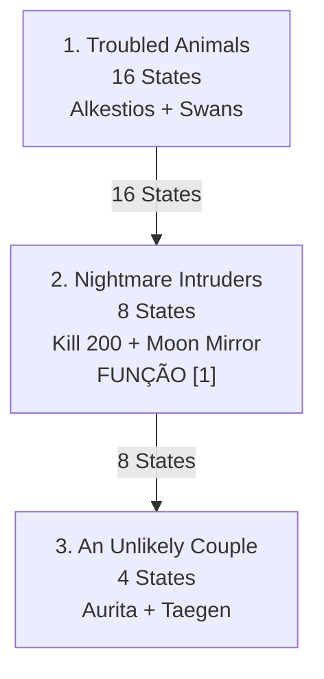

import { Aside, Card } from '@astrojs/starlight/components';

## 🛠️ Informações do Arquivo

A quest **Threatened Dreams** é uma épica missão de proteção do reino Fae Feyrist contra invasores de Roshamuul. Inclui 3 missões complexas com funções dinâmicas para rastreamento em tempo real.

<Card title="Caminho Original">
`data-otservbr-global/lib/core/quests/catalog/045_threatened_dreams.lua`
</Card>

<Aside type="tip">
**ID da Quest**: Storage.Quest.U11_40.ThreatenedDreams  
**Tipo**: Defesa Sobrenatural/Exploração Oculta  
**Dificuldade**: Muito Avançada  
**Quantidade de Missões**: 3  
**Padrão**: Estados + Funções Dinâmicas
</Aside>

## 📄 Visão Geral do Código

### Resumo Executivo

| Propriedade | Valor |
|-------------|-------|
| **Nome** | Threatened Dreams |
| **Tema** | Proteção Feyrist |
| **Rainha** | Maelyrra (Fae Queen) |
| **Antagonista** | Roshamuul Invaders |
| **Estrutura** | 3 Missões com 16-8-4 States |
| **Storage Namespace** | U11_40.ThreatenedDreams |

## 🔧 Estrutura do Código

### Variáveis Locais

| Nome | Tipo | Descrição |
|------|------|-----------|
| `quest` | table | Tabela principal |
| `missions` | table | 3 missões épicas |
| `startStorageId` | string | ID armazenamento |
| `startStorageValue` | number | 1 (início) |

### Padrões: Estados + Funções Inline

**Missão 1**: 16 states narrativos puros (sem funções)
**Missão 2**: 8 states, com função em [1]
**Missão 3**: 4 states narrativos puros

## 🗺️ Estrutura das Missões

### Progressão Visual



### Detalhamento das Missões

| # | Nome | Objetivo Principal | States | Função |
|---|------|------------------|--------|---------|
| 1 | Troubled Animals | Proteger Alkestios + Swan | 16 | Não |
| 2 | Nightmare Intruders | Matar 200 invasores | 8 | State [1] |
| 3 | An Unlikely Couple | Ajudar casal mixed | 4 | Não |

## 🎮 Missão 1: Troubled Animals (16 States)

A maior com narrativa longa descrevendo 3 sub-tasks:

**States 1-3**: White Deer Alkestios
- [1]: Conhecer Alkestios (fae)
- [2]: Fake book na acampamento
- [3]: Colocar livro notavelmente

**States 4-10**: Wolf Ghost + Whelps
- [4-7]: Buscar whelps perdidos
- [8-9]: Encontrar fur + stone mouth
- [10]: Resgatar ghost

**States 11-16**: Swan Maiden
- [11-12]: Encontrar swan maiden
- [13-15]: Coletar penas mágicas espalhadas
- [16]: Acesso a Feyrist aberto

## 🎮 Missão 2: Nightmare Intruders (8 States)

Única com **função dinâmica em state [1]**:

```lua
states = {
  [1] = function(player)
    return string.format(
      "Kill 200 nightmare monsters... Killed: %d weakened frazzlemaws and %d enfeebled silencers.",
      player:getStorageValue(...FrazzlemawsCount),
      player:getStorageValue(...EnfeebledCount)
    )
  end,
  [2] = "200 killed narrative",
  -- ... [3-8] narrativas
}
```

Sub-tasks:
- [1]: Matar 200 (com função)
- [2]: Sucessor
- [3]: Buscar Moon Mirror + liberar fairies
- [4]: Problema de barreira
- [5-6]: Coletar sunlight/starlight
- [7]: Carregar 5 moon sculptures
- [8]: Barreira restaurada

## 💾 Mapeamento de Storage

```lua
Storage.Quest.U11_40.ThreatenedDreams = {
  QuestLine = progresso_geral,
  Mission01 = { [1] = estado_1_a_16 },
  Mission02 = {
    [1] = estado_2_a_8,
    FrazzlemawsCount = contador_dinamico,  -- Função M2[1]
    EnfeebledCount = contador_dinamico     -- Função M2[1]
  },
  Mission03 = { [1] = estado_3_a_4 }
}
```

## 🌌 Narrativa de Defesa Fae

A quest retrata a ameaça a Feyrist (reino secreto Fae) por invasores de Roshamuul:
1. Proteção de seres Fae ameaçados
2. Defesa contra pesadelos invasores
3. Restauração de barreira mágica
4. Romance inter-espécies (final)

## 🤖 Informações da Documentação

**Data**: 21 de Fevereiro de 2026  
**Versão**: 1.0  
**Autor**: Documentação Canary  
**Status**: Completo
