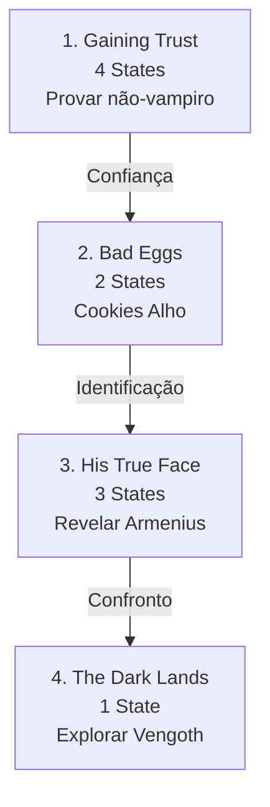

import { Aside, Card } from '@astrojs/starlight/components';

## 🛠️ Informações do Arquivo

A quest **Blood Brothers** é uma missão de investigação de vampiros onde o jogador trabalha com Julius para identificar e derrotar uma ameaça vampírica. Inclui 4 missões com narrativa atmosférica de vampirismo.

<Card title="Caminho Original">
`data-otservbr-global/lib/core/quests/catalog/046_blood_brothers.lua`
</Card>

<Aside type="tip">
**ID da Quest**: Storage.Quest.U8_4.BloodBrothers  
**Tipo**: Investigação Sobrenatural  
**Dificuldade**: Avançada  
**Quantidade de Missões**: 4  
**Boss**: Armenius (Vampire Leader)
</Aside>

## 📄 Visão Geral do Código

### Resumo Executivo

| Propriedade | Valor |
|-------------|-------|
| **Nome** | Blood Brothers |
| **Tema** | Conspiracy Vampírica |
| **Aliado** | Julius |
| **Antagonista** | Armenius (líder) |
| **Região** | Vengoth |
| **Estrutura** | 4 Missões (1-4 states) |
| **Storage Namespace** | U8_4.BloodBrothers |

## 🔧 Estrutura do Código

### Variáveis Locais

| Nome | Tipo | Descrição |
|------|------|-----------|
| `quest` | table | Tabela principal |
| `missions` | table | 4 missões |
| `startStorageId` | string | ID armazenamento |
| `startStorageValue` | number | 1 (início) |

### Padrão: Estados Narrativos Curtos

Todas as 4 missões utilizam **estados narrativos simples** com placeholder vazio em [2].

## 🗺️ Estrutura das Missões

### Progressão Visual



### Detalhamento das Missões

| # | Nome | Objetivo | States |
|---|------|---------|--------|
| 1 | Gaining Trust | Ganhar confiança de Julius | 4 |
| 2 | Bad Eggs | Distribuir cookies alho + relatar | 2 |
| 3 | His True Face | Usar palavras mágicas revelar | 3 |
| 4 | The Dark Lands | Marcar 5 locações em Vengoth | 1 |

## 🎮 Detalhamento de Cada Missão

### Missão 1: Gaining Trust (4 States)

```lua
states = {
  [1] = "Pensar em maneira ganhar confiança de Julius",
  [2] = "",  -- PLACEHOLDER VAZIO!
  [3] = "",  -- PLACEHOLDER VAZIO!
  [4] = "You have Julius' trust."
}
```

**Objetivo**: Convencer Julius de que você não é vampiro via ritual desconhecido.

### Missão 2: Bad Eggs (2 States)

```lua
states = {
  [1] = "Bake garlic cookies using dough on baking tray... 
         Hand out cookies and watch reactions. 
         Report suspicious people to Julius.",
  [2] = "You have reported five suspects - probably vampires - to Julius."
}
```

**Mecânica**: Criar cookies de alho, distribuir a cidadãos, identificar vampiros por reação.

### Missão 3: His True Face (3 States)

```lua
states = {
  [1] = "Use magic words 'alori mort' in front of suspicious citizens 
         to reveal who is their leader.",
  [2] = "",  -- PLACEHOLDER VAZIO!
  [3] = "You reported the incident with Armenius to Julius."
}
```

**Objetivo**: Usar frase de poder para revelar identidade vampire verdadeira (Armenius).

### Missão 4: The Dark Lands (1 State)

```lua
states = {
  [1] = "Find someone to bring you to Vengoth. 
         Use Julius' map to mark at least 5 spots including castle. 
         Report back."
}
```

**Objetivo**: Exploração de Vengoth e mapeamento preparatório.

## 💾 Mapeamento de Storage

```lua
Storage.Quest.U8_4.BloodBrothers = {
  QuestLine = progresso_geral,
  Mission01 = estado_confianca,      -- 4 states
  Mission02 = estado_cookies,        -- 2 states
  Mission03 = estado_revelacao,      -- 3 states
  Mission04 = estado_vengoth         -- 1 state
}
```

## ⚠️ Observações Técnicas

**Placeholders vazios [2] e [3] em M1 e M3**:
Provavelmente aguardando implementação de narrativas específicas ou rewards intermediários.

## 🧛 Narrativa de Vampiros

A quest segue investigação sistemática:
1. Ganhar confiança do aliado
2. Identificar vampiros via teste alho
3. Revelar líder (Armenius)
4. Preparar invasão em Vengoth

## 🤖 Informações da Documentação

**Data**: 21 de Fevereiro de 2026  
**Versão**: 1.0  
**Autor**: Documentação Canary  
**Status**: Completo
