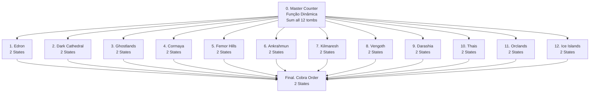

import { Aside, Card } from '@astrojs/starlight/components';

## 🛠️ Informações do Arquivo

A quest **Grave Danger** é uma missão épica de múltiplas locações onde o jogador deve santificar 12 tumbas em diferentes regiões e derrotar o Order of the Cobra. Inclui 1 missão mestre com função dinâmica + 12 sub-missões.

<Card title="Caminho Original">
`data-otservbr-global/lib/core/quests/catalog/047_grave_danger.lua`
</Card>

<Aside type="tip">
**ID da Quest**: Storage.Quest.U12_20.GraveDanger  
**Tipo**: Exploração Multi-Locação  
**Dificuldade**: Muito Avançada  
**Quantidade de Missões**: 14 (1 mestre + 12 tombs + 1 cobra)  
**Padrão**: Função Dinâmica Master + 2-state Tombs
</Aside>

## 📄 Visão Geral do Código

### Resumo Executivo

| Propriedade | Valor |
|-------------|-------|
| **Nome** | Grave Danger |
| **Tema** | Sanificação de Tumbas |
| **Tipo** | Quest de Exploração Múltipla |
| **Tumbas** | 12 locações |
| **Boss Final** | Order of the Cobra |
| **Estrutura** | 14 Missões (1 master + 12 + 1) |
| **Storage Namespace** | U12_20.GraveDanger |

## 🔧 Estrutura do Código

### Variáveis Locais

| Nome | Tipo | Descrição |
|------|------|-----------|
| `quest` | table | Tabela principal |
| `missions` | table | 14 branches |
| `startStorageId` | string | ID armazenamento |
| `startStorageValue` | number | 1 (início) |

### Padrão: Mestre Dinâmica + Tumbas Simples

**Missão [1]**: Função dinâmica que soma 12 contadores
**Missões [2-13]**: 2-state simples (encontrar & confirmar)
**Missão [14]**: Order of Cobra (2 states)

## 🗺️ Estrutura das Missões

### Progressão Visual



### Mestre: Grave Danger - The Lich Knights

**Função Dinâmica que rastreia 12 contadores:**

```lua
states = {
  [1] = function(player)
    return string.format(
      "Prevent 12 lich knights. Sanctify graves... Graves explored: %d/12",
      player:getStorageValue(Storage.Quest.U12_20.GraveDanger.Graves.Edron)
        + player:getStorageValue(Storage.Quest.U12_20.GraveDanger.Graves.DarkCathedral)
        + -- ... (10 mais) ...
      - 12
    )
  end,
  [2] = "You prevented the lich knights curse!"
}
```

### Detalhamento das Tumbas (2-13)

| # | Nome | Locação | Estado 1 | Estado 2 |
|---|------|---------|---------|---------|
| 1 | Edron North | "Find grave north Edron" | Encontrar | Visitado |
| 2 | Dark Cathedral | "Find grave cathedral" | Encontrar | Visitado |
| 3 | Ghostlands | "Find grave ghostlands" | Encontrar | Visitado |
| 4 | Cormaya | "Find grave Cormaya" | Encontrar | Visitado |
| 5 | Femor Hills | "Find grave Femor" | Encontrar | Visitado |
| 6 | Ankrahmun Isle | "Find grave NE island" | Encontrar | Visitado |
| 7 | Kilmaresh | "Find grave Kilmaresh" | Encontrar | Visitado |
| 8 | Vengoth | "Find grave Vengoth" | Encontrar | Visitado |
| 9 | Darashia | "Find grave Darashia" | Encontrar | Visitado |
| 10 | Thais Temple | "Find grave temple" | Encontrar | Visitado |
| 11 | Orclands | "Find grave entrance" | Encontrar | Visitado |
| 12 | Ice Islands | "Find grave south islands" | Encontrar | Visitado |

### Missão 14: Order of the Cobra

```lua
states = {
  [1] = "",  -- PLACEHOLDER VAZIO
  [2] = "Scarlett Etzel once stood righteous. 
          The assassins she rallied (Order of Cobra) 
          had ill repute. You vanquished them."
}
```

**Boss**: Scarlett Etzel (líder Order of Cobra)

## 💾 Mapeamento de Storage

```lua
Storage.Quest.U12_20.GraveDanger = {
  Questline = progresso_mestre,
  Graves = {
    Edron = contador_1,
    DarkCathedral = contador_2,
    Ghostlands = contador_3,
    Cormaya = contador_4,
    FemorHills = contador_5,
    Ankrahmun = contador_6,
    Kilmaresh = contador_7,
    Vengoth = contador_8,
    Darashia = contador_9,
    Thais = contador_10,
    Orclands = contador_11,
    IceIslands = contador_12
  },
  Cobra = estado_final
}
```

## 🎯 Objetivo: Sanificação de Lich Knights

Prevenir a ressurreição de 12 Lich Knights visitando suas tumbas em 12 regiões diferentes para santificá-las. Cada tumba visitada decrementa ameaça. Após completar todas, confrontar Order of Cobra.

## 🤖 Informações da Documentação

**Data**: 21 de Fevereiro de 2026  
**Versão**: 1.0  
**Autor**: Documentação Canary  
**Status**: Completo
