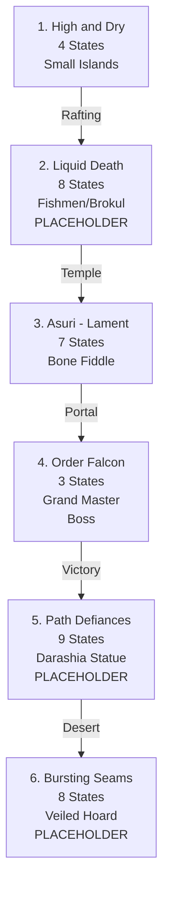

import { Aside, Card } from '@astrojs/starlight/components';

## 🛠️ Informações do Arquivo

A quest **The Secret Library** é uma épica missão de lore-gathering com 6 sub-quests que exploram sete locações e incluem descoberta de um artefato antigo. Contém múltiplos placeholders ("Part III", "Part IV") indicando trabalho em progresso.

<Card title="Caminho Original">
`data-otservbr-global/lib/core/quests\catalog\049_the_secret_library.lua`
</Card>

<Aside type="tip">
**ID da Quest**: Storage.Quest.U11_80.TheSecretLibrary  
**Tipo**: Exploração/Lore-Gathering  
**Dificuldade**: Muito Avançada  
**Quantidade de Missões**: 6  
**Observação**: Contém placeholders em progresso
</Aside>

## 📄 Visão Geral do Código

### Resumo Executivo

| Propriedade | Valor |
|-------------|-------|
| **Nome** | The Secret Library |
| **Tema** | Descoberta de Conhecimento Antigo |
| **Mentor** | Dedoras |
| **Estrutura** | 6 Missões (4,7,8,9,8 states) |
| **Boss Encounters** | Brokul, Grand Master Oberon |
| **Storage Namespace** | U11_80.TheSecretLibrary |

## 🔧 Estrutura do Código

### Variáveis Locais

| Nome | Tipo | Descrição |
|------|------|-----------|
| `quest` | table | Tabela principal |
| `missions` | table | 6 branches |
| `startStorageId` | string | ID armazenamento |
| `startStorageValue` | number | 1 (início) |

### Padrão: Estados Narrativos + Placeholders

Todas as 6 missões utilizam arrays de states com alguns placeholders "Part III", "Part IV", etc.

## 🗺️ Estrutura das Missões

### Progressão Visual



### Detalhamento das Missões

| # | Nome | Objetivo | States | Observação |
|---|------|---------|--------|-----------|
| 1 | High and Dry | Pequena ilha deserta | 4 | Completo |
| 2 | Liquid Death | Fishmen temple | 8 | Placeholder |
| 3 | Asuri - Lament | Bone fiddle puzzle | 7 | Alguns placeholders |
| 4 | Order Falcon | Derrotar boss | 3 | Completo |
| 5 | Path Defiances | Estatua mystério | 9 | Muito placeholder |
| 6 | Bursting Seams | Veiled Hoard | 8 | Muito placeholder |

## 🎮 Missão 1: High and Dry (4 States)

States completos descrevendo sobrevivência em ilha:
```lua
[1] = "Dedoras asked to talk Charles, knows about small island"
[2] = "You got stuck on island, must discover escape"
[3] = "Built raft, used stars navigate, found something"
[4] = "Congratulations you completed this mission"
```

## 🎮 Missão 3: Asuri - Lament (7 States)

Narrativa de criação mágica:
```lua
[1] = "Go to Asuri Palace Port Hope"
[2] = "Assemble instrument with objects found"
[3] = "Talk dead girl's mother Gail"
[4] = "Create bone fiddle with ebony/skull/hair"
[5] = "Enter violet portal (Peacock Ballad)"
[6] = "Found ancient map in secret desk"
[7] = "Congratulations you completed this mission"
```

## 🎮 Missão 4: Order of Falcon (3 States)

Breve narrativa de combate:
```lua
[1] = "Ancient knights order in Edron, abandoned outpost"
[2] = "Defeated Grand Master Oberon in combat"
[3] = "Congratulations you completed this mission"
```

## ⚠️ Placeholders Identificados

### Missão 2: Liquid Death

```lua
[4] = "Part IV"
[5] = "Part V"
[6] = "Part VI"
[7] = "Brokul defeated...fish creatures"
[8] = "Congratulations"
```

### Missão 5: Path Defiances

```lua
[3] = "Part III"
[4] = "Part IV"
[5] = "Part V"
[6] = "Part VI"
[7] = "Part VII"
```

### Missão 6: Bursting Seams

```lua
[3] = "Part III"
[4] = "Part IV"
[5] = "Part V"
```

## 💾 Mapeamento de Storage

```lua
Storage.Quest.U11_80.TheSecretLibrary = {
  Questlog = progresso_geral,
  SmallIslands = {
    Questline = estado_m1
  },
  LiquidDeath = {
    Questline = estado_m2
  },
  Asuras = {
    Questline = estado_m3
  },
  FalconBastion = {
    Questline = estado_m4
  },
  Darashia = {
    Questline = estado_m5
  },
  MoTA = {
    Questline = estado_m6
  }
}
```

## 🏛️ Padrão: Quest em Desenvolvimento

Esta quest é clara exemplo de **desenvolvimento incompleto**:
- Alguns estados finalizados (M1, M3, M4)
- Múltiplos placeholders "Part III/IV/V/VI/VII" aguardando preenchimento
- Estrutura planejada mas narrativas faltando

## 🎯 Objetivo: Biblioteca Secreta

Exploração progressiva de 6 locações para descobrir artefatos antigos e finalmente localizar a biblioteca oculta de conhecimento (Veiled Hoard of Zathroth).

## 🤖 Informações da Documentação

**Data**: 21 de Fevereiro de 2026  
**Versão**: 1.0  
**Autor**: Documentação Canary  
**Status**: Documentação Completa (Quest em Desenvolvimento)

---

**AVISO**: Esta quest aguarda conclusão. Muitos states contêm "Part X" placeholders.
