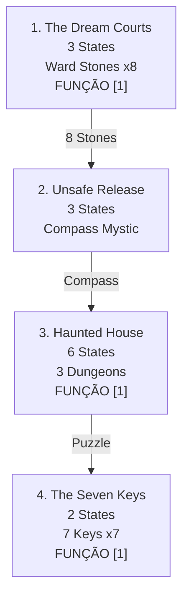

import { Aside, Card } from '@astrojs/starlight/components';

## 🛠️ Informações do Arquivo

A quest **The Dream Courts** é uma missão complexa em um reino onírico onde o jogador trabalha com cortes de Sonho (Winter & Summer) contra ameaças internas. Utiliza funções dinâmicas para rastreamento de stones e chaves.

<Card title="Caminho Original">
`data-otservbr-global\lib\core\quests\catalog\050_the_dream_courts.lua`
</Card>

<Aside type="tip">
**ID da Quest**: Storage.Quest.U12_00.TheDreamCourts  
**Tipo**: Exploração Onírica  
**Dificuldade**: Muito Avançada  
**Quantidade de Missões**: 4  
**Padrão**: Estados + Funções Dinâmicas
</Aside>

## 📄 Visão Geral do Código

### Resumo Executivo

| Propriedade | Valor |
|-------------|-------|
| **Nome** | The Dream Courts |
| **Tema** | Reinos Oníricos |
| **Cortes** | Winter Court & Summer Court |
| **Boss Final** | Nightmare Beast |
| **Estrutura** | 4 Missões (3,3,6,2 states) |
| **Storage Namespace** | U12_00.TheDreamCourts |

## 🔧 Estrutura do Código

### Variáveis Locais

| Nome | Tipo | Descrição |
|------|------|-----------|
| `quest` | table | Tabela principal |
| `missions` | table | 4 branches |
| `startStorageId` | string | ID armazenamento|
| `startStorageValue` | number | 1 (início) |

### Padrão: Estados + Funções Inline

- **M1**: Função em [1], narrativa [2-3]
- **M2**: 3 states narrativos puros
- **M3**: Função em [1], narrativa [2-6]
- **M4**: Função em [1], narrativa [2]

## 🗺️ Estrutura das Missões

### Progressão Visual



### Detalhamento das Missões

| # | Nome | Objetivo | States | Função |
|---|------|---------|--------|---------|
| 1 | The Dream Courts | Energizar 8 ward stones | 3 | [1] |
| 2 | Unsafe Release | Compass compass | 3 | Não |
| 3 | Haunted House | Puzzle 3 dungeons | 6 | [1] |
| 4 | The Seven Keys | Coletar 7 chaves | 2 | [1] |

## 🎮 Missão 1: The Dream Courts (3 States)

**Primeira com função dinâmica:**

```lua
states = {
  [1] = function(player)
    return string.format("You already got %d/8 energized ward stones.", 
      math.max(player:getStorageValue(Storage.Quest.U12_00.TheDreamCourts.WardStones.Count), 0))
  end,
  [2] = "You must kill the Nightmare Beast.",
  [3] = "By defeating the dreadful Nightmare Beast you did both courts favor. 
         From now on, dream elves will regard you as friend."
}
```

Objetivo: Energizar 8 ward stones espalhados + derrotar Nightmare Beast.

## 🎮 Missão 2: Unsafe Release (3 States)

Estados narrativos sobre compass:
```lua
[1] = "Part I"
[2] = "Part II"
[3] = "Andre happy compass works. From now on can charge compass. 
       Use to access mystical chests once daily."
```

## 🎮 Missão 3: Haunted House (6 States)

**Segunda com função dinâmica em [1]:**

```lua
states = {
  [1] = function(player)
    return string.format(
      "Tormented soul trusted secret: join passages to three dungeons! 
       Cellar %d/1 | Temple %d/1 | Tomb %d/1",
      math.max(player:getStorageValue(Storage.Quest.U12_00.TheDreamCourts.HauntedHouse.Cellar), 0),
      math.max(player:getStorageValue(Storage.Quest.U12_00.TheDreamCourts.HauntedHouse.Temple), 0),
      math.max(player:getStorageValue(Storage.Quest.U12_00.TheDreamCourts.HauntedHouse.Tomb), 0)
    )
  end,
  [2] = "Part I - burried cathedral",
  [3] = "Part II - puzzle dos livros",
  [4] = "Part III - bosses",
  [5] = "Part IV - last stone",
  [6] = "Activating ward stone after defeating Faceless Bane gained access 
         to deepest mysteries of dream courts."
}
```

Rastreia 3 dungeons (Cellar, Temple, Tomb) que devem ser conectados.

## 🎮 Missão 4: The Seven Keys (2 States)

**Terceira com função dinâmica em [1]:**

```lua
states = {
  [1] = function(player)
    return string.format("You already got %d/7 secret keys.", 
      math.max(player:getStorageValue(Storage.Quest.U12_00.TheDreamCourts.TheSevenKeys.Count), 0))
  end,
  [2] = "You found the seven keys to unlock the Seven Dream Doors 
         in the Labyrinth of Summer and Winter's Dreams."
}
```

Objetivo: Coletar 7 chaves para desbloquear labyrinth.

## 💾 Mapeamento de Storage

```lua
Storage.Quest.U12_00.TheDreamCourts = {
  Main = {
    Questline = progresso_geral
  },
  WardStones = {
    Questline = estado_m1,
    Count = contador_dinamico          -- Função M1[1]
  },
  UnsafeRelease = {
    Questline = estado_m2
  },
  HauntedHouse = {
    Questline = estado_m3,
    Cellar = contador_m3,              -- Função M3[1]
    Temple = contador_m3,              -- Função M3[1]
    Tomb = contador_m3                 -- Função M3[1]
  },
  TheSevenKeys = {
    Questline = estado_m4,
    Count = contador_dinamico          -- Função M4[1]
  }
}
```

## 🌙 Narrativa Onírica

A quest progride através de reinos de sonho:
1. Energizar defesas (ward stones) contra invasores
2. Obter tools mysticos (compass)
3. Resolver puzzles de house (3 dungeons)
4. Coletar chaves para labyrinth final

## 🤖 Informações da Documentação

**Data**: 21 de Fevereiro de 2026  
**Versão**: 1.0  
**Autor**: Documentação Canary  
**Status**: Completo
