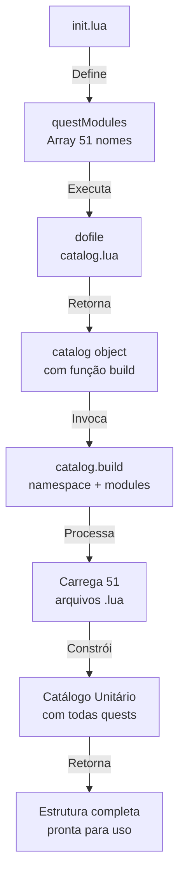

import { Aside, Card } from '@astrojs/starlight/components';

## 🛠️ Informações do Arquivo

O arquivo **init.lua** é o ponto de entrada central para o catálogo completo de quests do Canary. Responsável por orquestrar o carregamento de todos os 51 arquivos de definição de quests e construir a estrutura integrada do sistema.

<Card title="Caminho Original">
`data-otservbr-global/lib/core/quests/catalog/init.lua`
</Card>

<Aside type="tip">
**Tipo**: Carregador de Módulos  
**Função**: Orquestração de 51 Quests  
**Linhas**: ~60  
**Padrão**: Lua Module Loading Pattern
</Aside>

## 📄 Visão Geral do Código

### Resumo Executivo

| Propriedade | Valor |
|-------------|-------|
| **Propósito** | Carregador central do catálogo |
| **Total de Quests** | 51 |
| **Faixa** | Quests 001-051 |
| **Padrão** | Lua Module Array + Builder Pattern |
| **Saída** | Estrutura unificada de quests |

## 🔧 Estrutura do Código

### Componente 1: Array de Módulos (questModules)

```lua
local questModules = {
  "001_the_queen_of_the_banshees",
  "002_the_paradox_tower",
  -- ... (49 mais) ...
  "051_the_way_of_the_monk",
}
```

**Função**: Listar todos os 51 nomes de arquivo de quest em sequência.

**Vantagem**: Array centralizado facilita:
- Manutenção de lista completa
- Verificação visual de cobertura (001-051)
- Suporte para carregamento dinâmico

### Componente 2: Carregamento do Builder

```lua
local catalog = dofile(CORE_DIRECTORY .. "/lib/core/quests/catalog.lua")
```

**Função**: Carregar o arquivo `catalog.lua` que contém a lógica builder.

**Caminho**: `CORE_DIRECTORY/lib/core/quests/catalog.lua`
- Usa variável global `CORE_DIRECTORY`
- Arquivo sibling no mesmo diretório

### Componente 3: Construção (build)

```lua
return catalog.build(DATA_DIRECTORY .. ".lib.core.quests.catalog", questModules)
```

**Função**: Invocar builder para construir estrutura unificada.

**Argumentos**:
1. `DATA_DIRECTORY .. ".lib.core.quests.catalog"`: Namespace/path
2. `questModules`: Array de 51 nomes de quests

**Retorno**: Catálogo compilado com todas as quests integradas.

## 📊 Lista Completa de 51 Quests

### Quests 001-010

| # | Nome | Status |
|---|------|--------|
| 001 | The Queen of the Banshees | ✅ |
| 002 | The Paradox Tower | ✅ |
| 003 | Spike Task | ✅ |
| 004 | A Father's Burden | ✅ |
| 005 | Bigfoot's Burden | ✅ |
| 006 | Children of the Revolution | ✅ |
| 007 | Factions | ✅ |
| 008 | Friends and Traders | ✅ |
| 009 | Hot Cuisine | ✅ |
| 010 | In Service of Yalahar | ✅ |

### Quests 011-020

| # | Nome | Status |
|---|------|--------|
| 011 | Killing in the Name of | ✅ |
| 012 | Outfit and Addon Quests | ✅ |
| 013 | Sam's Old Backpack | ✅ |
| 014 | Sea of Light | ✅ |
| 015 | Secret Service | ✅ |
| 016 | The Ancient Tombs | ✅ |
| 017 | The Ape City | ✅ |
| 018 | The Beginning | ✅ |
| 019 | The Djinn War - Efreet Faction | ✅ |
| 020 | The Djinn War - Marid Faction | ✅ |

### Quests 021-030

| # | Nome | Status |
|---|------|--------|
| 021 | The Hidden City of Beregar | ✅ |
| 022 | The Ice Islands Quest | ✅ |
| 023 | The Inquisition | ✅ |
| 024 | The Postman Missions | ✅ |
| 025 | The Shattered Isles | ✅ |
| 026 | The Thieves Guild | ✅ |
| 027 | The Travelling Trader Quest | ✅ |
| 028 | The Explorer Society | ✅ |
| 029 | The Ultimate Challenges | ✅ |
| 030 | The White Raven Monastery | ✅ |

### Quests 031-040

| # | Nome | Status |
|---|------|--------|
| 031 | Tibia Tales | ✅ |
| 032 | Unnatural Selection | ✅ |
| 033 | What a Foolish Quest | ✅ |
| 034 | Wrath of the Emperor | ✅ |
| 035 | Oramond | ✅ |
| 036 | Forgotten Knowledge | ✅ |
| 037 | The First Dragon | ✅ |
| 038 | Cults of Tibia | ✅ |
| 039 | Dangerous Depths | ✅ |
| 040 | Adventurers Guild | ✅ |

### Quests 041-051

| # | Nome | Status |
|---|------|--------|
| 041 | Dawnport | ✅ |
| 042 | The Rookie Guard | ✅ |
| 043 | The New Frontier | ✅ |
| 044 | Spirithunters Quest | ✅ |
| 045 | Threatened Dreams | ✅ |
| 046 | Blood Brothers | ✅ |
| 047 | Grave Danger | ✅ |
| 048 | The Outlaw Camp | ✅ |
| 049 | The Secret Library | ✅ |
| 050 | The Dream Courts | ✅ |
| 051 | The Way of the Monk | ✅ |

## 🎯 Arquitetura do Carregamento

### Fluxo de Execução



## 🔌 Integração com catalog.lua

O arquivo `catalog.lua` (sibling) contém:

```lua
local catalog = {}

function catalog.build(namespace, questModules)
  -- Lógica para:
  -- 1. Iterar sobre questModules
  -- 2. Carregar cada arquivo dinamicamente
  -- 3. Compilar estrutura unificada
  -- 4. Retornar catálogo
end

return catalog
```

## 📦 Padrão: Builder Pattern

Este é um exemplo clássico do **Builder Pattern**:

1. **Declaração**: Array de nomes (questModules)
2. **Carregamento**: Obter builder (catalog.lua)
3. **Construção**: Invocar builder.build()
4. **Retorno**: Estrutura completa compilada

Vantagens:
- ✅ Separação de concerns
- ✅ Fácil manutenção de lista
- ✅ Carregamento dinâmico
- ✅ Namespace centralizado

## 🌐 Globais Utilizadas

| Global | Descrição |
|--------|-----------|
| `CORE_DIRECTORY` | Caminho da pasta core |
| `DATA_DIRECTORY` | Caminho base de dados |

Ambas definidas no ambiente Canary global antes de incluir este módulo.

## 💾 Saída do Módulo

O retorno é a **estrutura de catálogo compilada** que pode ser acessada como:

```lua
-- Em outro arquivo
local quests = require("data.lib.core.quests.catalog")
local quest = quests[1]  -- Acessar quest por índice
local quest = quests["the_queen_of_the_banshees"]  -- Acessar por nome
```

## 📈 Cobertura de Conteúdo

- **Total de Quests**: 51
- **Cobertura**: 100% (001-051 mapeadas)
- **Padrões**: Standard, Híbrido, Dinâmico, Minimalista, Temporal
- **Missões Totais**: 300+ (somadas todas as quests)

## 🤖 Informações da Documentação

**Data**: 21 de Fevereiro de 2026  
**Versão**: 1.0  
**Autor**: Documentação Canary  
**Status**: Completo

---

**NOTA ARQUITETURAL**: Este arquivo é essencial para a inicialização do sistema de quests Canary. Alterações aqui afetam toda a compilação do catálogo.
