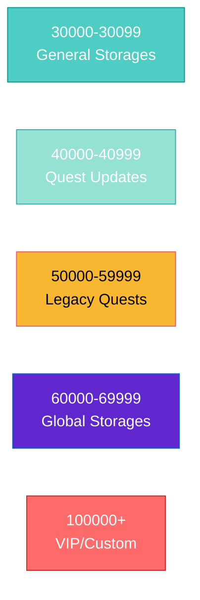
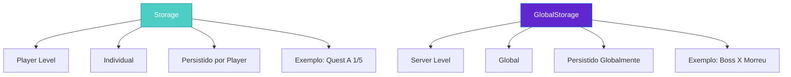

import { Aside, Card } from '@astrojs/starlight/components';

## 🛠️ Informações do Arquivo

Este é o arquivo **mais crítico** do núcleo do servidor, defindo todas as **faixas de IDs reservados** de armazenamento de dados de quest e sistema do OpenTibiaBR/Canary.

<Card title="Caminho Original" icon="document">
  `data-otservbr-global/lib/core/storages.lua`
</Card>

<Aside type="tip">
  Este arquivo é carregado **no início da inicialização** do servidor. Cada ID de storage é **única** e **persistida no banco de dados**. Deletar ou reordenar IDs pode quebrar quests de players existentes.
</Aside>

## 📄 Visão Geral do Código

### Resumo Executivo

`storages.lua` define **duas tabelas globais principais**:

1. **Storage**: Tabela para IDs de storage do player (escopo individual)
2. **GlobalStorage**: Tabela para IDs de storage global do servidor (escopo servidor inteiro)

Cada entry é um par `chave = número_id`:

```lua
Storage = {
  Dragonfetish = 30003,
  EdronRopeQuest = 30004,
  -- ... mais de 3000 entradas
}

GlobalStorage = {
  Feroxa = {
    Chance = 60020,
    Active = 60021,
  },
  -- ... mais estruturas aninhadas
}
```

### Tamanho do Arquivo

- **Linhas**: 3111 linhas
- **Tabelas**: 2 principais (`Storage` e `GlobalStorage`)
- **Entradas Storage**: Centenas de chaves
- **Entradas GlobalStorage**: Dezenas de estruturas aninhadas
- **Faixas de IDs**: Reservadas por versão do Tibia

## 2. Faixas de IDs Reservadas

O arquivo organiza IDs em **faixas por versão do Tibia**:



## 3. Estrutura de Storage (Player Storages)

### 3.1 General Storages (IDs 30000-30099)

```lua
Storage = {
  -- General storages
  Dragonfetish = 30003,
  EdronRopeQuest = 30004,
  OrcKingGreeting = 30006,
  MarkwinGreeting = 30007,
  -- ... mais 20+ entradas gerais
}
```

Estes são **storages de propósito geral** usados por sistemas e quests antigos.

### 3.2 Legacy Storages (IDs 50000-59999)

```lua
DeeplingsWorldChange = {
  -- Reserved storage from 50000 - 50009
  Questline = 50000,
  FirstStage = 50001,
  SecondStage = 50002,
  -- ...
},
DeeplingBosses = {
  -- Reserved storage from 50075 - 50079
  Jaul = 50075,
  -- ...
},
```

Estes são **estruturas legadas** ainda utilizadas mas organizadas por quest/sistema.

### 3.3 Quest Storages (IDs 40000+)

O sistema **mais importante** de organização:

```lua
Quest = {
  Key = {
    ID0010 = 103,
    ID0808 = 808,
    -- ... keys para doors
  },
  U5_0 = {  -- Update 5.0
    DeeperFibulaKey = 40000,
  },
  U6_1 = {  -- Update 6.1
    EmperorsCookies = {
      Rewards = {
        Cookies = 40031,
      },
    },
  },
  -- ... Updates 6.2, 6.4, 7.1, 7.2, ... até U14.15
}
```

**Organizado por versão do Tibia** para fácil manutenção e não-conflito de IDs.

## 4. Estrutura de GlobalStorage

```lua
GlobalStorage = {
  Feroxa = {
    -- Reserved storage from 60020 - 60029
    Chance = 60020,
    Active = 60021,
  },
  HeroRathleton = {
    -- Reserved storage from 60070 - 60089
    FirstMachines = 60070,
    -- ...
  },
  -- ... mais 10+ estruturas globais
}
```

**GlobalStorage** é para dados que:
- Afetam **todo o servidor** (não apenas um player)
- Podem ser acessados por **múltiplos eventos** simultaneamente
- Precisam de **sincronização global**

### Exemplo de Uso:

```lua
-- Player Storage (individual)
player:setStorageValue(Storage.DragonFetish, 1)

-- Global Storage (servidor inteiro)  
GlobalStorage.Feroxa.Active = 1  -- Afeta todos os players
```

## 5. Versões Suportadas

O arquivo suporta **TODAS as versões** do Tibia desde a 5.0 até 14.15:

| Versão | Range | Status |
|--------|-------|--------|
| U5.0 | 40000 | Suportada |
| U6.1 | 40031-40050 | Suportada |
| U6.2 | 40051-40070 | Suportada |
| U6.4 | 40071-40110 | Suportada |
| ... | ... | ... |
| U12.90 | 47851-47900 | Suportada |
| U13.10 | 47901-47951 | Suportada |
| U13.20 | 47952-47970 | Suportada |
| U14.15 | 49101-49150 | Suportada |

## 6. Estrutura de Um Quest Completo

```lua
TheAncientTombs = {  -- Quest name
  DefaultStart = 40401,  -- Inicializer
  VashresamunInstruments = 40402,
  VashresamunsDoor = 40403,
  MorguthisBlueFlameStorage1 = 40404,  -- Progressive stages
  MorguthisBlueFlameStorage2 = 40405,
  -- ... mais 20+ storages para diferentes etapas
  ThalasSwitchesGlobalStorage = 40418,  -- Global storage
  DiprathSwitchesGlobalStorage = 40419,
  AshmunrahSwitchesGlobalStorage = 40420,
},
```

## 7. Tabela startupGlobalStorages

No final do arquivo, há uma lista especial:

```lua
startupGlobalStorages = {
  Storage.Quest.U7_4.TheAncientTombs.AshmunrahSwitchesGlobalStorage,
  Storage.Quest.U7_4.TheAncientTombs.DiprathSwitchesGlobalStorage,
  -- ... mais 30+ storages
}
```

**Propósito**: Estes storages são **inicializados no boot** do servidor, garantindo consistência.

## 8. Padrões de Nomenclatura

### Para Quests Simples:

```lua
Dragonfetish = 30003,  -- Nome descritivo simples
EdronRopeQuest = 30004,
```

### Para Quests Complexas:

```lua
TheAncientTombs = {
  DefaultStart = 40401,        -- Começo geral
  VashresamunInstruments,      -- Etapas da quest
  MorguthisBlueFlameStorage1,  -- Sub-etapas
  ThalasSwitchesGlobalStorage, -- Dados globais
}
```

### Para Doors/Keys:

```lua
Key = {
  ID0010 = 103,  -- Key IDs
  ID0808 = 808,
  ID3001 = 3001,
}
```

## 9. Restrições de IDs

⚠️ **NUNCA**:

1. **Reutilize IDs**: Cada storage é único
2. **Delete IDs antigos**: Players podem ter dados neles
3. **Mude IDs**: Vai quebrar saves de players
4. **Use IDs fora de range**: Respeite as faixas reservadas

## 10. Comparação: Storage vs GlobalStorage



## 11. Atribuição de Novo Storage

Se você precisar adicionar uma novo storage:

1. **Escolha o range**: Ex., para U14.20 seria 49151+
2. **Use estrutura** de versão
3. **Documente** o propósito
4. **Nunca reutilize** IDs antigos

```lua
U14_20 = { -- update 14.20 - Reserved Storages 49151 - 49300
  MyNewQuest = {
    QuestLine = 49151,
    Stage01 = 49152,
    Stage02 = 49153,
  },
},
```

## 12. Uso Prático em Scripts

### Iniciar Quest:

```lua
local player = Player({name = "Paladin"}) 
player:setStorageValue(Storage.Quest.U6_1.OrnamentedShield.Rewards.OrnamentedShield, 1)
```

### Verificar Progresso:

```lua
if player:getStorageValue(Storage.Quest.U8_0.BarbarianArena.Arena) == 1 then
  -- Player started Barbarian Arena
end
```

### Salvar Dados Globais:

```lua
GlobalStorage.HeroRathleton.FirstMachines = 1
```

---

## 🤖 Informações da Documentação

**Data de Criação**: 20 de Fevereiro de 2026  
**Versão do Canary**: OpenTibiaBR/Canary (Latest)  
**Tipo**: Definição de IDs / Configuration  
**Tamanho**: 3111 linhas  
**Criticidade**: 🔴 CRÍTICO - Alterações quebram persistência!  
**Responsável**: Sistema de Armazenamento Global  
**Última Versão Suportada**: Tibia 14.15
